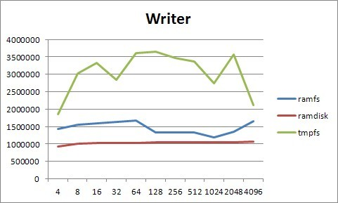
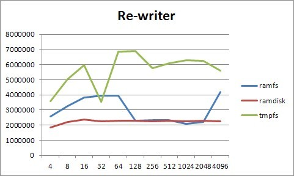
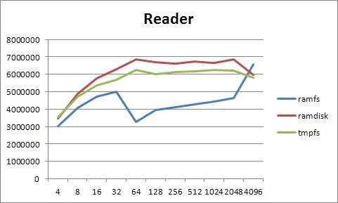
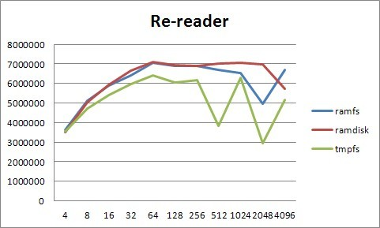

测试手段：

 

| 1  | `dd if=/dev/zero of=tmp bs=1M count=10` |
| ---- | ------------------------------- |
| 2  | `iozone -a -i 1 -i 0 -c -g 5M -n 1M`    |

用dd命令测试瞬间写的能力。

新增利用iozone命令测试内存盘性能：

测试项包括写入，重复写入，读出，重复读出

测试结果只作参考

横坐标是测试的时候写入读出的快文件大小，纵坐标是每秒的写入读出的字节数

在Linux中可以将一部分内存mount为分区来使用，通常称之为RamDisk，分为:Ramdisk, ramfs, tmpfs.

① 第一种就是传统意义上的RamDisk，可以格式化，然后加载。
这在Linux内核2.0/2.2就已经支持，其不足之处是大小固定，之后不能改变。为了能够使用Ramdisk，我们在编译内核时须将block device中的Ramdisk支持选上，它下面还有两个选项，一个是设定Ramdisk的大小，默认是4096k;另一个是initrd的支持。
如果对Ramdisk的支持已经编译进内核，我们就可以使用它了:
首先查看一下可用的RamDisk，使用ls /dev/ram*
首先创建一个目录，比如test，运行mkdir /mnt/test;
然后对/dev/ram0 创建文件系统，运行mke2fs /dev/ram0;
最后挂载 /dev/ram0，运行mount /dev/ram /mnt/test，就可以象对普通硬盘一样对它进行操作了。

 装载后写入速度在700M/S-800M/S之间，如果umount再加载，只要不重启linux，那文件依然会保存在/dev/ramX中。

② 另两种则是内核2.4才支持的，通过Ramfs或者Tmpfs来实现:
它们不需经过格式化，用起来灵活，其大小随所需要的空间而增加或减少。Ramfs顾名思义是内存文件系统，它处于虚拟文件系统(VFS)层，而不像ramdisk那样基于虚拟在内存中的其他文件系统(ex2fs)。因而，它无需格式化，可以创建多个，只要内存足够，在创建时可以指定其最大能使用的内存大小。如果你的Linux已经将Ramfs编译进内核，你就可以很容易地使用Ramfs了。

对于ramfs，它没有回写地址。文件写入ramfs中后和平时一样分配目录和页，但是他们回写不了。这就意味着他们的内存永远也不能被标识为clean,所以他们在期待回收内存的时候不会被虚拟内存释放。

创建一个目录，加载Ramfs到该目录即可:

| `1`  | `# mkdir /testRam` |
| ---- | ------------------ |
|  `2` | `# mount -t ramfs none /testRAM` |

缺省情况下，Ramfs被限制最多可使用内存大小的一半。可以通过maxsize(以kbyte为单位)选项来改变。

| `1`  | `# mount -t ramfs none /testRAM -o maxsize=2000` |
| ---- | ------------------------------------------------ |
|      |                                                  |

 (创建了一个限定最大使用内存为2M的ramdisk)

写入速度在900M/S-1100M/S之间，umount后再加载数据消失。

③ Tmpfs是一个虚拟内存文件系统，是ramfs的衍生物，是基于ramfs建立的。不同于传统的用块设备形式来实现的Ramdisk，也不同于针对物理内存的Ramfs，tmpfs可以使用物理内存，也**可以使用交换分区**。在Linux内核中，虚拟内存资源由物理内存(RAM)和交换分区组成，这些资源是由内核中的虚拟内存子系统来负责分配和管理。Tmpfs向虚拟内存子系统请求页来存储文件，它同Linux的其它请求页的部分一样，不知道分配给自己的页是在内存中还是在交换分区中。同Ramfs一样，其大小也不是固定的，而是随着所需要的空间而动态的增减。使用tmpfs，首先你编译内核时得选择”虚拟内存文件系统支持(Virtual memory filesystem support)” 。
然后就可以加载tmpfs文件系统了:

 

| `1`  | `# mkdir -p /mnt/tmpfs`             |
| ---- | ----------------------------------- |
| `2`  | `# mount tmpfs /mnt/tmpfs -t tmpfs` |

同样可以在加载时指定tmpfs文件系统大小的最大限制:

| `1`  | `# mount tmpfs /mnt/tmpfs -t tmpfs -o size=32m` |
| ---- | ----------------------------------------------- |
|      |                                                 |

 写入速度在1.2G/S-1.3G/S，umount后再加载数据消失。

④ rootfs是一个ramfs的特殊实例，他在2.6系统中呈现。你不能卸载rootfs就如同你不能杀死init进程。