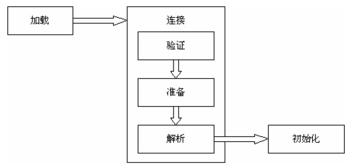
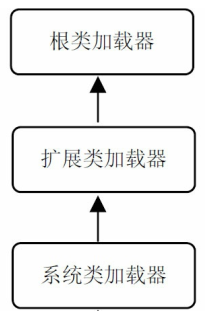

Java类加载
-------------------

## 加载、 连接和初始化




### 加载

类的加载是指把类的**.class文件**中的二进制数据读入到内存中， 然后在**堆区**创建一个**java.lang.Class**对象， 用来封装类在方法区内的数据结构。

从本地文件系统中加载类的.class文件， 这是最常见的加载方式。
通过网络下载类的.class文件。

* 从ZIP、 JAR或其他类型的归档文件中提取.class文件。
* 从一个专有数据库中提取.class文件。
* 把一个Java源文件动态编译为.class文件。  

### 初始化
这个阶段虚拟机执行类的初始化语句，包括静态变量的声明处进行初始化 、静态代码块中进行初始化 。

Java虚拟机只有在程序**首次**主动使用一个类或接口时才会初始化它 ,包括这些场景：

1. 创建类的实例 (包括new、反射、克隆、反序列化等手段) 
2. 调用类的静态方法  
3. 访问某个类或接口的静态变量， 或者对该静态变量赋值  
4. 调用Java  API中某些反射方法，比如调用Class.forName("xxx")  
5. 初始化子类会先初始化它的父类 
6. Java虚拟机启动时被标明为启动类的类     

**说明1：** 使用final类型的静态变量不会导致类的初始化，因为编译时就能算出来 。但是如果在编译时不能计算出来，那么会导致类的初始化 ，比如：

````java
public static final int a= (int)(Math.random()*10)/10+1;
````

由于编译器不会计算出变量a的取值， 因此变量a不是编译时常量，调用前必须先初始化 。 

**说明2：** 如果执行“Child.a”或“Child.method()” ,而a和method()实际定义在父类中，子类没有重写，那么只会初始化父类。

**说明3：**调用ClassLoader类的loadClass()方法加载一个类， 不会导致类的初始化 ，Class.forName则会初始化。 

### 虚拟机自带的加载器  

* 根（Bootstrap） 类加载器 ：  是虚拟机的一部分，实现依赖于底层操作系统，没有父加载器。 它负责加载虚拟机的核心类库， 如java.lang.*等  。根类加载器从系统属性sun.boot.class.path所指定的目录中加载类库。 

* 扩展（Extension） 类加载器：  它的父加载器为根类加载器。 它从java.ext.dirs系统属性所指定的目录中加载类库， 或者从JDK的安装目录的jre\lib\ext子目录（扩展目录） 下加载类库， 如果用户自己创建JAR文件放在这个目录下， 也会自动由扩展类加载器加载。
* 系统（System） 类加载器：  是sun.misc.Launcher$AppClassLoader的实例，它的父加载器为扩展类加载器 ，它从classpath环境变量或者系统属性java.class.path所指定的目录中加载类 。我们自己写的class默认都是由它加载的。



根加载器代码里是获取不到的：

````java
System.out.println(Object.class.getClassLoader());//print null,根加载器
System.out.println(MyClass.class.getClassLoader());//sun.misc.Launcher$AppClassLoader@2a139a55
System.out.println(ClassLoader.getSystemClassLoader().getParent());//sun.misc.Launcher$ExtClassLoader@7852e922
System.out.println(ClassLoader.getSystemClassLoader().getParent().getParent());//null,根加载器
````


### 父亲委托机制 (Parent Delegation）

加载一个类时，总是请求它的父加载器代为加载，这样保证了系统的安全性，因为在此机制下， 用户自定义的类加载器不可能加载应该由父加载器加载的可靠类，从而防止不可靠甚至恶意的代码代替由父加载器加载的可靠代码。比如，你可能想自己写一个java.lang.Object,替代jdk中的Object类成为所有类的默认父类，然而父亲委托机制保证了这是不可能的，因为Object是根加载器加载的。

如果你的代码引用了一个jar，你想替换jar里的某个class，那么可以自己写一个包名和类名都相同的类，然后巧妙地修改jar的引用顺序，让虚拟机加载你的代码而不是jar里的。那是因为jar包和你的代码都是system classloader加载的。

### 可见性

*加载器及所有父加载器*  所加载的类组成了该类加载器的命名空间 ，同一个命名空间中， 不会出现类的完整名字相同的两个类, 但是在不同的命名空间中， 有可能会出现类的完整名字相同的两个类。

以前我们说，包名相同的两个类互相可见（即默认访问级别），其实准确的说，还要再加一个条件：由同一类加载器加载的属于相同包的类。这样的限制能避免用户自定义的类冒充核心类库的类 。

有时你看到这样的报错：

> com.xxx.A cannot be cast to com.xxx.A

这让人迷惑，但是知道是不同的类加载器分别加载了A类两次，就豁然开朗了。

另外，需要指出， 加载器之间的父子关系实际上指的是**加载器对象**之间的**包装**关系， 而不是类之间的继承关系。 甚至一对父子加载器可能是同一个加载器类的两个实例  。

### 自定义类加载器  

首先继承ClassLoader，然后重写findClass方法：

````java
public class MyClassLoader extends ClassLoader {
@Override
	protected Class<?> findClass(String name) throws ClassNotFoundException {
		byte[] data = loadClassData(name);
		return defineClass(name, data, 0, data.length);
	}
}
````

loadClassData没什么好说的，以二进制流形式读取字节码,放到byte数组里，返回此数组。然后将数组作为defineClass的参数传递进去就行了。

自定义类加载器就按照这个模板写就行了。

然后我们提供两个构造函数：

````java
	public MyClassLoader(String name) {
		super();
		this.name = name;
	}

	public MyClassLoader(ClassLoader parent, String name) {
		super(parent);
		this.name = name;
	}
````

第一个构造函数没有指定parent 加载器，那么当你loader1 = new MyClassLoader("loader1")时，loader1 的父加载器是AppClassLoader。

你可以再次`loader2 = new MyClassLoader(loader1，"loader2")`，这一次指定了父加载器是loader1。

我们测试一下：
````java
Class objClass = loader2.loadClass("com.xxx.A");
Object obj = objClass.newInstance(); // 创建一个 A 类的实例
System.out.println(obj.getClass().getClassLoader());
````

loader2先委托loader1加载，loader1再委托AppClassLoader(也就是系统类加载器)进行加载。AppClassLoader的parent是扩展类加载器，它不能加载A类，所以AppClassLoader自己尝试加载。加载成功，所以print那行打印sun.misc.Launcher$AppClassLoader@2a139a55。

再来，
````java 
MyClassLoader loader3 = new MyClassLoader(null, "loader3");
Class objClass = loader3.loadClass("com.xxx.A");
````
构造函数parent传入的是`null`,也就是根加载器。根加载器不能加载class A，所以objClass的加载器就是loader3。

再看个有趣的：

````java
MyClassLoader loader3 = new MyClassLoader(null, "loader3");
Class objClass = loader3.loadClass("com.xxx.A");
Object obj = objClass.newInstance();

System.out.println(((A)obj).a);
System.out.println(objClass.getField("a").get(obj));
````

第一个print语句会抛异常：`com.xxx.A cannot be cast to com.xxx.A`,因为执行的这段代码是系统类加载器加载的，而obj是loader3加载的，他们属于不同命名空间，彼此之间无法互相访问。

但是有趣的是，用反射可以正常访问，第二个print可以把obj.a打印出来。

### 单例模式

了解了类的加载机制后，我们推测，通过自定义类加载器，可以让一个单例的类产生多个对象。留着以后验证。

### URLClassLoader  

在JDK的java.net包中， 提供了一个功能比较强大的URLClassLoader类， 它扩展了ClassLoader类。 它不仅能从本地文件系统中加载类， 还可以从网上下载类 。

URLClassLoader类提供了以下形式的构造方法:

````java
URLClassLoader(URL[] urls) //父加载器为系统类加载器
URLClassLoader(URL[] urls, ClassLoader parent) //parent参数指定父加载器
````

### 类的卸载  

当代表Sample类的Class对象不再被引用， 即不可触及时， 那么Class对象就会结束生命周期， Sample类在方法区内的数据也会被卸载， 从而结束Sample类的生命周期.

由Java虚拟机自带的类加载器(根类加载器、 扩展类加载器和系统类加载器 )所加载的类， 在虚拟机的生命周期中， 始终不会被卸载。 这些类加载器则会始终引用它们所加载的类的Class对象， 因此这些Class对象始终是可触及的。  

由用户自定义的类加载器所加载的类是可以被卸载的。观察下面代码：

````java
MyClassLoader loader1 = new MyClassLoader("loader1");
Class objClass = loader1.loadClass("Sample");
System.out.println("objClass's hashCode is "+objClass.hashCode());

//1
Object obj=objClass.newInstance(); 
loader1=null; 
objClass=null; 
obj=null; 
//2
loader1 = new MyClassLoader("loader1"); 
objClass = loader1.loadClass("Sample"); 
System.out.println("objClass's hashCode is "+objClass.hashCode());
````

在1处，把loader1、objClass、obj，所有的引用变量都置为null  。这样objClass在方法区内的二进制数据就可以被卸载了。  

在2处，Sample类又重新被加载，Java虚拟机的堆区会生成一个新的Class< Sample > 实例 ,打印的hashCode应该不一样。

### Thread.currentThread().getContextClassLoader()

Thread类里面有个contextClassLoader「线程上下文类加载器」，这个 contextClassLoader 究竟是做什么用的？

它可以做到跨线程共享类，只要它们共享同一个 contextClassLoader。父子线程之间会自动传递 contextClassLoader，所以共享起来将是自动化的。

如果不同的线程使用不同的 contextClassLoader，那么不同的线程使用的类就可以隔离开来。

如果我们对业务进行划分，不同的业务使用不同的线程池，线程池内部共享同一个 contextClassLoader，线程池之间使用不同的 contextClassLoader，就可以很好的起到隔离保护的作用，避免类版本冲突。

如果我们不去定制 contextClassLoader，那么所有的线程将会默认使用 AppClassLoader，所有的类都将会是共享的。

### 结语

类加载器方面的知识，尽管实战中用的不多，但是非常重要，一定要懂。其实还是有很多应用场景的，比如，为了防止反编译，可以将class文件加密，然后自定义classloader解密加载。