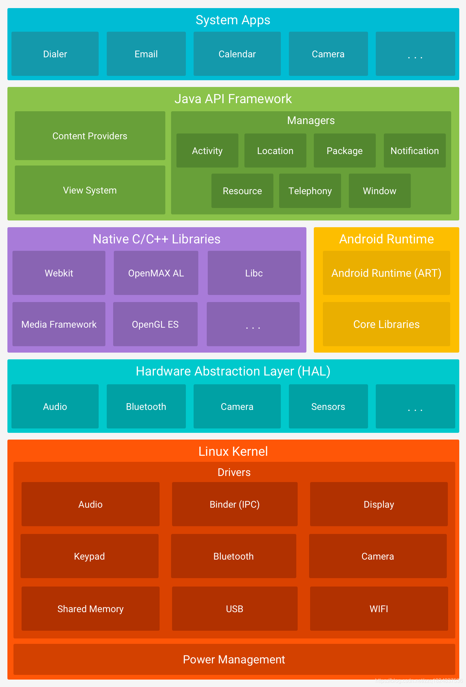
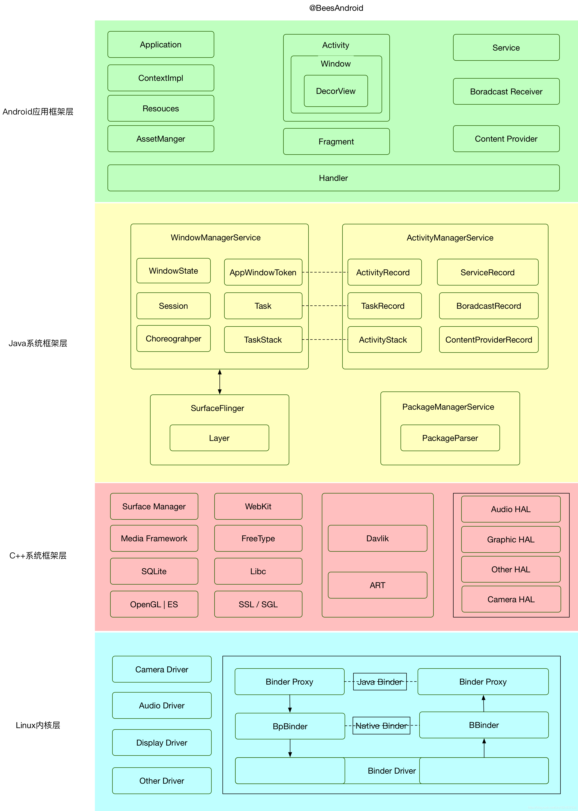
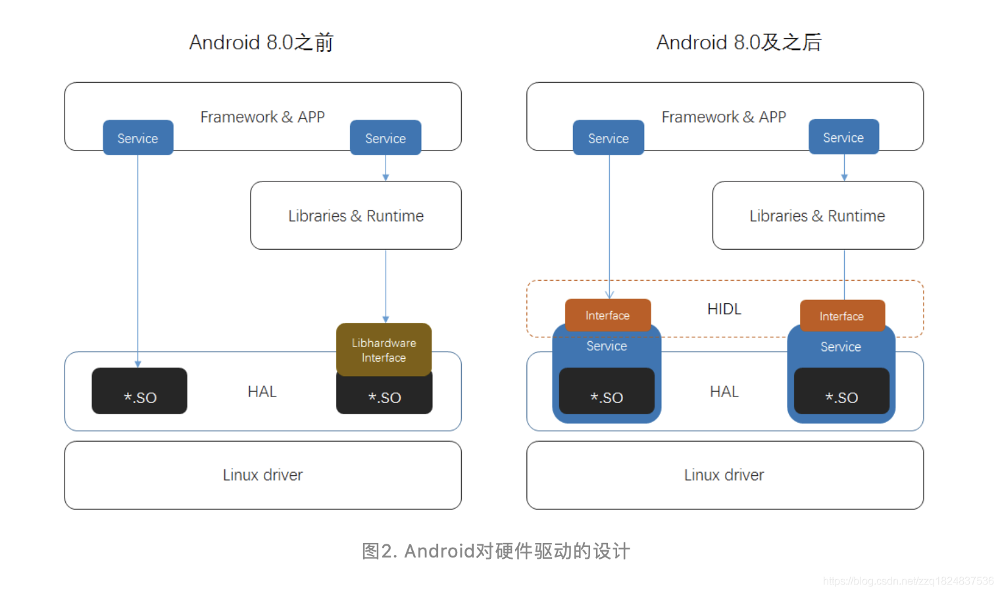
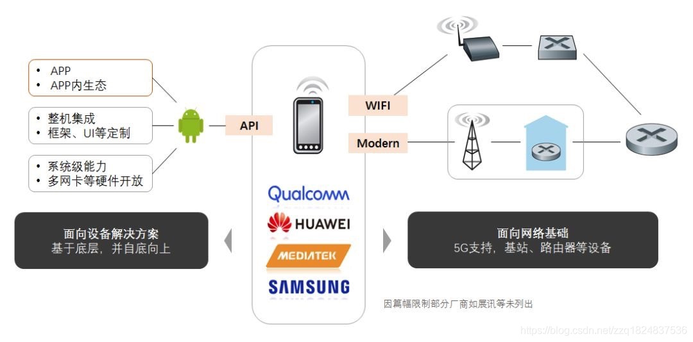
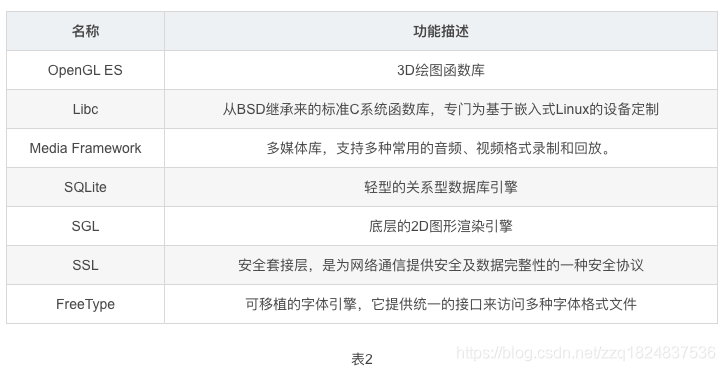
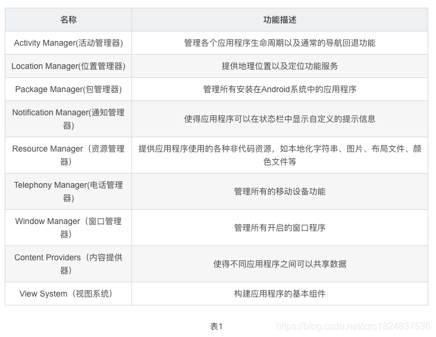
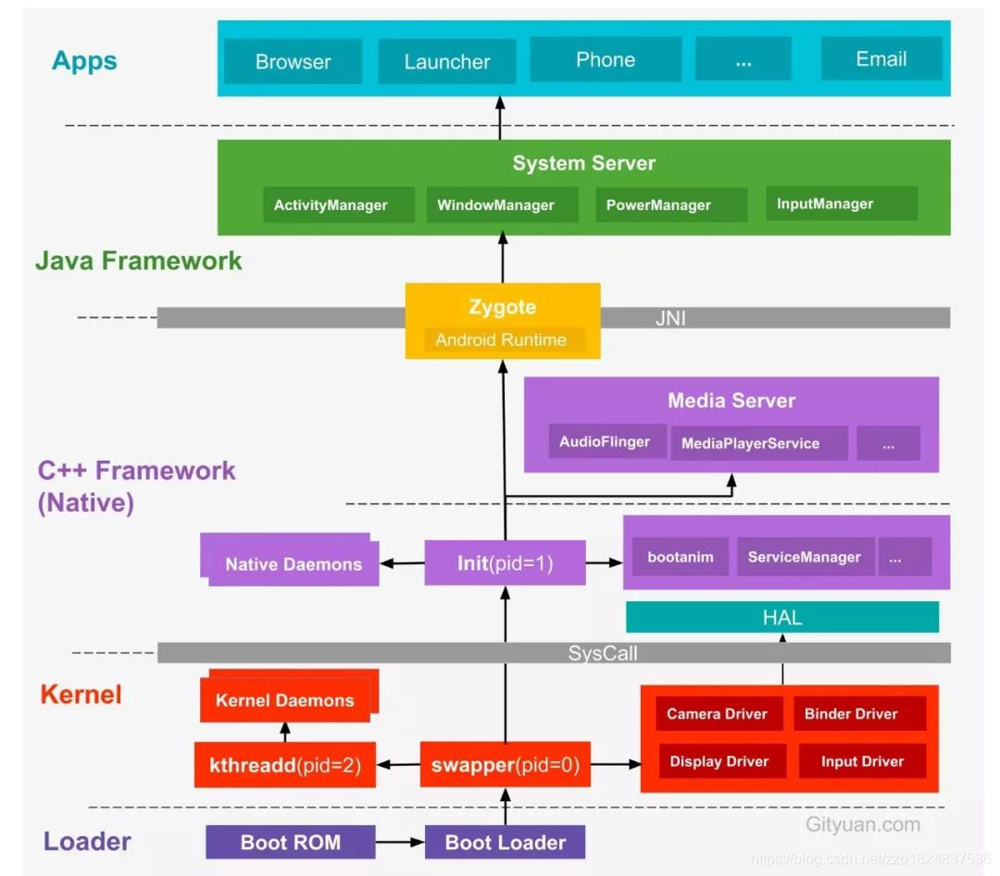
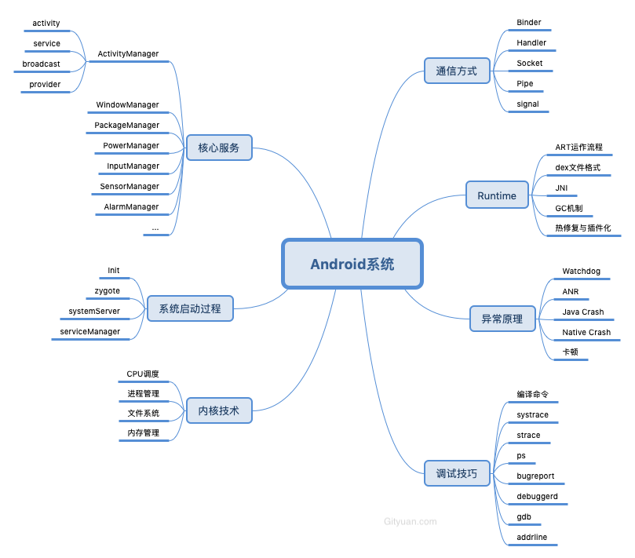

# android架构

## 整体组成

Android系统非常庞大且错综复杂，需要具备全面的技术栈，但整体架构设计清晰。Android底层内核空间以Linux Kernel作为基石，上层用户空间由Native系统库、虚拟机运行环境、框架层组成，通过**系统调用**(Syscall)连通系统的内核空间与用户空间。对于用户空间主要采用C++和Java代码编写，通过**JNI**技术打通用户空间的Java层和Native层(C++/C)，从而连通整个系统。

Google官方提供的经典分层架构图，从下往上依次分为Linux内核、HAL、系统Native库和Android运行时环境、Java框架层以及应用层这5层架构，其中每一层都包含大量的子模块或子系统。

## AOSP目录

| 目录名                               | 介绍                                                         |
| :----------------------------------- | :----------------------------------------------------------- |
| build/core/                          | AOSP整个编译过程中核心的编译规则makefile                     |
| build/envsetup.sh                    | 编译初始化脚本                                               |
| build/target                         | AOSP自带的Target(模拟器)的一些makefile                       |
| build/tools/                         | 编译中使用的shell及python写的工具脚本                        |
| packages/                            | 系统app以及一些provider,输入法等桌面看不到的app              |
| framework/av/                        | 多媒体相关的native层源码目录                                 |
| framework/webview/                   | 浏览器内核chromium的源码目录                                 |
| framework/native/                    | power、surface、input、binder等服务的native层实现源码目录    |
| framework/base/core/                 | framework.jar、framework-res.apk、libandroid_runtime.so等的源文件 |
| framework/base/native/               | libandroid.so的源代码目录.java中的api的native实现.比如looper,assertManager |
| framework/base/media/                | 多媒体相关的JavaApi和jni层的源文件                           |
| framework/base/packages/             | SettingProviders,SystemUI等不在桌面启动的APP源码             |
| framework/base/service/              | service.jar、libandroid_service.so的源文件                   |
| framework/base/service/              | wifi服务相关的JavaApi,WifiManager,WifiService等              |
| device/(vendor_name)/(product_name)  | 跟某些厂商的某个硬件平台相关的内核,硬件配置等                |
| vendor/(vendor_name)/(product_name)  | 厂商对AOSP进行的修改或者定制,放在vendor目录。包括但不限于framework层新增API,新增APP等业务需求,但是现在Google更推荐放在devices目录下 |
| /out/host                            | 该目录下包含了针对当前操作系统所编译出的Android开发工具产物,例如adb,aapt,fastboot等命令 |
| /out/target/common/                  | 该目录包含了针对Android设备的通用的编译产物,主要是java应用代码和java库。Framework.jar,services.jar,android.policy.jar等等 |
| /out/target/(product)/(product_name) | 包含了针对特定设备的编译结果以及平台相关的C/C++库和二进制文件。其中，product_name是具体目标设备的名称 |

## 每层架构

Android通过硬件抽象、组件化、接口层三种能力来为诸多变数预留大量可操作、斡旋的空间。

## **Linux 内核(Linux kernel)**

开发设备驱动程序与开发典型的 Linux 设备驱动程序类似。Android 使用的 Linux 内核版本包含几个特殊的补充功能，例如：Low Memory Killer（一种内存管理系统，可更主动地保留内存）、唤醒锁定（一种 [`PowerManager`](https://developer.android.google.cn/reference/android/os/PowerManager.html) 系统服务）、Binder IPC 驱动程序以及对移动嵌入式平台来说非常重要的其他功能。这些补充功能主要用于增强系统功能，不会影响驱动程序开发。您可以使用任意版本的内核，只要它支持所需功能（如 Binder 驱动程序）即可。不过，我们建议您使用 Android 内核的最新版本。

## **硬件抽象层（Hardware Abstraction Layer, HAL）**

在一定程度上起到这样的目的：它为移动领域五花八门、标准不统一的硬件驱动定义标准接口，避免Android过分依赖Linux，让后续的扩展和整机集成更加高效，满足了手机制造商的重要诉求；同时还起到隔离Linux内核的作用，避免厂商充满硬件秘密的驱动源码受GPL协议影响而开源，保障了芯片等硬件制造商的核心利益。传统手机OS的定制和集成流程需要修改大量代码，负担不少，从这个角度来看Android HAL其设计是领先的。结合AOSP优良的代码分支、模块管理，加上基于GNU automake巨集形成的Android build system，厂商享受到超越以往的便捷。

Android 8.0开启Treble项目，从此芯片厂商能通过基于Binder的HIDL提供稳定接口，制造商则可不受芯片厂商影响而直接更新Framework，甚至获得无需重新编译HAL即可OTA的能力。

HAL为Android设备量的持续增长提供了基础，并促进有实力的厂商向设备上层及基础设施两个领域纵深发展（图3），体现在掌握核心技术的厂商（如高通、华为、MTK），通过不断建设系统能力来强化竞争力（支持5G标准、硬件能力、软硬结合以及系统能力的深度定制等），而具备渠道和资源整合优势的手机制造商（华为、OPPO、小米、VIVO等），则立足OS持续构建更高效的应用来拓展版图（UI、推送、商店、轻应用等），这都体现出Android HAL对整个产业的凝聚和影响，间接弥补Android自身的诸多不足。

## **系统运行库层**

系统运行库层分为两部分，分别是C/C++程序库和Android运行时库。下面分别来介绍它们。

1. C/C++程序库
C/C++程序库能被Android系统中的不同组件所使用，并通过应用程序框架为开发者提供服务，主要的C/C++程序库如下表2所示。

2. Android运行时库
运行时库又分为**核心库**和**ART**(5.0系统之后，Dalvik虚拟机被ART取代)。核心库提供了Java语言核心库的大多数功能，这样开发者可以使用Java语言来编写Android应用。相较于JVM，Dalvik虚拟机是专门为移动设备定制的，允许在有限的内存中同时运行多个虚拟机的实例，并且每一个Dalvik 应用作为一个独立的Linux 进程执行。独立的进程可以防止在虚拟机崩溃的时候所有程序都被关闭。而替代Dalvik虚拟机的ART 的机制与Dalvik 不同。在Dalvik下，应用每次运行的时候，字节码都需要通过即时编译器转换为机器码，这会拖慢应用的运行效率，而在ART 环境中，应用在**第一次安装**的时候，字节码就会预先编译成机器码，使其成为真正的本地应用。

## 应用程序框架层（Java Framework)

应用框架层为开发人员提供了可以开发应用程序所需要的API，我们平常开发应用程序都是调用的这一层所提供的API，当然也包括系统的应用。这一层的是由Java代码编写的，可以称为Java Framework。下面来看这一层所提供的主要的组件。

## 应用程序层

包括系统内置的应用、自己开发的应用、第三方应用等。

## 启动流程

Google提供的5层架构图很经典,但是并没能体现Android整个系统的内部架构、运行机理，以及各个模块之间是如何衔接与配合工作的，下面是一个开机启动的主要流程：

**图解：** Android系统启动过程由上图从下往上的一个过程是由Boot Loader引导开机，然后依次进入 -> `Kernel` -> `Native` -> `Framework` -> `App`，接来下简要说说每个过程：

####  关于Loader层：

- Boot ROM: 当手机处于关机状态时，长按Power键开机，引导芯片开始从固化在`ROM`里的预设代码开始执行，然后加载引导程序到`RAM`；
- Boot Loader：这是启动Android系统之前的引导程序，主要是检查RAM，初始化硬件参数等功能。

####  Linux内核层

Android平台的基础是Linux内核，比如ART虚拟机最终调用底层Linux内核来执行功能。Linux内核的安全机制为Android提供相应的保障，也允许设备制造商为内核开发硬件驱动程序。

- 启动Kernel的swapper进程(pid=0)：该进程又称为idle进程, 系统初始化过程Kernel由无到有开创的第一个进程, 用于初始化进程管理、内存管理，加载Display,Camera Driver，Binder Driver等相关工作；
- 启动kthreadd进程（pid=2）：是Linux系统的内核进程，会创建内核工作线程kworkder，软中断线程ksoftirqd，thermal等内核守护进程。`kthreadd进程是所有内核进程的鼻祖`。

#### 硬件抽象层 (HAL)

硬件抽象层 (HAL) 提供标准接口，HAL包含多个库模块，其中每个模块都为特定类型的硬件组件实现一组接口，比如WIFI/蓝牙模块，当框架API请求访问设备硬件时，Android系统将为该硬件加载相应的库模块。

#### Android Runtime & 系统库

每个应用都在其自己的进程中运行，都有自己的虚拟机实例。ART通过执行DEX文件可在设备运行多个虚拟机，DEX文件是一种专为Android设计的字节码格式文件，经过优化，使用内存很少。ART主要功能包括：预先(AOT)和即时(JIT)编译，优化的垃圾回收(GC)，以及调试相关的支持。

这里的Native系统库主要包括init孵化来的用户空间的守护进程、HAL层以及开机动画等。启动init进程(pid=1),是Linux系统的用户进程，`init进程是所有用户进程的鼻祖`。

- init进程会孵化出ueventd、logd、healthd、installd、adbd、lmkd等用户守护进程；
- init进程还启动`servicemanager`(binder服务管家)、`bootanim`(开机动画)等重要服务
- init进程孵化出Zygote进程，Zygote进程是Android系统的第一个Java进程(即虚拟机进程)，`Zygote是所有Java进程的父进程`，Zygote进程本身是由init进程孵化而来的。

#### Framework层

- Zygote进程，是由init进程通过解析init.rc文件后fork生成的，Zygote进程主要包含：
  - 加载ZygoteInit类，注册Zygote Socket服务端套接字
  - 加载虚拟机
  - 提前加载类preloadClasses
  - 提前加载资源preloadResouces
- System Server进程，是由Zygote进程fork而来，`System Server是Zygote孵化的第一个进程`，System Server负责启动和管理整个Java framework，包含ActivityManager，WindowManager，PackageManager，PowerManager等服务。
- Media Server进程，是由init进程fork而来，负责启动和管理整个C++ framework，包含AudioFlinger，Camera Service等服务。

#### App层

- Zygote进程孵化出的第一个App进程是Launcher，这是用户看到的桌面App；
- Zygote进程还会创建Browser，Phone，Email等App进程，每个App至少运行在一个进程上。
- 所有的App进程都是由Zygote进程fork生成的。

#### Syscall && JNI

- Native与Kernel之间有一层系统调用(SysCall)层，见[Linux系统调用(Syscall)原理](http://gityuan.com/2016/05/21/syscall/);
- Java层与Native(C/C++)层之间的纽带JNI，见[Android JNI原理分析](http://gityuan.com/2016/05/28/android-jni/)。

## 通信方式

无论是Android系统，还是各种Linux衍生系统，各个组件、模块往往运行在各种不同的进程和线程内，这里就必然涉及进程/线程之间的通信。对于IPC(Inter-Process Communication, 进程间通信)，Linux现有管道、消息队列、共享内存、套接字、信号量、信号这些IPC机制，Android额外还有Binder IPC机制，Android OS中的Zygote进程的IPC采用的是Socket机制，在上层system server、media server以及上层App之间更多的是采用Binder IPC方式来完成跨进程间的通信。对于Android上层架构中，很多时候是在同一个进程的线程之间需要相互通信，例如同一个进程的主线程与工作线程之间的通信，往往采用的Handler消息机制。

想深入理解Android内核层架构，必须先深入理解Linux现有的IPC机制；对于Android上层架构，则最常用的通信方式是Binder、Socket、Handler，当然也有少量其他的IPC方式，比如杀进程Process.killProcess()采用的是signal方式。下面说说Binder、Socket、Handler：

#### Binder

Binder作为Android系统提供的一种IPC机制，无论从系统开发还是应用开发，都是Android系统中最重要的组成，也是最难理解的一块知识点，想了解[为什么Android要采用Binder作为IPC机制？](https://www.zhihu.com/question/39440766/answer/89210950) 可查看我在知乎上的回答。深入了解Binder机制，最好的方法便是阅读源码。

**Binder IPC原理**

Binder通信采用c/s架构，从组件视角来说，包含Client、Server、ServiceManager以及binder驱动，其中ServiceManager用于管理系统中的各种服务。

#### Socket

Socket通信方式也是C/S架构，比Binder简单很多。在Android系统中采用Socket通信方式的主要有：

- zygote：用于孵化进程，system_server创建进程是通过socket向zygote进程发起请求；
- installd：用于安装App的守护进程，上层PackageManagerService很多实现最终都是交给它来完成；
- lmkd：lowmemorykiller的守护进程，Java层的LowMemoryKiller最终都是由lmkd来完成；
- adbd：这个也不用说，用于服务adb；
- logcatd:这个不用说，用于服务logcat；
- vold：即volume Daemon，是存储类的守护进程，用于负责如USB、Sdcard等存储设备的事件处理。

等等还有很多，这里不一一列举，Socket方式更多的用于Android framework层与native层之间的通信。Socket通信方式相对于binder比较简单。

#### Handler

**Binder/Socket用于进程间通信，而Handler消息机制用于同进程的线程间通信**，Handler消息机制是由一组MessageQueue、Message、Looper、Handler共同组成的，为了方便且称之为Handler消息机制。

有人可能会疑惑，为何Binder/Socket用于进程间通信，能否用于线程间通信呢？答案是肯定，对于两个具有独立地址空间的进程通信都可以，当然也能用于共享内存空间的两个线程间通信，这就好比杀鸡用牛刀。接着可能还有人会疑惑，那handler消息机制能否用于进程间通信？答案是不能，Handler只能用于共享内存地址空间的两个线程间通信，即同进程的两个线程间通信。很多时候，Handler是工作线程向UI主线程发送消息，即App应用中只有主线程能更新UI，其他工作线程往往是完成相应工作后，通过Handler告知主线程需要做出相应地UI更新操作，Handler分发相应的消息给UI主线程去完成，如下图：

由于工作线程与主线程共享地址空间，即Handler实例对象mHandler位于线程间共享的内存堆上，工作线程与主线程都能直接使用该对象，只需要注意多线程的同步问题。工作线程通过mHandler向其成员变量MessageQueue中添加新Message，主线程一直处于loop()方法内，当收到新的Message时按照一定规则分发给相应的handleMessage()方法来处理。所以说，Handler消息机制用于同进程的线程间通信，其核心是线程间共享内存空间，而不同进程拥有不同的地址空间，也就不能用handler来实现进程间通信。

上图只是Handler消息机制的一种处理流程，是不是只能工作线程向UI主线程发消息呢，其实不然，可以是UI线程向工作线程发送消息，也可以是多个工作线程之间通过handler发送消息。

要理解framework层源码，掌握这3种基本的进程/线程间通信方式是非常有必要，当然Linux还有不少其他的IPC机制，比如共享内存、信号、信号量，在源码中也有体现，如果想全面彻底地掌握Android系统，还是需要对每一种IPC机制都有所了解。

## 核心知识点导图

## 可参阅的资料
1. 本文大部分内容来自*Gityuan*的http://gityuan.com/android/。原文有整个系列的索引。基于6.0
2. 刘望舒：(http://liuwangshu.cn/)和他的三部曲书籍。基于7.0以上
3. 谷歌官网：https://source.android.google.cn/。

## 结束语

Android系统之博大精深，包括Linux内核、Native、虚拟机、Framework，通过系统调用连通内核与用户空间，通过JNI打通用户空间的Java层和Native层，通过Binder、Socket、Handler等打通跨进程、跨线程的信息交换。