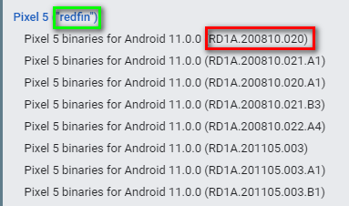
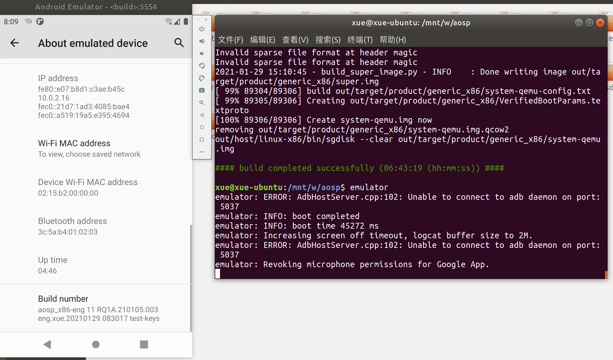
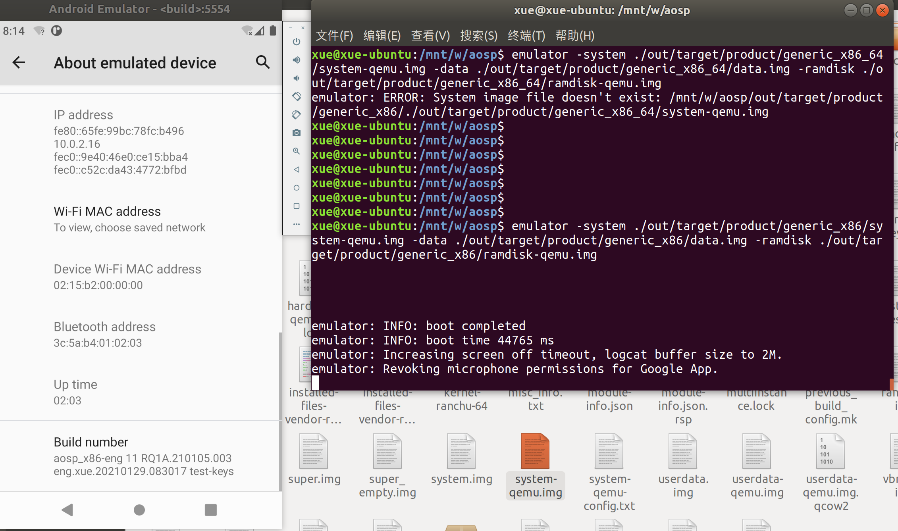

## 1. 搭建编译环境

官网有详细教程https://source.android.google.cn/setup/build/initializing?hl=zh-cn

此外，经过第三方定制过的代码，搭环境、编译代码可能有改变。应该由第三方提供手册。比如NXP提供的imx-p9.0.0_2.1.1-auto-ga 源码包，除了安卓官网的步骤外，还需要配置cmake和gcc-armnone-eabi-7-2018-q2-update  。NXP应该提供这些文档。

这里主要介绍的是通用的步骤。那些厂商定制过的，如果我刚好知道，就顺便提一下。

## 2. 编译

首先确保仓库检出的分支是你需要编译的分支，如果不是，用 `repo init -b yourbranch` 切换到你需要的分支。

从.repo/manifests.git/config文件可以看到你的远程仓库，以及当前branch：

````shell
work@ubuntu-cts:~/aosp/.repo/manifests.git$ cat config
[core]
	repositoryformatversion = 0
	filemode = true
[filter "lfs"]
	smudge = git-lfs smudge --skip -- %f
[remote "origin"]
	url = http://aosp.tuna.tsinghua.edu.cn/platform/manifest
	fetch = +refs/heads/*:refs/remotes/origin/*
[branch "default"]
	remote = origin
	merge = refs/heads/master

````

或者`repo info`查看每个git仓库的信息。

如果你不知道用哪个分支编译的话，我的建议是，选择一个release分支。

```shell
#进入.repo/manifests.git目录
cd ~/aosp/.repo/manifests.git
git branch -a #查看所有分支
git branch -a | grep android-11#查看安卓11的分支
#or
cd .repo/manifests && git branch -a | cut -d / -f 3 | grep android-11
#我的输出like：
android-11.0.0_r1
android-11.0.0_r10
android-11.0.0_r11
android-11.0.0_r12
android-11.0.0_r13
android-11.0.0_r14
android-11.0.0_r15
android-11.0.0_r16
android-11.0.0_r17
android-11.0.0_r2
android-11.0.0_r3
android-11.0.0_r4
android-11.0.0_r5
android-11.0.0_r7
android-11.0.0_r8
android-11.0.0_r9

```

上面输出中，我想切到最新的那个分支：android-11.0.0_r17，用下面指令：

`repo init -u https://mirrors.bfsu.edu.cn/git/AOSP/platform/manifest -b android-11.0.0_r17`

-u url是可省略的。然后检出代码：

`repo sync -dcql`

加上-l表示只检出，不联网下载

打开：

https://source.android.google.cn/setup/start/build-numbers#platform-code-names-versions-api-levels-and-ndk-releases

从这个网站查询分支支持的设备、buildid等信息。比如上面的android-11.0.0_r17：

| Build           | 标记               | 版本      | 支持的设备                                                   | 安全补丁程序级别 |
| --------------- | ------------------ | --------- | ------------------------------------------------------------ | ---------------- |
| RP1A.201105.002 | android-11.0.0_r17 | Android11 | Pixel 3、Pixel 3a、Pixel 3a XL、Pixel 3 XL、Pixel 4、Pixel 4a、Pixel 4 XL | 2020-11-05       |
(表格1)

从镜像站下载的压缩包，直接解压下来，如果不执行 repo init -b切换分支，直接sync的话，就是在master分支上面。master也是可以直接编的，但你最好切换到android-xxx_rXX这样的分支。

然后：

> 1. cd aosp
>
> 2. source build/envsetup.sh *#初始化编译环境*
>
> 3. lunch *#设置编译目标*
>
> 4. make -j8 *#开始编译 可选参数 -j  指定线程数目，一般是CPU核心数乘以2。线程并不是越多越好
>
> 如果需要把编译过程日志保存下来：
>
> make -j8 2>&1 | tee build.log

lunch后你要选择编译哪个目标。如果是在模拟器上跑的话，选择aosp_x86-eng 或 aosp_x86_64-eng。也可以选择arm,但我们的电脑都是x86的，所以arm的编出来后，模拟器运行巨卡，可能要启动半个小时，在漫长的等待后，你不知道是启动慢还是根本起不来。所以我们选x86。

如果需要刷到谷歌支持的手机上，你需要下载驱动。到https://developers.google.cn/android/drivers/，打开看到下面列表，红框里的内容跟前面“表格1”的build列 对应起来，下载所有的vendor和driver，解压出来。得到sh，这个sh不仅仅是脚本，也包含了二进制数据，执行它自解压到vendor目录。然后lunch时，根据绿色框，选择lunch的目标，也可以到https://source.android.google.cn/setup/build/running界面查看应该选择的lunch。




如果编译报错，十有八九是你的环境配置问题或者编译步骤不对。不要怀疑源码，毕竟谷歌提交的代码都是有review和test的，而且全球已经有好多人编过了。

### 2.1  out目录

`out`目录是编译之后产生的, 具体介绍如下:

- `out/target/product/[generic]/system`: 其中, `[]`表示的目录是根据你`lunch`选项生成的, 例如`generic_arm64`表示生成的是`arm`架构的64问系统.
- `out/target/product/generic/system/apk`: Android系统自带的apk文件
- `out/target/product/generic/system/bin`: 一些可执行文件(比如C编译的执行)
- `out/target/product/generic/system/lib`: 动态链接库;
- `out/targer/product/generic/system/lib/hw`: 硬件抽象层文件

### 2.2. 编译命令及解释

m   在源码树的根目录执行编译
mm   编译当前路径下所有模块，但不包含依赖
mmm [module_path]   编译指定路径下所有模块，但不包含依赖
mma   编译当前路径下所有模块，且包含依赖
mmma [module_path]   编译指定路径下所有模块，且包含依赖
make [module_name]   无参数，则表示编译整个Android代码


- make systemimage - system.img
- make userdataimage - userdata.img
- make ramdisk - ramdisk.img
- make snod - 快速打包system.img，重新生成 system.img 镜像 
- make otapackage  制作*OTA*包

**列举部分模块的编译指令**：

| 模块           | make命令                | mmm命令                              |
| -------------- | ----------------------- | ------------------------------------ |
| init           | make init               | mmm system/core/init                 |
| zygote         | make app_process        | mmm frameworks/base/cmds/app_process |
| system_server  | make services           | mmm frameworks/base/services         |
| java framework | make framework          | mmm frameworks/base                  |
| framework资源  | make framework-res      | mmm frameworks/base/core/res         |
| jni framework  | make libandroid_runtime | mmm frameworks/base/core/jni         |
| binder         | make libbinder          | mmm frameworks/native/libs/binder    |

等效于cd到对应目录，然后mm。


## 3. 模拟器运行

编译成功后，运行模拟器，先source build/envsetup.sh,lunch初始化环境，然后emulator 。如果需要增大内存，开启`GPU`的支持，则加上  -gpu on -memory 4096。

我们前面选择的是x86, 运行前需要对电脑做一些配置。

1. 开启CPU虚拟化

   进入BIOS开启CPU虚拟化，intel的是叫Intel Virtual Technology, AMD是叫SVM mode, 开启之后重启， 用`egrep -c '(svm|vmx)' /proc/cpuinfo`进行检测， 如果不为0就是正确开启了

2. 安装KVM

   `sudo apt-get install qemu qemu-kvm`, 安装之后用`kvm-ok`检测是否安装成功

   关于不同ubuntu版本kvm的安装，以官网https://help.ubuntu.com/community/KVM/Installation为准。

   更多关于执行虚拟机的硬件加速问题，参考https://developer.android.google.cn/studio/run/emulator-acceleration#vm-linux，macOS和windows系统也能从这个网页找到。

```
#使用emulator时,经常会起不来，报各种错误。从网上收集了一些常见的错误
#1、虚拟机停在黑屏界面,点击无任何响应.此时,可能是kernel内核问题,指定正确的kernel:
./out/host/linux-x86/bin/emulator -partition-size 1024 -kernel ./prebuilts/qemu-kernel/arm/kernel-qemu-armv7 

#2、使用emulator出现comand not found，需要编译sdk
source ./build/envsetup.sh
lunch sdk
#或者
make sdk

#3、出现
#emulator: ERROR: x86_64 emulation currently requires hardware acceleration!
#Please ensure KVM is properly installed and usable.
#CPU acceleration status: This user doesn't have permissions to use KVM (/dev/kvm)
sudo apt-get install qemu-kvm cpu-checker
sudo addgroup kvm
sudo usermod -a -G kvm 你的用户名
sudo chgrp kvm /dev/kvm
sudo vim /etc/udev/rules.d/60-qemu-kvm.rules
    #60-qemu-kvm.rules添加
    KERNEL=="kvm", GROUP="kvm", MODE="0660"

#通过使用kernel-qemu-armv7内核 解决模拟器等待黑屏问题.而-partition-size 1024 则是解决警告: #system partion siez adjusted to match image file (163 MB >66 MB)

#如果你一开始编译的版本是aosp_arm-eng,使用上述命令仍然不能解决等待黑屏问题时,不妨编译#aosp_arm64-eng试试.
```
## 4. 真机运行

首先要把编译出的镜像烧录到机器。首先要说的是，如果是真机的话，仅仅编译AOSP是不行的，还有各种硬件驱动、基带等，谷歌亲子系列手机是非常简单的，前面已经介绍过。而其他手机，首先依赖个厂家的开源，其次就算开源了驱动，也可能会有一些问题，典型的问题是屏下指纹不能用、相机问题等。适配各个手机是一个非常复杂的工作。这里我不考虑这些，只介绍最基础的知识。

### 4.1 线刷

android-sdk\platform-tools中有一个工具叫fastboot。fastboot 是用来与bootloader的USB通讯的PC命令行工具。他一般主要也用来向bootloader传送刷机文件进行文件分区重烧。 因此在使用时，必须有一个PC机并且USB线要始终联着。所以这种方式称为线刷。

fastboot是一种比recovery更底层的刷机模式，所以如果recovery坏了，没法卡刷了，可以用线刷的方式补救。

fastboot可以做：

解锁bootloader

```shell
#对于新款设备（2015 年及之后发布的设备）：
fastboot flashing unlock
#对于老款设备（2014 年及之前发布的设备）：
fastboot oem unlock
```

擦除分区

```
fastboot erase {partition} 
例：
fastboot erase boot
fastboot erase system
```

烧写指定分区

```
1.进入bootloader烧写模式
  adb reboot bootloader
2.查看设备
  fastboot devices 
3.开始烧写
  fastboot flash system system.img //烧写开始
  fastboot flash persist persist.img
  fastboot flash cache cache.img
  fastboot flash userdata userdata.img
  fastboot flash boot boot.img
  fastboot flash recovery recovery.img
4.重启设备
  fastboot reboot
```

烧写所有分区

```
fastboot flashall -w //-w 选项会擦除设备上的 /data 分区
注意：此命令会在当前目录中查找所有img文件，将这些img文件烧写到所有对应的分区中，并重新启动手机。
```

烧入zip

```
1、下载ROM，记录ROM在PC上的路径
2、重启手机进入fastboot mode，通过下面两种方法之一
	1、adb reboot bootloader (需要USB调试开关打开).
	2、关机长按音量加和电源按钮
3、清除手机数据
  fastboot -w
4、升级到ROM
  fastboot update </path/to/your/RomFile.zip>
5、你的手机将刷机并自动重启到新的ROM
```

一些命令

```
fastboot flash splash1 开机画面.bmp
fastboot flash splash splash.bin #刷开机logo
fastboot flashing unlock    #6.0以上设备 设备必须解锁，开始刷机（这个不同的手机厂商不同）
fastboot erase {partition}  # 擦除分区
fastboot  erase  frp    # 擦除 frp 分区，frp 即 Factory Reset Protection，用于防止用户信息在手机丢失后外泄
fastboot  flash  boot  boot.img    # 刷入 boot 分区，包括了kernel 和ramdisk
fastboot  flash  system  system.img    # 刷入 system 分区
fastboot  flash  recovery  recovery.img    # 刷入 recovery 分区
fastboot flashall    #烧写所有分区，注意：此命令会在当前目录中查找所有img文件，将这些img文件烧写到所有对应的分区中，并重新启动手机。
fastboot  format  data    # 格式化 data 分区
fastboot  flashing lock    # 设备上锁，刷机完毕
fastboot  continue    # 自动重启设备
fastboot reboot# 重启手机
fastboot reboot-bootloader# 重启到bootloader 刷机用
fastboot devices  ## 发现手机，显示当前哪些手机通过fastboot连接了

fastboot flash aboot emmc_appsboot.mbn #刷lk镜像
fastboot flash userdata userdata.img  #刷用户数据镜像、
fastboot flash persist persist.img #刷persist镜像

fastboot flash modem <path to NON-HLOS.bin> or <path to APQ.bin>
fastboot flash sbl1 <path to sbl1.mbn>
fastboot flash rpm <path to rpm.mbn>
fastboot flash tz <path to tz.mbn>
fastboot flash devcfg <path to devcfg.mbn>
fastboot flash dsp <path to adspso.bin>
fastboot flash adsp <path to dsp2.mbn>
fastboot flash cmnlib <path to cmnlib.mbn >
fastboot flash cmnlib64 <path to cmnlib64.mbn >
fastboot flash keymaster <path to keymaster.mbn >
fastboot flash cache <path to cache.img>


```

### 4.2  卡刷

开机时进入recovery系统，recovery从SD卡中更新系统，称为卡刷。sideload功能可以让你不用事先将ROM包拷贝至SD卡或手机内存。

官方的recovery会校验ota包的签名，而且各样功能都比较弱，可以用第三方recovery。好用的第三方RE:[TWRP](https://link.jianshu.com/?t=http://www.baidu.com/link?url=sb7qYey9n4Y14tP2hXzpv9wLEKMFsEuZsSOmgU_x56u) 和 CWM。刷入第三方recovery需要用线刷： fastboot flash recovery recovery.img。并且需要先解锁。谷歌的手机可以直接用fastboot命令解锁。现代大部分手机解锁都需要像官方申请解锁码。还有些手机不能解锁，不支持刷机。

### 4.3  厂家烧录

一般主板上都留有串口，可以通过串口将完整系统灌装到芯片里。这是厂家量产的方式，一开始芯片没有uboot没有recovery，刚刚组装好硬件，软件是完全一片空白的时候，都是用这种方式。

烧录工具和使用方法是芯片供应商提供的，比如我们现在做的项目，NXP提供了“母片工具2.0+.zip”这个烧录工具，将串口的boot和GND引脚短接，运行程序，就能通过USB口将编译出的镜像烧录到车机里面。以前做过MTK的项目，MTK提供的烧录工具和方法不一样，但是原理都差不多。

### 4.4  借助软件

借助网上一些刷机软件。其原理无非是执行前面介绍的那些指令。

有些手机，供应商会提供专用的PC端软件，比如我记得以前联想的手机，它的刷机包格式我不清楚可能是联想自己搞的，要用专门的工具刷入。

### 4.5 高通9008模式
Qualcomm HS-USB QDLoader 9008，是一种download模式，是最底层的联机模式，机器rec，fb都被篡改或清除时，唯一能进入还不会被摧毁的就是download模式。联机后驱动会显示9008或9007或900e等。所以大家都叫9008深度刷机。售后帮你救砖一般用这种方式。

进入方法，往往需要将手机拆开，将某个地方短接。不同的手机型号不一样。adb reboot edl或许也能进入。

## 5.一些概念

* 首先许多概念只是习惯叫法，不是严格的定义，因此大致了解即可，没必要咬文嚼字。

* 固件(Firmware)一般是官方原厂包的叫法，ROM一般是第三方刷机包的叫法。因为是固定在手机中的一个固定的位置，平时不随意改动，所以叫固件。

* 国内的定制系统开发者，经常会陷入自己的产品究竟是应该称为 OS还是 UI的争论,为了避免此类争论和表示谦虚，会自称为 ROM。

* **基带(Baseband)是手机中的一块电路，**负责完成移动网络中无线信号的解调、解扰、解扩和解码工作，并将最终解码完成的数字信号传递给上层处理系统进行处理。手机中的电路通常由两大部分组成，一部分是高层处理部分，相当于我们使用的电脑；另一部分就是基带，这部分相当于我们使用的Modem，手机支持什么样的网络制式(GSM、CDMA、WCDMA、TD-SCDMA等)都是由它来决定的，就像ADSL Modem和普通窄带Modem的区别一样。**而我们刷机中遇到的刷基带，实际上，只是在硬件没有限制的情况下通过代码的微调进行改变基带的射频信号之类的**

* ROM=内核+系统

* 底包=固件，底包包含基带

* 我们平时刷第三方 ROM，实际上只是刷了 boot 和 system 两个分区（俗称内核和系统）。对于大多数手机来说，除了这两个分区，还包括了大家俗称的基带、Modem、TrustZone 等必不可少的分区。所以刷之前需要先刷底包。

* **Radio 包 **  无线通信模块的驱动程序。ROM 和 Radio 可以分开刷，互不影响。如果你的手机刷新了 ROM 后有通讯方面的问题可以刷新 RADIO 试一试。

* **ROM 的分类**   一种是出自手机制造商官方的原版ROM，特点是稳定。另一种是开发爱好者自主编译的ROM，特点是根据用户具体需求进行调整。另外还有基于原生ROM 进行美化或修改的ROM

  
  
## 6.实践

**经验1：**

一次编译、模拟器执行的经历：

时间：2021年1月  
电脑是联想小新13寸的笔记本，  
CPU:  i5-10210U  
内存: 16G  
硬盘是某国产山寨垃圾固态，用了两个星期坏了，找厂家换了一个，用了几个星期又坏了，自掏邮费又换新了一个。编译源码时硬盘负荷巨大，所以为了防止固态硬盘又坏掉，做好数据备份。  
系统: Ubuntu18.04

正常安装好官网要求的依赖包，以及g++、gcc、make、git、OpenJdk8等开发工具。

shell里面没有python这个指令，但是有python3命令。  
`python3 --version` 显示版本是3.6.9。  
`which python3` 显示路径是 /usr/bin/python3  
于是用
`sudo update-alternatives --install /usr/bin/python python /usr/bin/python3.6 1 `
创建了指向python3的软链接，这样就可以用python命令了。

然后安装kvm，在x86上跑虚拟机都要用到它：  
sudo apt-get install qemu-kvm cpu-checker libvirt-bin ubuntu-vm-builder bridge-utils ia32-libs-multiarch
kvm-ok
sudo groupadd -r kvm
到/lib/udev/rules.d目录打开50-udev-default.rules文件看一下。我的最下面有：

```
#KERNEL=="kvm", GROUP="kvm", MODE="0666", OPTIONS+="static_node=kvm"

SUBSYSTEM=="ptp", ATTR{clock_name}=="KVM virtual PTP", SYMLINK += "ptp_kvm"
```

repo版本是v2.11.1   
源代码从清华镜像下载压缩包，102个G,下载完后先校验md5,确保压缩包完整。  
解压出来得到.repo目录，放到aosp目录下。  
然后repo sync，检出的是master分支。  
正常编译，选择的是aosp_x86_64-eng。  
编译过程没有问题，然后执行emulator报错，缺少libvulkan.so，然后解决了这个问题，又有其它问题，试了许多方法都解决不了。
用android studio创建了一个Pixel_3a_API_30_x86的avd，用sdk里面的emulator是可以运行这个镜像的。说明至少我的系统环境没有问题。  
看一下build.prop,好家伙，版本是android S。我记得现在才到R呢。  
有一个emu-master-qemu分支，是用来编译模拟器的，我估计要先切到这个分支，把模拟器编译出来，用自己编译的模拟器跑吧（https://www.mobibrw.com/2020/27951 这个网址里就是先编译的模拟器）。不过我也没试过，不确定。  
默认用的是预编译好的，放在prebuilts/android-emulator/linux-x86_64/目录。我们直接输入emulator都是用的这个。

主分支的版本，谷歌还在开发中，尚未正式发布，放弃它。切到android-11.0.0_r27 ：
```
repo init -b android-11.0.0_r27
repo sync -dcql
```
因为加了-l不联网同步，然后出了问题。直接repo sync就好了。

然后编译又出了问题，提示缺少高通的什么东西，我一看，hardware/qcom/sm8150目录果然缺了不少文件。后来我把整个aosp删除，只保留了.repo文件夹，重新repo sync，就好了。  
这一次lunch选的是aosp_x86-eng,当然，选aosp_x86_64-eng还是选择不带_64的并不重要，现代的处理器都是64位的。编译很顺利，花了七个小时，毕竟轻薄笔记本性能有限。编完后，打开
out/target/product/generic_x86/ ， 看到除了system.img，还有一个system-qemu.img。同理存在ramdisk-qemu.img、userdata-qemu.img、vendor-qemu.img。

然后直接输入emulator回车，模拟器顺利起来，进入安卓系统。见截图。



指定镜像为带qemu的img，也可以起来：  
emulator -system ./out/target/product/generic_x86/system-qemu.img -data ./out/target/product/generic_x86/data.img -ramdisk ./out/target/product/generic_x86/ramdisk-qemu.img 




但是指定img为不带有qemu的则无法起来：  
emulator -system ./out/target/product/generic_x86/system.img -data ./out/target/product/generic_x86/data.img -ramdisk ./out/target/product/generic_x86/ramdisk.img  #起不来

说明直接输入emulator，用的就是带有-qemu的镜像，这个镜像就是专门为qemu运行制作的。


**经验2：**

公司的台式机，CPU: i3-6100,双核四线程，16G内存+1G的swap分区，1T机械硬盘。

系统：ubuntu20.04.02。

jdk11。

因为公司的老项目编码需要python2.6~2.7，安装好Python2和Python3后，用update-alternatives切换版本：

sudo update-alternatives --install /usr/bin/python python /usr/bin/python2 2
sudo update-alternatives --install /usr/bin/python python /usr/bin/python3 3
sudo update-alternatives --config python

然后老项目的repo版本是比较旧的，把两个版本的repo都放到bin下面，改名，需要用哪个就把名称改成repo。

软件依赖方面，除了安装谷歌官方要求的依赖软件，还安装了我们那个老项目要求的各种配置。其中有两个依赖包安装时提示已经被其它软件代替，根据提示安装即可。

将aosp.tar解包出来，

repo init -b android-11.0.0_r17，

repo sync -dcql某个git仓库有问题，然后联网repo sync -dcq就可以了。

source build/envsetup.sh 
lunch  --选择aosp_x86_64-eng

make -j8 2>&1 | tee build.log

编译结束后：

“#### failed to build some targets (08:27:13 (hh:mm:ss)) ####”

这个fail估计还是电脑配置问题。我关闭窗口，重新make就好了：

“#### build completed successfully (31:56 (mm:ss)) ####”

然后运行emulator，直接就起来了，弹出一个框提示adb的版本过期，叉掉就行了，不影响运行。

我没有安装kvm，不知道为什么能起来，不关心了。