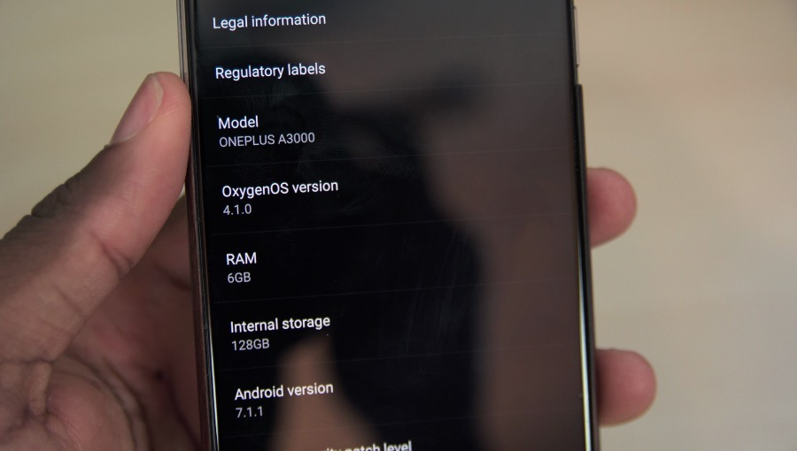
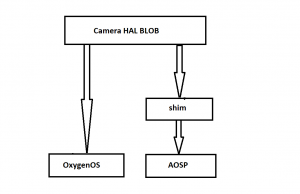
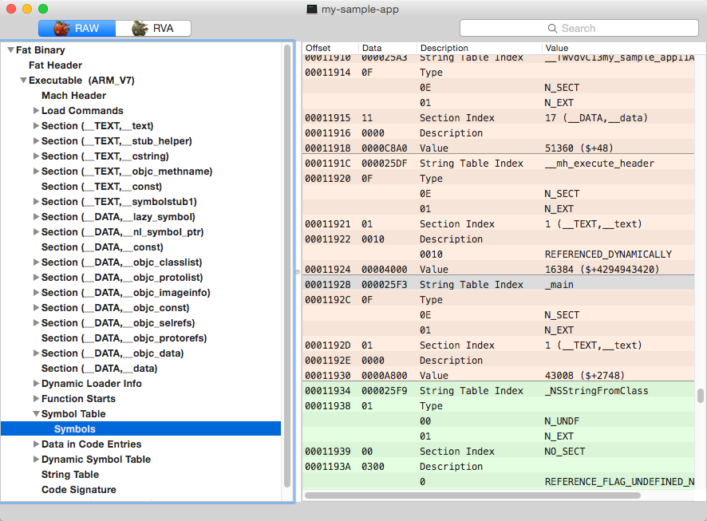
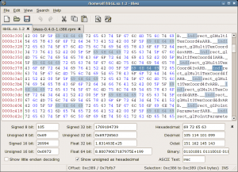

本文来自https://blog.toby.moe/android-shim/

原创翻译，[译自XDA](https://www.xda-developers.com/cameras-custom-roms-developers-make-hardware-work-without-source-code/)

随着Android Oreo的发布和许多如小米Redmi Note 3，Google Nexus 5之类的设备陆续有人开发出支持的第三方ROM，你可能会好奇为什么即使对于AOSP这样的原版系统，同样的功能（主要是相机）也可能出现问题需要重新适配。 你可能已经看到XDA论坛的各种ROM发布帖子中，“正常使用”列出了一些能正常使用的部分，然后跟着标志性的“暂不能用”列表。这两个部分已经在Reddit和Twitter成为一个梗了。

为什么开发者试图将AOSP ROM移植到设备上时会出这么多问题？ 简单的答案是，由于功能在不同版本的Android上发生了变化，所以打包成BLOB的旧驱动文件无法支持较新版本的Android，即使是原版的AOSP。 为了克服这个问题，开发者一般会使用一种叫”shim”（垫片）的手段进行适配，但是这个过程很棘手，耗时，有时还很难调试。

在本文中，我们将科普这个”shim”技术的原理，特别是关于相机部分的适配。我们将以OnePlus 3T为例。但请注意，现实中不同的设备适配过程中可能遇到的问题是各不相同的。

就算是以对第三方ROM支持优秀著称的一加手机，ROM开发者在幕后做的适配工作也是非常复杂的。

## 什么叫”shim”和BLOB？

为了了解这些开发人员都做了什么工作，首先需要解释几个事情。虽然Android系统是开源的，那些与设备一起售出的很多软件并不是。比如，第三方开发者看不到Samsung Experience, EMUI, OxygenOS或者之类其他的厂商修改版ROM的代码。

当然，只打算移植官方原版Android系统到一个设备的开发人员理论上可能不用在乎这些魔改版ROM的代码。但现实并非如此——因为一个重大原因：让手机的摄像头能正常工作的驱动程序，主要是Camera HAL (Hardware Abstraction Layer 硬件抽象层)也不是开源的。

相机HAL和官方ROM都是闭源的最大问题是，负责ROM移植的开发者几乎等于在盲操作了。官方ROM之所以能够正常调用相机是因为官方有HAL的源代码。HAL是让ROM与硬件之间能正常互相通信的关键部分——没有它，相机是没法用的。可以把HAL比作一辆车的油门和方向盘，这两个东西为车辆内部的复杂结构提供了一个可以让外部用简单方法进行操作的“界面”。

随着相机硬件上变得越来越复杂（比如出现了各种双摄），假如有HAL的源码就可以让移植第三方ROM变得简单很多。

然而由于各种原因，OEM厂商并不公开提供HAL源码。首先，如果他们本身也不完全拥有相机HAL的所有权（比如可能相机功能用了其他公司授权的知识产权），那他们是没法开源的。其次，开放HAL源码可能会危及他们自己的知识产权。而且这些公司并没有义务提供源代码（不像他们所用到的Linux内核由于GPL协议而必须开源）。所以没有HAL源码，开发人员要怎么才能让相机能用？答案是用BLOB和”shim”技术，加大量的调试。

一个设备BLOB文件包括了打包编译好的二进制文件。在本例中，相机HAL是厂商编译好后以二进制形式存储在设备中出货的。开发者指的BLOB就是这些在设备里存储的，他们能够提取的文件。相机BLOB的相关问题一直困扰了一加手机相关开发很长时间了，但好在至少开发者总是能提取这些BLOB文件。HAL源代码可以说是开发者解决问题的金钥匙了，但由于知识产权的问题，估计它永远不会被开源。

因此想要移植AOSP的开发者唯一能用的就是没有源代码的这些BLOB文件。很少有人能把这些BLOB直接套用在原版系统上直接正常使用，所以为了修正两者之间的问题，开发人员需要开发一个”shim”垫片。

“垫片”指的是添加代码以让BLOB与要移植的系统之间能够正常调用。这种垫片对于各种BLOB来说都可能需要，但通常最大的问题还是相机的。正如前面提到的，除了把新版Android移植到设备上，移植同样版本的原版纯净Android也是需要垫片的。

推荐阅读 [From Store to Shelf: An In-Depth Capitulation of Why MSM8974 Devices Are Excluded from Nougat](https://www.xda-developers.com/in-depth-capitulation-of-why-msm8974-devices-are-excluded-from-nougat/)

例如OnePlus2收到了Android 6.0 Marshmallow的系统更新。这个设备本身已经有了完全正常运行的基于Android 7 Nougat的第三方AOSP ROM，就是因为有辛勤工作的开发者开发了他们的shim。接下来我们会分析一些shim的例子，但首先会详细讲解shim到底是怎么工作的。

## Shim是怎么工作的？

由于开发者没有相机HAL或者厂商ROM的源码（但有编译好的二进制），他们不知道相机HAL需要哪些函数。因此相机HAL需要的函数与开发者需要移植的原版ROM中存在的函数往往是不匹配的。

为了解决这个问题，开发者要创建一个对应相机HAL需要的函数。这个新的函数起到在BLOB与ROM之间作为中间人的作用，这也是其称为”shim”垫片的原因。相机HAL所需要的函数在目标ROM中不存在的是需要shim的主要情况。

一个涉及OnePlus 3T的假设例子可能会更直观一点。假设一个用OxygenOS与OnePlus相机App的情景。如果我们用基于Nougat的OxygenOS中提取的BLOB用于构建Nougat的原版AOSP ROM，可能会出现问题。这是因为厂商编译的相机BLOB可能需要调用OxygenOS中特有的一些功能函数，但在AOSP中并不存在，或者名字不一样，这就会导致错误。这就可以通过我们的shim来进行弥补修复。

在编程中，“符号”指的是代码中的一个特定函数。符号的存在是因为在开发中由于代码的修改可能导致一个函数的位置发生变化，为了避免硬编码定位地址，编译器会创建一个符号表，这样其他函数可以以此找到该函数正确的位置。当你改变了一个函数的名称，编译后它的符号也会发生改变。因此当厂商改变了相机HAL的源代码后，开发者就需要创建新的shim了。

目前为止的解释，创建一个shim垫片听起来很容易。改变几个函数名称并不难对吧？有这么简单就好了。现实中会面临比改个名复杂得多的问题。XDA开发者Sultanxda为我们提供了他创建shim时一个更为复杂的例子。

## 创建Shim-并没有听上去那么简单

如果你不熟悉OnePlus 3T，可以告诉你前摄像头在最初的第三方AOSP ROM有很多问题。首先，拍摄超过8百万像素的图片会导致崩溃。为了解决这个问题，Sultanxda创建了几个shim才能让其正常工作。

### Shim #1 – 改变相机程序包名

为了阻止前置摄像头在用户拍摄超过8百万像素照片的情况下崩溃，Sultanxda强制相机HAL将所有相机App识别为OnePlus相机。这是因为OnePlus官方不知道出于什么原因对某些程序创建了几个特别的识别函数（isOnePlusCamera，isFacebookCamera等）。Sultanxda通过让相机HAL的相关函数指向一个永远返回true的函数，让其以为用户永远在用OnePlus官方相机App。

### Shim #2 – 禁用QuadraCfa

对于这个垫片，他得禁用QuadraCfa，这可能是一个高通的什么专利相机技术。之所以说“可能”是因为我和Sultanxda其实都不很知道这到底是什么，但Sultanxda发现一旦开启这个功能前置相机就会出问题。

他发现QuadraCfa有时会自动启动，但不知道为什么。解决这个问题需要一个比较特殊的修改。对于常规的shim，shim函数提供BLOB所需要的但原本缺失的符号。但对于这个案例，BLOB已经自带了它需要的符号——一个可能是代表启动QuadraCfa的函数。

所以他需要重写这个HAL中的符号，让他的shim替代这个原本的函数。唯一的操作方式是用16进制编辑器手动修改HAL的二进制。16进制编辑本质上就是在一堆看不懂的乱码中寻找一根干草堆里的针——一个需要编辑的函数或者字符串。

这样编辑一个函数比编辑一个字符串要困难得多，好在Sultanxda发现可以通过编辑符号表实现同样的效果而不用去手动编辑函数内容。

### Shim #3 – 高光修复

然后Sultanxda发现用前置摄像头在亮度很高的环境下照相会导致崩溃。为了重现这个问题，Sultanxda打开了他OnePlus One上的手电筒功能用来照OnePlus 3T的摄像头，让其崩溃以产生能用来调试的日志。他发现了导致崩溃的函数后，创建了一个shim使得设备对于前置摄像头一直使用低亮度模式。

### Shim #4 – 前置摄像头低分辨率问题

修复了上面的问题之后，Sultanxda发现了一个shim导致的问题：前置摄像头只能拍低分辨率图片。用户设置了比如一千六百万像素拍摄，实际的图片只有四百万。

为了解决这个问题他shim了handleSuperResolution和isSuperResolution两个函数使他们永远返回true（但只有当使用前置摄像头时，不然使用后置时这样会导致崩溃）。

## 总结 – 做垫片也可能很复杂

Sultanxda承认它的这个例子可能不能代表一个典型的shim工作。他对于完成了如此复杂的工作感到自豪。这个例子说明了在一些设备上让摄像头正常工作会有多困难。

> 希望你做摄像头shim的时候不会这么复杂 - Sultanxda

日志，日志，各种日志。没有一致的方式重现一个崩溃，没有日志开发者很难找出问题的根源。即使他们找出了问题所在，也未必能提供一个直截了当的修复。寻找与解决这些问题可能耗时很多天甚至很多周，所以修复AOSP ROM上的相机问题是如此复杂。

如果你的设备有一个能完整工作的移植AOSP ROM，你应该感谢这些开发者幕后所做的工作，这真的很不容易。这是一个很多人不会察觉到的付出，因为有XDA论坛上各种有才的开发人员负责着这这些Android中普通用户看不到的部分。