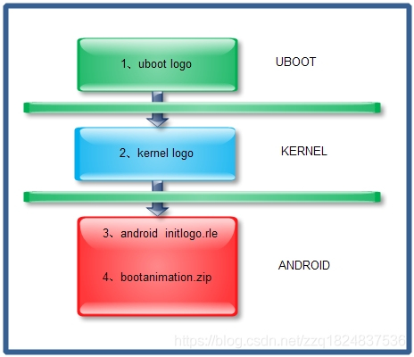
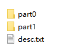
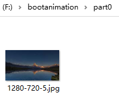
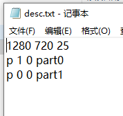

开机时在实现logo的过程中有四幅图片:

1) 、uboot显示；

2) 、kernel显示logo_linux_clut244.ppm；

3) 、android第一幅intilogo.rle；

4) 、android第二幅,bootanimation。

前三幅一般我们做成相同的，（4）为动画显示。启动过程如下所示。
 



## 一、kernel显示

大多数android厂商会设置logo.img来替代kernel显示，也就是说你看不到kernel显示。要想看到，你得将logo分区擦除:

```
adb reboot bootloader
#检查设备是否连接
fastboot devices
#擦除logo分区
fastboot erase logo
```

找到源码kernel_dir\drivers\video\logo\目录，在这个目录下你会发现logo_linux_clut224.ppm文件，这个就是开机画面的图片。

> 我们项目NXP的SOC,内核源码放在vendor/nxp-opensource/kernel_imx/，所以logo在vendor/nxp-opensource/kernel_imx/drivers/video/logo目录。
>
> ````shell
> work@S111-CCS2plus:~/test/plus/vendor/nxp-opensource/kernel_imx/drivers/video/logo$ ls -l
> total 944
> -rw-rw-r-- 1 work work   230 Aug 20 12:16 clut_vga16.ppm
> -rw-rw-r-- 1 work work  1581 Aug 20 12:16 Kconfig
> -rw-rw-r-- 1 work work 55752 Aug 20 12:16 logo_blackfin_clut224.ppm
> -rw-rw-r-- 1 work work 54088 Aug 20 12:16 logo_blackfin_vga16.ppm
> -rw-rw-r-- 1 work work  2682 Aug 20 12:16 logo.c
> -rw-rw-r-- 1 work work 76866 Aug 20 12:16 logo_dec_clut224.ppm
> -rw-rw-r-- 1 work work 76845 Aug 20 12:16 logo_linux_clut224.ppm
> -rw-rw-r-- 1 work work 12847 Aug 20 12:16 logo_linux_mono.pbm
> -rw-rw-r-- 1 work work 76844 Aug 20 12:16 logo_linux_vga16.ppm
> -rw-rw-r-- 1 work work 75502 Aug 20 12:16 logo_m32r_clut224.ppm
> -rw-rw-r-- 1 work work 76846 Aug 20 12:16 logo_mac_clut224.ppm
> -rw-rw-r-- 1 work work 78444 Aug 20 12:16 logo_parisc_clut224.ppm
> -rw-rw-r-- 1 work work 76840 Aug 20 12:16 logo_sgi_clut224.ppm
> -rw-rw-r-- 1 work work 14216 Aug 20 12:16 logo_spe_clut224.ppm
> -rw-rw-r-- 1 work work 78440 Aug 20 12:16 logo_sun_clut224.ppm
> -rw-rw-r-- 1 work work 76843 Aug 20 12:16 logo_superh_clut224.ppm
> -rw-rw-r-- 1 work work 12845 Aug 20 12:16 logo_superh_mono.pbm
> -rw-rw-r-- 1 work work 76842 Aug 20 12:16 logo_superh_vga16.ppm
> -rw-rw-r-- 1 work work  2049 Aug 20 12:16 Makefile
> 
> ````
>
> 

如要替换成自己的Logo，则把自己的Logo图片（png格式）转换成ppm格式，替换这个文件，重新编译烧录。

将png图片改成.ppm格式。首先你要有个 **和自己屏幕分辨率一样** 或者 小于屏幕分辨率的图片，如logo_linux_clut224.png

 **①将png图片转成pnm**

   **pngtopnm** logo_linux_clut224.png >logo_linux_clut224.pnm

  **②将pnm图片的颜色数限制在224色**

  **pnmquant** 224 logo_linux_clut224.pnm > logo_linux_clut224_backup.pnm（此处生成后的名字不可与前者相同，否则会报错）

  **③将pnm图片转换成我们需要的ppm**

  **pnmtoplainpnm** logo_linux_clut224_backup.pnm >logo_linux_clut224.ppm


## 二、Android 开机动画

Android的开机动画是由Linux本地守护程序bootanimation专门控制实现的，其代码在：frameworks/base/cmds/bootanimation/目录下:

````shell
work@S111-CCS2plus:~/test/plus/frameworks/base/cmds/bootanimation$ ls -l
total 108
-rw-rw-r-- 1 work work  1768 Jan  6 14:36 Android.mk
-rw-rw-r-- 1 work work 12603 Jan  6 14:36 audioplay.cpp
-rw-rw-r-- 1 work work  1136 Jan  6 14:36 audioplay.h
-rw-rw-r-- 1 work work 42385 Jan  6 14:36 BootAnimation.cpp
-rw-rw-r-- 1 work work  6231 Jan  6 14:36 BootAnimation.h
-rw-rw-r-- 1 work work  5222 Jan  6 14:36 bootanimation_main.cpp
-rw-rw-r-- 1 work work  1950 Jan  6 14:36 BootAnimationUtil.cpp
-rw-rw-r-- 1 work work   817 Jan  6 14:36 BootAnimationUtil.h
-rw-rw-r-- 1 work work   174 Jan  6 14:36 bootanim.rc
-rw-rw-r-- 1 work work  5059 Jan  6 14:36 FORMAT.md
drwxrwxr-x 2 work work  4096 Jan  6 14:36 iot
````

修改Android开机动画有两种方式：

**Ø 蒙板图片替换：**

替换frameworks/base/core/res/assets/images/目录下的两个图片文件：android-logo-mask.png和android-logo-shine.png。android-logo-mask.png是镂空蒙板图片，android-logo-shine.png是镂空蒙板后面的闪光png图片。两个图片通过叠加移动来达到动画效果。

Android系统默认的开机动画是由两张图片android-logo-mask.png和android-logo-shine.png通过程序调用实现的动画效果（明暗变化）。 
这两张图片保存在<android-source>/frameworks/base/core/res/assets/images中：

````shell
work@S111-CCS2plus:~/test/plus/frameworks/base/core/res/assets/images$ ls -l
total 112
-rw-rw-r-- 1 work work 12104 Jan  6 14:36 android-logo-mask.png
-rw-rw-r-- 1 work work 88700 Jan  6 14:36 android-logo-shine.png
-rw-rw-r-- 1 work work 12142 Jan  6 14:36 clock_font.png

````

简单替换的方法就是自定义png图片，替换 android-logo-mask.png文件，并重新编译：

```
$ mmm -B frameworks/base/core/res/
```

会生成新的<android-source>/out/target/product/xxx/system/framework/framework-res.apk文件，替换的图片就在其中。

**Ø 逐帧动画替换：**

在/data/local/目录或/system/media/目录创建bootanimation.zip文件，该压缩包文件里存放有逐帧动画及控制脚本。

这是我们现在项目里的bootanimation：

````shell
mek_8q:/data/local $ ls -l
total 1448
-rwxrwxrwx 1 u0_a4  u0_a4  484541 2020-11-24 17:25 1606112502000.hsae_acc_on_ad
-rwxrwxrwx 1 u0_a17 u0_a17 969467 2020-11-23 14:21 bootanimation.zip   #这个文件
drwxrwxrwx 5 shell  shell    4096 2021-01-10 11:41 tmp
drwxrwxrwx 2 shell  shell    4096 1970-01-01 08:00 traces
````

bootanimation.zip 解压后：



part0:



desc.txt:



制作Android开机动画文件时，文件bootanimation.zip压缩模式需为存储模式。如果不是存储模式，开机界面将会出现黑屏的情况，无法正常播放。

压缩命令如下：

```
zip -r -0 bootanimation.zip part0 part1 desc.txt
```

执行上面命令，即可将part0目录，part1目录，desc.txt文件以存储的压缩方式压缩为bootanimation.zip。

desc.txt内容

```
//part0内图像像素 1280宽*720高  每帧（s）播放25张图片
1280 720 25

//p代表定义一个部分 第二位表示文件夹播放次数，1:重复播放一次，“0”代表无限循环播放
// 第三位表示播放下一个部分前的延迟帧数.也就是part0结束后多长时间播放part1,默认为0。如果你是用15帧每秒播放，那么p后面第二个数为15时，就是延迟1秒
p 1 0 part0
p 0 0 part1
//最后要加一个换行
```

part 目录中的图片的命名要是连续的，比如pic_001, pic_002, _pic_003 … 图片格式png或jpg都可