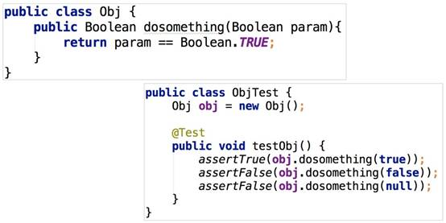
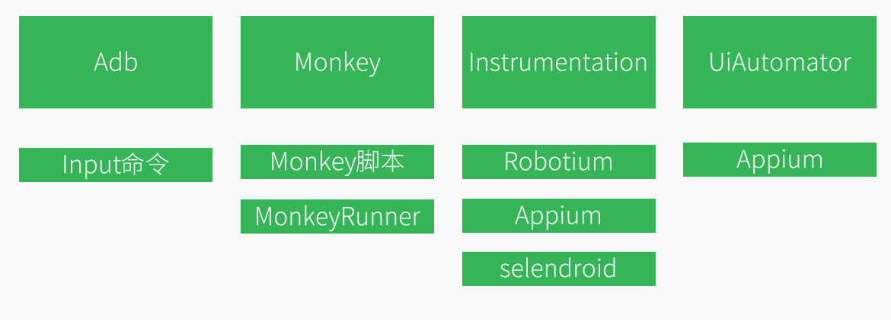
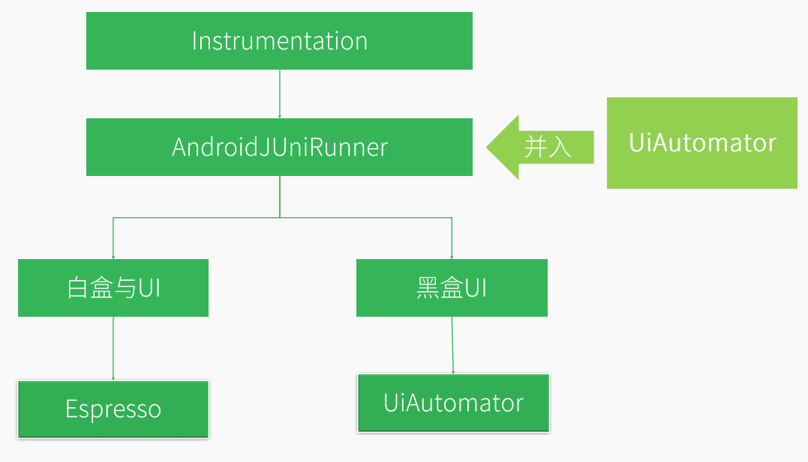

# 单元测试介绍

单元测试是在项目代码之外建立的**白盒测试工程**，用于执行项目中的目标函数并**验证其状态或者结果**，其中，单元指的是测试的最小模块，通常指函数。代码能够检测目标代码的正确性，打包时单元测试的代码不会被编译进入APK中。

与Java单元测试相同，Android单元测试也是维护代码逻辑的白盒工程，但由于Android运行环境的不同，Android单元测试的环境配置以及实施流程均有所不同。

## Java单元测试

在传统Java单元测试中，我们需要针对每个函数进行设计单元测试用例。如图2便是一个典型的单元测试的用例。



 

1、针对函数dosomething(Boolean param)的**每个if-else分支**，我们都需要构造相应的参数并验证结果。

2、针对参数，除了正常参数（这个例子的正常参数是true或false），还应该构造临界值参数、空值参数(null)、正常范围之外的参数

3、单元测试的目标函数主要有三种：

  1. 有明确的返回值，如上图的dosomething(Boolean param)，做单元测试时，只需调用这个函数，然后验证函数的返回值是否符合预期结果。
  2. 函数本身没有返回值，改变其对象内部的一些属性或者状态，，就验证它所改变的属性和状态。
  3. 一些函数没有返回值，也没有直接改变哪个值的状态，这就需要验证其行为，比如点击事件。
  4. 既没有返回值，也没有改变状态，又没有触发行为的函数是不可测试的，在项目中不应该存在。

构造用例的原则是测试用例与函数一对一，每个测试用例都应该准确指定它是测的哪个函数，临界值参数、空值参数(null)、异常参数、正常参数的测试代码可以一起放在一个用例里面，也可以分开写，分开写的好处是导出的测试报告可以具体一点。 当一个函数存在多种特性时，比如既有返回值，又改变了类的状态，那么可以为每一种特性写一条case验证，也可以只写一个case，逐一执行目标函数并验证其影响。

 

## Android单元测试

在Android单元测试中，并不要求对所有函数都覆盖到，像Android SDK中的函数回调则不用测试。

在Android中，单元测试的本质依旧是验证函数的功能，测试框架也是JUnit。
在Java中，编写代码面对的只有类、对象、函数，编写单元测试时可以在测试工程中创建一个对象出来然后执行其函数进行测试，而在Android中，编写代码需要面对的是组件、控件、生命周期、异步任务、消息传递等。打个比方，你总不能自己去new一个Activity吧，退一步讲，就算你new YourActivity，也可以测试里面的一些方法，你怎么让它走到到resume的状态呢？ 虽然本质是SDK主动执行了实例的onResume方法，但是SDK做了许多事情，并不是简单的调用onResume方法。怎么测试界面上的事件监听呢？这些监听大部分都是匿名内部类的形式，你怎么才能测试到里面的代码呢？许多非常复杂的对象是android框架层传递过来的，你不可能自己创建这些对象，又怎么测试呢？因此需要JUnit之外的框架支持。

当前主流的单元测试框架AndroidTest和Robolectric，前者需要运行在Android环境上，后者可以直接运行在JVM上，速度也更快，可以直接由Jenkins周期性执行，无需准备Android环境。前者称为[插桩单元测试](#插桩单元测试)，后者称为[本地单元测试](#本地单元测试 )。对于一些测试对象依赖度较高而需要解除依赖的场景，我们可以借助Mock框架和PowerMock。

## Android Studio项目的测试目录

·     androidTest 目录应包含在真实或虚拟设备上运行的测试。此类测试包括集成测试、端到端测试，以及仅靠 JVM 无法完成应用功能验证的其他测试。

·     test 目录应包含在本地计算机上运行的测试，如单元测试。

## 设备

·     真实设备

·     虚拟设备（如 Android Studio 中的[模拟器](https://developer.android.google.cn/studio/run/emulator)）

·     模拟设备（如 Robolectric）

## Android 各种UI测试框架介绍

按技术进行分类：



*  MonkeyRunner  
  1.  编写语言： Python、 Jython  
  2.  运行环境： Python环境， adb链接PC运行
  3.  测试对象： UI测试
  4.  测试限制： 主要使用坐标， 逻辑判断较差  

*  Instrumentation  
  1.  编写语言： Java  
  2.  运行环境： adb命令启动或者手机中直接启动测试
  3.  测试限制： 单个Activity测试， 需与测试应用相同的签名
  4.  测试对象： 主要用于白盒测试和UI测试  
* Robotium  
  1.  编写语言： java   基于Instrumentation封装
  2.  运行环境： 与Instrumentation相同
  3.  测试限制： 与Instrumentation相同  

* UiAutomator  

  1. 谷歌在Android  4.1  推出UiAutomator测试框架  

  2. 用于UI自动化测试  

  3. 功能： 模拟人对手机操作， 模拟各种动作如点击， 长按， 滑动、 按键等操作  

  4. 优点：
     •  API简单易学,编写快速；
     •  运行简单
     •  无Activity限制；
     •  无需签名；
     •  几乎可以模拟所有的人为操作；  
     • 所有java语言与当前的框架都可以成为UiAutomator的扩展  
     
5. 缺点：
     •  对权限控制不足；
     •  无法像Instrumentation一样高权限操作应用；
     •  很多android API无法利用；  

MonkeyRunner  代码风格示例

````java
device=MonkeyRunner.waitForConnection() #连接⼿手机设备	
device.press('KEYCODE_HOME',MonkeyDevice.DOWN_AND_UP)#点击Home键	
device.type('Hello MonkeyRunner')#向编辑区域输⼊入⽂文本
````
Instrumentation  代码风格示例
````java
mActivity.runOnUiThread(new Runnable() {
    public void run() {
    	mSpinner.requestFocus();
    }
});
mInstrumentation.waitForIdleSync();
this.sendKeys(KeyEvent.KEYCODE_BACK);
````
Robotium  代码风格示例
````java
solo.clickOnMenuItem("Add note");
solo.enterText(0, "Note 1");
solo.goBack();
````
## 关系




## 本地单元测试

本地单元测试是由 JVM 驱动的开发计算机上运行的测试，可以使用 [Robolectric](http://robolectric.org/)。

Robolectric 会模拟 Android 4.1（API 级别 16）或更高版本的运行时环境，并提供由社区维护的虚假对象（称为“影子”）。通过此功能，您可以测试依赖于框架的代码，而无需使用模拟器或[模拟对象](https://developer.android.google.cn/training/testing/fundamentals#test-doubles)。Robolectric 支持 Android 平台的以下几个方面：

- 组件生命周期
- 事件循环
- 所有资源


## 插桩单元测试

在物理设备或模拟器上运行插桩单元测试。不过，这种形式的测试所用的执行时间明显多于本地单元测试，因此，最好只有在，必须根据 实际设备硬件 评估应用的行为时才依靠此方法。

运行插桩测试使用Google提供的AndroidX Test API，AndroidX Test 会使用以下线程：

- 主线程，也称为“界面线程”或“Activity 线程”，界面交互和 Activity 生命周期事件发生在此线程上。
- 插桩线程，大多数测试都在此线程上运行。当您的测试套件开始时，`AndroidJUnitTest` 类将启动此线程。

如果您需要在主线程上执行某个测试，请使用 [`@UiThreadTest`](https://developer.android.google.cn/reference/androidx/test/annotation/UiThreadTest) 注释该测试。

## build.gradle

Android Studio中引入Robolectric 或者AndroidX Test ，只需要在build.gradle做一些配置。请参考官网。


## 测试金字塔的级别

测试金字塔（如图 2 所示）说明了应用应如何包含三类测试（即小型、中型和大型测试）：

- [小型测试](https://developer.android.google.cn/training/testing/fundamentals#small-tests)是指单元测试，用于验证应用的行为，一次验证一个类。

- [中型测试](https://developer.android.google.cn/training/testing/fundamentals#medium-tests)是指集成测试，从模块级别验证应用的行为，即验证一组单元的协作和交互的集成测试。下面这些属于中型测试：
1. 视图和视图模型之间的互动，如测试 [`Fragment`](https://developer.android.google.cn/reference/androidx/fragment/app/Fragment) 对象、验证布局 XML 或评估 [`ViewModel`](https://developer.android.google.cn/reference/androidx/lifecycle/ViewModel) 对象的数据绑定逻辑。
  
2. 应用的代码库层中的测试，验证不同数据源和数据访问对象 (DAO) 是否按预期进行互动。
  
3. 应用的垂直切片，测试特定屏幕上的互动。此类测试目的在于验证应用堆栈的所有各层的互动。
  
4. 多 Fragment 测试，评估应用的特定区域。与本列表中提到的其他类型的中型测试不同，这种类型的测试通常需要真实设备，因为被测互动涉及多个界面元素。

- [大型测试](https://developer.android.google.cn/training/testing/fundamentals#large-tests)是指端到端测试，用于验证跨越了应用的多个模块的用户操作流程。

运行中型测试时使用 Espresso，不管是真实设备或 Robolectric 。

你的APP对不同Android版本的支持、UI对不同屏幕尺寸的适配、对不同硬件配置的支持，这些都算作大型测试，因此大型测试最好在模拟设备或基于云的服务（如 [Firebase 测试实验室](https://firebase.google.cn/docs/test-lab/)）上，而不是在物理设备上。

沿着金字塔逐级向上，从小型测试到大型测试，各类测试的保真度逐级提高，但维护和调试工作所需的执行时间和工作量也逐级增加。因此，您编写的单元测试应多于集成测试，集成测试应多于端到端测试。虽然各类测试的比例可能会因应用的用例不同而异，但我们通常建议各类测试所占比例如下：**小型测试占 70%，中型测试占 20%，大型测试占 10%**。

如需详细了解 Android 测试金字塔，请观看 2017 年 Google I/O 大会的 [Android 平台上的测试驱动型开发](https://www.youtube.com/watch?v=pK7W5npkhho&start=111)会议视频（从 1 分 51 秒开始）。


## 可参考的资料

1、公司共享盘上的视频

2、 android的官网教程

4、 https://chriszou.com/2016/08/06/android-unit-testing-async/

5、 http://doc.yonyoucloud.com/doc/wiki/project/android-weekly/issue-145/parameterized-testing-with-robolectric.html