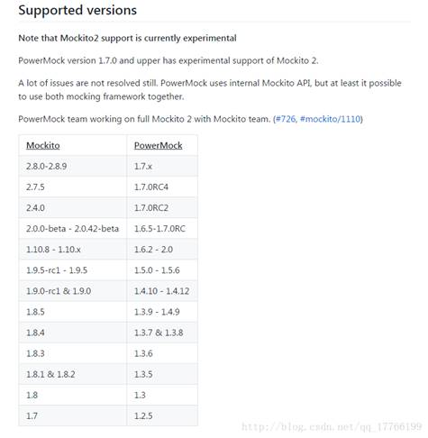

## 为什么使用Powermockito

​     Mockito其实已经可以满足大部分的需求，但是它的实现机制是使用cglib来动态创建接口的类的实例,这种实现方式不能用于mock构造函数以及静态、final、私有的方法等, 所以我们才需要结合使用PowerMock

​     PowerMockito扩展了其它mock框架，使用字节码操作和一个自定义类加载器来模拟静态方法，构造函数，final类和方法，私有方法，去除静态初始化器等等。

PowerMockito支持EasyMock和Mockito，我们这里基于mockito讲解。

## 集成

在build.gradle中添加：

````groovy
testImplementation 'junit:junit:4.12'
testImplementation 'org.mockito:mockito-core:2.27.0'
testImplementation 'org.powermock:powermock-module-junit4:2.0.2'
testImplementation 'org.powermock:powermock-api-mockito2:2.0.2'
````

如果使用了PowerMockRule，还要添加：

````groovy
testImplementation 'org.powermock:powermock-module-junit4-rule:2.0.2'
testImplementation 'org.powermock:powermock-classloading-xstream:2.0.2'
````


当然，你可以把后面的版本号改成你需要的。但要注意，Powermock是基于mockito的，所以版本要对应：



 

## 启动

@RunWith(PowerMockRunner.class)

或

MockitoAnnotations.initMocks(this);

如果@RunWith被其它测试框架占用，可以使用@Rule：

````java
@Rule
public PowerMockRule rule = new PowerMockRule();
````

 

## Junit注解

@BeforeClass

@Before

@Test

@After

@AfterClass

 

Junit的几个断言方法：Assert.fail()方法、assertTrue方法、assertThat方法

例如,断言a.foo()方法应该抛出一个异常，测试这么写：

try{

​     a.foo();

​     fail();//如果走到这里，表示没有按照预期抛出异常，则测试失败

}catch(MyException e){}

 

## mock一个对象

1、注解方式

@Mock

McuManager mMcuManager;

2、普通方式

PowerMockito.mock(McuManager.class)

3、深度mock

@Mock(Answers.RETURNS_DEEP_STUBS)

或

PowerMockito.mock(Object.class,Mockito.RETURNS_DEEP_STUBS)

4、smart mock

@Mock(Answers. RETURNS_SMART_NULLS)

 

## spy

​     SocManager socManager = PowerMockito.spy(new SocManager());

或注解方式

@Spy

private SocManager socManager;//自动调用无参构造函数

@Spy

private SocManager socManager = new SocManager();

 

理解mock与spy的区别，mock函数默认会mock所有方法，而spy返回的对象默认调用真实的方法，适用于只需要mock部分方法的场景。从语法上讲，mock传递一个T.class构造出假的T对象，而spy可以根据T.Class构造对象，也可以将真实的T对象包装出一个新对象。

 

## mock一个函数

1、return在后

PowerMockito.when(mStorageManager.getVolumePaths()).thenReturn(strs);//表示当调用mStorageManager的getVolumePaths方法时，返回strs对象。

​    PowerMockito.when(mStorageManager.getVolumeState(anyString())).thenReturn(Environment.MEDIA_MOUNTED);//当getVolumeState的参数是任意的字符串时，返回mounted状态

限制是mock的方法必须有一个返回值。

 

2、doReturn在前

PowerMockito.doReturn(true).when(socManager).isUsbMounted();//当调用isUsbMounted()，返回true

 

// addEmployee是一个没有返回值得方法，没法用when().thenXXX的方式

PowerMockito.doNothing().when(employeeDao).addEmployee(employee);

 

以下是正确的:

PowerMockito.doReturn(true).when(mPodPorxy,"isConnected");

PowerMockito.doReturn(true).when(mPodPorxy,"isConnected",参数1,参数2);//如果有参数

 

PowerMockito.doReturn(true).when(mPodPorxy).isConnected();

但这样是错误的：

PowerMockito.doReturn(true).when(mPodPorxy.isConnected())//报错提示缺少thenReturn,可见这是return在后面时的写法

 

## PrepareForTest

当需要mock私有方法、静态和final方法时，需要加注解：@PrepareForTest(A.class)

这个注解的意思是，PowerMock根据你的mock要求，去修改写在@PrepareForTest里的class文件，所以凡是需要通过修改字节码才能实现的功能，都需要加这个注解。

通常报错信息会提示你加这个注解：“The class xxxx not prepared for test”, 但有些场合是不会的，如果发现mock没有效果，考虑是否忘了添加PrepareForTest。

 

## mock私有方法

私有方法代码里是访问不到的，先添加 @PrepareForTest(PodPorxy.class),然后将方法名以字符串传入即可：

PowerMockito.when(mPodPorxy, " isConnected").thenReturn(true);


## mock静态方法

1、先添加@PrepareForTest({Log.class, McuManager.class})注解

2、然后 PowerMockito.mockStatic(Log.class); PowerMockito.mockStatic(McuManager.class);

这时Log和McuManager类中的static方法已经自动mock了。没有返回值的方法，一律doNothing。有返回值得方法，按照默认策略返回，比如返回一个null或空的集合。

3、再然后指定动作：

​     PowerMockito.when(McuManager.getInstance()).thenReturn(mockMcuManager);

//默认就是doNothing，所以这行代码是不需要的

PowerMockito.doNothing().when(LogUtil.class,"i",anyString(),anyString())

 

## mock构造函数

举例，SocManager.java里面存在：

private RemoteCallbackList<ISocCallback> mSocCallbacks = new RemoteCallbackList<T>();

由于RemoteCallbackList是android里面的class，非安卓环境运行new RemoteCallbackList会抛异常，于是用：

PowerMockito.whenNew(RemoteCallbackList.class).withNoArguments().thenReturn(mockedObj);

在每次new对象时直接返回mock的RemoteCallbackList对象。

不要忘了添加@PrepareForTest({SocManager.class})，注意是SocManager，不是RemoteCallbackList，因为需要修改的是SocManager.class的字节码。

 

## 阻止静态代码块

有时静态代码块会依赖真实环境，通过@SuppressStaticInitializationFor注解可以阻止：

 @RunWith(PowerMockRunner.class)

@PrepareForTest({LogBt.class})

@SuppressStaticInitializationFor("com. utils.LogBt")

public class XXXTest{}

 

这样LogBt的static{xxx}不会执行。

 

## 构造函数里需要mock

还有这样一种场景，需要new A()创建真实的A对象,但是A的构造器里面调用了A 的init()方法，而init是依赖真实环境才能执行的，所以我希望将init方法mock。

1、 Init不是static的，所以mockStatic不适用。

2、 这时A的对象还没有创建出来，所以when.thenReturn的方法也不适用。

当然，我们可以回避问题，找到init里面会报错的那一行，将它mock。但是，如果init方法是native的呢？或者init里面需要mock的代码很多很复杂，为了代码简洁更应该mock init呢？

对策：

假设测试对象是AAA类,代码像这样：

  public AAA() {

​    test();

  }

  private void test(){

​    throw new RuntimeException("haha");

  }

可以这样抑制test方法执行：

1、import static org.powermock.api.support.membermodification.MemberModifier.suppress;

2、@PrepareForTest({AAA.class})

3、在new AAA之前，执行suppress(methods(AAA.class, "test"));

4、创建对象AAA aa = new AAA();你会发现test()没有执行，没有异常。

 

## 模拟抛异常

PowerMockito.doThrow().when();

PowerMockito.when().thenThrow()

 

## 自定义行为: thenAnswer

PowerMockito.when(rtpSession.addParticipant(Mockito.any())).thenAnswer(invocation -> {

​        throw new SocketException();

​      });

于是，在每次调用addParticipant是，真正执行的是thenAnswer()里的代码。

举例：

Log.i(tag,msg)是安卓提供的打印日志的方法，在junit里面执行会报错。我们替换成System.out.println:

 ````java
@PrepareForTest(Log.class)
PowerMockito.mockStatic(Log.class);
PowerMockito.doAnswer(new Answer<Object>() {
    @Override
    public Object answer(InvocationOnMock invocation) throws Throwable {
        System.out.println(invocation.getArgument(0,String.class) + ": " + invocation.getArgument(1,String.class));
        return null;
    }
}).when(Log.class,"i",anyString(),anyString());
 ````

这样所有调用Log.i(tag,msg)的地方真正执行的都是System.out.println(tag+”: ” + msg)

 

## 验证方法执行次数

​     Mockito.verify(mockBean).someMethod();表示：someMethod方法调用了一次，相当于times(1)

Mockito.verify(mockBean, Mockito.times(n)).someMethod();表示：someMethod方法调用了n次

Mockito.verify(mockBean, Mockito.never()).someMethod();表示：someMethod方法未执行

Mockito.verify(mockBean, Mockito.atLeastOnce()).someMethod();表示：someMethod方法至少执行过一次,相当于atLeast(1)

以下是PowerMock才有的：

​     PowerMockito.verifyNew(SocManager.class, Mockito.times(1)).withNoArguments();//如果构造函数执行了不止一次，则测试失败


​    PowerMockito.verifyStatic(Mockito.times(1));//紧接下行

​    MyUtils.mytest(Mockito.anyString())//紧跟一行表示要验证的是哪个已经mock的静态方法


​    PowerMockito.verifyPrivate(socManager,Mockito.times(1)).invoke("doUsbTask");//private对外不可见，故只能用invoke (“methodName”,arg1,arg2…)

 

 

比如，测试单例模式。对于单例模式，构造方法应该只执行了一次，所以这样测试：

````java
PowerMockito.field(SocManager.class,"mSocManager").set(null,null);

PowerMockito.whenNew(SocManager.class).withNoArguments().thenReturn(PowerMockito.mock(SocManager.class));

//启动10个线程
int threads = 5;
final CountDownLatch downLatch = new CountDownLatch(threads);
for(int i = 0; i < threads; i++){
    new Thread(new Runnable() {
        @Override
        public void run() {
            SocManager.getInstance();
            SocManager.getInstance();
            downLatch.countDown();
        }

    }).start();
}

downLatch.await();//等线程全部执行完

//如果SocManager的构造函数没执行或执行了多次，则测试失败

PowerMockito.verifyNew(SocManager.class, Mockito.times(1)).withNoArguments();

//恢复SocManager.mSocManager ，避免影响其它case
PowerMockito.field(SocManager.class,"mSocManager").set(null,mSocManager);
````


 

## 一些方法

​	     mock、mockStatic

​          when、whenNew

​          withNoArguments、withAnyArguments()、withArguments(obj1,obj2,...)

​          thenReturn、thenThrow()、thenAnswer()、thenCallRealMethod();

​          doThrow()、doNothing()、doAnswer()、doReturn()、doCallRealMethod();

Mockito: anyBoolean()anyByte()anyChar()anyInt()anyString()anyList()等

 

## field方法修改成员变量

​     用反射也可以做到，但是不太方便，PowerMockito只需一行

PowerMockito.field(SocManager.class,"versionList").set(mSocManager,new String[3]);

PowerMockito.field(SocManager.class,"mSocManager").set(null,socManager);//mSocManager是SocManager的static成员

PowerMockito.field(SocManager.class, "currentDevice").get(mSocManager)

 

## 存在子线程

如果被测试的方法里创建了子线程，那么在case方法里应该在方法的末尾sleep一段时间，确保子线程执行结束再返回。

 

## 记录一些问题

​     每个case方法执行之前都会执行一次被@Before修饰的方法以及用@Mock标志的属性，从而重新初始化对象，保证case之间不会互相干扰。但是不会每次重新加载class，所以当一个case里面修改了类的某个静态字段时，此修改对其它case是可见的，这可能会导致一些意想不到的结果。比如，在我的测试类里面有：

    @Mock
    Context mContext;

然后在SocManager.getInstance()里new一个SocManager对象，在构造函数里获取mContext。问题是对于每个case，都会生成一个新的mock的mContext对象，而SocManager.getInstance()作为一个单例，只有第一个case执行了一次构造函数，后面的case都是直接返回对象。于是，只有第一个case，SocManager持有的mContext是我们mock的Context，从第二个case开始，SocManager里的mContext对象还是以前的，而我们在测试方法里用的mContext是刚刚mock出来的，不是一个对象。导致的现象是，明明已经执行了：

when(mContext.getXX()).thenReturn(obj)，

SocManager里面却没有按预期返回obj。

解决方法是：

1、 在@Before里面强行将新mock的mContext设置到SocManager.mContext

2、 或者在@Before里将SocManager.instance设置为null，也就是每个case都构造一个新的SocManager对象。

3、 或者，TestClass里面将mContext声明static，删除@Mock注解，然后在@BeforeClass里mock Context对象：

mContext = PowerMockito.mock(Context.class);。

mContext 是静态的，@Mock注解无法作用于static成员，所以这里只能用mock函数创建实例。@BeforeClass修饰的方法只执行一次保证了mContext是一个对象。