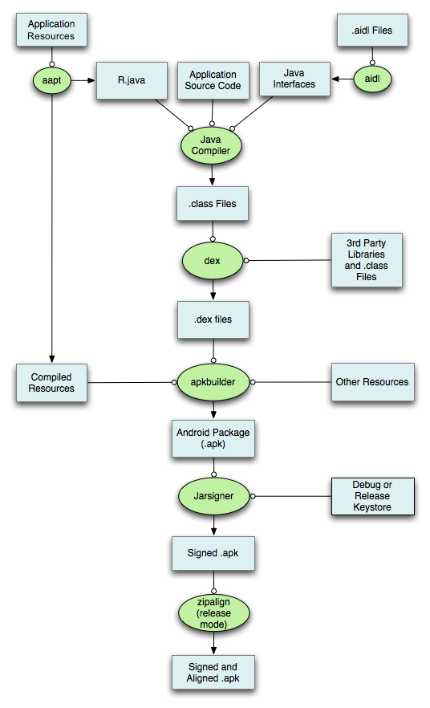
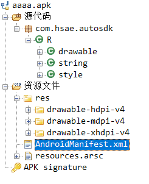
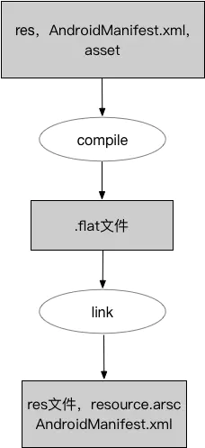
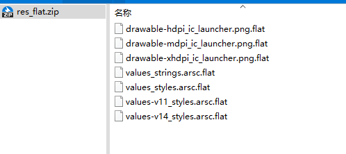
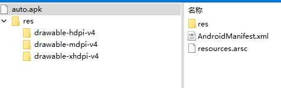
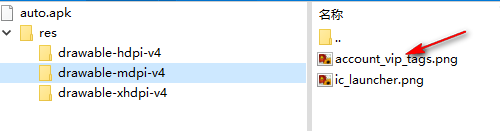

## 图形界面

不管使用的IDE是eclipse还是android studio，都可以在菜单和工具栏中找到构建的选项。这显然不是本文要讲的。

## 用gradle构建apk

android studio默认使用gradle来管理安卓项目。图形界面的本质还是调用的一些命令。

* 构建调试版 APK： 

`gradlew assembleDebug`

这将在 `project_name/module_name/build/outputs/apk/` 中创建一个名为 `module_name-debug.apk` 的 APK。该文件已使用调试密钥进行签名并使用 [`zipalign`](https://developer.android.google.cn/tools/help/zipalign) 对齐，因此您可以立即将其安装到设备上。

* 构建 APK 并立即在运行的模拟器或连接的设备上安装，请改为调用 `installDebug`：

```shell
gradlew installDebug
```


## 命令行构建apk

本文的重点是使用android-sdk里面的工具构建apk，不借助gradle或任何IDE。

来自google官方经典的流程图：



从这张图看出大致分了几步(暂时不考虑第三方库和native代码等复杂情况)：

1. 用aapt处理资源文件
2. 用aidl转换aidl文件
3. 编译java文件
4. class文件转成dex格式
5. 将资源文件和java代码一起打包成apk。其实就是zip格式的压缩。
6. 签名
7. zip对齐

> aapt 参数
> -f 如果编译出来的文件已经存在，强制覆盖。
> -m 使生成的包的目录放在-J参数指定的目录。
> -J 指定生成的R.java的输出目录
> -S res文件夹路径
> -A assert文件夹的路径
> -M AndroidManifest.xml的路径
> -I 某个版本平台的android.jar的路径
> -F 具体指定apk文件的输出

aapt、aidl、dx、zipalign 等工具在android-sdk\build-tools\xx目录下，先将这个目录添加到环境变量。

### 第一步 aapt打包资源文件

**生成R.java**

```shell
# aapt package -m -J <R.java目录> -S <res目录> -I <android.jar目录>  -M <AndroidManifest.xml目录>
aapt package -m -J gen -S res -I D:\android-sdk\platforms\android-29\android.jar -M  AndroidManifest.xml
```

这个命令将会在gen目录下面创建包路径和R.java 。显然，要想生成R.java，至少要让aapt知道res目录、AndroidManifest.xml、以及android.jar。知道R.java是什么的同学不难理解这一点。

提示出错：“ERROR: Unable to open class file gen\com\hsae\autosdk\R.java: No such file or directory”，百度了很多都没有解。其实只是因为目录下没有gen这个目录，错误信息不太友好导致这个问题卡了很长时间。aapt工具不会自动帮你创建目录，你要自己先创建gen目录，然后再执行命令。

记住，后面的其它命令也有类似问题，留意即可。


**将资源打包成apk**

在上面的命令的基础上加上一个-F选项，可同时生成R.java和apk：

```shell
#先创建gen目录
aapt package -m -J gen -S res -I D:\android-sdk\platforms\android-29\android.jar -M  AndroidManifest.xml -f -F aaaa.apk
```

执行这个命令将会生成R.java，和一个aaaa.apk。解包apk你会看到里面只有R.java和资源文件：



所以接下来要把java代码打包进来。

### 第二步 将aidl转成java

aidl命令的基本用法是：

`aidl -Isrc -ogen src\xxx\xxx.aidl `

据说aidl的命令非常奇怪，-I -p与后面的值之间不能有空格，然而我试了加了空格并没有问题。

-I 表示import语句的搜索路径。-o表示生成的目标java文件放在哪个路径。

这个命令一次只能处理一个aidl文件，于是我写了bash脚本批量执行。

```shell
#搜索出所有aidl文件，保存到aidls.txt里
find src -name *.aidl > aidls.txt
#遍历aidls.txt的每一行，执行aidl命令
while read line; do aidl -Isrc -p/d/android-sdk/platforms/android-29/framework.aidl -ogen $line ; done < aidls.txt
```

因为我的aidl文件当中，有一些用到了framework提供的parcel（比如android.os.Bundle和 android.graphics.Bitmap），所以加了-p。 


### 第三步 编译java代码

```shell
#java11当中-bootclasspath已经不能用，所以直接把android.jar当成普通的jar包加到-classpath后面。不过我用的是从安卓源码编译出来的framework.jar，就不需要android-sdk下的android.jar了
javac -encoding UTF-8 -target 11 -classpath  /e/sdk/framework.jar:/e/AutoSdk/libs/libProtocolService.jar  -d out/ `find ./src -name *.java` `find ./gen -name *.java`
```

### 第四步 生成.dex文件

`dx.bat --dex --output=classes.dex --min-sdk-version=26 out`//上一步class文件输出在out目录

我遇到了以下的报错：

```
PARSE ERROR:
unsupported class file version 55.0
...while parsing com/hsae/autosdk/
```

回到第三步，指定兼容性即可：

```shell
'/c/Program Files/Java/jdk1.8.0_211/bin/javac.exe' -encoding UTF-8 -source 1.8 -target 1.8 -classpath /e/sdk/framework.jar:/e/AutoSdk/libs/libProtocolService.jar  -d out/ `find ./src -name *.java` `find ./gen -name *.java`
```

### 第五步 生成APK文件

以前用apkbuilder命令，不过在 Android SDK build tools r22里面被移除了。

不过第一步得到了aaa.apk，反正apk就是一个压缩包，直接把classes.dex压缩到里面就是了。

### 第六步 签名

apk是必须加入签名的。SDK 提供了一个的debug key,路径在~/.android/debug.keystore。默认的签名信息如下

```
Key password:  android
Keystore password:  android
Key alias: androiddebugkey
```

用JDK提供的工具jarsigner 进行签名：

```shell
F:\temp\apk> jarsigner -verbose -keystore C:\Users\xuexiangyu\.android\debug.keystore -storepass android aaaa.apk androiddebugkey
   正在添加: META-INF/MANIFEST.MF
   正在添加: META-INF/ANDROIDD.SF
   正在添加: META-INF/ANDROIDD.RSA
  正在签名: AndroidManifest.xml
  正在签名: classes.dex
  正在签名: res/drawable-hdpi-v4/ic_launcher.png
  正在签名: res/drawable-mdpi-v4/ic_launcher.png
  正在签名: res/drawable-xhdpi-v4/ic_launcher.png
  正在签名: resources.arsc

>>> 签名者
    X.509, CN=Android Debug, O=Android, C=US
    [可信证书]

jar 已签名。

警告:
签名者证书为自签名证书。
```

到这里，apk就完整了，接下来可以adb install 测试一下。

对于我们公司这种定制系统的开发者，更常见的是用signapk签名，or 放到源码环境下。方法各异，但签名的原理是一样的。

我测试的这个app，代码目录结构十分简单；对于复杂的项目，还是用gradle吧。

### 第七步 zipalign 

APK签名完成后，需要对未压缩的数据进行4个字节的边界对齐。这样提高了APK的性能，主要体现在文件的操作、资源的读取等等。使用zipalign工具帮我们处理这样的事情。

```shell
zipalign -f 4 aaaa.apk  aaa-aligned.apk
```

## aapt命令

* 列出apk的详细内容:aapt list -a aaaa.apk

  ```shell
  F:\temp\apk>aapt list -a aaaa.apk
  META-INF/MANIFEST.MF
  META-INF/ANDROIDD.SF
  META-INF/ANDROIDD.RSA
  AndroidManifest.xml
  classes.dex
  res/drawable-hdpi-v4/ic_launcher.png
  res/drawable-mdpi-v4/ic_launcher.png
  res/drawable-xhdpi-v4/ic_launcher.png
  resources.arsc
  
  Resource table:
  Package Groups (1)
  Package Group 0 id=0x7f packageCount=1 name=com.hsae.autosdk
    Package 0 id=0x7f name=com.hsae.autosdk
      type 1 configCount=3 entryCount=1
        spec resource 0x7f020000 com.hsae.autosdk:drawable/ic_launcher: flags=0x00000100
        config mdpi-v4:
        ...............省略
  ```

  

* 显示标签、图标和应用程序的相关描述

  ```shell
  F:\temp\apk>aapt dump badging aaaa.apk
  package: name='com.hsae.autosdk' versionCode='1' versionName='1.0' compileSdkVersion='29' compileSdkVersionCodename='10'
  sdkVersion:'21'
  targetSdkVersion:'21'
  application-label:'com.hsae.sdk'
  application-icon-160:'res/drawable-mdpi-v4/ic_launcher.png'
  application-icon-240:'res/drawable-hdpi-v4/ic_launcher.png'
  application-icon-320:'res/drawable-xhdpi-v4/ic_launcher.png'
  application: label='com.hsae.sdk' icon='res/drawable-mdpi-v4/ic_launcher.png'
  feature-group: label=''
    uses-feature: name='android.hardware.faketouch'
    uses-implied-feature: name='android.hardware.faketouch' reason='default feature for all apps'
  supports-screens: 'small' 'normal' 'large' 'xlarge'
  supports-any-density: 'true'
  locales: '--_--'
  densities: '160' '240' '320'
  ```

  > badging     Print the label and icon for the app declared in APK.
  > permissions   Print the permissions from the APK.
  > resources    Print the resource table from the APK.
  >
  > configurations  Print the configurations in the APK.
  > xmltree     Print the compiled xmls in the given assets.
  >
  > xmlstrings    Print the strings of the given compiled xml assets.

* 编译android资源

  前面说过了。

* 移除apk中的文件

  `aapt remove aaaa.apk classes.dex`

## aapt2

aapt2是在aapt上做了优化。Android Gradle Plugin3.0.0或者更高版本默认开启aapt2。以前可以在配置文件中手动关闭aapt2，但是谷歌渐渐地强制使用aapt2来编译资源文件。

AAPT2试图尽早捕获大多数错误.这就是为什么当从AAPT切换到AAPT2时,您可能会遇到许多错误。

aapt2将原先的资源编译打包过程拆分成了两部分，即编译和链接。

`编译`：将资源文件编译为二进制格式文件
`链接`：将编译后的所有文件合并，打包成一个单独文件



只有一个资源文件发生改变时，你只需要重新编译改变的文件，然后将其与其他未改变的资源进行链接即可。而之前的aapt是将所有资源进行merge，merge完后将所有资源进行编译，产生一个资源ap_文件，该文件是一个压缩包，后果就是即使只改变了一个资源文件，也要进行全量编译。

在windows上面，aapt2命令非常不好用。很容易报“ bad resource path”。总结一下注意点：

1. 用windows命令行，不要用git bash 或mingw等仿linux shell的工具。
2. 路径用“\”,不要用"/"
3. 输入文件的路径必须符合以下结构： path/resource-type[-config]/file
4. aapt2 compile，传入--dir时，-o指定的是输出文件，传入具体的资源文件时，-o 指定的是输出目录。

```shell
# 先新建out目录，然后执行命令。-v表示详细的日志输出
E:\AutoSdk>aapt2 compile -v res\drawable-mdpi\ic_launcher.png  -o out
res\drawable-mdpi\ic_launcher.png: note: compiling PNG.
note:  paletteSize=1309 alphaPaletteSize=641 maxGrayDeviation=219 grayScale=false.
note: encoding PNG RGBA.
res\drawable-mdpi\ic_launcher.png: note: legacy=5057 new=4509.
#然后在out目录生成一个drawable-mdpi_ic_launcher.png.flat文件
```

```shell
E:\AutoSdk>aapt2 compile -v --dir res -o  res_flat.zip
res\drawable-hdpi\ic_launcher.png: note: compiling PNG.
note:  paletteSize=2405 alphaPaletteSize=999 maxGrayDeviation=255 grayScale=false.
note: encoding PNG RGBA.
res\drawable-hdpi\ic_launcher.png: note: legacy=9193 new=7875.
res\drawable-mdpi\ic_launcher.png: note: compiling PNG.
note:  paletteSize=1309 alphaPaletteSize=641 maxGrayDeviation=219 grayScale=false.
note: encoding PNG RGBA.
res\drawable-mdpi\ic_launcher.png: note: legacy=5057 new=4509.
res\drawable-xhdpi\ic_launcher.png: note: compiling PNG.
note:  paletteSize=3670 alphaPaletteSize=1425 maxGrayDeviation=255 grayScale=false.
note: encoding PNG RGBA.
res\drawable-xhdpi\ic_launcher.png: note: legacy=14068 new=12145.
#得到的 res_flat.zip 是一个压缩包，包括了所有的flat文件。
```

第一次执行是，可以用--dir扫描所有res，后续应该只指定单个文件，获得增量的优势。


**第一步：**

先执行`E:\AutoSdk>aapt2 compile -v --dir res -o  res_flat.zip`,得到：



因为我的项目非常简单，res目录下只有这么多资源。

**第二步：**

```shell
E:\AutoSdk>aapt2 link -o auto.apk -I D:\android-sdk\platforms\android-29\android.jar  --manifest AndroidManifest.xml res_flat.zip 
aapt2.exe W 02-22 19:42:24  5620 14776 ApkAssets.cpp:138] resources.arsc in APK 'D:\android-sdk\platforms\android-29\android.jar' is compressed.
```

因为是第一次，当前目录下还没有auto.apk这个文件，所以需要指定所有的flat文件，这里传了一个res_flat.zip ，你也可以解压出来，把所有文件列在后面。

执行完成后，目录下出现auto.apk:



**第三步：**

随便找一张png图片，比如“account_vip_tags.png”，放到本项目的drawable-mdpi目录。然后：

```shell
E:\AutoSdk>aapt2 compile -v res\drawable-mdpi\account_vip_tags.png  -o out\
res\drawable-mdpi\account_vip_tags.png: note: compiling PNG.
note:  paletteSize=25 alphaPaletteSize=9 maxGrayDeviation=210 grayScale=false.
note: encoding PNG RGBA.
res\drawable-mdpi\account_vip_tags.png: note: legacy=466 new=816.
```

这时out目录下应该生成一个drawable-mdpi_account_vip_tags.png.flat。然后执行：

```shell
E:\AutoSdk>aapt2 link -o auto.apk -I D:\android-sdk\platforms\android-29\android.jar  --manifest AndroidManifest.xml res_flat.zip out\drawable-mdpi_account_vip_tags.png.flat
aapt2.exe W 02-22 19:55:26  2012 10952 ApkAssets.cpp:138] resources.arsc in APK 'D:\android-sdk\platforms\android-29\android.jar' is compressed.
```

然后再打开auto.apk，发现这张图片已经添加进来了：




## 参考

https://developer.android.google.cn/studio/build/building-cmdline

https://juejin.cn/post/6844904128947159047