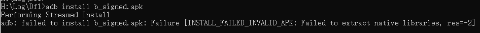

1. apk是zip格式，直接解压
2. android studio内置了反编译工具，apk拖到android studio里面，可查看资源
3. jadx-gui--》感觉是目前最好用的反编译工具，查看代码、资源、签名等信息。
4. apktool(https://ibotpeaches.github.io/Apktool/install/) --》解包、重新打包
5. dex2jar--》把dex格式转成jar
6. jd-gui

经测试，直接解压，再zip压缩，4字节对齐+签名后，应用是无法安装的：



有修改资源、重新打包的需求，应该使用apktool。

```shell
#向导出
.\apktool.bat d .\DocumentsUI.apk 

#重新打包成APK
.\apktool.bat b .\DFL_CarControl -o .\DFL_CarControl_mod.apk
```

