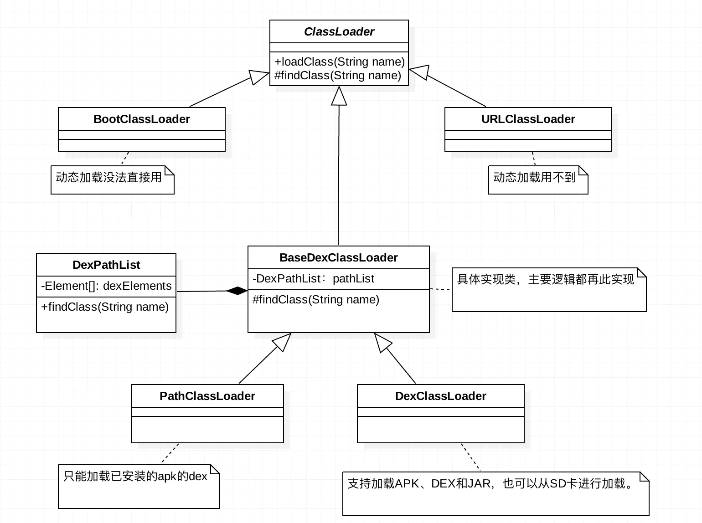

先了解java的classloader机制，再看本章。

开局一张图：



众所皆知，安卓java是跑在Dalvik虚拟机里，跟PC上面不同，编译后生成的是dex文件。类的加载也遵从双亲委托模型，但是加载器跟标准的jvm虚拟机不一样。

只关心三个类：**BootClassLoader**、**PathClassLoader**、**DexClassLoader**。

**BootClassLoader** 为所有android加载器中最顶层加载器，相当于jvm的最顶层加载器BootstrapClassLoader。不过BootstrapClassLoader由C++实现，java中无法获取（返回null）。BootClassLoader为java实现，为ClassLoader的内部类, 可通过
 `ClassLoader.getSystemClassLoader().getParent()`获取

**PathClassLoader**  是我们apk的默认加载器，它是用来加载系统类和主dex文件中的类的，但是系统类是由BootClassLoader加载的

**DexClassLoader **可以用来加载外置的dex文件或者apk等。


PathClassLoader和DexClassLoader最大的区别就是DexClassLoader可以加载外置dex文件。

PathClassLoader只会加载apk中的主dex文件，其他的dex文件是使用DexClassloader动态加载进来，然后通过反射获取到PathClassLoader中的DexPathList，然后再拿到DexPathList中的。


测试代码：

```java
//MainActivity.java,test in android P
System.out.println(getClassLoader());
System.out.println(getClassLoader().getParent());
System.out.println(ClassLoader.getSystemClassLoader());
```

```shell
#logcat
System.out: dalvik.system.PathClassLoader[DexPathList[[zip file "/data/app/com.hsae.testdexclassloader-LQKQId2dBSEd6v-BticZPw==/base.apk"],nativeLibrary
Directories=[/data/app/com.hsae.testdexclassloader-LQKQId2dBSEd6v-BticZPw==/lib/x86_64, /system/lib64]]]

System.out: java.lang.BootClassLoader@6a45781

System.out: dalvik.system.PathClassLoader[DexPathList[[directory "."],nativeLibraryDirectories=[/system/lib64, /system/lib64]]]


```

