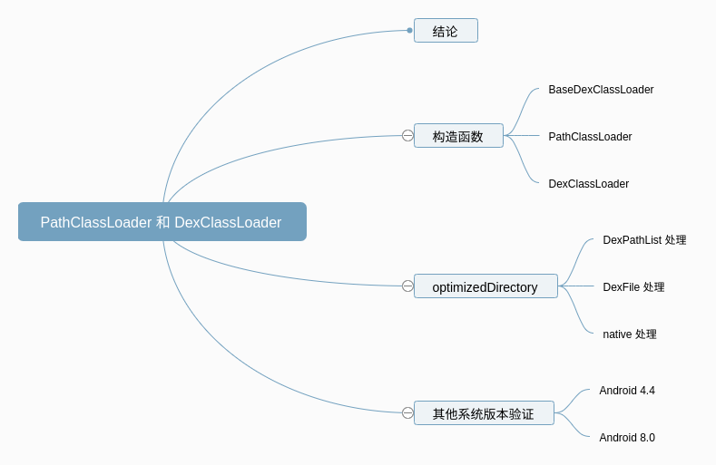
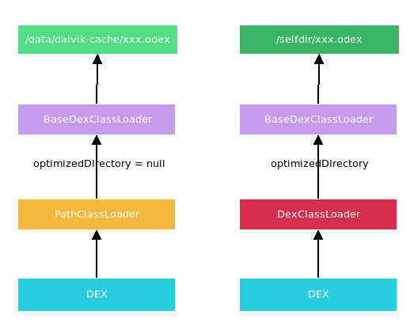
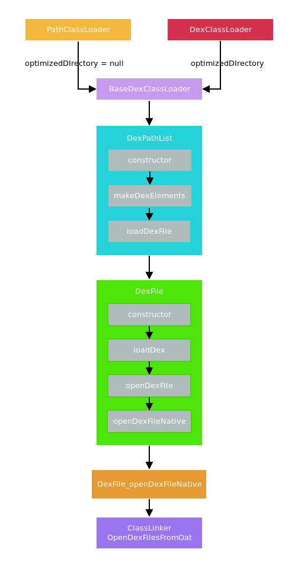
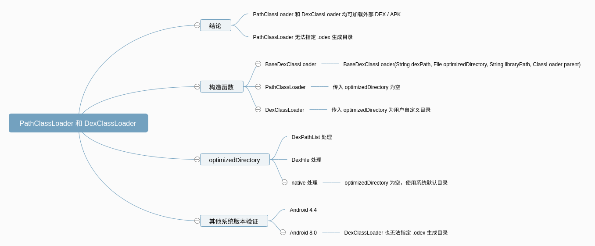

## 预备知识

Propaedeutics : java的classloader机制。

## 正文

开局一张图


众所皆知，安卓java是跑在Dalvik虚拟机里，跟PC上面不同，编译后生成的是dex文件。类的加载也遵从双亲委托模型，但是加载器跟标准的jvm虚拟机不一样。

只关心三个类：**BootClassLoader**、**PathClassLoader**、**DexClassLoader**。

**BootClassLoader** 为所有android加载器中最顶层加载器，相当于jvm的最顶层加载器BootstrapClassLoader。不过BootstrapClassLoader由C++实现，java中无法获取（返回null）。BootClassLoader为java实现，为ClassLoader的内部类, 可通过
 `ClassLoader.getSystemClassLoader().getParent()`获取

**PathClassLoader**  是我们apk的默认加载器，它是用来加载系统类和主dex文件中的类的，但是系统类是由BootClassLoader加载的

**DexClassLoader **可以用来加载外置的dex文件或者apk等，当然这并不是说PathClassLoader就不能加载外置dex和apk。


测试代码1：

```java
//MainActivity.java,test in android P
System.out.println(getClassLoader());
System.out.println(getClassLoader().getParent());
System.out.println(ClassLoader.getSystemClassLoader());
```
输出如下：
```shell
#logcat
System.out: dalvik.system.PathClassLoader[DexPathList[[zip file "/data/app/com.hsae.testdexclassloader-LQKQId2dBSEd6v-BticZPw==/base.apk"],nativeLibrary
Directories=[/data/app/com.hsae.testdexclassloader-LQKQId2dBSEd6v-BticZPw==/lib/x86_64, /system/lib64]]]

System.out: java.lang.BootClassLoader@6a45781

System.out: dalvik.system.PathClassLoader[DexPathList[[directory "."],nativeLibraryDirectories=[/system/lib64, /system/lib64]]]

```


PathClassLoader 可以加载dex文件，apk文件，测试如下：

```java
   private void testPathClassLoader1(){
        //确保Subscribe.dex 存在且有可读权限
        System.out.println("testPathClassLoader1 " + new File("/sdcard/dex/Subscribe.dex").canRead());
        //创建PathClassLoader实例，传入Subscribe.dex
        PathClassLoader pathClassLoader = new PathClassLoader("/sdcard/dex/Subscribe.dex",ClassLoader.getSystemClassLoader());
        try {
//            Class<?> forName = Class.forName("com.hsae.cn202sr.launcher.eventbus.Subscribe", true, pathClassLoader);
            //得到Subscribe.dex里面的某个类
            Class<?> aClass = pathClassLoader.loadClass("com.hsae.cn202sr.launcher.eventbus.Subscribe");
            System.out.println("我是一个注解吗 " + aClass.isAnnotation());
            System.out.println("我是一个成员类吗" + aClass.isMemberClass());//成员类指的是，作为类的成员存在于某个类的内部
            //note：内部类分为:静态类(static class)、成员类(member class)、局部类(local class)、匿名类（anonymous class）
        } catch (ClassNotFoundException e) {
            e.printStackTrace();
            System.out.println("Error");
        }
    }
    private void testPathClassLoader2(){
        //确保Music.apk 存在且有可读权限
        System.out.println("testPathClassLoader2 " + new File("/sdcard/dex/Music.apk").canRead());
        //创建PathClassLoader实例，传入 Music.apk
        PathClassLoader pathClassLoader = new PathClassLoader("/sdcard/dex/Music.apk",ClassLoader.getSystemClassLoader());
        try {
            //先用反编译确认Music.apk里面存在MediaBrowserService这个类。
            Class<?> aClass = pathClassLoader.loadClass("android.service.media.MediaBrowserService");
            System.out.println("我是一个注解吗 " + aClass.isAnnotation());
            System.out.println("我是一个成员类吗" + aClass.isMemberClass());
        } catch (ClassNotFoundException e) {
            e.printStackTrace();
            System.out.println("Error");
        }

        //网上看到资料说PathClassLoader只支持直接操作 dex 文件或者已经安装过的 apk，因此分别用Music.apk和Widget.apk测试
        //Music.apk是内置的app,Widget.apk是没有安装过的APP
        //实测发现，PathClassLoader是可以解析apk里面的dex的，不需要安装过。
        PathClassLoader pathClassLoader2 = new PathClassLoader("/sdcard/dex/Widget.apk",ClassLoader.getSystemClassLoader());
        try {
            //com.example.widget.MainActivity是Widget.apk里面的某个类
            Class<?> aClass = pathClassLoader2.loadClass("com.example.widget.MainActivity");
            System.out.println("我是一个注解吗 " + aClass.isAnnotation());
            System.out.println("我是一个接口吗" + aClass.isInterface());
        } catch (ClassNotFoundException e) {
            e.printStackTrace();
            System.out.println("Error");
        }
    }
```

输出：

```shell
03-08 10:15:01.491  3791  3791 I System.out: testPathClassLoader1 true
03-08 10:15:01.497  3791  3791 I System.out: 我是一个注解吗 true
03-08 10:15:01.497  3791  3791 I System.out: 我是一个成员类吗false
03-08 10:15:01.497  3791  3791 I System.out: testPathClassLoader2 true
03-08 10:15:01.500  3791  3791 I System.out: 我是一个注解吗 false
03-08 10:15:01.500  3791  3791 I System.out: 我是一个成员类吗false
03-08 10:15:01.503  3791  3791 I System.out: 我是一个注解吗 false
03-08 10:15:01.504  3791  3791 I System.out: 我是一个接口吗false
```


**DexClassLoader **测试如下：

```java
    private void testDexClassLoader1(){
        //确保Subscribe.dex 存在且可读
        System.out.println("\ntestDexClassLoader1 " + new File("/sdcard/dex/Subscribe.dex").canRead());
        //创建DexClassLoader实例，传入Subscribe.dex
        DexClassLoader dexClassLoader = new DexClassLoader("/sdcard/dex/Subscribe.dex",null ,null,ClassLoader.getSystemClassLoader());
        try {
            Class<?> aClass = dexClassLoader.loadClass("com.hsae.cn202sr.launcher.eventbus.Subscribe");
            System.out.println("我是一个注解吗 " + aClass.isAnnotation());
        } catch (ClassNotFoundException e) {
            e.printStackTrace();
            System.out.println("Error");
        }
    }

    private void testDexClassLoader2(){
        //确保Music.apk可读
        System.out.println("\nDexClassLoader test app " + new File("/sdcard/dex/Music.apk").canRead());
        //创建PathClassLoader实例，传入Subscribe.dex
        DexClassLoader dexClassLoader = new DexClassLoader("/sdcard/dex/Music.apk",null,null,ClassLoader.getSystemClassLoader());
        try {
            Class<?> aClass = dexClassLoader.loadClass("android.service.media.MediaBrowserService");
            System.out.println("我是一个注解吗 " + aClass.isAnnotation());
            System.out.println("我是一个接口吗 " + aClass.isInterface());
        } catch (ClassNotFoundException e) {
            e.printStackTrace();
            System.out.println("Error");
        }
    }
```

输出：

```shell
03-08 10:26:31.994  4230  4230 I System.out: testPathClassLoader1 true
03-08 10:26:31.996  4230  4230 I System.out: 我是一个注解吗 true
03-08 10:26:31.997  4230  4230 I System.out: 我是一个成员类吗false
03-08 10:26:31.997  4230  4230 I System.out: testPathClassLoader2 true
03-08 10:26:32.000  4230  4230 I System.out: 我是一个注解吗 false
03-08 10:26:32.000  4230  4230 I System.out: 我是一个成员类吗false
03-08 10:26:32.004  4230  4230 I System.out: 我是一个注解吗 false
03-08 10:26:32.004  4230  4230 I System.out: 我是一个接口吗false
03-08 10:26:32.004  4230  4230 I System.out:
03-08 10:26:32.004  4230  4230 I System.out: testDexClassLoader1 true
03-08 10:26:32.008  4230  4230 I System.out: 我是一个注解吗 true
03-08 10:26:32.009  4230  4230 I System.out:
03-08 10:26:32.009  4230  4230 I System.out: DexClassLoader test app true
03-08 10:26:32.011  4230  4230 I System.out: 我是一个注解吗 false
03-08 10:26:32.012  4230  4230 I System.out: 我是一个接口吗 false
```

然后到/sdcard/dex目录下看一下，发现多了一个oat目录：

```shell
generic_x86_64:/sdcard/dex/oat/x86_64 # ls -l
total 184
-rw-rw---- 1 root sdcard_rw  17312 2021-03-08 10:54 Music.odex
-rw-rw---- 1 root sdcard_rw 141052 2021-03-08 10:54 Music.vdex
-rw-rw---- 1 root sdcard_rw  17304 2021-03-08 10:54 Subscribe.odex
-rw-rw---- 1 root sdcard_rw    792 2021-03-08 10:54 Subscribe.vdex
```

DexClassLoader和PathClassLoader都会生成odex和vdex。

这两个测试代码看，DexClassLoader和PathClassLoader都可以加载sdcard上面的dex文件和apk文件，都会优化dex文件，那么他们的区别在哪里呢？下面的分析来自https://blog.csdn.net/valada/article/details/100189694 ，引用全文如下：

## 引用

### 文章概览




### 起因

说起 Android 中的 PathClassLoader 和 DexClassLoader，先提出一个疑问，PathClassLoader 和 DexClassLoader 有什么区别呢？

关于答案，我斗胆猜测一下，大家心中的回答一定是 PathClassLoader 是用来加载已经安装的 apk 的，DexClassLoader 是用来加载存储空间的 dex / apk 文件的。为什么这样说呢，因为之前我也一直这样理解的，而且网上大部分文章中也都是这样讲解的。

那为何突然又谈起 PathClassLoader 和 DexClassLoader 呢？起因是我在前段时间写了一些插件化的 demo，当时忘记了 PathClassLoader 和 DexClassLoader 这回事，直接用 PathClassLoader 去加载插件了，竟然也可以加载成功？一丝丝的困惑浮现在我英俊帅气的脸庞上，聪明的小脑瓜里打上了一个小小的问号。于是乎去翻了一下源码，就有了这篇文章。

### 先放结论

先放结论，PathClassLoader 和 DexClassLoader 都能加载外部的 dex／apk，只不过区别是 DexClassLoader 可以指定 optimizedDirectory，也就是 dex2oat 的产物 .odex 存放的位置，而 PathClassLoader 只能使用系统默认位置。但是这个 optimizedDirectory 在 Android 8.0 以后也被舍弃了，只能使用系统默认的位置了。

我们这里先基于 android 5.0 代码来分析，然后再看看其他系统版本的一些区别。（选取 5.0 是因为此时 art 的源码还比较简单～）

### ClassLoader 的构造函数



#### 3.1 BaseDexClassLoader 构造函数

PathClassLoader 和 DexClassLoader 都是继承了 BaseDexClassLoader，这里先看一下。 [BaseDexClassLoader](https://www.androidos.net.cn/android/5.0.1_r1/xref/libcore/dalvik/src/main/java/dalvik/system/BaseDexClassLoader.java) 的构造函数。

```java
public class BaseDexClassLoader extends ClassLoader {
    private final DexPathList pathList;
    /**
    * Constructs an instance.
    *
    * @param dexPath the list of jar/apk files containing classes and
    * resources, delimited by {@code File.pathSeparator}, which
    * defaults to {@code ":"} on Android
    * @param optimizedDirectory directory where optimized dex files
    * should be written; may be {@code null}
    * @param libraryPath the list of directories containing native
    * libraries, delimited by {@code File.pathSeparator}; may be
    * {@code null}
    * @param parent the parent class loader
    */
    public BaseDexClassLoader(String dexPath, File optimizedDirectory,
                              String libraryPath, ClassLoader parent) {
        super(parent);
        this.pathList = new DexPathList(this, dexPath, libraryPath, optimizedDirectory);
    }
}
```

BaseDexClassLoader 构造函数有四个参数，含义如下：

* dexPath: 需要加载的文件列表，文件可以是包含了 classes.dex 的 JAR/APK/ZIP，也可以直接使用 classes.dex 文件，多个文件用 “:” 分割
* optimizedDirectory: 存放优化后的 dex，可以为空
* libraryPath: 存放需要加载的 native 库的目录
* parent: 父 ClassLoader

通过构造函数我们大概可以了解到 BaseDexClassLoader 的运行方式，传入 dex 文件，然后进行优化，保存优化后的 dex 文件到 optimizedDirectory 目录。

#### 3.2 PathClassLoader 构造函数

接着我们再看 [PathClassLoader](https://www.androidos.net.cn/android/5.0.1_r1/xref/libcore/dalvik/src/main/java/dalvik/system/PathClassLoader.java) 的构造函数。

```java
/**
 * Provides a simple {@link ClassLoader} implementation that operates on a list
 * of files and directories in the local file system, but does not attempt to
 * load classes from the network. Android uses this class for its system class
 * loader and for its application class loader(s).
 */
public class PathClassLoader extends BaseDexClassLoader {
    public PathClassLoader(String dexPath, ClassLoader parent) {
        super(dexPath, null, null, parent);
    }

    /**
     * Creates a {@code PathClassLoader} that operates on two given
     * lists of files and directories. The entries of the first list
     * should be one of the following:
     *
     * <ul>
     * <li>JAR/ZIP/APK files, possibly containing a "classes.dex" file as
     * well as arbitrary resources.
     * <li>Raw ".dex" files (not inside a zip file).
     * </ulyanzheng>
     *
     * The entries of the second list should be directories containing
     * native library files.
     *
     * @param dexPath the list of jar/apk files containing classes and
     * resources, delimited by {@code File.pathSeparator}, which 
     * defaults to {@code ":"} on Android
     * @param libraryPath the list of directories containing native 
     * libraries, delimited by {@code File.pathSeparator}; may be
     * {@code null}
     * @param parent the parent class loader
     */
    public PathClassLoader(String dexPath, String libraryPath, ClassLoader parent) {
        super(dexPath, null, libraryPath, parent);
    }
}

```

关于 PathClassLoader 有一点稍微注意一下，代码注释中对 PathClassLoader 的介绍是，用来操作文件系统上的一系列文件和目录 的 ClassLoader 实现。其中并没有提到只能加载安装后的 apk 文件。

PathClassLoader 有两个构造函数，区别在于传给 BaseDexClassLoader 的 libraryPath 是否为空。最终调用 BaseDexClassLoader 构造函数时，传入的 optimizedDirectory 为空。

#### 3.3 DexClassLoader 构造函数

再来看看 [DexClassLoader](https://www.androidos.net.cn/android/5.0.1_r1/xref/libcore/dalvik/src/main/java/dalvik/system/DexClassLoader.java) 的构造函数。和 BaseDexClassLoader 构造函数的参数是一样的。

```java
public class DexClassLoader extends BaseDexClassLoader {
    /**
     * Creates a {@code DexClassLoader} that finds interpreted and native
     * code.  Interpreted classes are found in a set of DEX files contained 
     * in Jar or APK files.
     * 
     * <p>The path lists are separated using the character specified by the
     * {@code path.separator} system property, which defaults to {@code :}.
     * 
     * @param dexPath the list of jar/apk files containing classes and
     *     resources, delimited by {@code File.pathSeparator}, which 
     *     defaults to {@code ":"} on Android
     * @param optimizedDirectory directory where optimized dex files
     *     should be written; must not be {@code null} 
     * @param librarySearchPath the list of directories containing native
     *     libraries, delimited by {@code File.pathSeparator}; may be
     *     {@code null}
     * @param parent the parent class loader
     */
    public DexClassLoader(String dexPath, String optimizedDirectory, String librarySearchPath, ClassLoader parent) {
        super(dexPath, new File(optimizedDirectory), librarySearchPath, parent);
    }
}

```

通过上面对构造函数的分析，我们可以明白，PathClassLoader 和 DexClassLoader 关键不同点，在 optimizedDirectory 参数上，PathClassLoader 传入的是 null，而 DexClassLoader 传入的是用户指定的目录。

### optimizedDirectory 参数的处理

既然知道了区别在 optimizedDirectory，那就来看看 BaseDexClassLoader 里是怎么处理 optimizedDirectory 的。

#### 4.1 DexPathList 处理

在 BaseDexClassLoader 里，直接将 optimizedDirectory 透传给了 DexPathList。

这里先简单介绍一下 DexPathList。

DexPathList 里有两个成员变量，dexElements 用来保存 dex 和资源列表，nativeLibraryDirectories 用来保存 native 库列表。

```java
class DexPathList {
    private final Element[] dexElements;
    private final File[] nativeLibraryDirectories;
}
```

在 DexPathList 中，使用 optimizedDirectory 的路径是：

```txt
DexPathList -> makeDexElements -> loadDexFile
```

这里要看一下 loadDexFile 方法:

```java
class DexPathList {
    private static DexFile loadDexFile(File file, File optimizedDirectory)
        throws IOException {
        if (optimizedDirectory == null) {
            return new DexFile(file);
        } else {
            String optimizedPath = optimizedPathFor(file, optimizedDirectory);
            return DexFile.loadDex(file.getPath(), optimizedPath, 0);
        }
    }
}
```

在 DexPathList 中，会为每一个 DEX 文件创建一个 DexFile 对象，创建方式有两种，optimizedDirectory 为空时，调用 DexFile(file) 创建，否则调用 DexFile.loadDex()。

这样对于 optimizedDirectory 的处理就流转到 DexFile 里了。

#### 4.2 DexFile 处理

​	其实在 DexFile.loadDex 里，也是直接调用了 [DexFile](https://www.androidos.net.cn/android/5.0.1_r1/xref/libcore/dalvik/src/main/java/dalvik/system/DexFile.java) 的构造函数

```java
class DexFile {
    public DexFile(File file) throws IOException {
        this(file.getPath());
    }
    public DexFile(String fileName) throws IOException {
        // 调用 openDexFile 处理 dex
        mCookie = openDexFile(fileName, null, 0);
        mFileName = fileName;
        guard.open("close");
    }
    private DexFile(String sourceName, String outputName, int flags) throws IOException {
        // ...
        // 调用 openDexFile 处理 dex
        mCookie = openDexFile(sourceName, outputName, flags);
        mFileName = sourceName;
        guard.open("close");
    } 
    static public DexFile loadDex(String sourcePathName, String outputPathName,
                                  int flags) throws IOException {
        return new DexFile(sourcePathName, outputPathName, flags);
    } 
    private static long openDexFile(String sourceName, String outputName, int flags) throws IOException {
        // 最终调用 native 方法 
        return openDexFileNative(new File(sourceName).getAbsolutePath(),
                                 (outputName == null) ? null : new File(outputName).getAbsolutePath(),
                                 flags);
    }
    private static native long openDexFileNative(String sourceName, String outputName, int flags);}

```

DexFile 代码不多，上面基本上就是主要代码了。我们可以看到，不管调用 DexFile 哪个构造函数，最后都会通过 openDexFileNative 进行处理，区别就在于 outputName 参数是否为空，而 outputName 参数，就是上面一路传递下来的 optimizeDirectory 参数。
我们再回顾一下调用的链路：

```txt
PathClassLoader.constructor / DexClassLoader.constructor -> BaseDexClassLoader.constructor -> DexPathList.constructor -> DexPathList.makeDexElements -> DexPathList.loadDexFile -> DexFile.constructor / DexFile.loadDex -> DexFile.openDexFile -> DexFile.openDexFileNative

```

再继续往下看，就走到了 native 逻辑。native 逻辑可以下载 [art 源码](https://android.googlesource.com/platform/art/)对照查看。

#### 4.3 native 处理

openDexFileNative 对应的 native 逻辑在 dalviksystemDexFile.cc 里的 DexFile_openDexFileNative 方法。

在 DexFile_openDexFileNative 里主要做事情是处理 DEX 文件，并生成 .odex 文件到 optimizedDirectory 里。

这里关于 optimizedDirectory 的处理路径是：

```txt
DexFile_openDexFileNative -> ClassLinker::OpenDexFilesFromOat
```

在 OpenDexFilesFromOat 里有这样一段处理逻辑：

```c++
ClassLinker::OpenDexFilesFromOat() {
    // ...
    if (oat_location == nullptr) {
    // 如果 oat_location 为空，就使用默认的 dalvikcache
        const std::string dalvik_cache(GetDalvikCacheOrDie(GetInstructionSetString(kRuntimeISA)));
        cache_location = GetDalvikCacheFilenameOrDie(dex_location, dalvik_cache.c_str());
        oat_location = cache_location.c_str();
    }
    // ...
    if (Runtime::Current()->IsDex2OatEnabled() && has_flock && scoped_flock.HasFile()) {
        // Create the oat file.
        open_oat_file.reset(CreateOatFileForDexLocation(dex_location, scoped_flock.GetFile()->Fd(),                                                    oat_location, error_msgs));
    }
}

```

上面方法里的 oat_location 就是 optimizeDirectory 传入到 native 中的化身。这里有一个判断逻辑，如果 oat_location 为空的话，就采用默认的 dalvikcache 路径。之后调用 CreateOatFileForDexLocation 去优化 DEX 文件了。

而 dalvikcache 是通过 GetDalvikCacheOrDie 获取的。

```c++
// art/runtime/utils.cc
std::string GetDalvikCacheOrDie(const char* subdir, const bool create_if_absent) {
    CHECK(subdir != nullptr);
    // 这里的 AndroidData 就是 /data 目录
    const char* android_data = GetAndroidData();
    const std::string dalvik_cache_root(StringPrintf("%s/dalvik-cache/", android_data));
    const std::string dalvik_cache = dalvik_cache_root + subdir;
    if (create_if_absent && !OS::DirectoryExists(dalvik_cache.c_str())) {
        // Don't create the system's /data/dalvik-cache/... because it needs special permissions.
        if (strcmp(android_data, "/data") != 0) {
            int result = mkdir(dalvik_cache_root.c_str(), 0700);
            if (result != 0 && errno != EEXIST) {
                PLOG(FATAL) << "Failed to create dalvik-cache directory " << dalvik_cache_root;
                return "";
            }
            result = mkdir(dalvik_cache.c_str(), 0700);
            if (result != 0) {
                PLOG(FATAL) << "Failed to create dalvik-cache directory " << dalvik_cache;
                return ""; 
            } 
        } else { 
            LOG(FATAL) << "Failed to find dalvik-cache directory " << dalvik_cache;
            return ""; 
        }
    }
    return dalvik_cache;
}

```

GetDalvikCacheOrDie 获取的就是 /data/dalvik-cache/ 目录。
这里我们回顾一下之前提出的问题，避免迷失在茫茫代码中。
我们的问题是 optimizedDirectory 参数传空和不为空有什么区别，PathClassLoader 传入的 optmizedDirectory 为空，而 DexClassLoader 传入的 optimizedDirectory 是用户自定义的目录。
回看一下调用链路:



```
PathClassLoader.constructor / DexClassLoader.constructor -> BaseDexClassLoader.constructor -> DexPathList.constructor -> DexPathList.makeDexElements -> DexPathList.loadDexFile -> DexFile.constructor / DexFile.loadDex -> DexFile.openDexFile -> DexFile.openDexFileNative -> DexFile_openDexFileNative -> ClassLinker::OpenDexFilesFromOat

```

到这里我们就可以得出结论了，optmizedDirectory 不为空时，使用用户定义的目录作为 DEX 文件优化后产物 .odex 的存储目录，为空时，会使用默认的 /data/dalvik-cache/ 目录。

所以印证了开头的结论，PathClassLoader 其实并不是只能加载安装后的 APK，也可以加载其他 DEX/JAR/APK 文件，只不过生成的 .odex 文件只能存储在系统默认路径下。

被误导多年的谜题终于解开了。耳边不禁响起柯南破案的 BGM。

### 其他系统版本上进行验证

不过上述的分析是在 5.0 源码下进行的，我们再选取 4.4 和 8.0 看一下。
为什么选取这两个版本呢？首先 4.4 和 5.0 是 ART 和 Dalvik 的分水岭，而 8.0 以后对 PathClassLoader 有些改动。

#### 5.1 Android 4.4

有了上面的分析基础，我们分析 4.4 的代码就顺畅的多了。一路从 Java 分析到 native。

Java 层代码没有什么变动，native 的入口还是 DexFile_openDexFileNative。之后的代码就有了些许不一样。

```c++
DexFile_openDexFileNative() {
    // ...
    if (outputName.c_str() == NULL) {
        dex_file = linker->FindDexFileInOatFileFromDexLocation(dex_location, dex_location_checksum);
    } else {
        std::string oat_location(outputName.c_str());
        dex_file = linker->FindOrCreateOatFileForDexLocation(dex_location, dex_location_checksum, oat_location);
    }
    // ...
}
```

这里和 5.0 的区别就是 根据 outputName 也就是 optimizedDirectory 是否为空，调用了两个不同的函数。

而 FindDexFileInOatFileFromDexLocation 里的逻辑就又有些熟悉了。

```java
ClassLinker::FindDexFileInOatFileFromDexLocation() {
    // ...
    std::string oat_cache_filename(GetDalvikCacheFilenameOrDie(dex_location));
    return FindOrCreateOatFileForDexLocationLocked(dex_location, dex_location_checksum, oat_cache_filename);
}
```

默认也是获取到 dalvikcache 目录作为 .odex 文件的存储路径。

#### 5.2 Android 8.0

在 8.0 系统上，事情发生了一些微弱的变化，我们看看 BaseDexClassLoader 的构造函数。

```java
class BaseDexClassLoader {
    /**
    * Constructs an instance.
    * Note that all the *.jar and *.apk files from {@code dexPath} might be
    * first extracted in-memory before the code is loaded. This can be avoided
    * by passing raw dex files (*.dex) in the {@code dexPath}.
    *
    * @param dexPath the list of jar/apk files containing classes and
    * resources, delimited by {@code File.pathSeparator}, which 
    * defaults to {@code ":"} on Android.
    * @param optimizedDirectory this parameter is deprecated and has no effect 
    * @param librarySearchPath the list of directories containing native
    * libraries, delimited by {@code File.pathSeparator}; may be
    * {@code null} 
    * @param parent the parent class loader
    */
    public BaseDexClassLoader(String dexPath, File optimizedDirectory,
                              String librarySearchPath, ClassLoader parent) {
        super(parent);
        this.pathList = new DexPathList(this, dexPath, librarySearchPath, null);  
        if (reporter != null) {
            reporter.report(this.pathList.getDexPaths());
        }
    }
}

```

一个很明显的变化就是，optimizedDirectory 被弃用了，传给 DexPathList 的 optimizedDirectory 直接为空，不管外面传进来什么值。

也就是说，在 8.0 上，PathClassLoader 和 DexClassLoader 其实已经没有什么区别了。DexClassLoader 也不能指定 optimizedDirectory 了。

而在 DexFile_openDexFileNative 中，可以看到，javaOutputName 参数也已经被弃用了:

```c++
static jobject DexFile_openDexFileNative(JNIEnv* env, 
                                         jclass,
                                         jstring javaSourceName,
                                         jstring javaOutputName ATTRIBUTE_UNUSED,
                                         jint flags ATTRIBUTE_UNUSED,
                                         jobject class_loader,
                                         jobjectArray dex_elements) {}

```

之后对 DEX 文件的处理链路如下：

```
DexFile_openDexFileNative -> DexLocationToOdexNames -> OatFileManager::OpenDexFilesFromOat -> OatFileAssistant::OatFileAssistant -> OatFileAssistant::DexLocationToOdexFilename -> DexLocationToOdexNames
```

在 DexLocationToOdexNames 方法里，对 .odex 文件的路径做了处理:

```c++
static bool DexLocationToOdexNames(const std::string& location,
                                   InstructionSet isa,
                                   std::string* odex_filename,
                                   std::string* oat_dir,
                                   std::string* isa_dir,
                                   std::string* error_msg) {
    CHECK(odex_filename != nullptr);
    CHECK(error_msg != nullptr);
    // The odex file name is formed by replacing the dex_location extension with
    // .odex and inserting an oat/<isa> directory. For example:
    //   location = /foo/bar/baz.jar
    //   odex_location = /foo/bar/oat/<isa>/baz.odex
    // Find the directory portion of the dex location and add the oat/<isa>
    // directory.
    size_t pos = location.rfind('/');
    if (pos == std::string::npos) {
        *error_msg = "Dex location " + location + " has no directory.";
        return false;
    }
    std::string dir = location.substr(0, pos+1);
    // Add the oat directory.
    dir += "oat";
    if (oat_dir != nullptr) {
        *oat_dir = dir;
    }
    // Add the isa directory 
    dir += "/" + std::string(GetInstructionSetString(isa));
    if (isa_dir != nullptr) {
        *isa_dir = dir;
    }
    // Get the base part of the file without the extension.
    std::string file = location.substr(pos+1);
    pos = file.rfind('.');
    if (pos == std::string::npos) {
        *error_msg = "Dex location " + location + " has no extension.";
        return false;
    } 
    std::string base = file.substr(0, pos);
    *odex_filename = dir + "/" + base + ".odex";
    return true;
}

```

看到上面的处理就是在 DEX 文件同级目录下添加一个 oat/ 文件作为 .odex 的存储目录。

### 总结

