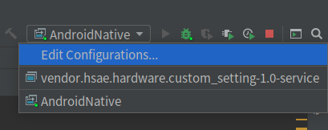
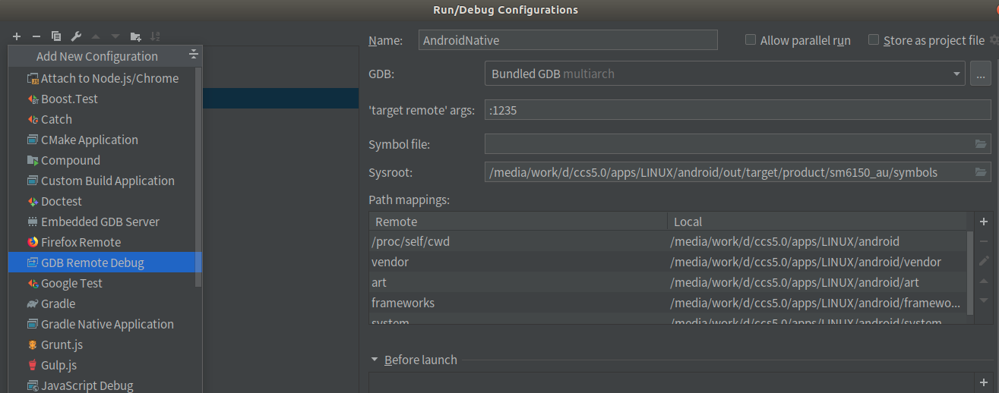
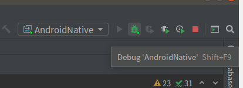
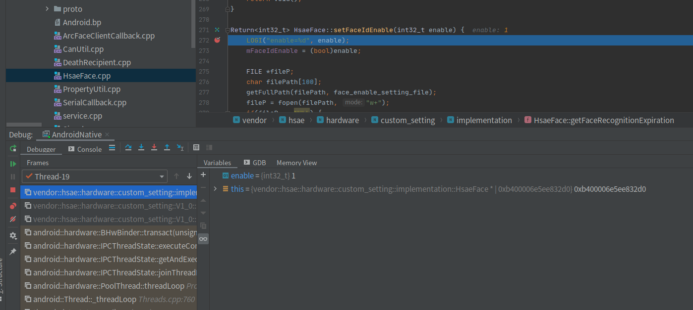

前面介绍的用vscode调试, 并阐明了原理。写于两年前。因为发现Clion比较好用（除了收费这一点），配置比vscode简单，智能化程度更高。所以补充一篇Cion的调试。

## 导入project

使用`aidegen`命令。不赘述。

## 添加debug的配置



`Edit Configurations`,点击+号，



选择`GDB Remote Debug`, 参考上图填入配置。下面的`Path mappings`，如果你开发的程序路径在vendor下面，那就添加一项vendor。

## 端口转发

Configurations只需要添加一次。而每次进行断点调试之前，都需要进行端口转发，并attach进程id

```shell
adb forward tcp:1235 tcp:1235
adb shell gdbserver64 :1235 --attach pid
```

端口号和Configurations里的是一致的。

## debug

点击"Debug"



每次重新执行过forword后，clion里先把红色的点掉，再点击Debug。

## 效果

