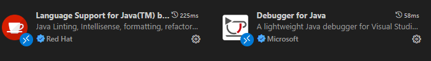
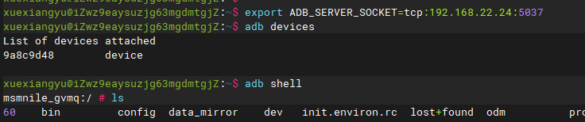
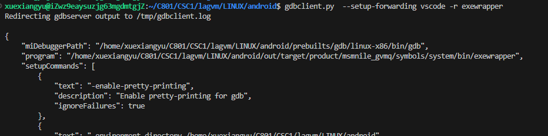
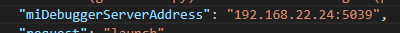
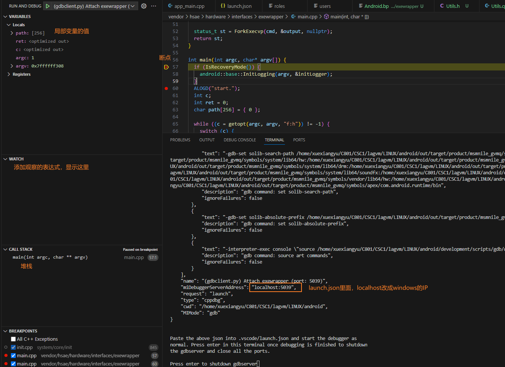
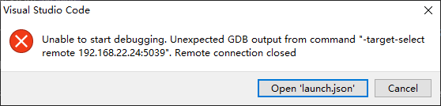
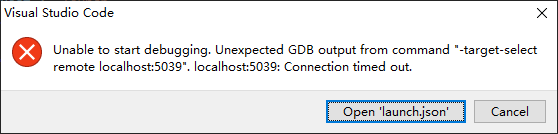

debug功能可以在运行程序时，加断点、单步执行、查看本地变量的值、查看堆栈等。

对于用AS开发普通App，其调试非常简单，不多言。

安卓系统是用C/C++和java写的。故对于framework层及以下，debug分为java代码的调试和native代码的调试。

谷歌正在推的kotlin，暂时不考虑。

## JAVA的debug

用Android Studio进行debug我们都已经很熟了。只要能把代码导入到AS里面，我们就可以debug了。我们知道，AS基于Jetbrains Idea。idea的项目，目录里有一个.idea文件夹，里面一堆xml。但是AS是用gradle编译的。sync的过程就是把gradle转成idea识别的配置的过程。

`.idea `文件夹前期还有一个形态，便是 `.ipr `文件，但由于 `.ipr `文件只能是一个纯粹的 `xml` 文件，不能包括其它资源，这几年渐渐现已被 `.idea` 文件夹替代。

一个概念是 `.iml` 文件，AS 在 Sync 完之后，是怎样做到让咱们能在自己的代码、第三方库的代码，乃至第三方库又依靠的其它第三方库之间来回跳转的呢？它是怎样记住的？其实便是依靠 `.iml` 文件。

尽管 AOSP 的项目不采用 Gradle 编译，但不管用哪个编译，在编译期间都是必定要理清各模块、jar包之间的关系的，假如我们编译期间顺带着把这种关系记载到一个 `.iml` 文件里，而且描述成一个可导入的 `.ipr` 文件 或许 `.idea` 文件夹，再导入 AS ，这不正行了吗。

### idegen

用idegen将的源码导入android studio:

> source build/envsetup.sh
>
> lunch
>
> mmm development/tools/idegen/
>
> sudo evelopment/tools/idegen/idegen.sh
>
> 生成android.ipr和android.iml两个文件。为了提高导入速度，打开android.iml，用正则表达式去掉所有测试代码，只保留isTestSource="false"的。然后搜索excludeFolder，把所有不关心的目录都排除掉。然后下面是许多orderEntry，找到orderEntry type="sourceFolder"，移到所有orderEntry的最上面。保存。
>
> 然后打开studio，open,选择iml文件。等待导入完成。

导入完成后，打开Run/Debug configurations对话框，添加一个Android App类型的配置，保存。

打开Project Structure, 切到modules，点中里面的Android, 把Manifest file 设置为frameworks/base/core/res/AndroidManifest.xml，把res dir设置为base/core/res/res、assert dir设置为base/core/res/assets。

以上只需要第一次使用的时候配置一下。下面就可以debug了。

首先，界面点击“Attach  Debugger to Android Process”,选择你要需要debug的进程。OK！

### AIDEGen

idegen 是比较方便，但最大的问题在于，它生成的是整个 AOSP 全部项目的依靠，等 AS 导入翻开，代价是巨大的，所以上面我让大家删掉一大堆自己不担任的依靠，再导入  AS，然后渐渐等剖析，然后还要配  SDK，配各种途径，然后发现还是一堆爆红，再查看是不是多了漏了哪个模块……一套下来，天现已黑了。

AIDEGen 坐落 AOSP 源码的 `tools/asuite/aidegen` 目录，从 `git log` 来看，Google 应该是从 2018 年夏天开端立项开发，而且内部运用，大概在 2020 年左右开释。Google 建议咱们从 Android 10 开端，就运用 AIDEGen 来将源码导入 IDE ，无需再运用 idegen，也不用去了解 `iml`，`ipr` 文件。

使用方法参考源码aidegen项目目录下的README文档。简要的说，执行以下命令：

```shell
source build/envsetup.sh && lunch <TARGET>
#假设你担任的是 Settings 模块
aidegen Settings -i s #i 是 IDE 的意思，s 代表 Android Studio
```

### 快捷调试

以上方法优点是配置比较完善，每个类都能找到。缺点：idegen的方法，卡顿，耗时，即使手动去掉了iml里的好多，依然消耗大。另外，两种方法都是在Ubuntu上启动AS的，尽管idegen的方法可以把源码和iml、ipr文件一起拷贝到本地windows上，但源码很大，过程很麻烦。

其实我们只是debug，不一定要配置那么完善，允许代码报红。直接把自己需要调试的部分代码下载下来，用AS打开目录，稍微设置一下java src的目录，关联一下jdk。这些AS是会自动提示你选的。然后attach进程，就可以了。或者创建一个新的android project，然后把framework部分的代码拷贝到project里，gradle指定java目录。甚至可以用samba把Ubuntu目录映射到本地windows盘符，AS项目gradle添加目录即可，连下载代码到本地的过程都免了。

### 使用vscode

使用vscode的原因是源码在远程服务器，只能ssh连接，不好用AS等GUI的 IDE 。关于远程服务器如何adb识别车机，见下文C++调试的 2024更新的部分。这里不重复。

远程服务器能adb devices识别到设备后，执行：

```
pid=($(adb shell ps -A |grep -i  system_server));adb forward tcp:5039 jdwp:${pid[1]}
```

调试framework，一般都是system_server进程。如果不是，pid换成目标进程。

vscode里安装两个插件：



插件对jdk版本有要求。服务器的jdk版本过低的话，可以试一下安装老版本的插件。

也可以直接安装Extension Pack for Java。

vscode打开framework待调试代码的目录。不要打开源码根目录，导入过程转圈会持续相当长的时间，没法调试，只能等。打开framework/base目录的话，快很多，十分钟还可以接受。直接打开frameworks/base/services/core/目录就相当快了。

因为没有源码里的依赖、构建关系，所以java插件会报很多错误，但是不影响断点和debug。会导致有些对象无法添加watch。

然后新建一个launch.json，在configurations里面添加一下一段（过程和c++类似）：

```json
       //加到launch.json的configurations里
       {
            //debugger for java插件对应的一个名字。必须为java
            "type": "java",
            //给这个配置取的一个名字
            "name": "Remote Debug AOSP java",
            //因为是远程调试，只能为attach
            "request": "attach",
            //常规是localhost。但这里应改成接着安卓机器的windows的IP 
            "hostName": "192.168.22.24",
            //远程调试的端口号，使用了adb forward映射到了5039
            "port": 5039,
            //需要调试的源代码文件
            // 需要调试哪个代码，就把目录添加进来
            // 可以是我们的APP的源文件位置，也可以是Android的源码
            "sourcePaths": [
                "/home/xuexiangyu/C801/CSC1/lagvm/LINUX/android/frameworks/base/services/core/java",
                "/home/xuexiangyu/C801/CSC1/lagvm/LINUX/android/frameworks/base/core/java"
            ]
        }
```

打上断点，点start debugging即可。


#### 可能遇到的问题

1. 端口的问题。先kill-server

2. windows已经打开了一个Android Studio,然后VS Code start debugging超时失败。把AS关闭，重新执行命令即可。

3. 类似的，遇到问题第一时间看是不是电脑有多个程序使用adb，比如AS，投屏软件。就我的情况，开投屏没事，开AS肯定debug不上。

4. 暂停了但是不知道断点停在哪，找不到。

   --》因为可能是没有把源码路径加进来。

   --》另外发现如果在code-workspace文件里设置里配置了java.project.sourcePaths，本意是设置源码路径，类似AS里指定workspace里哪些目录放java代码。但加了后会出现这个问题。

5. 左边可以显示当前类this里面各个成员变量的值，但是代码区域不显示当前行或鼠标选中变量的运算结果，虽然断点停住了，但是依然不知道运行结果。添加的watch报错，也不能运行表达式。也就是说，看不到局部变量的值，只看到类成员的。

   ---》这个大概不是我们的锅。因为代码下载下来后，用AS调试，现象是一样的，也有这问题。是不是因为我们项目依赖没配置完整有报错？抑或是不是因为apk不是debuggable的？或者是因为这是一个apex格式打包的？不得而知。

   换成debug system_server, 所有都是好的。所以方法本身是没问题的。

5. 需要调试的目录分散在AOSP的各个部分，比如一部分在packages,一部分在framework。所以需要打开整个源码根目录。但是打开后特别卡，停留在导入java，解析语法，甚至还会联网下载gradle依赖，jar包、其它资源。等了几个小时进度还卡在那。

   对策：我们不需要解析全部代码的语法，也不需要把AOSP里的每个工程配好。所以没必要等这几个小时（几天）。我们可以创建一个vs code的workspace文件，导入我们需要的目录：

   ```json
   // 我在任意位置创建了一个vsdebug/ccs50frameworkdebug/ccs50framework.code-workspace文件。
   {
       "settings": {
           "terminal.integrated.env.linux": {
               "ANDROID_BUILD_TOP":"/home/xue/ccs50/apps/LINUX/android",
               "ADB_SERVER_SOCKET":"tcp:192.168.22.24:5037"
           },
           "java.project.referencedLibraries": [
               "out/soong/.intermediates/frameworks/base/framework/android_common/turbine-combined/framework.jar",
               "/home/ecd_600970_1827621407188/Android/Sdk/platforms/android-30/*.jar"
           ]
       },
       "folders": [
           {
               "name": "frameworks.base.services.core.java",
               "path": "/home/xue/ccs50/apps/LINUX/android/frameworks/base/services/core/java"
           },
           {
               "name": "frameworks.base.core.java",
               "path": "/home/xue/ccs50/apps/LINUX/android/frameworks/base/core/java"
           },
           {
               "name": "packages.apps.PermissionController",
               "path": "/home/xue/ccs50/apps/LINUX/android/packages/apps/PermissionController"
           }
           
       ],
       "launch": {
           "version": "0.2.0",
           "configurations": [
               {
                   "type":"java",
                   "name": "RemoteJava",
                   "request": "attach",
                   "hostName": "192.168.22.24",
                   "port": 5039,
                   "sourcePaths": [
                       "${ANDROID_BUILD_TOP}/frameworks/base/services/core/java",
                       "${ANDROID_BUILD_TOP}/frameworks/base/core/java",
                       "${ANDROID_BUILD_TOP}/packages/apps/PermissionController/src",
                       "${ANDROID_BUILD_TOP}/out/soong/.intermediates/packages/apps/PermissionController/PermissionController/android_common_com.android.permission/gen/aapt2/R",
                       "${ANDROID_BUILD_TOP}/out/soong/.intermediates/packages/apps/PermissionController/PermissionController/android_common_com.android.permission/kapt/gen/stubs",
                       "${ANDROID_BUILD_TOP}/out/soong/.intermediates/packages/apps/PermissionController/statslog-permissioncontroller-java-gen/gen"
                   ]
               }
           ]
       }
   }
   ```
   
   launch配置在code-workspace文件里，不需要再创建launch.json文件。
   
   为了方便，我加了一个ANDROID_BUILD_TOP变量。但是folders无效，需写全路径。launch可以用变量。
   
   另外，我还配了java.project.referencedLibraries，以及添加了out目录下，与PermissionController有关的几个目录。不过这些大概率不影响你的debug，不一定要配，属于锦上添花的。看你自己实际需要。

## C++代码的debug

首先也是代码导入的问题。aidegen一样搞定，可以导入vscode或clion。无需赘述。直接介绍debug。

> 见 StudyNotes/ide/ 目录下的笔记。

### 使用vscode

aosp自带gdbclient.py脚本用于调试：

```shell
work@ubuntu-cts:~/iov2.0_plus_qm$ gdbclient.py 
usage: gdbclient.py [-h] [--adb ADB_PATH] [-a | -d | -e | -s SERIAL]
                    (-p PID | -n NAME | -r ...) [--port [PORT]]
                    [--user [USER]]
gdbclient.py: error: one of the arguments -p -n -r is required
```

-n 通过进程名来调试，-p 通过进程id来调试
虽然使用该脚本工具调试没有问题，但是操作上来说还是不如IDE来得直观方便快捷，所以在2020年的下半年，谷歌更新了gdbclient.py脚本，添加了新的参数：

```shell
work@ubuntu-cts:~/aosp$ gdbclient.py
usage: gdbclient.py [-h] [--adb ADB_PATH] [-a | -d | -e | -s SERIAL]
                    (-p PID | -n NAME | -r ...) [--port [PORT]]
                    [--user [USER]] [--setup-forwarding {gdb,vscode}]
                    [--lldb | --no-lldb] [--env VAR=VALUE]
gdbclient.py: error: one of the arguments -p -n -r is required
```

我们就是利用新加的--setup-forwarding vscode参数，来生成vscode的lunch配置，然后用vscode调试android native的代码。

首先检查你的gdbclient.py指令能不能支持--setup-forwarding，如果不支持，你可能需要更新源码升级到最新（android11以上。前面说过，这个功能是谷歌在大约2020年提交的）。

用vscode打开源码目录，电脑打开模拟器或者用USB连接到真机，源码与模拟器（真机）运行的系统相对应。

如果你用了vscode的remote功能，连接USB或模拟器的是远程的电脑，而不是你的电脑，因为源码在远端。

VS Code需要先安装C/C++插件，装了插件才能支持C++调试。安装完后界面右下角提示正在下载C++组件，因为国内环境问题下载比较慢，耐性等待。

假设要调试 cameraserver 进程，首先：

> source build/envsetup.sh 
>  lunch #choose your target

进入adb shell, ps -e |grep system_server查到进程号是344。

退出adb shell,执行 `gdbclient.py -p 344 --setup-forwarding vscode`

```shell
$ gdbclient.py -p 344 --setup-forwarding vscode
Redirecting gdbserver output to /tmp/gdbclient.log

{
    "miDebuggerPath": "/home/work/aosp/prebuilts/gdb/linux-x86/bin/gdb", 
    "program": "/home/work/aosp/out/target/product/generic_x86_64/symbols/system/bin/cameraserver", 
    "setupCommands": [
        {
            "text": "-enable-pretty-printing", 
            "description": "Enable pretty-printing for gdb", 
            "ignoreFailures": true
        }, 
        {
            "text": "-environment-directory /home/work/aosp", 
            "description": "gdb command: dir", 
            "ignoreFailures": false
        }, 
        {
            "text": "-gdb-set solib-search-path /home/work/aosp/out/target/product/generic_x86_64/symbols/system/lib/:/home/work/aosp/out/target/product/generic_x86_64/symbols/system/lib/hw:/home/work/aosp/out/target/product/generic_x86_64/symbols/system/lib/ssl/engines:/home/work/aosp/out/target/product/generic_x86_64/symbols/system/lib/drm:/home/work/aosp/out/target/product/generic_x86_64/symbols/system/lib/egl:/home/work/aosp/out/target/product/generic_x86_64/symbols/system/lib/soundfx:/home/work/aosp/out/target/product/generic_x86_64/symbols/vendor/lib/:/home/work/aosp/out/target/product/generic_x86_64/symbols/vendor/lib/hw:/home/work/aosp/out/target/product/generic_x86_64/symbols/vendor/lib/egl:/home/work/aosp/out/target/product/generic_x86_64/symbols/apex/com.android.runtime/bin", 
            "description": "gdb command: set solib-search-path", 
            "ignoreFailures": false
        }, 
        {
            "text": "-gdb-set solib-absolute-prefix /home/work/aosp/out/target/product/generic_x86_64/symbols", 
            "description": "gdb command: set solib-absolute-prefix", 
            "ignoreFailures": false
        }, 
        {
            "text": "-interpreter-exec console \"source /home/work/aosp/development/scripts/gdb/dalvik.gdb\"", 
            "description": "gdb command: source art commands", 
            "ignoreFailures": false
        }
    ], 
    "name": "(gdbclient.py) Attach cameraserver (port: 5039)", 
    "miDebuggerServerAddress": "localhost:5039", 
    "request": "launch", 
    "type": "cppdbg", 
    "cwd": "/home/work/aosp", 
    "MIMode": "gdb"
}


Paste the above json into .vscode/launch.json and start the debugger as
normal. Press enter in this terminal once debugging is finished to shutdown
the gdbserver and close all the ports.

Press enter to shutdown gdbserver
```

注意到最后一行“Press enter to shutdown gdbserver”，保持这个终端不动，不要按回车。

VS Code的Workspace目录为android源码路径，点击菜单Debug->Open Configurations新建一个C++(GDB/LLDB) lunch.json文件


该文件中自动创建的配置中，有一个`configurations:[xxx]`, 删除方括号里的内容，将上面生成的JSON内容粘贴到里面, 完成后如上图所示。Ctrl+S保存后关闭。

点击运行的三角图标：


OK！在C++的代码里面打上断点，可以单步执行、查看变量值、堆栈等等。

调试结束后，回到执行gdbclient.py的那个终端，按回车结束gdbserver。

### 可能的问题

1. 目前（android 11）,repo要用Python3执行，而gdbclient.py依然要用Python2.6或2.7运行，你需要用update-alternatives切换版本。

2. 我点击三角形调试按钮时，vscode弹框报错。后来注意到启动模拟器时，terminal里面有一行：

   > emulator: ERROR: AdbHostServer.cpp:102: Unable to connect to adb daemon on port: 5037

   并且模拟器启动时弹框提示“adb已经过期，请升级到最新”。用adb --version发现这个源码里的adb对应SDK 29：

   > work@ubuntu-cts:~/aosp$ adb --version
   > Android Debug Bridge version 1.0.41
   > Version 29.0.6-eng.work.20210227.192205
   > Installed as /home/work/aosp/out/soong/host/linux-x86/bin/adb

   执行`export PATH=/home/work/android/Sdk/platform-tools:$PATH`,

   android-sdk里的adb升级到最新。然后就OK了。

3. 官方后面的版本逐渐用lldbclient.py 代替gdbclient.py，看你的项目是哪个版本。官网地址：https://source.android.google.cn/devices/tech/debug/gdb?hl=zh-cn

4. gdb调试程序的时候打印变量值会出现`<value optimized out> `,并且逐语句忽上忽下跳来跳去的。原因是gcc 默认编译会加上-O2优化编译会提高程序运行速度。可以在gcc编译的时候加上 -O0参数项,意思是不进行编译优化,

### 老版本的安卓源码

如前所述，过去的gdbclient.py没有--setup-forwarding。比如我们现在做的CCS2.0+。

第一反应是把最新的gdbclient.py移植过去，替换旧的。然而真这么做了以后，就会发现，有更多的文件需要移植，会遇到各种问题，浪费大量时间，不建议试。

如果你是高手，喜欢用命令行，那么没必要折腾，直接用命令行就行了。下一节简单介绍了一下怎么用命令行调试。

不过我不是高手，命令行记不住，所以研究了一下用IDE。

我们打开gdbclient.py的源码，删繁就简研究一下原理，很容易知道怎么做。

以CCS2.0+项目为例，介绍一下步骤。

1. 进入adb shell, ps -e | grep 进程名，根据PPID判断进程是32位还是64位。这里我假设是64位。
2. 执行`gdbserver64 :5039 --attach 29643` , 29643是进程号。如果5039端口被占用，那就换一个。
3. 重新打开一个终端，这次不要进adb shell, 执行adb forward tcp:5039 tcp:5039，这句话的意思是把本地5039端口收到的数据转发到车机的5039端口。上个命令gdbserver监听的正是5039端口。
4. 跟上个章节介绍的一样，vscode新建一个C++(GDB/LLDB) lunch.json，把上个章节执行`gdbclient.py -p 344 --setup-forwarding vscode`生成的json拷贝进去，然后依葫芦画瓢修改一下路径。包括源码路径，和out/target/product目录下的build target目录。
5. -gdb-set solib-search-path 那一行，有些路径你用不到，有些路径本项目没有，删掉即可。
6. 修改"program"为你调试的程序，修改“miDebuggerServerAddress”为你监听的端口。
7. 保存。然后点击 debug 了，是不是跟前面一样。

在这个过程中，你需要关注两个终端的输出。如果终端提示断开，你需要重新连一下。

adb forward --list 命令查看forward的所有端口。有的时候forward失效，用这个命令看一下，没有了就要重新执行。

如果觉的操作太麻烦，你可以把以上过程写成脚本。

### 解决远端代码的debug

公司的项目源码在服务器(192.168.20.111)上面，虽然可以用vscode remote ssh插件浏览代码，但是机器是在我们自己座位上，不可能接到服务器上面，所以也就不能debug。

**（2024更新：见方案4）**

方案1：用adb wifi ，需要服务器和机器在一个局域网里，能互相访问到。

方案2：或者干脆装个虚拟机把代码下载下来。

方案3：我们公司的远程服务器安装了samba,因此可以在windows的文件夹里输入`\\192.168.20.111\share\`打开。假设源码的地址是`\\192.168.20.111\share\huanglixin`,映射网络驱动器为V盘。

VS Code里面，将V盘当做本地文件夹打开。然后打开launch.json, "configurations"的值替换为以下文本：

```json
{
    "miDebuggerPath": "D:\\android-sdk\\ndk\\20.0.5594570\\prebuilt\\windows-x86_64\\bin\\gdb.exe", 
    "program": "V:/out/target/product/mek_8q/symbols/system/bin/app_process64", 
    "setupCommands": [
        {
            "text": "-enable-pretty-printing", 
            "description": "Enable pretty-printing for gdb", 
            "ignoreFailures": true
        }, 
        {
            "text": "-environment-directory V:/", 
            "description": "gdb command: dir", 
            "ignoreFailures": false
        }, 
        {
            "text": "-gdb-set solib-absolute-prefix V:/out/target/product/mek_8q/symbols", 
            "description": "gdb command: set solib-absolute-prefix", 
            "ignoreFailures": false
        }, 
        {
            "text": "-interpreter-exec console \"source V:/development/scripts/gdb/dalvik.gdb\"", 
            "description": "gdb command: source art commands", 
            "ignoreFailures": false
        }
    ], 
    "name": "(gdbclient.py) Attach cameraserver (port: 5039)", 
    "miDebuggerServerAddress": "localhost:5039", 
    "request": "launch", 
    "type": "cppdbg", 
    "cwd": "./", 
    "MIMode": "gdb"
}
```

这段文本是从前面linux系统里拷贝过来的，把路径改为windows风格。

* miDebuggerPath 的值改成windows版本的gdb.exe。ndk工具包里面有。
* program 为你要调试的程序
* setupCommands里面，我为了偷懒删除了 solib-search-path 。它的含义见下一节。

然后，跟前面一样，adb shell 里面 运行gdbserver ，PC端执行adb forward。

然后点击debug按钮，Samba映射到本地的文件访问非常缓慢，所以你可能要等一段时间。

由于Samba的性能堪忧，这种方式只用于debug，看代码还是用remote ssh插件。

**方案4：** 找到了从远程Ubuntu服务器里面访问连接到本地windows的adb设备的方法。

1. 本地windows上，有一个adb设备：

   

2. 打开一个设备，执行`adb server nodaemon -a -P 5037`

   （-P 5037不是必须的，因为5037是默认端口）

   

   如果报错：could not install *smartsocket* listener: cannot bind to 0.0.0.0:5037，应该是端口占用，先adb kill-server。实际情况是，如果当前机器已经运行了一个adb server,那么需要先kill，在重新启动adb server。

3. 假设我的电脑的IP是：192.168.22.24，在远程服务器上面执行：`export ADB_SERVER_SOCKET=tcp:192.168.22.24:5037`。

4. 然后远程的Ubuntu上，adb就可以进入本地的设备了

   

   通过这种方式，实现安卓源代码在服务器上，在本地windows上通过VSCode+ssh插件开发，并可以debug。

   （如需进一步改进，参考https://juejin.cn/post/7265125267367444517）

   下面接着完成第5步

5. 执行`gdbclient.py  --setup-forwarding vscode -r exewrapper`,这里演示了debug运行一个程序，而不是像前面演示的那样attach一个已经存在的进程。exewrapper是我开发的一个程序。-r后面也可以把完整路径（/system/bin/exewrapper）写清楚。这里遇到了一些问题，后来发现要把"-r 程序名"放在最后面。

   

   另外，我还尝试了用lldb来调试（根据gdbclient.py --help,指定--lldb即可）。但没试起来。原因可能是车机里只有gdbserver，只能用gdb。

6. 把这一串json拷贝到launch.json的configurations里（而不是覆盖整个文件）。然后要把miDebuggerServerAddress的地址由localhost改成windows的IP。

   

7. 后续不再赘述，前文都说过了。截几张图：

   

   遇到的问题：

   1. 有时出现这个弹框

      

      好像重新执行以下gdbclient.py就可以了

   2. 需要安装C/C++插件才支持调试。我以前用clangd插件，为了调试，先把clangd禁用，再启动C/C++，重新打开vscode。

   3. 这个错误是"miDebuggerServerAddress": "localhost:5039", 没改localhost为IP。改后要重新执行gdbclient.py,否则出现1的错误。

      
      
   4. 没有装C/C++插件，或者装了但没有启用

      

### 命令行

进入adb  shell 或串口，ps -e找到要调试的进程的进程号。假设进程号是4131。

输入:

> mek_8q:/ # gdbserver64 :5039 --attach 4131                                     
> Attached; pid = 4131
> Listening on port 5039

5039是监听的端口，可以选任意可用的端口。32位的程序使用gdbserver。如果目标程序是64位的，用gdbserver会报架构不兼容。

在PC端，照常source build/envsetup + lunch。输入：

> gdbclient.py -p 4131 --port 5039

输出一串信息后，进入gdb的控制台。

详细的gdb命令自行百度，我不擅长这个。

当GDB无法显示so动态库的信息或者显示信息有误时，通常是由于库搜索路径错误导致的，可使用set sysroot、set solib-absolute-prefix、set solib-search-path来指定库搜索路径。

1. set sysroot 与 set solib-absolute-prefix 是同一条命令，实际上，set sysroot是set solib-absolute-prefix 的别名。
2. solib-absolute-prefix设置库的绝对路径前缀，只对绝对路径有效（编译器自动链接的so库多采用绝对路径）。由于是路径前缀，所以只能设置一个路径。
3. 而solib-search-path设置库的搜索路径，对绝对路径和相对路径均起作用，该命令可设置多个搜索路径，路径之间使用“:”隔开（在linux中为冒号，DOS和Win32中为分号）

### android studio

AOSP的C/C++调试原理，就是在Android端运行gdbserver，然后PC端使用gdb通过tcp连接到gdbserver，所以只要知道原理，任何C/C++ IDE理论上都是可以进行调试的，eclipse可以，CLion可以，AS自然应该也可以, 无非就是怎么配置的问题。但是AS该怎么配置调试C++?比较麻烦，根据debug的原理，肯定需要把带symbol信息的so或可执行文件路径传给android studio。然后调试工具是NDK里的还是源码路径下的？

还是说需要创建一个gradle管理的安卓app项目，把framework的代码拷贝进去，编写CMakeList.txt？

这里就不探究了，既然可以用CLion或VS code,没必要死脑筋非要搞定AS。网上的教程都说“AOSP可以很容易的导入到Android Studio，很舒服的跳转、调试，但是仅限于Java，Native代码连跳转都不行。” 既然大牛都觉得麻烦，我菜鸟就算了。“茴“字只需要一种写法。

Clion的debug的配置模板里面有GDB Remote Debug，所以配置容易一点，网上的教程都是针对Clion的。

综上，用AS 或idea调试 java，用VS Code 或clion调试 C/C++。


## 参考

https://blog.csdn.net/iamdy/article/details/106658583 （AOSP Native代码导入CLion）

https://blog.csdn.net/iamdy/article/details/111272854?utm_medium=distribute.pc_relevant.none-task-blog-baidujs_title-1&spm=1001.2101.3001.4242 （CLion调试Android 11 Native代码）

https://source.android.google.cn/docs/core/tests/debug/gdb?hl=zh-cn（官方指导，实时更新。最新指出 谷歌会从GDB 改用 LLDB）

https://blog.csdn.net/xiaowanbiao123/article/details/132067245 （java,另外作者写了整整一个系列十几篇，讲解如何调试和分析）