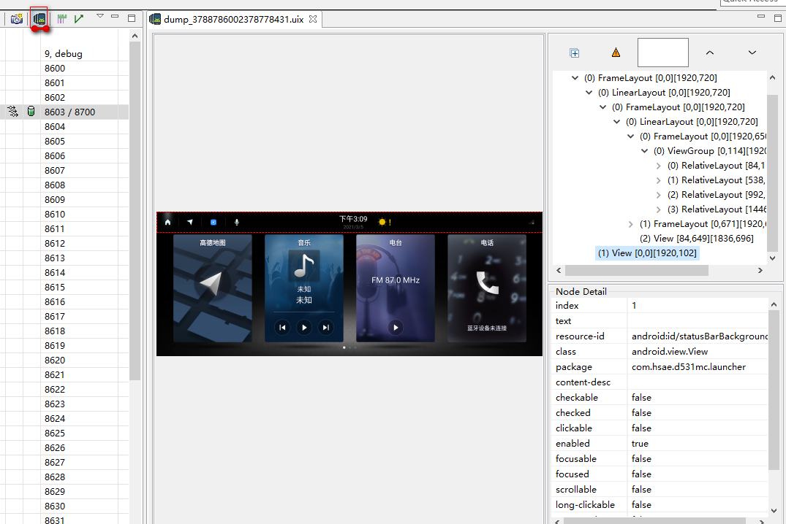

## DDMS

以前开发安卓还在用eclipse的时候，分析工具是DDMS。虽然现在eclipse+adt的方式已经被android studio代替，但是android-sdk里面仍然保留了ddms。这个工具非常好用，因此有必要介绍一下。

打开`<android-sdk>-tools`目录，执行monitor.bat即可启动。

如果起不来，通常是脚本里的路径或者java版本的问题。在控制台里面执行monitor.bat，可以看到报错信息，根据报错信息很容易解决。

起来后连接到device，界面是一个eclipse的界面：


### 线程、java heap等信息


dump整体视图



查看当前的所有windows层级：


AndroidStudio中的Layout Inspector有点像这两种图的结合简化。当Layout Inspector不够用时，不妨试试旧的方式。

### Traceview

分析测试Android的性能的工具有dumpsys、Systrace、TraceView、Update Threads（更新线程）、Update Heap（更新堆）、Allocation Tracker（分配跟踪器）等工具。先介绍traceview。

Traceview的使用方法：

方法一：通过在代码中添加相关函数

在关键代码段开始前调用Android SDK中Debug类的startMethodTracing()方法，在关键代码段结束前调用stopMethodTracing()方法。

将会采集运行时间内该应用所有线程的方法执行情况，采集数据保存到执行的sdcard目录下的一个文件中。

再将该文件pull到电脑中，拖拽到Eclipse里打开。

方法二：DDMS界面，选中所要跟踪的进程。点击上方的Start/Stop Method Profiling摁钮来开始/停止采集数据。当停止采集时，DDMS会自动触发Traceview工具来浏览采集到的数据


通过Traceview打开采集到的数据，UI分为上下两个面板，上面是Timeline Panel(时间线面板)，下面是Profile Panel(分析面板)。


这些使用细节无需过多介绍，自己使用几次，多摸索自然而然就会了。详细介绍请参考我们公司同事分享的《Android系统优化工具介绍.pptx》。

### Memory Analyzer Tool(MAT)

MAT是一个eclipse的插件，同时也有单独的Windows和Linux版本的客户端，通过解析hprof文件来分析内存使用情况。

如果eclipse里面没有安装MAT插件，点击Devices视图里的“Dump Hprof file”按钮采集数据，最后确定数据保存路径，得到hprof文件。

用android studio，则安照如下手续导出hprof文件：

1. View->Tool Windows->Profiler打开Profiler视图，点击+号，选择需要分析的进程。
2. 点击Memory那一行，然后点击上面的“Dump java heap“
3. 左边点击的”Export“图标，或者右击，export。


MAT用来分析java程序的hprof文件 与Android导出的hprof有一定的格式区别，因此我们需要把导出的hprof文件转换一下，sdk中提供给我们转换的工具 hprof-conv.exe 在platform-tools目录下。

> 命令格式：hprof-conv 源文件 输出文件
> 例如：hprof-conv E:\aaa.hprof E:\output.hprof 

过去还在用eclipse的时代，用的MAT是eclipse的插件，这个转换是自动的，现在已经没人用eclipse开发android了，所以要手动转一下。

在MAT中打开得到的hprof文件。

•Overview视图中指出了内存的使用情况，并通过饼图展示内存的分配情况：

​	 – Leak Suspects: 内存泄露报告

​	 – Top Components: 吃货报告

​	 – Histogram: 每个Class占用内存

​	 – Dominator Tree: 列出哪些对象占用内存最多以及谁hold住这些对象

•Histogram，列出每个类的实例对象的数量。

​	Ø Class Name：类名

​	Ø Objects：每一种类型的对象数量

​	Ø Shallow Heap：一个对象本身（不包括该对象引用的其他对象）占用的内存

​	Ø Retained Heap：一个对象本身，以及由该对象引用的其他对象的Shallow Heap的总和


Dominator Tree，列出进程中的所有对象。与Histogram不同的是左侧列是对象，而不是类

​	Ø List Object(with outgoing references/with incoming references)，列出由该对象引用的其他对象/引用该对象的其他对象

​	Ø Path To GC Roots，由当前对象到GC Roots引用链。在子菜单中可以选择排除不同的非强引用组合来筛选到GC Roots的引用链

​	Ø GC Roots，是指那些不会被垃圾回收的对象。图中对象名前面有黄色圆点的就是GC Roots，每个GC Roots对象名的后面有灰黑色的标识，表面这个对象之所有是GC Roots的原因


•Top Consumers：

   以class和package分类表示占用内存比较多的对象

•Leak Suspects：

   对内存泄露原因的简单分析，列出可能的怀疑对象

### Systrace

TraceView是android的一个可视化的调试工具，Systrace是Android4.1中新增的性能数据采样和分析工具。

TraceView是Android平台特有的数据采集和分析工具，它主要用于分析Android中应用程序的hotspot。Systrace从本质上说是对Linux Kernel中ftrace的封装。

Systrace可帮助开发者收集Android关键子系统（如Surfaceflinger、WindowManagerService等Framework部分关键模块、服务）的运行信息，从而帮助开发者更直观的分析系统瓶颈，改进性能。
 Systrace的功能包括跟踪系统的I/O操作、内核工作队列、CPU负载以及Android各个子系统的运行状况等。

 在Android平台中， 它主要由3部分组成：
 **1.内核部分：**Systrace利用了Linux Kernel中的ftrace功能。所以，如果要使用Systrace的话，必须开启kernel中和ftrace相关的模块。
 **2.数据采集部分：**Android定义了一个Trace类。应用程序可利用该类把统计信息输出给ftrace。同时，Android还有一个atrace程序，它可以从ftrace中读取统计信息然后交给数据分析工具来处理。
 **3.数据分析工具：**Android提供一个systrace.py（python脚本文件，位于Android SDK目录/tools/systrace中，其内部将调用atrace程序）用来配置数据采集的方式（如采集数据的标签、输出文件名等）和收集 ftrace统计数据并生成一个结果网页文件供用户查看。
通常通过命名行的方式，通过执行systrace.py使用systrace（命令行工具这一节介绍），不过可以在 DDMS 里面使用：


### 腾讯apt

腾讯开源的android性能测试工具，是一个eclipse的插件，提供了CPU利用率实时曲线图、多维度内存实时曲线图，方便竞品对比测试和定位内存泄露问题；支持进程内存构成分析，支持手工或超过阈值时自动转储(Dump)详细堆内存对象信息，支持多进程，支持生成和导出常用格式的的日志图表。

只需要将下载的APT_Eclipse_Plugin.jar文件放到Eclipse安装目录下的plugins文件夹下，然后重启Eclipse即可。

由于eclipse已经被淘汰，这个工具没用了。

## android studio

android studio里面放弃了Android Monitor工具，所有关于性能分析的功能都在 [Android Profiler] 里。

### CPU 性能剖析器

1. 依次选择 **View > Tool Windows > Profiler** 或点击工具栏中的 **Profile** 图标 。

   如果 **Select Deployment Target** 对话框显示提示，请选择需将您的应用部署到哪个设备上以进行性能剖析。如果您已通过 USB 连接设备但系统未列出该设备，请确保您已[启用 USB 调试](https://developer.android.google.cn/studio/debug/dev-options#enable)。

2. 点击 **CPU** 时间轴上的任意位置以打开 CPU 性能剖析器。

当您打开 CPU 性能剖析器时，它会立即开始显示应用的 CPU 使用率和线程活动。

### 记录跟踪数据

请从 CPU 性能剖析器上方或下方的下拉菜单中[选择记录配置](https://developer.android.google.cn/studio/profile/cpu-profiler#configurations)，然后点击 **Record**。

与您的应用交互，然后在完成时点击 **Stop**。性能剖析器会自动在跟踪数据窗格中显示其跟踪信息

在开始记录跟踪信息之前，请为需捕获的分析信息选择适当的记录配置：

* 对 Java 方法采样
* 跟踪 Java 方法
* 对 C/C++ 函数采样
* 跟踪系统调用

详细教程见官网：https://developer.android.google.cn/studio/profile/cpu-profiler

### 内存性能分析器

内存性能分析器是 [Android Profiler](https://developer.android.google.cn/studio/preview/features/android-profiler) 中的一个组件，可帮助您识别可能会导致应用卡顿、冻结甚至崩溃的内存泄漏和内存抖动。它显示一个应用内存使用量的实时图表，让您可以捕获堆转储、强制执行垃圾回收以及跟踪内存分配。

如需打开内存性能分析器，请按以下步骤操作：

1. 依次点击 **View > Tool Windows > Profiler**（您也可以点击工具栏中的 **Profile** 图标 ）。
2. 从 Android Profiler 工具栏中选择要分析的设备和应用进程。如果您已通过 USB 连接设备但系统未列出该设备，请确保您已[启用 USB 调试](https://developer.android.google.cn/studio/debug/dev-options#enable)。
3. 点击 **MEMORY** 时间轴上的任意位置以打开内存性能分析器。

或者，您可以从命令行使用 [dumpsys](https://developer.android.google.cn/studio/command-line/dumpsys) 检查您的应用内存，还可以[在 logcat 中查看 GC 事件](https://developer.android.google.cn/studio/debug/am-logcat#memory-logs)。

内存计数中的类别如下：

- **Java**：从 Java 或 Kotlin 代码分配的对象的内存。

- **Native**：从 C 或 C++ 代码分配的对象的内存。

  即使您的应用中不使用 C++，您也可能会看到此处使用了一些原生内存，因为即使您编写的代码采用 Java 或 Kotlin 语言，Android 框架仍使用原生内存代表您处理各种任务，如处理图像资源和其他图形。

- **Graphics**：图形缓冲区队列为向屏幕显示像素（包括 GL 表面、GL 纹理等等）所使用的内存。（请注意，这是与 CPU 共享的内存，不是 GPU 专用内存。）

- **Stack**：您的应用中的原生堆栈和 Java 堆栈使用的内存。这通常与您的应用运行多少线程有关。

- **Code**：您的应用用于处理代码和资源（如 dex 字节码、经过优化或编译的 dex 代码、.so 库和字体）的内存。

- **Others**：您的应用使用的系统不确定如何分类的内存。

- **Allocated**：您的应用分配的 Java/Kotlin 对象数。此数字没有计入 C 或 C++ 中分配的对象。

### 查看全局 JNI 引用

JNI 引用由原生代码进行管理，因此原生代码使用的 Java 对象可能会保持活动状态过长时间。如果丢弃了 JNI 引用而未先明确将其删除，Java 堆上的某些对象可能会变得无法访问。此外，还可能会达到全局 JNI 引用限制。

如需排查此类问题，请使用内存性能分析器中的 **JNI heap** 视图浏览所有全局 JNI 引用，并按 Java 类型和原生调用堆栈对其进行过滤。借助此信息，您可以了解创建和删除全局 JNI 引用的时间和位置。

在您的应用运行时，选择您要检查的一部分时间轴，然后从类列表上方的下拉菜单中选择 **JNI heap**。

### 原生内存性能分析器

Android Studio 内存性能分析器包含原生内存性能分析器，该工具适用于部署到搭载 Android 10 的物理设备的应用；[Android Studio 4.2 预览版](https://developer.android.google.cn/studio/preview)现提供对 Android 11 设备的支持。

原生内存性能分析器会跟踪特定时间段内采用原生代码表示的对象的分配/解除分配情况，并提供以下信息：

- **Allocations**：在选定时间段内通过 `malloc()` 或 `new` 运算符分配的对象数。
- **Deallocations**：在选定时间段内通过 `free()` 或 `delete` 运算符解除分配的对象数。
- **Allocations Size**：在选定时间段内所有分配的总大小（以字节为单位）。
- **Deallocations Size**：在选定时间段内所有已释放内存的总大小（以字节为单位）。
- **Total Count**：**Allocations** 列中的值减去 **Deallocations** 列中的值所得的结果。
- **Remaining Size**：**Allocations Size** 列中的值减去 **Deallocations Size** 列中的值所得的结果。

内存分析器的使用详细介绍请见官网：https://developer.android.google.cn/studio/profile/memory-profiler

### 网络性能剖析器

打开网络性能剖析器，请按以下步骤操作：

1. 依次点击 **View > Tool Windows > Profiler**（您也可以点击工具栏中的 **Profile** 图标 ）。
2. 从 Android Profiler 工具栏中选择要分析的设备和应用进程。如果您已通过 USB 连接设备但系统未列出该设备，请确保您已[启用 USB 调试](https://developer.android.google.cn/studio/debug/dev-options#enable)。
3. 点击 **NETWORK** 时间轴上的任意位置以打开网络性能剖析器。

### 能耗性能剖析器

能耗性能剖析器可帮助您了解应用在哪里耗用了不必要的电量。

能耗性能剖析器会监控 CPU、网络无线装置和 GPS 传感器的使用情况，并直观地显示其中每个组件消耗的电量。能耗性能剖析器还会显示可能会影响耗电量的系统事件（唤醒锁定、闹钟、作业和位置信息请求）的发生次数。

能耗性能剖析器并不会直接测量耗电量，而是使用一种模型来估算设备上每项资源的耗电量。

打开能耗性能剖析器，请按以下步骤操作：

1. 依次选择 **View > Tool Windows > Profiler** 或点击工具栏中的 **Profile** 图标 。

   如果 **Select Deployment Target** 对话框显示提示，请选择需将您的应用部署到哪个设备上以进行性能剖析。如果您已通过 USB 连接设备但系统未列出该设备，请确保您已[启用 USB 调试](https://developer.android.google.cn/studio/debug/dev-options#enable)。

2. 点击 **Energy** 时间轴中的任意位置以打开能耗性能剖析器。

更多介绍请参阅官网：https://developer.android.google.cn/studio/profile/energy-profiler

## 命令行工具

更多命令行工具见谷歌的官方文档：https://developer.android.google.cn/studio/command-line/。摘录一些遇到问题时常用的分析工具。

### dmtracedump

`dmtracedump` 是一种用于从跟踪日志文件生成图形化调用堆栈图的工具。此工具使用 Graphviz Dot 实用程序创建图形化的输出，因此您必须先安装 Graphviz，才能运行 `dmtracedump`。如果尚未生成跟踪日志并将其从连接的设备保存到本地计算机，请转到[通过检测您的应用生成跟踪日志](https://developer.android.google.cn/studio/profile/generate-trace-logs)。

`dmtracedump` 工具以树形图的形式生成调用堆栈数据，其中每个节点表示一个方法调用。它使用箭头显示调用流程（从父节点到子节点）。下图显示了 `dmtracedump` 的示例输出。

`dmtracedump` 工具在 Android SDK 工具软件包中提供，并位于 `android-sdk/platform-tools/` 下。

### dumpsys

`dumpsys` 是一种在 Android 设备上运行的工具，可提供有关系统服务的信息。您可以使用 [Android 调试桥 (ADB)](https://developer.android.google.cn/studio/command-line/adb) 从命令行调用 `dumpsys`，获取在连接的设备上运行的所有系统服务的诊断输出。此输出通常比您想要的更详细，因此您可以使用下文所述的命令行选项仅获取您感兴趣的系统服务的输出。

执行dumpsys命令，实际上执行的是对应服务的dump方法。比如键入dumpsys netd，实际上执行的是NetworkController和TrafficController.cpp里面的dump():

```C++
//<source_dir>/system/netd/server/TrafficController.cpp
void TrafficController::dump(DumpWriter& dw, bool verbose) {
    std::lock_guard<std::mutex> ownerMapGuard(mOwnerMatchMutex);
    dw.incIndent();
    dw.println("TrafficController");

    dw.incIndent();
    dw.println("BPF module status: %s", ebpfSupported? "ON" : "OFF");

    if (!ebpfSupported)
        return;

    dw.blankline();
    dw.println("mCookieTagMap status: %s",
               getMapStatus(mCookieTagMap.getMap(), COOKIE_TAG_MAP_PATH).c_str());
    dw.println("mUidCounterSetMap status: %s",
               getMapStatus(mUidCounterSetMap.getMap(), UID_COUNTERSET_MAP_PATH).c_str());
    dw.println("mAppUidStatsMap status: %s",
               getMapStatus(mAppUidStatsMap.getMap(), APP_UID_STATS_MAP_PATH).c_str());
    //.....
    dw.decIndent();

    dw.decIndent();

    dw.decIndent();

}
    
```

```shell
#Examples
dumpsys input
dumpsys gfxinfo package-name
dumpsys netstats detail
dumpsys package com.example.myapp | grep userId
dumpsys batterystats options
dumpsys procstats --hours 3
dumpsys meminfo package_name|pid [-d]
dumpsys activity activities
dumpsys window windows
```

### logcat
不说了

### systrace(重要)
是一个python脚本systrace.py, 在Android SDK工具软件包里面`platform-tools/systrace`目录 。捕获系统跟踪记录

`systrace` 命令会调用 [Systrace 工具](https://developer.android.google.cn/topic/performance/tracing)，您可以借助该工具收集和检查设备上在系统一级运行的所有进程的时间信息。

1.  [下载并安装最新的 Android SDK 工具](https://developer.android.google.cn/studio/intro/update#sdk-manager)。
2. 安装 [Python](http://www.python.org/) 并将其添加到工作站的 `PATH` 环境变量中。
3. 将adb添加到 `PATH` 环境变量。systrace.py里面会用到adb跟手机通信。
4. 使用 [USB 调试连接](https://developer.android.google.cn/tools/device#setting-up)将搭载 Android 4.3（API 级别 18）或更高版本的设备连接到开发系统。

例如，以下命令会调用 `systrace` 来记录设备活动，并生成一个名为 `mynewtrace.html` 的 HTML 报告。此类别列表是大多数设备的合理默认列表。

```bash
$ python systrace.py -o mynewtrace.html sched freq idle am wm gfx view \
        binder_driver hal dalvik camera input res
```

### atrace(使用频度高)

systrace里面会调用atrace。所以你发现systrace.py的一些参数和atrace参数用法是一样的。在adb外面用systrace，已经进入Android Shell就用atrace。

atrace --help : 查看参数

atrace --list 查看支持的trace对象

-o filename 输出到文件

-a appname  指定只抓特定程序，“*”号匹配任意字符

例如：

atrace -a com.google.android.exoplayer2.demo -o /data/1.atrace -t 10

其中-a 指定只看exoplayer，-t 10秒，-o 输出文件路径。


抓出的文件有一下几种方法：

1. 直接文本打开。不过估计很难看懂

2. 用systrace.py --from-file转成HTML。除了上面提到的Android SDK中找到systrace.py，如果你有安卓源码，在目录external/chromium-trace/也可以找到：

   ```shell
   /external/chromium-trace$ ./systrace.py --from-file 1.atrace
   ```

   可以转成html格式。然后用浏览器打开。但是有时浏览器显示不出来，不知原因。

3. 后面介绍的perfetto，给了一个网站，这里也可以用。用这个网站打开，界面非常友好：https://ui.perfetto.dev/#!/viewer

举例：

`atrace binder_driver binder_lock  aidl -o /sdcard/test.trace`

perfetto.dev网站打开如下：


### perfetto

和systrace一样，perfetto的数据来源之一也是atrace，所以这些命令都差不多，会一个就等于全部掌握了。

Perfetto是Android 10（API 29）推出的，用来取代systrace。不仅适用于 Android、还适用Linux 和 Chrome的。

`perfetto` 从您的设备上收集性能跟踪数据时会使用多种来源，例如：

- 使用 `ftrace` 收集内核信息
- 使用 `atrace` 收集服务和应用中的用户空间注释
- 使用 `heapprofd` 收集服务和应用的本地内存使用情况信息

Perfetto 从Android10开始有些用法才能正常。之前版本解决方案见下面链接的教程。

perfetto的教程https://perfetto.dev/docs/quickstart/android-tracing

在线抓trace https://ui.perfetto.dev/ ，浏览器里面添加设备，通过adb连接到你的手机，然后点“Start Recording”

Trace configuration ：https://perfetto.dev/docs/concepts/config

谷歌开发者的指导： https://developer.android.google.cn/studio/command-line/perfetto

另外这些工具，用ubuntu支持性比windows更好。

### addr2line

根据栈轨迹定位到源码位置，需要参数指定带有symbol的库。参考我之前的笔记。

### kill

想不到吧！`kill -3 进程号 `不会把进程杀死，而是把这个瞬间的调用轨迹输出到/data/anr目录。见下一篇文章。

### am profile

就是TraceView。

1. am profile start proccessid /sdcard/tt2.trace 
2. am profile stop processid
3. adb pull /sdcard/tt2.trace 到本地电脑
4. 将tt2.trace拖进到Android Studio的profile中

## 日志

1. logcat日志，分为'main', 'system', 'radio', 'events'四个类型，底层对应四个环形缓冲区
2. 内核日志，通过dmesg或cat proc/kmsg查看。一般与APP开发者无关，主要是BSP他们需要关注。
3. TOMBSTONE，tombstone其实就是native层的崩溃日志，存放路径在/data/tombstones文件夹中。借助addr2line分析tombstone文件。还可以用debuggerd工具对正在运行的程序产生tombstone
4. ANR日志，在/data/anr目录
5. 其它特定功能的专有日志，比如蓝牙的snoop日志，需要专门的工具来分析。

## 开发者模式

启用开发者选项，里面有一些有用的功能。比如，查看过渡绘制、启用严格模式、功耗检测等。

里面还可以抓systrace，在开发者选项-调试部分，选择`系统跟踪`。然后` adb pull /data/local/traces/ .`到电脑端。

不过我的手机`系统跟踪`被厂家隐藏起来了，所以不能用。

## 代码中插入调试功能

* 前面提到的startMethodTracing

* Java 代码打印函数栈  Thread.dumpStack()

* Native 代码打印函数栈  

  ```C++
  #include <utils/CallStack.h>
  CallStack stack(LOG_TAG);
  android::CallStack stack(LOG_TAG);
  ```

* Kernel 打印函数栈   dump_stack();或 __backtrace();即可  

* app 代码中添加“可以用atrace收集到的” trace  

  ```java
  Trace.beginSection("my function");
  try {
  ...// 被 trace 的代码段,可以包多个函数,但是不能跨函数,也不能跨线程
  } finally {
  Trace.endSection();
  }
  ```

* framework 中添加 trace  

  ```java
  Trace.traceBegin(Trace.TRACE_TAG_VIEW, "measure"); //trace 开始
  try{
      ... //被 trace 的代码段,可以包多个函数,但是不能跨函数,也不能跨线程
  }finally {
  Trace.traceEnd(Trace.TRACE_TAG_VIEW); //trace 结束
  }
  ```

* Native 代码中添加 trace  

  ```c++
  #include <utils/Trace.h>
  #define ATRACE_TAG xxxx//定义 TAG
  ATRACE_BEGIN("test"); //开始 trace
  … // 被 trace 的代码段
  ATRACE_END(); /结束 trace,匹配与其最近的 ATRACE_BEGIN
  ```

* BlockCanary、LeakCanary等GitHub上面的开源项目，集成到代码里，可以帮忙分析卡顿、溢出问题。


## 经验

### 内存泄漏问题

一般分为三步进行排查：

1、使用LeakCanary进行初步排查；

2、使用Android studio自带的Android Profiler分析；

3、使用MemoryAnalyzer（MAT）分析；

对于这三步，如果对内存消耗这块没有严格要求，一般使用LeakCarary就可以了。

如果对内存管控比较严格，一般使用Android Profiler也是可以的，如果还不能定位到问题就可以使用MAT了。
