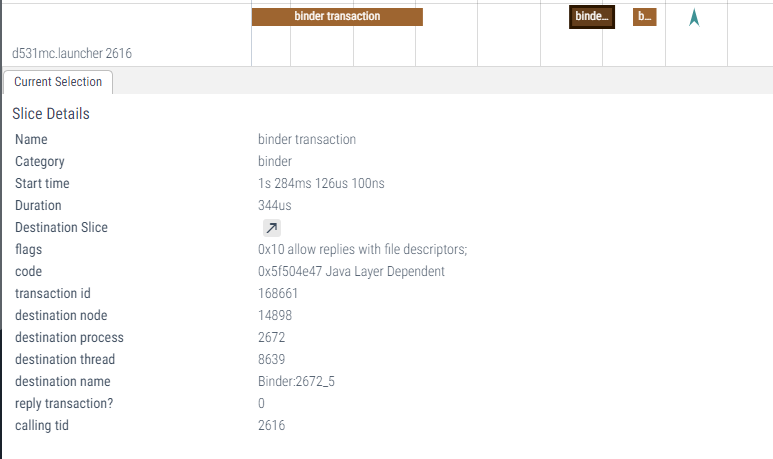
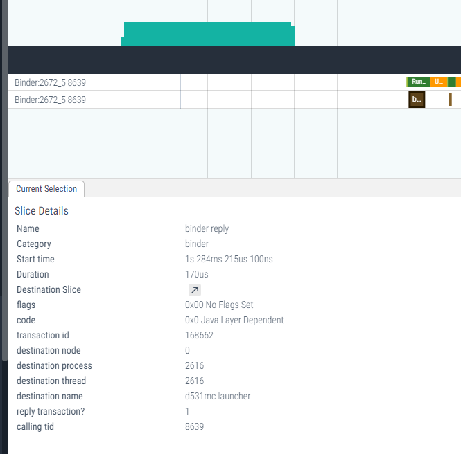

## 问题现象: 

Bug103838：主界面，点击”酷狗“音乐卡片无反应，点击”收音机“卡片的”暂停/上一首/下一首“按钮无效；

## 问题操作步骤: 

1、酷我音乐界面，点击面板”下一曲“
2、点击面板按钮”TUNE“
3、返回主界面
4、点击”酷狗“音乐卡片

## 分析过程

### 正常代码流程应该是：

点击”酷狗“音乐卡片 -》 调用AudioProxy.launchApp ->AudioAdatper调用酷狗的对应方法

###   日志

#### Launcher

05-21 17:29:04.126 2175 2175 I LauncherWidgetControlImpl: VA1606XM_Launcher_P630_20191129: KUGOU_MUSIC OnClickListener launchApp

**结论：**launcher调用方法AudioProxy.getInstance().launchApp(SourceConst.App.KUGOU_MUSIC.ordinal(), true)来启动酷狗，但是之后没有AudioAdapter的相关启动日志。需要AudioAdapter分析为何没有响应启动酷狗的操作。

#### AudioAdatper

点击卡片拉起酷狗，但是此时并没有收到调用LaunchApp方法的日志打印
05-21 17:29:04.671 2175 2175 I LauncherWidgetControlImpl: VA1606XM_Launcher_P630_20191129: KUGOU_MUSIC OnClickListener launchApp

总结一下，就是Launcher认为自己调用了对应的aidl，AudioAdatper认为自己没有收到


AudioProxy.getInstance().launchApp（）的实现：

```java
    public void launchApp(int type, boolean autoPlay) {
        try {
            if (null == getStub()) {
                Log.e(TAG, "stub is null");
                return;
            }
            getStub().launchApp(type, autoPlay);
        } catch (RemoteException e) {
            e.printStackTrace();
        } catch (IllegalArgumentException e) {
            e.printStackTrace();
        }
    }
```

### SysTrace

```shell
python systrace.py -o mynewtrace.html sched freq idle am wm gfx view \
        binder_driver hal dalvik camera input res
//or
atrace sched freq idle am wm gfx view \
        binder_driver hal dalvik camera input res -o a.trace
```





然后将目标进程的堆栈打印出来（kill -3 2672）
```shell
"Binder:2672_3" prio=5 tid=11 Native
  | group="main" sCount=1 dsCount=0 flags=1 obj=0x139426d8 self=0xe5c48d675400
  | sysTid=2710 nice=0 cgrp=default sched=0/0 handle=0xe5c478ad44f0
  | state=S schedstat=( 0 0 0 ) utm=76 stm=17 core=0 HZ=100
  | stack=0xe5c4789d9000-0xe5c4789db000 stackSize=1009KB
  | held mutexes=
  kernel: (couldn't read /proc/self/task/2710/stack)
  native: #00 pc 000000000006f74c  /system/lib64/libc.so (__ioctl+4)
  native: #01 pc 0000000000029168  /system/lib64/libc.so (ioctl+136)
  native: #02 pc 000000000005a844  /system/lib64/libbinder.so (android::IPCThreadState::talkWithDriver(bool)+260)
  native: #03 pc 000000000005b5ec  /system/lib64/libbinder.so (android::IPCThreadState::waitForResponse(android::Parcel*, int*)+60)
  native: #04 pc 000000000005b438  /system/lib64/libbinder.so (android::IPCThreadState::transact(int, unsigned int, android::Parcel const&, android::Parcel*, unsigned int)+176)
  native: #05 pc 00000000000513e8  /system/lib64/libbinder.so (android::BpBinder::transact(unsigned int, android::Parcel const&, android::Parcel*, unsigned int)+72)
  native: #06 pc 0000000000131520  /system/lib64/libandroid_runtime.so (android_os_BinderProxy_transact(_JNIEnv*, _jobject*, int, _jobject*, _jobject*, int)+152)
  native: #07 pc 0000000000565be0  /system/lib64/libart.so (art_quick_generic_jni_trampoline+144)
  native: #08 pc 0000000000004f88  /dev/ashmem/dalvik-jit-code-cache (deleted) (???)
  at android.os.BinderProxy.transactNative(Native method)
  at android.os.BinderProxy.transact(Binder.java:1127)
  at com.kugou.auto.proxy.IKgAutoInterface$Stub$Proxy.executeAction(IKgAutoInterface.java:127)
  at com.kugou.auto.proxy.ActionExecute.executeVoidResultAction(ActionExecute.java:36)
  at com.kugou.auto.proxy.ActionExecute.executeVoidResultAction(ActionExecute.java:27)
  at com.kugou.auto.proxy.KgAutoProxy.playNext(KgAutoProxy.java:548)
  at com.hsae.d531mc.audioadapter.audioapi.KuGouApi.doAudioNext(KuGouApi.java:398)
  at com.hsae.d531mc.audioadapter.service.AudioAdapterService$1.onHmiChanged(AudioAdapterService.java:280)
  at com.hsae.autosdk.audio.IHsaeAudiolInterface$Stub.onTransact(IHsaeAudiolInterface.java:388)
  at android.os.Binder.execTransact(Binder.java:731)

```

发现audioadapter当前正在调用酷狗提供的aidl方法。从onHmiChanged方法，知道这其实是10分钟之前按下面板按键触发的，为什么现在还卡着？

跟进到酷狗里面，发现酷狗是UI和service两个进程分离的。跟到service里面，发现一个死锁：

```shell
- waiting to lock <0x06c740d4> (a com.kugou.framework.service.g) held by thread 47
- locked <0x008f627d> (a com.kugou.common.player.manager.p)
- waiting to lock <0x06c740d4> (a com.kugou.framework.service.g) held by thread 47
- waiting to lock <0x008f627d> (a com.kugou.common.player.manager.p) held by thread 1
- locked <0x06c740d4> (a com.kugou.framework.service.g)
```

至此真相大白，酷狗内部死锁，导致audioadatper的一个binder线程一直占用，从而Launcher调用的方法没有执行。