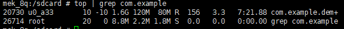
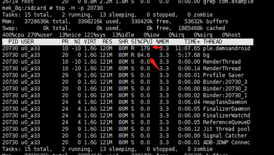
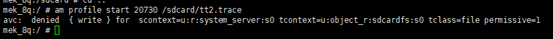
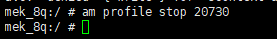
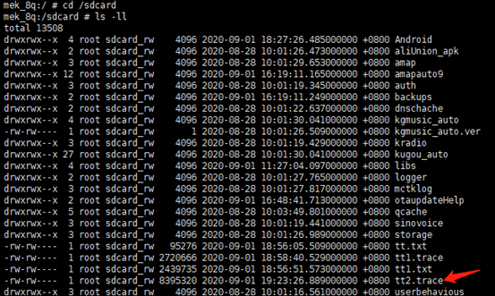
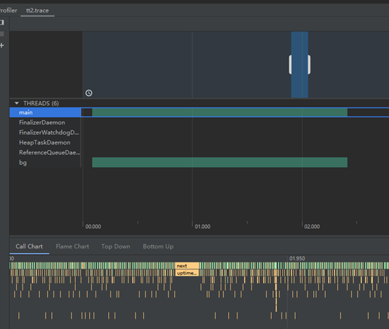
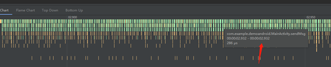
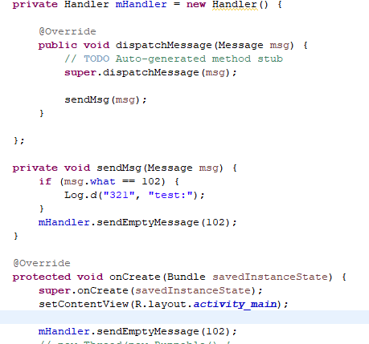

# 应用高CPU问题分析

1. ps -A | grep com.example.demoandroid 获取进程id

2. top -H -p processid查看哪个线程繁忙
    

3. am profile start proccessid /sdcard/tt2.trace 
    

4. am profile stop processid

5. 进入sdcard,查看tt2.trace文件

6. adb pull /sdcard/tt2.trace 到本地电脑

7.  将tt2.trace拖进到Android Studio中(eclipse会出现打开不了问题)

鼠标在底下部分停留，可以查看调用什么方法，耗时多久

 

发现MainActivity.sendMsg方法一直在调用，结合代码，发现sendMsg调用存在死循环逻辑

