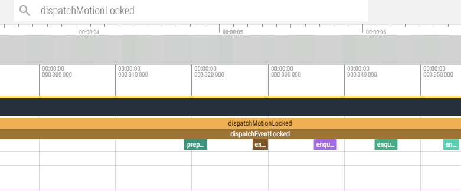

### atrace命令使用

```
console:/data/local/tmp # atrace --help
usage: atrace [options] [categories...]
options include:
  -a appname      enable app-level tracing for a comma separated list of cmdlines; * is a wildcard matching any process
  -b N            use a trace buffer size of N KB
  -c              trace into a circular buffer
  -f filename     use the categories written in a file as space-separated
                    values in a line
  -k fname,...    trace the listed kernel functions
  -n              ignore signals
  -s N            sleep for N seconds before tracing [default 0]
  -t N            trace for N seconds [default 5]
  -z              compress the trace dump
  --async_start   start circular trace and return immediately
  --async_dump    dump the current contents of circular trace buffer
  --async_stop    stop tracing and dump the current contents of circular
                    trace buffer
  --stream        stream trace to stdout as it enters the trace buffer
                    Note: this can take significant CPU time, and is best
                    used for measuring things that are not affected by
                    CPU performance, like pagecache usage.
  --list_categories
                  list the available tracing categories
 -o filename      write the trace to the specified file instead
                    of stdout.
```

一些经验：

1. 很多陈旧的网站说-c用于指定categories，这是错的。categories自然跟在后面，不需要前缀-x。

2. 如果抓的内容比较大，一定要指定-b，增加buffer大小，否则后面的会把前面的覆盖，导致抓取的不全。

   有时你在trace里没找到你想要的部分，可能就是buffer不够，被覆盖了。尽量总是指定一下，单位KB。

   （有时很奇怪，看时间轴，是全的。比如我指定-t 10s,  时间轴就是10s，好像没丢失，但实际上少了，加上-b  40960就有了）

3. 指定-t 10s, 抓取的时间。

下面这段代码：

```
// com.example.mytest
Trace.beginSection("my_section_trace");
try {
    test1();
    System.out.println("---------test-------");
    test2();
} finally {
    Trace.endSection();
}

private void test1() {
    Trace.beginSection("my_section_trace");
    try {
        SystemClock.sleep(1000);
    } finally {
        Trace.endSection();
    }
}
private void test2() {
    SystemClock.sleep(200);
}
```

抓取命令：

```
atrace -t 10s -b 40960 -z -c -a com.example.mytest -o /data/local/tmp/mytest_trace 
```

一定要指定-a processName,  否则自定的my_section_trace不会抓出来。这里后面没有其他categories，内容比较少，因此-b我设的小一些。

mytest_trace文件pull出来，在https://ui.perfetto.dev/网站打开，然后搜索my_section_trace：


4. 抓取点击事件有关的trace

   `atrace -t 10s -b 4096 -z -c -o /data/local/tmp/input_trace input`

   不需要`-a 包名`了,在末尾指定category为input即可。不一定末尾，但我们习惯放末尾，防止误解，比如你放前面“-c input”，容易误会成input是-c的参数值。

   InputDispatcher里有：

   ```
   bool InputDispatcher::dispatchMotionLocked(nsecs_t currentTime, std::shared_ptr<MotionEntry> entry,
                                              DropReason* dropReason, nsecs_t* nextWakeupTime) {
       ATRACE_CALL();
       // Preprocessing.
       if (!entry->dispatchInProgress) {
           entry->dispatchInProgress = true;
   
           logOutboundMotionDetails("dispatchMotion - ", *entry);
       }
    其中：
    #define ATRACE_CALL() ATRACE_NAME(__FUNCTION__)
   ```

   所以我在https://ui.perfetto.dev/搜索dispatchMotionLocked即可定位到。

   

   为什么能看到dispatchMotionLocked里面的一些函数？当然是因为这些函数都调用了ATRACE_CALL()，所有能被采集。

5. 一个比较全的抓各种信息：

   `atrace -t 10s -b 40960 -z -c -o /data/local/tmp/boot_trace sched freq idle am sm power pm ss wm gfx view binder_driver binder_lock aidl hal dalvik camera input res memory  mmc sync `

   atrace --list_categories，然后无脑往后加就是。

   但是个人经验，要慎用，因为太多，经常出现buffer不够，有些信息没了的情况。然后因为你没找到，以为本来就没有，造成错误分析。

### 机制

不需要深入研究实现机理，只讨论一点：

categories是如何和代码里的（C++）ATRACE_CALL()或（Java）Trace.beginSection("my_section_trace");关联的？

或者说，我怎么知道我的ATRACE_CALL，应该在命令行用哪个category？

以input为例：

在`frameworks/native/cmds/atrace/atrace.cpp`:

```
static const TracingCategory k_categories[] = {
      { "gfx",        "Graphics",                 ATRACE_TAG_GRAPHICS, {
          { OPT,      "events/gpu_mem/gpu_mem_total/enable" },
      } },
      { "input",      "Input",                    ATRACE_TAG_INPUT, { } },
      { "view",       "View System",              ATRACE_TAG_VIEW, { } },
      { "webview",    "WebView",                  ATRACE_TAG_WEBVIEW, { } },
```

看到 TRACE_TAG_INPUT 了没，在`system/core/libcutils/include/cutils/trace.h`:

```
#define ATRACE_TAG_GRAPHICS         (1<<1)
#define ATRACE_TAG_INPUT            (1<<2)
#define ATRACE_TAG_VIEW             (1<<3)
```

这样ATRACE_TAG_INPUT就和其它category区别开了。然后：

```c++
//frameworks/native/services/inputflinger/dispatcher/InputDispatcher.cpp
#define ATRACE_TAG ATRACE_TAG_INPUT

//system/core/libutils/include/utils/Trace.h
//-------->这里出现了ATRACE_TAG， define成ATRACE_TAG_INPUT
#define ATRACE_NAME(name) ::android::ScopedTrace PASTE(___tracer, __LINE__)(ATRACE_TAG, name)
#define ATRACE_CALL() ATRACE_NAME(__FUNCTION__)
```

这是C++的，对于Java：

```
public static void beginSection(@NonNull String sectionName) {
    if (isTagEnabled(TRACE_TAG_APP)) {
        if (sectionName.length() > MAX_SECTION_NAME_LEN) {
            throw new IllegalArgumentException("sectionName is too long");
        }
        nativeTraceBegin(TRACE_TAG_APP, sectionName);
    }
}
TRACE_TAG_APP同样在system/core/libcutils/include/cutils/trace.h里定义
```

TRACE_TAG_APP在atrace.cpp的k_categories[] 数组里没有，同样的，我们是通过`-a 进程名`抓的，而不是categories。很合理。

通过阅读源码可以知道**ATRACE_TAG_APP**是有一个switch分支单独出来，通过识别是否有-a参数然后赋值的。

所以前面说-a指定进程名，大概是有问题的，因为一些都不是用的ATRACE_TAG_APP，指定-a有什么用？应该说第三方app通过Trace.beginSection函数记录的trace，用`-a packageName`来获取。

理解这一点后，我们甚至可以自己去添加自定义category。

### https://ui.perfetto.dev/网站使用

网上资料很多。

### 参考

https://www.bilibili.com/opus/975080429494206482

