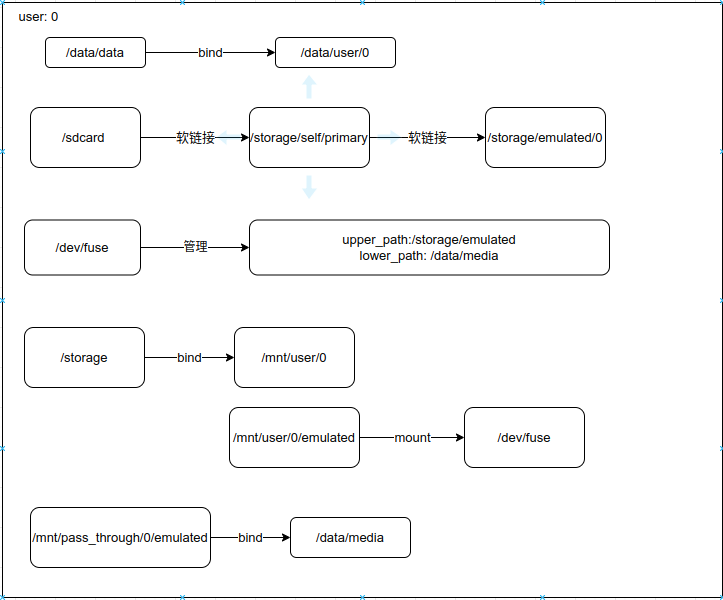

# 存储相关接口
各个版本以来，存储有关的api变化不大。但是APP访问存储的权限管控一直在变。

本文做如下说明：

1. 针对的是android 11。11之前的不再考虑。android 13又对权限进一步细化了，本文暂时不涉及，有时间再研究。
2. 也许可以通过降低targetSdkVersion绕过一些权限管控。我们也不考虑，demo的target声明为11。
3. requestLegacyExternalStorage只是为了过渡，我们也不考虑。
4. 系统级应用不受权限限制。我们只讨论普通的app。

假设没有多用户。


## 系统目录

```java
//返回File对象
Environment.getRootDirectory()//     /system
Environment.getDataDirectory()//     /data
Environment.getStorageDirectory()//  /storage    
Environment.getDownloadCacheDirectory()//    /data/cache    
```

以上称为系统目录，普通app是不会访问的，也没有权限访问。

system目录是只读，不可能修改；

data目录只会访问下面的特定子目录，不会直接在/data创建文件；

storage目录是tmpfs，在下面挂载其他的存储目录，也不可能直接访问。

`/data/cache`只有系统级应用可以访问，普通app的缓存目录有自己的私有目录。

成为系统应用访问`/data/cache`有几种方式：

1. AndroidManifest.xml添加`android:sharedUserId="android.uid.system"`并且用系统秘钥(platform)进行签名；
2. 添加`android.permission.ACCESS_CACHE_FILESYSTEM`权限,并用platform签名
3. 添加`android.permission.ACCESS_CACHE_FILESYSTEM`权限，不签名，app放在/system/app目录。
4. 通过root访问

## 私有目录

私有目录分为两种：**内部存储私有目录和外部存储的私有目录。**

* 内部存储：Context#getFilesDir，Context#getCacheDir   ，对应目录/data/data/packageName
* 外部存储：Context#getExternalFilesDir，Context#getExternalCacheDir ，对应目录/sdcard/Android/data/packageName

### 内部存储私有目录

```java
//不需要权限
this.getFilesDir();// /data/user/0/com.xue.storagedemo/files
this.getCacheDir();// /data/user/0/com.xue.storagedemo/cache
getDatabasePath("aaa");// /data/user/0/com.xue.storagedemo/databases/aaa
getDir("test", MODE_PRIVATE);// /data/user/0/com.xue.storagedemo/app_test
getCodeCacheDir();//   /data/user/0/com.xue.storagedemo/code_cache
```

因为没有多用户，`/data/user/0`实际上就是`/data/data` 。

也就是，`/data/user/0/包名`是应用的私有目录，应用不需要任何权限，可以访问此目录下的任何文件；应用只能访问自己的私有目录。

### 外部存储私有目录

每个手机都有个sdcard目录，这个是从内置存储空间的data目录里划分出来的；另外还可以外接SD卡。两个都是外部存储空间，功能是一样的。

在下面的代码示例中，因为手机上插了一张存储卡，所以形如getXXXDirs的这种接口，结果都是返回File[2],一个在sdcard上面，一个在TF卡上面。

```java
getExternalCacheDir();//        /storage/emulated/0/Android/data/com.xue.storagedemo/cache

//       /storage/emulated/0/Android/data/com.xue.storagedemo/cache;
//以及      /storage/11FB-2317/Android/data/com.xue.storagedemo/cache
getExternalCacheDirs();

//   /storage/emulated/0/Android/data/com.xue.storagedemo/files/Music
getExternalFilesDir(Environment.DIRECTORY_MUSIC);

//   /storage/emulated/0/Android/data/com.xue.storagedemo/files/aaaa
getExternalFilesDir("aaaa");

//   /storage/emulated/0/Android/data/com.xue.storagedemo/files
getExternalFilesDir(null);//或者""

//   /storage/emulated/0/Android/media/com.xue.storagedemo
//以及/storage/11FB-2317/Android/media/com.xue.storagedemo
getExternalMediaDirs();

//   /storage/emulated/0/Android/obb/com.xue.storagedemo
getObbDir();

//   /storage/emulated/0/Android/obb/com.xue.storagedemo
//  /storage/3236-3939/Android/obb/com.xue.storagedemo
getObbDirs();

```

在这些目录下创建文件同样不需要权限，包括obb目录和media目录，也包括TF卡上的目录。即只要是私有目录(自己包名目录下)，就有完全的读写权限。

私有目录应用卸载后，数据会删除。

## 共享目录

外部存储的公共目录即 `/storage/emulated/0` 目录下的 DCIM、Pictures、Alarms， Music， Notifications，Podcasts， Ringtones、Movies、Download、Documents、Audiobooks、Recordings等目录。

这些类型是安卓定义好的。对应sdcard里的特定目录。谷歌要求普通应用访问这些目录必须要需要通过 MediaStore 或者 Storage Access Framework（以下简称 SAF）来获取到文件的Uri来进行访问，不能通过`file path`来访问资源。不像以前只要申请里权限就可以任意访问sdcard里的文件。这是android 11强制启用分区存储带来的重大变化。

权限方面的要求如下：

| 类型     | 位置                 | 访问应用自己生成的文件 | 访问其他应用生成的的文件      | 访问方法                                          | 卸载应用是否删除文件 |
| -------- | -------------------- | ---------------------- | ----------------------------- | ------------------------------------------------- | -------------------- |
| 外部存储 | Photo/ Video/ Audio/ | 无需权限               | 需要权限READ_EXTERNAL_STORAGE | MediaStore Ap                                     | 否                   |
| 外部存储 | Downloads            | 无需权限               | 无需权限                      | 通过存储访问框架SAF，加载系统文件选择器           | 否                   |
| 外部存储 | 应用特定的目录       | 无需权限               | 无法直接访问                  | getExternalFilesDir()获取到属于应用自己的文件路径 | 是                   |

* 通过MediaStore，只能访问那几个目录，而不是全部sdcard

* MediaStore会记录文件是哪个app创建的。app可以增删改查自己创建的文件，不需要权限。所以android 11上面已经用不到WRITE_EXTERNAL_STORAGE。

* MediaStore读取其他app创建的文件，则需要声明READ_EXTERNAL_STORAGE。

* MediaStore修改其他APP创新建的多媒体文件，需要注意一下两点

  - 1.需要判断是否有`READ_EXTERNAL_STORAGE`权限
  - 2.需要`catch RecoverableSecurityException`，由MediaProvider弹出弹框给用户选择是否允许APP修改或删除图片/视频/音频文件。用户操作的结果，将通过onActivityResult回调返回到APP。如果用户允许，APP将获得该Uri的修改权限，直到设备重启。

  ```
  //首先判断是否有READ_EXTERNAL_STORAGE权限
  if (checkSelfPermission(android.Manifest.permission.READ_EXTERNAL_STORAGE) == PackageManager.PERMISSION_GRANTED) {
      //这里的img 是我相册里的，如果运行demo，可以换成你自己的
      Uri queryUri = xxxxx;
      OutputStream os = null;
      try {
          os = getContentResolver().openOutputStream(queryUri);
      } catch (IOException e) {
          e.printStackTrace();
      } catch (RecoverableSecurityException e1) {
          e1.printStackTrace();
          //捕获 RecoverableSecurityException异常，发起请求
          try {
              startIntentSenderForResult(e1.getUserAction().getActionIntent().getIntentSender(), 0x01,null,0,0,0);
          } catch (IntentSender.SendIntentException e2) {
              e2.printStackTrace();
          }
      }
  }
  ```

* 另外一个app可以通过定义FileProvider实现文件安全共享给其它应用。典型应用是调用相机获取图片。

设计的这么复杂，估计就是谷歌认为app不应该修改其他app的文件。真有需要，也应该先拷贝一份，变成自己的，再编辑。

### 管理设备存储空间

针对文件管理器类型的应用，它们需要获得共享存储的更广泛的访问权限，而不仅限于media类型。**Android11**使用权限：

```xml
<uses-permission android:name="android.permission.MANAGE_EXTERNAL_STORAGE"
```

代码里面通过下面申请权限:

```java
private void requestmanageexternalstorage_Permission() {
    if (Build.VERSION.SDK_INT >= Build.VERSION_CODES.R) {
        // 先判断有没有权限
        if (Environment.isExternalStorageManager()) {
            Toast.makeText(this, "Android VERSION  R OR ABOVE，HAVE MANAGE_EXTERNAL_STORAGE GRANTED!", Toast.LENGTH_LONG).show();
        } else {
            Toast.makeText(this, "Android VERSION  R OR ABOVE，NO MANAGE_EXTERNAL_STORAGE GRANTED!", Toast.LENGTH_LONG).show();
            Intent intent = new Intent(Settings.ACTION_MANAGE_APP_ALL_FILES_ACCESS_PERMISSION);
            intent.setData(Uri.parse("package:" + this.getPackageName()));
            startActivityForResult(intent, REQUEST_CODE);
        }
    }
}
```

我们发现申请这个权限，不是用的动态权限的方法，而是通过intent跳到一个设置界面：


在settings里面看就知道有这个权限了。


另外要说的是，即使获得里这个权限，也不是sdcard所有文件都能访问。sdcard/Android/packages目录下的应用私有数据，普通应用无论如何也是不能访问的。

# StorageManager的接口

```cpp
//许多方法都是hide的。对用户开放的，大多数是写get方法，用处也不大
getUuidForPath(new File("/sdcard"))//根据path，获取对应存储卷的uuid
getAllocatableBytes(uuidForPath)//根据uuid，获取对应卷的可分配空间大小
getStorageVolumes();//返回volume的list，包含内置虚拟存储卡和外置存储卡

//判断是否加密
isEncrypted(new File("/sdcard"))//false
isEncrypted(new File("/data"))//true
```


# 存储与多用户

多用户下，存储涉及的目录关系是这样：



假设还有一个user id=10的用户：


* 主用户下，`/data/data`访问的是`/data/user/0`; 次用户user10里路径`/data/data`真正访问的是`/data/user/10`;
* 主用户下，sdcard通过符号链接，访问到/storage/emulated/0；又`/storage`绑定到`/mnt/user/0`，所以sdcard访问到`mnt/user/0/emulated/0`;又，`mnt/user/0/emulated/` 挂载到`/dev/fuse`，所以访问请求会交给fuse处理，而fuse记录了从/storage/emulated到/data/media的映射，所以最后sdcard访问到的是`/data/media/0`。
* 切换到user 10，sdcard最终访问到的则是`/data/media/10`。
* 如此，实现不同用户下的数据隔离。

# 多用户存储隔离的实现机理

- 挂载命名空间

Mount namespaces provide isolation of the list of mount points seen by the processes in each namespace instance. Thus, the processes in each of the mount namespace instances will see distinct single-directory hierarchies. —— mount_namespaces(7) - Linux manual page - man7.org(http://man7.org/linux/man-pages/man7/mount_namespaces.7.html)

通俗的讲，挂载命名空间实现了挂载点的隔离，在不同挂载命名空间的进程，看到的目录层次不同。

- 挂载传播类型：shared、private、slave、unbindable

  peer group 是一个或多个挂载点的集合，他们之间可以共享挂载信息。

  **1.共享挂载（shared）:**此类型的挂载点会加入一个peer group，并会在group内传播和接收挂载事件；

  **2.从属挂载（slave）:**此类型的挂载点会加入一个peer group，并会接收group内的挂载事件，但不传播；

  **3.共享/从属挂载:**上面两种类型的共存体。可以从一个peer group（此时类型为从属挂载）接收挂载事件，再传播到另一个peer group；

  **4.私有挂载（private）:**此类型的挂载点没有peer group，既不传播也不接收挂载事件；

  **5.不可绑定挂载（unbindable）:**不可以mount

命令示例：

```shell
mount --make-private --bind dir1 dir2
mount --make-shared --bind dir1 dir2
mount --make-slave --bind dir1 dir2
```

演示隔离：

首先，在test目录下建立3个目录： dir1, dir2, my。

最终达到目的：打开两个shell，进入`my`目录，其中一个shell，my目录绑定到dir1；第二个shell, my绑定到dir2。

先准备目录和文件：

```shell
xue@xue-ubuntu22:/home/xue/test$ mkdir dir1
xue@xue-ubuntu22:/home/xue/test$ echo 111 > dir1/f1
xue@xue-ubuntu22:/home/xue/test$ mkdir dir2
xue@xue-ubuntu22:/home/xue/test$ echo ddd > dir1/f2
```

打开一个shell,

```shell
#创建一个新的命名空间
xue@xue-ubuntu22:~/test$ sudo unshare --mount --uts /bin/bash
root@xue-ubuntu22:/home/xue/test# readlink /proc/$$/ns/mnt
mnt:[4026533068]
root@xue-ubuntu22:/home/xue/test# mount --bind dir1 my
root@xue-ubuntu22:/home/xue/test# tree
.
├── dir1
│   └── f1
├── dir2
│   └── f2
└── my
    └── f1

3 directories, 3 files
```

我们看到my已经绑定到了dir1。

再打开一个shell，这个shell的namespace和之前的不一样。

```shell
xue@xue-ubuntu22:~/test$ tree
.
├── dir1
│   └── f1
├── dir2
│   └── f2
└── my

3 directories, 2 files
```

my目录是空的，没有绑定到dir1。下面执行：

```shell
xue@xue-ubuntu22:~/test$ sudo mount --bind dir2 my
[sudo] xue 的密码： 
xue@xue-ubuntu22:~/test$ tree
.
├── dir1
│   └── f1
├── dir2
│   └── f2
└── my
    └── f2

3 directories, 3 files


## 然后再回到前一个shell，查看目录
root@xue-ubuntu22:/home/xue/test# tree
.
├── dir1
│   └── f1
├── dir2
│   └── f2
└── my
    └── f1

3 directories, 3 files

```

我们可以看到，两个shell里，一个my通向dir1, 一个通向dir2。

安卓里面是怎样使用的？

我们知道应用启动时是通过zygote使用fork孵化出来的进程，在启动过程中，会调用到MountEmulatedStorage：

```cpp
//Zygote.childMain -> Zygote.specializeAppProcess -> com_android_internal_os_Zygote_nativeSpecializeAppProcess -> SpecializeCommon
//frameworks/base/core/jni/com_android_internal_os_Zygote.cpp
static void MountEmulatedStorage(uid_t uid, jint mount_mode, bool force_mount_namespace, fail_fn_t fail_fn) {
  // 这里面会调用unshare函数，创建私有的挂载命名空间
  ensureInAppMountNamespace(fail_fn);

  //根据uid计算user_id。如果没有多用户，user_id就是0；如果是多用户，userid=uid/100000
  //uid对应linux里的用户概念；user_id是安卓多用户的用户id。
  const userid_t user_id = multiuser_get_user_id(uid);
  const std::string user_source = StringPrintf("/mnt/user/%d", user_id);
  // Shell is neither AID_ROOT nor AID_EVERYBODY. Since it equally needs 'execute' access to
  // /mnt/user/0 to 'adb shell ls /sdcard' for instance, we set the uid bit of /mnt/user/0 to
  // AID_SHELL. This gives shell access along with apps running as group everybody (user 0 apps)
  // These bits should be consistent with what is set in vold in
  // Utils#MountUserFuse on FUSE volume mount
  PrepareDir(user_source, 0710, user_id ? AID_ROOT : AID_SHELL,
             multiuser_get_uid(user_id, AID_EVERYBODY), fail_fn);

    if (mount_mode == MOUNT_EXTERNAL_PASS_THROUGH) {
      const std::string pass_through_source = StringPrintf("/mnt/pass_through/%d", user_id);
      PrepareDir(pass_through_source, 0710, AID_ROOT, AID_MEDIA_RW, fail_fn);
      BindMount(pass_through_source, "/storage", fail_fn);
    } else if (mount_mode == MOUNT_EXTERNAL_INSTALLER) {
      const std::string installer_source = StringPrintf("/mnt/installer/%d", user_id);
      BindMount(installer_source, "/storage", fail_fn);
    } else if (isAppDataIsolationEnabled && mount_mode == MOUNT_EXTERNAL_ANDROID_WRITABLE) {
      const std::string writable_source = StringPrintf("/mnt/androidwritable/%d", user_id);
      BindMount(writable_source, "/storage", fail_fn);
    } else {
      BindMount(user_source, "/storage", fail_fn);
    }
}

//BindMount函数：
//flag: MS_BIND | MS_REC, MS_BIND用来建立绑定挂载。MS_REC与MS_BIND结合使用，表示以递归方式将挂载动作施之于子树下的所有挂载
mount(source_dir.c_str(), target_dir.c_str(), nullptr, MS_BIND | MS_REC, nullptr)
```

在MountEmulatedStorage里加一行日志，以显示mount的源目录和目标路径:

```cpp
  ALOGW("xue BindMount user_source=%s, target_dir=%s", user_source.c_str(), "/storage");
  BindMount(user_source, "/storage", fail_fn);
```

手机上新建用户：

```shell
lancelot:/ $ pm list users                                                 
Users:
	UserInfo{0:Owner:c13} running
	UserInfo{10:test:400}
```

先在主用户下运行任意个app，日志：

```shell
07-08 11:35:12.745  3767  3767 W Zygote  : xue BindMount user_source=/mnt/user/0, target_dir=/storage
```

切换到user10, 启动app:

```cpp
07-08 11:43:48.867  6983  6983 W Zygote  : xue BindMount user_source=/mnt/user/10, target_dir=/storage
```

类似的是，同样的挂载点`/data/data`在user10下，source是`/data/user/10`，主用户下，source是`/data/user/0`。一方面实现私有数据的分离，另一方面应用又可以统一通过`/data/data`访问。

# 参考

https://www.cnblogs.com/R-bear/p/15027390.html
