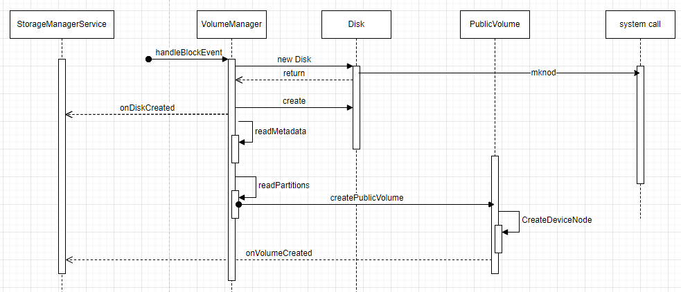

# 简介

Vold全称Volume Daemon，即Volume守护进程，用来管理Android中存储类(USB-Storage，包含U盘和SD卡）的热拔插事件，处于Kernel和Framework之间，是两个层级连接的桥梁。启动之后监听来自kernel的UEvent，挂载U盘并和FrameWork层的StorageManager通信，设置挂载选项、用户权限等

# 代码目录

```
.
├── Android.bp
├── AppFuseUtil.cpp
├── AppFuseUtil.h
├── bench
│   ├── benchgen.py
│   └── inodeop_bench
│       ├── Android.bp
│       ├── inodeop_bench.cpp
│       └── OWNERS
├── Benchmark.cpp
├── BenchmarkGen.h
├── Benchmark.h
├── binder
│   └── android
│       └── os
│           ├── IVold.aidl
│           ├── IVoldListener.aidl
│           ├── IVoldMountCallback.aidl
│           └── IVoldTaskListener.aidl
├── Checkpoint.cpp
├── Checkpoint.h
├── CleanSpec.mk
├── cryptfs.cpp
├── cryptfs.h
├── CryptoType.cpp
├── CryptoType.h
├── EncryptInplace.cpp
├── EncryptInplace.h
├── FileDeviceUtils.cpp
├── FileDeviceUtils.h
├── fs
│   ├── Exfat.cpp
│   ├── Exfat.h
│   ├── Ext4.cpp
│   ├── Ext4.h
│   ├── F2fs.cpp
│   ├── F2fs.h
│   ├── Ntfs.cpp
│   ├── Ntfs.h
│   ├── Vfat.cpp
│   └── Vfat.h
├── FsCrypt.cpp
├── FsCrypt.h
├── IdleMaint.cpp
├── IdleMaint.h
├── KeyBuffer.cpp
├── KeyBuffer.h
├── KeyStorage.cpp
├── KeyStorage.h
├── Keystore.cpp
├── Keystore.h
├── KeyUtil.cpp
├── KeyUtil.h
├── Loop.cpp
├── Loop.h
├── main.cpp
├── MetadataCrypt.cpp
├── MetadataCrypt.h
├── model
│   ├── Disk.cpp
│   ├── Disk.h
│   ├── DiskPartition.cpp
│   ├── DiskPartition.h
│   ├── EmulatedVolume.cpp
│   ├── EmulatedVolume.h
│   ├── ObbVolume.cpp
│   ├── ObbVolume.h
│   ├── PrivateVolume.cpp
│   ├── PrivateVolume.h
│   ├── PublicVolume.cpp
│   ├── PublicVolume.h
│   ├── StubVolume.cpp
│   ├── StubVolume.h
│   ├── VolumeBase.cpp
│   ├── VolumeBase.h
│   ├── VolumeEncryption.cpp
│   └── VolumeEncryption.h
├── MoveStorage.cpp
├── MoveStorage.h
├── NetlinkHandler.cpp
├── NetlinkHandler.h
├── NetlinkManager.cpp
├── NetlinkManager.h
├── OWNERS
├── PREUPLOAD.cfg
├── Process.cpp
├── Process.h
├── secdiscard.cpp
├── sehandle.h
├── TEST_MAPPING
├── tests
│   ├── Android.bp
│   ├── Utils_test.cpp
│   └── VoldNativeServiceValidation_test.cpp
├── Utils.cpp
├── Utils.h
├── vdc.cpp
├── VoldNativeService.cpp
├── VoldNativeService.h
├── VoldNativeServiceValidation.cpp
├── VoldNativeServiceValidation.h
├── vold_prepare_subdirs.cpp
├── vold.rc
├── VoldUtil.cpp
├── VoldUtil.h
├── VolumeManager.cpp
└── VolumeManager.h

8 directories, 99 files

```

我们挑选里面核心的模块来讲，主要包含NetLinkManager(nm)、VolumeManager(vm)、VoldNativeService。

NetLinkManager: 监听来自kernel的事件，判断是否是大容量存储类设备（USB,SD），如果是就对其挂载。

VolumeManager: 主要是配置相关的选项并告知上层（Framework，app）并接受上层所返回的消息（framework会增加用户ID的权限信息）。VoldNativeService: 则是真正去实现挂载的服务，会创建相应的文件夹，设定U盘权限，是否开启FUSE等等。


# 系统架构


# 初始化过程


## init进程启动vold

```
//system/vold/vold.rc文件
service vold /system/bin/vold \
        --blkid_context=u:r:blkid:s0 --blkid_untrusted_context=u:r:blkid_untrusted:s0 \
        --fsck_context=u:r:fsck:s0 --fsck_untrusted_context=u:r:fsck_untrusted:s0
    class core
    ioprio be 2
    task_profiles ProcessCapacityHigh
    shutdown critical
    group root reserved_disk
    reboot_on_failure reboot,vold-failed

```

## vold的初始化

去掉一些我们不关注的代码，比如收集trace、日志、初始化selinux这些。

```cpp
//main.cpp
...
    mkdir("/dev/block/vold", 0755);//1

 	if (!(vm = VolumeManager::Instance())) {//实例化VolumeManager
        LOG(ERROR) << "Unable to create VolumeManager";
        exit(1);
    }

    if (!(nm = NetlinkManager::Instance())) {//实例化NetlinkManager
        LOG(ERROR) << "Unable to create NetlinkManager";
        exit(1);
    }

    if (vm->start()) {
        PLOG(ERROR) << "Unable to start VolumeManager";
        exit(1);
    }


	//解析 fstab 文件
    VoldConfigs configs = {};
    if (process_config(vm, &configs)) {//2
        PLOG(ERROR) << "Error reading configuration... continuing anyways";
    }
	//注册服务
    if (android::vold::VoldNativeService::start() != android::OK) {
        LOG(ERROR) << "Unable to start VoldNativeService";
        exit(1);
    }
    if (nm->start()) {
        PLOG(ERROR) << "Unable to start NetlinkManager";
        exit(1);
    }

	//冷启动
 	coldboot("/sys/block");//3

    //加入bindler线程池
    android::IPCThreadState::self()->joinThreadPool();
```

1. //1: "/dev/block/vold"目录是Android系统中的一个设备节点目录，用于标识和管理外部存储设备的块设备，并通过挂载点与文件系统管理。

   用我自己的手机来举例，原来vold目录里是空的。然后我插入一张sd卡，首先/dev/block目录下可以看到sd卡对应的块设备：


然后vold目录变成：


挂载点：

```shell
/dev/block/vold/public:179,129 on /mnt/media_rw/3236-3939 type vfat (rw,dirsync,nosuid,nodev,noexec,noatime,gid=1023,fmask=0007,dmask=0007,allow_utime=0020,codepage=437,iocharset=iso8859-1,shortname=mixed,utf8,errors=remount-ro)
/dev/fuse on /mnt/installer/0/3236-3939 type fuse (rw,lazytime,nosuid,nodev,noexec,noatime,user_id=0,group_id=0,allow_other)
/dev/fuse on /mnt/androidwritable/0/3236-3939 type fuse (rw,lazytime,nosuid,nodev,noexec,noatime,user_id=0,group_id=0,allow_other)
/dev/fuse on /mnt/user/0/3236-3939 type fuse (rw,lazytime,nosuid,nodev,noexec,noatime,user_id=0,group_id=0,allow_other)
/dev/fuse on /storage/3236-3939 type fuse (rw,lazytime,nosuid,nodev,noexec,noatime,user_id=0,group_id=0,allow_other)
/dev/block/vold/public:179,129 on /mnt/pass_through/0/3236-3939 type vfat (rw,dirsync,nosuid,nodev,noexec,noatime,gid=1023,fmask=0007,dmask=0007,allow_utime=0020,codepage=437,iocharset=iso8859-1,shortname=mixed,utf8,errors=remount-ro)
```


2. //2: 不同的平台，分区表和挂载点不一样，高度依赖厂家定制，所以fstab文件一般在vendor/etc目录下。process_config里面会动态获取fstab文件的路径。解析fstab文件，把每一条设备挂载信息作为DiskSource都通过addDiskSource添加到volumemanager 的list 数组中`std::list<std::shared_ptr<DiskSource>> mDiskSources;`
3. //3: 所谓冷启动，对于热插拔的设备，NetlinkManager可以接收到uevent；但是有些先插上设备，然后开机启动的，因为vold进程启动比内核发uvent晚，接收不到，所以这里需要递归遍历/sys/block目录，然后往uevent文件里写入`add\n`，重新触发通知

## VolumeManager 的初始化

```cpp
int VolumeManager::start() {
    ATRACE_NAME("VolumeManager::start");

    // 先卸载掉所有volume和disk，使得处于比较干净的状态
    unmountAll();

    Loop::destroyAll();

    // Assume that we always have an emulated volume on internal
    // storage; the framework will decide if it should be mounted.
    CHECK(mInternalEmulatedVolumes.empty());

    auto vol = std::shared_ptr<android::vold::VolumeBase>(
            new android::vold::EmulatedVolume("/data/media", 0));
    vol->setMountUserId(0);
    vol->create();
    mInternalEmulatedVolumes.push_back(vol);

    // Consider creating a virtual disk
    updateVirtualDisk();

    return 0;
}
```

## VoldNativeService的初始化

```cpp
status_t VoldNativeService::start() {
    IPCThreadState::self()->disableBackgroundScheduling(true);
    status_t ret = BinderService<VoldNativeService>::publish();
    if (ret != android::OK) {
        return ret;
    }
    sp<ProcessState> ps(ProcessState::self());
    ps->startThreadPool();
    ps->giveThreadPoolName();
    return android::OK;
}
```

VoldNativeService负责binder通讯，连接vold与StorageManagerService。
disableBackgroundScheduling()在接收传入IPC调用时禁用将线程切换到后台。

BinderService::publish函数:

```cpp
static status_t publish(bool allowIsolated = false,
                        int dumpFlags = IServiceManager::DUMP_FLAG_PRIORITY_DEFAULT) {
    sp<IServiceManager> sm(defaultServiceManager());
    return sm->addService(String16(SERVICE::getServiceName()), new SERVICE(), allowIsolated,
                          dumpFlags);
}
```

相应的， StorageManagerService里通过`IBinder binder = ServiceManager.getService("vold");`得到对应的 Service。

## NetLinkManager 的初始化

NetlinkManager::start()主要实现了以下两个功能：
（1）创建并绑定socket用来接收内核消息（uevent);
（2）新建一个NetlinkHandler对象，并调用其start函数开始监听并处理内核传来的netlink event消息。

```cpp
int NetlinkManager::start() {
...
    if ((mSock = socket(PF_NETLINK, SOCK_DGRAM | SOCK_CLOEXEC, NETLINK_KOBJECT_UEVENT)) < 0) {
        PLOG(ERROR) << "Unable to create uevent socket";
        return -1;
    }
...
    if ((setsockopt(mSock, SOL_SOCKET, SO_RCVBUFFORCE, &sz, sizeof(sz)) < 0) &&
        (setsockopt(mSock, SOL_SOCKET, SO_RCVBUF, &sz, sizeof(sz)) < 0)) {
        PLOG(ERROR) << "Unable to set uevent socket SO_RCVBUF/SO_RCVBUFFORCE option";
        goto out;
    }
    if (setsockopt(mSock, SOL_SOCKET, SO_PASSCRED, &on, sizeof(on)) < 0) {
        PLOG(ERROR) << "Unable to set uevent socket SO_PASSCRED option";
        goto out;
    }
    if (bind(mSock, (struct sockaddr*)&nladdr, sizeof(nladdr)) < 0) {
        PLOG(ERROR) << "Unable to bind uevent socket";
        goto out;
    }
    mHandler = new NetlinkHandler(mSock);
    if (mHandler->start()) {
        PLOG(ERROR) << "Unable to start NetlinkHandler";
        goto out;
    }
 ...
}
```

# vold的一些类和成员

1. class Disk: 代表一个物理介质

   ```cpp
   std::vector<std::shared_ptr<VolumeBase>> mVolumes;//记录此Disk上面的分区
   std::string mDevPath;//dev下的设备路径
   std::string mSysPath;//sysfs下的设备路径
   uint64_t mSize;//磁盘的大小，bytes
   ```

   

# Vold的通信


### vold接收uevent的流程

NetlinkManager::start()函数创建并绑定了socket用来与kernel通信，在此函数最后调用了NetlinkHandler::start()函数来监听消息。

NetlinkHandler继承NetlinkListener，NetlinkListener位于libsysutils，libsysutils是一个共享库。NetlinkHandler实现onEvent方法（设计模式里的模板方法）


handleBlockEvent里面处理三种事件：新增（*kAdd*）、变化（*kChange*）、移除（*kRemove*）。

###  uevent消息的格式（示例）

插入TF卡,NetlinkListener收到uevent事件，原始socket流(截取部分)：

```
(add@/devices/platform/externdevice/mmc_host/mmc1/mmc1:aaaa) , size=205
(add@/devices/platform/externdevice/mmc_host/mmc1/mmc1:aaaa) , size=205
(add@/devices/virtual/bdi/179:128) , size=107
(add@/devices/virtual/bdi/179:128) , size=107
(add@/devices/platform/externdevice/mmc_host/mmc1/mmc1:aaaa/block/mmcblk1) , size=238
(add@/devices/platform/externdevice/mmc_host/mmc1/mmc1:aaaa/block/mmcblk1) , size=238
(add@/devices/platform/externdevice/mmc_host/mmc1/mmc1:aaaa/block/mmcblk1/mmcblk1p1) , size=273
(bind@/devices/platform/externdevice/mmc_host/mmc1/mmc1:aaaa) , size=221
(add@/devices/platform/externdevice/mmc_host/mmc1/mmc1:aaaa/block/mmcblk1/mmcblk1p1) , size=273
(bind@/devices/platform/externdevice/mmc_host/mmc1/mmc1:aaaa) , size=221
(add@/devices/virtual/bdi/0:175) , size=103
(add@/devices/virtual/bdi/0:175) , size=103
```

decode解析出NetlinkEvent对象：


防止有些同学不知道，补充一句，这里mPath是在/sys文件系统下的路径。

移除：

```
(remove@/devices/platform/externdevice/mmc_host/mmc1/mmc1:aaaa/block/mmcblk1/mmcblk1p1) , size=279
(remove@/devices/platform/externdevice/mmc_host/mmc1/mmc1:aaaa/block/mmcblk1/mmcblk1p1) , size=279
(remove@/devices/virtual/bdi/179:128) , size=113
(remove@/devices/platform/externdevice/mmc_host/mmc1/mmc1:aaaa/block/mmcblk1) , size=244
(unbind@/devices/platform/externdevice/mmc_host/mmc1/mmc1:aaaa) , size=192
(remove@/devices/platform/externdevice/mmc_host/mmc1/mmc1:aaaa) , size=211
(remove@/devices/virtual/bdi/179:128) , size=113
(remove@/devices/platform/externdevice/mmc_host/mmc1/mmc1:aaaa/block/mmcblk1) , size=244
(remove@/devices/virtual/bdi/0:175) , size=109
(unbind@/devices/platform/externdevice/mmc_host/mmc1/mmc1:aaaa) , size=192
(remove@/devices/platform/externdevice/mmc_host/mmc1/mmc1:aaaa) , size=211
(remove@/devices/virtual/bdi/0:175) , size=109
```


### Vold 与StorageManagerService的通信

Android 9之前的版本 StorageManagerService与vold的通信是socket, 9.0以及后续版本则使用binder通信。有关接口定义位置:

```shell
<aosp>/system/vold/binder/android/os$ ls
IVold.aidl  IVoldListener.aidl  IVoldMountCallback.aidl  IVoldTaskListener.aidl
```

只有第一个IVold.aidl是给framework用的接口，另外三个都是回调。

binder连接创建的过程，在StorageManagerService里面已经分析过。

# 外置存储设备的挂载流程

```shell
# /dev/block/vold目录新增块设备
console:/dev/block/vold # ls -l
total 0
brw------- 1 root root 8,  96 2023-06-01 19:01 disk:8,96
brw------- 1 root root 8, 100 2023-06-01 19:01 public:8,100

#mount情况
/dev/block/vold/public:8,100 124780512 2459600 122320912   2% /mnt/media_rw/B4FE-5315
/dev/fuse                    124780512 2459600 122320912   2% /mnt/user/0/B4FE-5315
```


## U盘识别过程

内核部分：

1. 总线驱动扫描：内核中的总线驱动程序会定期扫描系统中的总线接口，例如USB总线、PCI总线等。这些总线驱动程序会主动探测设备是否有连接或拔出。
2. 设备枚举：如果总线驱动程序检测到设备的连接或拔出，它会启动设备的枚举过程。枚举过程会尝试与设备进行通信，获取设备的识别信息，例如设备的厂商ID、产品ID等。
3. 设备驱动加载：根据设备的识别信息，内核会选择合适的设备驱动程序加载到系统中。这些驱动程序负责与设备进行交互，提供设备的功能和服务。
4. 设备注册：如果设备驱动程序成功加载，内核会将设备注册到相应的子系统中。这样，子系统就能够识别和管理设备，为设备提供适当的操作接口。
5. uevent消息生成：一旦设备成功注册到子系统中，内核会生成一个uevent消息。该消息包含设备的属性信息、事件类型等。
6. uevent消息传递：内核会通过netlink套接字将uevent消息发送到用户空间。用户空间中的守护进程（ueventd、vold）可以接收和处理这些消息，并读取sysfs文件系统。

用户空间部分：

1. ueventd处理uevent消息：ueventd解析接收到的uevent消息，提取出设备的相关信息和事件类型，根据需要执行相应的操作，如设备节点的创建、权限设置等。
2. vold接收到NetlinkEvent：vold收到NetlinkEvent后执行存储卷的挂载、卸载和管理服务。


我们只分析用户空间的代码逻辑,不分析内核。上面写出内核的流程，只是为了在分析前，先了解内核和用户空间的分工，知道哪些事情是内核里去做、哪些事情是用户空间做。

我们的关注点：

1、 用户空间的代码逻辑

2、 内核和Android用户空间的接口：uevent和sysfs

## uevent


uevent的格式：

```c
enum kobject_action {
    KOBJ_ADD,//------------------------设备添加事件。
    KOBJ_REMOVE,//---------------------Kobject移除事件。
    KOBJ_CHANGE,//---------------------设备状态或者内容发生改变。
    KOBJ_MOVE,//-----------------------更改名称或者更改parent，即更改了目录结构。
    KOBJ_ONLINE,//---------------------设备上线/下线事件，常表示使能或者去使能。
    KOBJ_OFFLINE,
    KOBJ_MAX
};

struct kobj_uevent_env {
    char *argv[3];//----------------------------用户空间可执行文件路径，以及参数等。
    char *envp[UEVENT_NUM_ENVP];//--------------指针数组，保存每个环境变量的地址，数组中每个指针指向下面buf数组中每个环境变量
    int envp_idx;//-----------------------------用于访问环境变量指针数组的index
    char buf[UEVENT_BUFFER_SIZE];//-------------环境变量内容。
    int buflen;//-------------------------------环境变量buf的长度
};
struct kset_uevent_ops {
    int (* const filter)(struct kset *kset, struct kobject *kobj);//当任何Kobject需要上报uevent时，它所属的kset可以通过该接口过滤，阻止不希望上报的event，从而达到从整体上管理的目的
    const char *(* const name)(struct kset *kset, struct kobject *kobj);//该接口可以返回kset的名称。如果一个kset没有合法的名称，则其下的所有Kobject将不允许上报uvent
    int (* const uevent)(struct kset *kset, struct kobject *kobj,struct kobj_uevent_env *env);//当任何Kobject需要上报uevent时，它所属的kset可以通过该接口统一为这些event添加环境变量。因为很多时候上报uevent时的环境变量都是相同的，因此可以由kset统一处理，就不需要让每个Kobject独自添加了。
};
```


## sysfs里面的目录分类

sysfs 挂载到 /sys 目录下，以设备树的形式向 user namespace 提供直观的设备和驱动信息。

- **/sys/block** 历史遗留问题，存放块设备，提供以设备名（如 sda）到 /sys/devices 的符号链接；

  示例：

  ```shell
  generic_x86_arm:/sys/block $ ls -l
  lrwxrwxrwx 1 root root 0 2023-07-10 03:39 dm-0 -> ../devices/virtual/block/dm-0
  lrwxrwxrwx 1 root root 0 2023-07-10 03:39 dm-1 -> ../devices/virtual/block/dm-1
  ```

- **/sys/bus** 按总线类型分类，在某个总线目录下可以找到连接该总线的设备的符号链接，指向 /sys/devices。某个总线目录之下的 drivers 目录包含了该总线所需的所有驱动的符号链接   对应 kernel 中的 struct bus_type；

  ```shell
  generic_x86_arm:/sys/bus $ ls -l
  drwxr-xr-x 4 root root 0 2023-07-10 03:40 gpio
  drwxr-xr-x 4 root root 0 2023-07-10 03:40 i2c
  drwxr-xr-x 4 root root 0 2023-07-10 03:40 nvmem
  drwxr-xr-x 5 root root 0 2023-07-10 03:40 pci
  drwxr-xr-x 4 root root 0 2023-07-10 03:40 serial
  drwxr-xr-x 4 root root 0 2023-07-10 03:40 soc
  drwxr-xr-x 4 root root 0 2023-07-10 03:40 spi
  drwxr-xr-x 4 root root 0 2023-07-10 03:40 usb
  ...
  
  generic_x86_arm:/sys/bus/usb/devices $ ls -l
  lrwxrwxrwx 1 root root 0 2023-07-10 03:43 1-0:1.0 -> ../../../devices/platform/dummy_hcd.0/usb1/1-0:1.0
  lrwxrwxrwx 1 root root 0 2023-07-10 03:43 usb1 -> ../../../devices/platform/dummy_hcd.0/usb1
  ```

- **/sys/class** 按设备功能分类，如输入设备在 /sys/class/input 之下，图形设备在 /sys/class/graphics 之下，是指向 /sys/devices 目录下对应设备的符号链接                      对应 kernel 中的 struct class；

- **/sys/dev** 按设备驱动程序分层（字符设备/块设备），提供以 major:minor 为名到 /sys/devices 的符号链接
  对应 kernel 中的 struct device_driver；

  ```shell
  generic_x86_arm:/sys/dev $ ls -l
  drwxr-xr-x 2 root root 0 2023-07-10 03:44 block
  drwxr-xr-x 2 root root 0 2023-07-10 03:44 char
  
  generic_x86_arm:/sys/dev/block $ ls -l
  lrwxrwxrwx 1 root root 0 2023-07-10 03:45 1:0 -> ../../devices/virtual/block/ram0
  lrwxrwxrwx 1 root root 0 2023-07-10 03:45 1:1 -> ../../devices/virtual/block/ram1
  lrwxrwxrwx 1 root root 0 2023-07-10 03:45 1:10 -> ../../devices/virtual/block/ram10
  ...
  ```

- **/sys/devices** 包含所有被发现的注册在各种总线上的各种物理设备。所有的物理设备都按其在总线上的拓扑结构来显示，除了 platform devices 和 system devices。platform devices 一般是关在芯片内部告诉或者低速总线上的各种控制器和外设，能被 CPU 直接寻址。system devices 不是外设，它是系统内部的核心结构，比如 CPU，timer 等，它们一般没有相关的 driver，但是会有一些体系结构相关的代码来配置它们。对应 kernel 中的 struct device。

它们之间的关系：

- device 描述各种设备，其保存了所有的设备信息；
- driver 用于**驱动** device，其保存了所有能够被它所驱动的设备链表；
- bus 是连接 CPU 和 device 的桥梁，其保存了所有挂载在它上面的设备链表和驱动这些设备的驱动链表；
- class 用于描述一类 device，其保存了所有该类 device 的设备链表。

## 从NetlinkHandler收到onEvent开始

前面已经介绍过kernel与vold的通信部分，我们知道，netlink会监听kernel上传的关于U盘，sdcard插入的消息，经过decode处理后交由onEvent函数处理。

实际上，插入U盘后，ueventd和vold都会接受到一部分Netlink事件。以某次示范来说，ueventd会创建：`/dev/block/sdg`和`/dev/block/sdg4`；vold会创建：

`/dev/block/vold/disk:8,96`和`/dev/block/vold/public:8,100`。

经过实测，我在ueventd里打上断点，卡住，并没有影响vold接收事件以及挂载目录。所以我们先不关心ueventd的参与。

从vold的onEvent开始。



1. 判断设备类型，过滤出block类型设备

   ```cpp
   if (std::string(subsys) == "block") {
       vm->handleBlockEvent(evt);
   }
   ```

2. 判断事件类型为添加设备

   ```cpp
   void VolumeManager::handleBlockEvent(NetlinkEvent* evt) {
       std::lock_guard<std::mutex> lock(mLock);
   	//获取主次设备号（major,minor）
       int major = std::stoi(evt->findParam("MAJOR"));
       int minor = std::stoi(evt->findParam("MINOR"));
       dev_t device = makedev(major, minor);
   
       switch (evt->getAction()) {
           case NetlinkEvent::Action::kAdd: {
               for (const auto& source : mDiskSources) {
                   if (source->matches(eventPath)) {
                       int flags = source->getFlags();
                       //判断是U盘还是SD卡
                       if (major == kMajorBlockMmc || IsVirtioBlkDevice(major)) {
                           flags |= android::vold::Disk::Flags::kSd;
                       } else {
                           flags |= android::vold::Disk::Flags::kUsb;
                       }
                       //创建Disk对象，用来保存当前磁盘信息
                       //Disk的构造函数会在/dev/block/vold/下面创建磁盘设备节点。
                       android::vold::Disk* disk = (source->getPartNum() == -1) ?
                               new android::vold::Disk(eventPath, device,
                                       source->getNickname(), flags) :
                               new android::vold::DiskPartition(eventPath, device,
                                       source->getNickname(), flags,
                                       source->getPartNum(),
                                       source->getFsType(), source->getMntOpts());
                       //添加到 mDisks 列表里，以及处理此磁盘下面的分区
                       handleDiskAdded(std::shared_ptr<android::vold::Disk>(disk));
                       break;
                   }
               }
               break;
           }
       }
   }
   ```

## 创建磁盘的设备节点

   ```cpp
   //Disk构造函数    
   DevPath = StringPrintf("/dev/block/vold/%s", mId.c_str());
   CreateDeviceNode(mDevPath, mDevice);
   
   status_t CreateDeviceNode(const std::string& path, dev_t dev) {
   ...
       mode_t mode = 0660 | S_IFBLK;
       if (mknod(cpath, mode, dev) < 0) {//linux系统函数
           if (errno != EEXIST) {
               ...
           }
       }
       ...
       return res;
   }
   ```

   handleDiskAdded代码：

   ```cpp
   void VolumeManager::handleDiskAdded(const std::shared_ptr<android::vold::Disk>& disk) {
       bool userZeroStarted = mStartedUsers.find(0) != mStartedUsers.end();
       if (mSecureKeyguardShowing) {
           mPendingDisks.push_back(disk);
       } else if (!userZeroStarted) {
           mPendingDisks.push_back(disk);
       } else {
           disk->create();
           mDisks.push_back(disk);
       }
   }
   ```

   主要看最后一个else。前面的分支是设备开机时延时创建Disk。

disk->create()

```cpp
status_t Disk::create() {
    ...
    //通知StorageManagerService，onDiskCreated事件
    auto listener = VolumeManager::Instance()->getListener();
    if (listener) listener->onDiskCreated(getId(), mFlags);
...
   //检查磁盘文件系统格式和读取文件分区列表 
    readMetadata();
    readPartitions();
    return OK;
}
```

readMetadata里读取磁盘的元信息，如设备的大小、制造商。主要是从sysfs里读取。

readPartitions里，执行sgdisk命令，得到这个disk上面的分区信息，然后给每个分区创建节点、挂载目录。

```cpp
//readPartitions
status_t Disk::readPartitions() {
    ...
    std::vector<std::string> cmd;
    cmd.push_back(kSgdiskPath);
    cmd.push_back("--android-dump");
    cmd.push_back(mDevPath);
    
    std::vector<std::string> output;
    status_t res = ForkExecvp(cmd, &output);//fork一个子进程，执行sgdisk命令,结果给output
...
    Table table = Table::kUnknown;
    bool foundParts = false;
    for (const auto& line : output) {
        auto split = android::base::Split(line, kSgdiskToken);
        auto it = split.begin();
        if (it == split.end()) continue;

        if (*it == "DISK") {
            //...
        } else if (*it == "PART") {
            foundParts = true;
            if (++it == split.end()) continue;
            int i = 0;
            if (!android::base::ParseInt(*it, &i, 1, maxMinors)) {
                LOG(WARNING) << "Invalid partition number " << *it;
                continue;
            }
            //分区的主设备号等于磁盘；次设备号是磁盘次设备号加上i
            dev_t partDevice = makedev(major(mDevice), minor(mDevice) + i);

            if (table == Table::kMbr) {//分区表是mbr
                if (++it == split.end()) continue;
                int type = 0;
                ...
                switch (type) {
                    case 0x06:  // FAT16
                    case 0x07:  // HPFS/NTFS/exFAT
                    case 0x0b:  // W95 FAT32 (LBA)
                    case 0x0c:  // W95 FAT32 (LBA)
                    case 0x0e:  // W95 FAT16 (LBA)
                    case 0x83:  // Linux EXT4/F2FS/...
                        createPublicVolume(partDevice);
                        break;
                }
            } else if (table == Table::kGpt) {//分区表是gpt
                if (++it == split.end()) continue;
                auto typeGuid = *it;
                if (++it == split.end()) continue;
                auto partGuid = *it;

                if (android::base::EqualsIgnoreCase(typeGuid, kGptBasicData)
                        || android::base::EqualsIgnoreCase(typeGuid, kGptLinuxFilesystem)) {
                    createPublicVolume(partDevice);
                } else if (android::base::EqualsIgnoreCase(typeGuid, kGptAndroidExpand)) {
                    createPrivateVolume(partDevice, partGuid);
                }
            }
        }
    }
...
}
```


命令行：

```shell
/system/bin/sgdisk --android-dump /dev/block/vold/disk:179,128
```

执行结果：

```shell
DISK mbr
PART 1 c
```

第一行告诉我们，磁盘分区三mbr类型。

第二行告诉我们，磁盘上有一个分区，类型是FAT32。

根据条件不同，最后会创建PublicVolume或PrivateVolume。一般都是PublicVolume，下面进入createPublicVolume。

## 创建分区的设备节点

```cpp
void Disk::createPublicVolume(dev_t device,
                const std::string& fstype /* = "" */,
                const std::string& mntopts /* = "" */) {
    auto vol = std::shared_ptr<VolumeBase>(new PublicVolume(device, fstype, mntopts));
...
    mVolumes.push_back(vol);
    vol->setDiskId(getId());
    vol->create();
}
```

PublicVolume继承了VolumeBase类

```cpp
status_t VolumeBase::create() {
    CHECK(!mCreated);

    mCreated = true;
    status_t res = doCreate();//doCreate由子类（PublicVolume、ObbVolume、PrivateVolume等）实现

    auto listener = getListener();
    if (listener) {
        //通知StorageManagerService
        listener->onVolumeCreated(getId(), static_cast<int32_t>(mType), mDiskId, mPartGuid,
                                  mMountUserId);
    }
    return res;
}
status_t PublicVolume::doCreate() {
    return CreateDeviceNode(mDevPath, mDevice);
}
```

CreateDeviceNode和前面创建disk的设备节点是一样的，故不再展开。

## 挂载分区

通过onVolumeCreated通知StorageManagerService后，StorageManagerService会调用mount

```java
//StorageManagerService
@Override
public void onVolumeCreated(String volId, int type, String diskId, String partGuid,
        int userId) {
    synchronized (mLock) {
        final DiskInfo disk = mDisks.get(diskId);
        final VolumeInfo vol = new VolumeInfo(volId, type, disk, partGuid);
        vol.mountUserId = userId;
        mVolumes.put(volId, vol);
        onVolumeCreatedLocked(vol);
    }
}
private void onVolumeCreatedLocked(VolumeInfo vol) {
    mHandler.obtainMessage(H_VOLUME_MOUNT, vol).sendToTarget();
}

//class StorageManagerServiceHandler extends Handler
case H_VOLUME_MOUNT: {
    final VolumeInfo vol = (VolumeInfo) msg.obj;
    ...
    mount(vol);
    break;
}

private void mount(VolumeInfo vol) {
    mVold.mount(vol.id, vol.mountFlags, vol.mountUserId, new IVoldMountCallback.Stub() {
        @Override
        public boolean onVolumeChecking(FileDescriptor fd, String path,
                String internalPath) {
            vol.path = path;
            vol.internalPath = internalPath;
            ParcelFileDescriptor pfd = new ParcelFileDescriptor(fd);
            try {
                mStorageSessionController.onVolumeMount(pfd, vol);
                return true;
            } catch (ExternalStorageServiceException e) {
                Slog.e(TAG, "Failed to mount volume " + vol, e);

                int nextResetSeconds = FAILED_MOUNT_RESET_TIMEOUT_SECONDS;
                Slog.i(TAG, "Scheduling reset in " + nextResetSeconds + "s");
                mHandler.removeMessages(H_RESET);
                mHandler.sendMessageDelayed(mHandler.obtainMessage(H_RESET),
                        TimeUnit.SECONDS.toMillis(nextResetSeconds));
                return false;
            } finally {
                try {
                    pfd.close();
                } catch (Exception e) {
                    Slog.e(TAG, "Failed to close FUSE device fd", e);
                }
            }
        }
    });
}
```

我们发现从StorageManagerService转了一圈，又回到里vold里，VoldNativeService::mount代码：

```cpp
binder::Status VoldNativeService::mount(
        const std::string& volId, int32_t mountFlags, int32_t mountUserId,
        const android::sp<android::os::IVoldMountCallback>& callback) {
    ...
    auto vol = VolumeManager::Instance()->findVolume(volId);
    vol->setMountFlags(mountFlags);
    vol->setMountUserId(mountUserId);
    vol->setMountCallback(callback);
    //执行PublicVolume的mount函数。在父类VolumeBase里
    int res = vol->mount();
    vol->setMountCallback(nullptr);

    if (res != OK) {
        return translate(res);
    }

    return translate(OK);
}
```

真正的挂载动作是PublicVolume::doMount函数，这个函数非常复杂，涉及许多背景知识。

## doMount

```cpp
//mRawPath是真实的挂载路径，通过这个路径可以访问插入sd卡里的文件
mRawPath = StringPrintf("/mnt/media_rw/%s", stableName.c_str());
//下面几个路径不要管它，因为安卓11已经废弃了SdcardFs（尽管代码层面仍然支持），所以与它相关的代码全部跳过
mSdcardFsDefault = StringPrintf("/mnt/runtime/default/%s", stableName.c_str());
mSdcardFsRead = StringPrintf("/mnt/runtime/read/%s", stableName.c_str());
mSdcardFsWrite = StringPrintf("/mnt/runtime/write/%s", stableName.c_str());
mSdcardFsFull = StringPrintf("/mnt/runtime/full/%s", stableName.c_str());

//mRawPath=/mnt/media_rw/3236-3939，下面给mPath赋值为/storage/3236-3939，这个路径也指向SD卡。
if (isVisible) {
    setPath(StringPrintf("/storage/%s", stableName.c_str()));
}
//我的设备：/mnt/media_rw/3236-3939, devPath=/dev/block/vold/public:179,129, fs=vfat
//所以走到mFsType == "vfat"的逻辑分支
if (mFsType == "exfat") {
        ret = exfat::Mount(mDevPath, mRawPath, AID_ROOT,
                 (isVisible ? AID_MEDIA_RW : AID_EXTERNAL_STORAGE), 0007);
} else if (mFsType == "ext4") {
    ret = ext4::Mount(mDevPath, mRawPath, false, false, true, mMntOpts,
            false, true);
} else if (mFsType == "f2fs") {
    ret = f2fs::Mount(mDevPath, mRawPath, mMntOpts, false, true);
} else if (mFsType == "ntfs") {
    ret = ntfs::Mount(mDevPath, mRawPath, AID_ROOT,
             (isVisible ? AID_MEDIA_RW : AID_EXTERNAL_STORAGE), 0007);
} else if (mFsType == "vfat") {
    //here，我的SD卡是FAT32格式
    ret = vfat::Mount(mDevPath, mRawPath, false, false, false, AID_ROOT,
            (isVisible ? AID_MEDIA_RW : AID_EXTERNAL_STORAGE), 0007, true);
} else {
    ret = ::mount(mDevPath.c_str(), mRawPath.c_str(), mFsType.c_str(), 0, NULL);
}
```

vfat是一个命名空间，而不是类对象。Mount函数：

```cpp
//Vfat.cpp
status_t Mount(const std::string& source, const std::string& target, bool ro, bool remount,
               bool executable, int ownerUid, int ownerGid, int permMask, bool createLost) {
...
    //挂载的参数
    flags = MS_NODEV | MS_NOSUID | MS_DIRSYNC | MS_NOATIME;
    flags |= (executable ? 0 : MS_NOEXEC);
    flags |= (ro ? MS_RDONLY : 0);
    flags |= (remount ? MS_REMOUNT : 0);

    auto mountData =
        android::base::StringPrintf("utf8,uid=%d,gid=%d,fmask=%o,dmask=%o,shortname=mixed",
                                    ownerUid, ownerGid, permMask, permMask);

    //mount系统函数，将/dev/block/vold/public:179,129挂载到/mnt/media_rw/3236-3939目录
    rc = mount(c_source, c_target, "vfat", flags, mountData.c_str());
...
}
```

执行完成后，可以查看到挂载信息：

```shell
lancelot:/ # mount | grep 3236                                                                                                       
/dev/block/vold/public:179,129 on /mnt/media_rw/3236-3939 type vfat (rw,dirsync,nosuid,nodev,noexec,noatime,gid=1023,fmask=0007,dmask=0007,allow_utime=0020,codepage=437,iocharset=iso8859-1,shortname=mixed,utf8,errors=remount-ro)
```

这里是直接访问fat文件系统的。实际最终的mount信息还有几个fuse格式的挂载点：

```shell
lancelot:/ # mount | grep 3236
/dev/block/vold/public:179,129 on /mnt/media_rw/3236-3939 type vfat (rw,dirsync,nosuid,nodev,noexec,noatime,gid=1023,fmask=0007,dmask=0007,allow_utime=0020,codepage=437,iocharset=iso8859-1,shortname=mixed,utf8,errors=remount-ro)
/dev/fuse on /mnt/installer/0/3236-3939 type fuse (rw,lazytime,nosuid,nodev,noexec,noatime,user_id=0,group_id=0,allow_other)
/dev/fuse on /mnt/androidwritable/0/3236-3939 type fuse (rw,lazytime,nosuid,nodev,noexec,noatime,user_id=0,group_id=0,allow_other)
/dev/fuse on /mnt/user/0/3236-3939 type fuse (rw,lazytime,nosuid,nodev,noexec,noatime,user_id=0,group_id=0,allow_other)
/dev/fuse on /storage/3236-3939 type fuse (rw,lazytime,nosuid,nodev,noexec,noatime,user_id=0,group_id=0,allow_other)
/dev/block/vold/public:179,129 on /mnt/pass_through/0/3236-3939 type vfat (rw,dirsync,nosuid,nodev,noexec,noatime,gid=1023,fmask=0007,dmask=0007,allow_utime=0020,codepage=437,iocharset=iso8859-1,shortname=mixed,utf8,errors=remount-ro)
```

 这些/dev/fuse的挂载点是在后续代码生成的。代码接着往下看：


```cpp
LOG(INFO) << "Mounting public fuse volume";
android::base::unique_fd fd;
int user_id = getMountUserId();
//挂载fuse
int result = MountUserFuse(user_id, getInternalPath(), stableName, &fd);

//MountUserFuse函数
//fuse_path的值是/mnt/user/0/3236-3939,这个路径通过fuse访问SD卡
std::string pre_fuse_path(StringPrintf("/mnt/user/%d", user_id));
std::string fuse_path(
    StringPrintf("%s/%s", pre_fuse_path.c_str(), relative_upper_path.c_str()));
//pass_through_path的值是/mnt/pass_through/0/3236-3939,这个路径访问SD卡的话，直接走底层文件系统，不经过fuse
std::string pre_pass_through_path(StringPrintf("/mnt/pass_through/%d", user_id));
std::string pass_through_path(
    StringPrintf("%s/%s", pre_pass_through_path.c_str(), relative_upper_path.c_str()));
...
fuse_fd->reset(open("/dev/fuse", O_RDWR | O_CLOEXEC));//打开/dev/fuse
...
//挂载fuse设备到/mnt/user/0/3236-3939
mount("/dev/fuse", fuse_path.c_str(), "fuse",MS_NOSUID | MS_NODEV | MS_NOEXEC | MS_NOATIME | MS_LAZYTIME, opts.c_str())
    
//将/mnt/pass_through/0/3236-3939这个路径和/mnt/media_rw/3236-3939绑定。相当于mount --bind命令。
BindMount(absolute_lower_path, pass_through_path)
```

## 启动fuse daemon

`mount /dev/fuse /mnt/user/0/3236-3939`的时候，这个路径似乎并没有与/mnt/media_rw/3236-3939产生任何关联，那为什么访问/mnt/user/0/3236-3939的时候，系统知道我们要访问的是`/mnt/media_rw/3236-3939`呢？其实还有最后一步，就是把这些信息通知到fuse daemon。

7.0以及之前，fuse daemon是一个名为sdcard的进程。8.0因为sdcardfs代替里fuse，所以没有这个进程。安卓11又回到里fuse，但是代码发生里很大的变化。

一个是代码位置，放到了mediaprovider里（packages/providers/MediaProvider）。

一个是，sdcard进程是自己与/dev/fuse打交道，而现在mediaprovider里是直接引入libfuse库。

我们分析一下从vold里mount fuse,到fuse daemon的链路。


前面StorageManagerService里调用mVold.mount时，最后一个参数是一个回调，在fuse mount结束后，通知StorageManagerService。

```cpp
	mFuseMounted = true;
    auto callback = getMountCallback();//mVold.mount(xx,xx,xx,callback)
    if (callback) {
        bool is_ready = false;
        //回调通知StorageManagerService
        callback->onVolumeChecking(std::move(fd), getPath(), getInternalPath(), &is_ready);
    }
```

onVolumeChecking的代码前面已经贴过了。跟进到mStorageSessionController.onVolumeMount：

```java
    public void onVolumeMount(ParcelFileDescriptor deviceFd, VolumeInfo vol)
            throws ExternalStorageServiceException {
       Slog.i(TAG, "On volume mount " + vol);
        String sessionId = vol.getId();
        int userId = getConnectionUserIdForVolume(vol);

        StorageUserConnection connection = null;
        synchronized (mLock) {
            connection = mConnections.get(userId);
            ...
            Slog.i(TAG, "Creating and starting session with id: " + sessionId);
            //path就是vold模块里volume对象的mPath属性；internalPath就是volume对象的mInternalPath(mRawPath)属性
            //以内置存储卡EmulatedVolume为例，mPath=/storage/emulated,mRawPath=/data/media,
            //其中/storage/emulated表示upperPath，/data/media表示lowerPath。见单独介绍fuse的另外一篇文章。
            connection.startSession(sessionId, deviceFd, vol.getPath().getPath(),
                    vol.getInternalPath().getPath());
        }
    }
```

StorageSessionController这个类是StorageManagerService服务里用来管理StorageUserConnection的，每个用户id对应一个StorageUserConnection。一般我们不用多用户，那么userId就是0，只有一个StorageUserConnection对象。

跟进到connection.startSession：

```java
    public void startSession(String sessionId, ParcelFileDescriptor pfd, String upperPath,
            String lowerPath) throws ExternalStorageServiceException {
        ...
        Session session = new Session(sessionId, upperPath, lowerPath);
        synchronized (mSessionsLock) {
            Preconditions.checkArgument(!mSessions.containsKey(sessionId));
            mSessions.put(sessionId, session);
        }
        mActiveConnection.startSession(session, pfd);
    }
```

mActiveConnection.startSession:

```java
waitForAsyncVoid((service, callback) -> service.startSession(session.sessionId,
                        FLAG_SESSION_TYPE_FUSE | FLAG_SESSION_ATTRIBUTE_INDEXABLE,
                                fd, session.upperPath, session.lowerPath, callback));
```

waitForAsyncVoid的作用是等ExternalStorageService连接上，再执行service.startSession。这里的service就是ExternalStorageService的客户端binder代理。

关于waitForAsyncVoid里面是怎样bind ExternalStorageService服务的，又是怎么等待连接成功再执行后续代码的，这个有点跑题，大家自行去看代码。

ExternalStorageService的实现端在MediaProvider里，类名：ExternalStorageServiceImpl。

```java
//packages/providers/MediaProvider
public final class ExternalStorageServiceImpl extends ExternalStorageService {
    ...
}

//frameworks/base/core/java/android/service/storage/ExternalStorageService.java
public abstract class ExternalStorageService extends Service {
    public final IBinder onBind(@NonNull Intent intent) {
        return mWrapper;
    }
    
    private class ExternalStorageServiceWrapper extends IExternalStorageService.Stub {
        public void startSession(String sessionId, @SessionFlag int flag,
                ParcelFileDescriptor deviceFd, String upperPath, String lowerPath,
                RemoteCallback callback) throws RemoteException {
            mHandler.post(() -> {
                try {
                    onStartSession(sessionId, flag, deviceFd, new File(upperPath),
                            new File(lowerPath));
                    sendResult(sessionId, null /* throwable */, callback);
                } catch (Throwable t) {
                    sendResult(sessionId, t, callback);
                }
            });
        }
    }
}

```

然后我们进到ExternalStorageServiceImpl的onStartSession

```java
    public void onStartSession(@NonNull String sessionId, /* @SessionFlag */ int flag,
            @NonNull ParcelFileDescriptor deviceFd, @NonNull File upperFileSystemPath,
            @NonNull File lowerFileSystemPath) {
        MediaProvider mediaProvider = getMediaProvider();
        boolean uncachedMode = false;
        if (SdkLevel.isAtLeastT()) {
            StorageVolume vol = getSystemService(StorageManager.class).getStorageVolume(upperFileSystemPath);
        }

        synchronized (sLock) {
...
                final String[] supportedTranscodingRelativePaths =
                        mediaProvider.getSupportedTranscodingRelativePaths().toArray(new String[0]);
                final String[] supportedUncachedRelativePaths =
                        mediaProvider.getSupportedUncachedRelativePaths().toArray(new String[0]);
                FuseDaemon daemon = new FuseDaemon(mediaProvider, this, deviceFd, sessionId,
                        upperFileSystemPath.getPath(), uncachedMode,
                        supportedTranscodingRelativePaths, supportedUncachedRelativePaths);
                daemon.start();
                sFuseDaemons.put(sessionId, daemon);
            }
    }
```

FuseDaemon.java是一个Thread类，所以我们应该看它的run方法：

```java
   /** 启动一个 FUSE session. 直到lower filesystem卸载后才返回 */
    @Override
    public void run() {
        final long ptr;
        synchronized (mLock) {
            mPtr = native_new(mMediaProvider);
            if (mPtr == 0) {
                throw new IllegalStateException("Unable to create native FUSE daemon");
            }
            ptr = mPtr;
        }

        Log.i(TAG, "Starting thread for " + getName() + " ...");
        native_start(ptr, mFuseDeviceFd, mPath, mUncachedMode,
                mSupportedTranscodingRelativePaths,
                mSupportedUncachedRelativePaths); // Blocks
        Log.i(TAG, "Exiting thread for " + getName() + " ...");

        synchronized (mLock) {
            native_delete(mPtr);
            mPtr = 0;
        }
        mService.onExitSession(getName());
        Log.i(TAG, "Exited thread for " + getName());
    }
```

native_start是一个jni方法，

```cpp
//com_android_providers_media_FuseDaemon.cpp
const JNINativeMethod methods[] = {
    //注册jni方法，native_start -> com_android_providers_media_FuseDaemon_start
        {"native_start", "(JILjava/lang/String;Z[Ljava/lang/String;[Ljava/lang/String;)V",
         reinterpret_cast<void*>(com_android_providers_media_FuseDaemon_start)},
        ...
} 
```

com_android_providers_media_FuseDaemon_start函数会调用FuseDaemon.cpp的Start函数。至此启动fusedaemon结束。

```cpp
void com_android_providers_media_FuseDaemon_start(
        JNIEnv* env, jobject self, jlong java_daemon, jint fd, jstring java_path,
        jboolean uncached_mode, jobjectArray java_supported_transcoding_relative_paths,
        jobjectArray java_supported_uncached_relative_paths) {
    LOG(DEBUG) << "Starting the FUSE daemon...";
    fuse::FuseDaemon* const daemon = reinterpret_cast<fuse::FuseDaemon*>(java_daemon);
...
    daemon->Start(std::move(ufd), utf_chars_path.c_str(), uncached_mode, transcoding_relative_paths,
                  uncached_relative_paths);
}
```

关于fuse daemon, 我们只大致知道它是干什么的就可以里，无需深入研究。

网上找的一张图，大部分能对上，将就看看。


## MEDIA_MOUNTED广播通知

最后，系统会发出android.intent.action.MEDIA_MOUNTED广播，APP可以通过监听这个广播，收到sd卡的挂载通知。分析发送的流程。


```cpp
//system/vold/model/VolumeBase.cpp
status_t VolumeBase::mount() {
...
    status_t res = doMount();
    //挂载成功，setState(State::kMounted)
    setState(res == OK ? State::kMounted : State::kUnmountable);
...
}
```

setState里会通知StorageManagerService

```cpp
void VolumeBase::setState(State state) {
    mState = state;
    auto listener = getListener();
    if (listener) {
        listener->onVolumeStateChanged(getId(), static_cast<int32_t>(mState));//mState==State::kMounted
    }
}
```

StorageManagerService收到onVolumeStateChanged回调:

```java
 @Override
 public void onVolumeStateChanged(String volId, int state) {
     synchronized (mLock) {
         final VolumeInfo vol = mVolumes.get(volId);
         if (vol != null) {
             final int oldState = vol.state;
             final int newState = state;
             vol.state = newState;
             final SomeArgs args = SomeArgs.obtain();
             args.arg1 = vol;
             args.arg2 = oldState;
             args.arg3 = newState;
             // handler发送H_VOLUME_STATE_CHANGED
             mHandler.obtainMessage(H_VOLUME_STATE_CHANGED, args).sendToTarget();
             onVolumeStateChangedLocked(vol, oldState, newState);
         }
     }
 }
```

然后Handler处理H_VOLUME_STATE_CHANGED消息:

```java
case H_VOLUME_STATE_CHANGED: {
    final SomeArgs args = (SomeArgs) msg.obj;
    onVolumeStateChangedAsync((VolumeInfo) args.arg1, (int) args.arg2,
            (int) args.arg3);
```

onVolumeStateChangedAsync里再次通过Handler发送通知：

```java
  private void onVolumeStateChangedAsync(VolumeInfo vol, int oldState, int newState) {
...
           final String oldStateEnv = VolumeInfo.getEnvironmentForState(oldState);
           final String newStateEnv = VolumeInfo.getEnvironmentForState(newState);
           if (!Objects.equals(oldStateEnv, newStateEnv)) {
               // Kick state changed event towards all started users. Any users
               // started after this point will trigger additional
               // user-specific broadcasts.
               for (int userId : mSystemUnlockedUsers) {
                   if (vol.isVisibleForRead(userId)) {
                       final StorageVolume userVol = vol.buildStorageVolume(mContext, userId,
                               false);
                       mHandler.obtainMessage(H_VOLUME_BROADCAST, userVol).sendToTarget();
                   }
               }
           }
...
   }
```

Handler处理H_VOLUME_BROADCAST：

```java
  case H_VOLUME_BROADCAST: {
      final StorageVolume userVol = (StorageVolume) msg.obj;
      final String envState = userVol.getState();//envState=="mounted"
      Slog.d(TAG, "Volume " + userVol.getId() + " broadcasting " + envState + " to "
              + userVol.getOwner());

      //在frameworks/base/core/java/android/os/storage/VolumeInfo.java初始化代码中,
      //sEnvironmentToBroadcast.put(Environment.MEDIA_MOUNTED, Intent.ACTION_MEDIA_MOUNTED);
      //其中Environment.MEDIA_MOUNTED=="mounted"，
      final String action = VolumeInfo.getBroadcastForEnvironment(envState);
      if (action != null) {
          final Intent intent = new Intent(action,
                  Uri.fromFile(userVol.getPathFile()));
          intent.putExtra(StorageVolume.EXTRA_STORAGE_VOLUME, userVol);
          intent.addFlags(Intent.FLAG_RECEIVER_REGISTERED_ONLY_BEFORE_BOOT
                  | Intent.FLAG_RECEIVER_INCLUDE_BACKGROUND);
          //向指定用户发送Intent.ACTION_MEDIA_MOUNTED广播
          mContext.sendBroadcastAsUser(intent, userVol.getOwner());
      }
      break;
  }
```


# 外置存储设备的卸载流程

略。。。

# 内置sdcard的挂载流程

## onUserStarted

创建sdcard的契机有两处，一为`VolumeManager::start`：

```cpp
int VolumeManager::start() {
    ...
    auto vol = std::shared_ptr<android::vold::VolumeBase>(
            new android::vold::EmulatedVolume("/data/media", 0));
    vol->setMountUserId(0);
    vol->create();
    mInternalEmulatedVolumes.push_back(vol);
...
    return 0;
}
```

start是在vold启动时执行的，这时StorageManagerService还没起来，后面的mount等流程不会执行，所以我们忽略这个case。

第二是`onUserStarted`。在用户首次开机，解锁屏幕时，会收到这个回调。

```cpp
int VolumeManager::onUserStarted(userid_t userId) {
    if (mStartedUsers.find(userId) == mStartedUsers.end()) {
        LOG(INFO) << "userid " << userId <<" not started";
        createEmulatedVolumesForUser(userId);
    }
    mStartedUsers.insert(userId);
    createPendingDisksIfNeeded();
    return 0;
}
```

## createEmulatedVolumesForUser

```cpp
void VolumeManager::createEmulatedVolumesForUser(userid_t userId) {
    // Create unstacked EmulatedVolumes for the user
    auto vol = std::shared_ptr<android::vold::VolumeBase>(
            new android::vold::EmulatedVolume("/data/media", userId));
    vol->setMountUserId(userId);
    mInternalEmulatedVolumes.push_back(vol);
    vol->create();
...
}
```

`vol->create`里通过回调通知StorageManagerService：

```cpp
status_t VolumeBase::create() {
...
    status_t res = doCreate();
    auto listener = getListener();
    if (listener) {
        listener->onVolumeCreated(getId(), static_cast<int32_t>(mType), mDiskId, mPartGuid,
                                  mMountUserId);
    }
...
}
```

前面分析的外置存储的挂载流程也是走到这个地方，但要注意的是，前面的vol对象是PublicVolume类型；而这里是EmulatedVolume类型，所以前者调用的是`PublicVolume.doCreate()`,而这里应该是`EmulatedVolume.doCreate()`，里面的实现是有差异的。

StorageManagerService收到onVolumeCreated后的代码逻辑前文已经介绍过。接下来从`VoldNativeService::mount`开始。

```cpp
binder::Status VoldNativeService::mount(
        const std::string& volId, int32_t mountFlags, int32_t mountUserId,
        const android::sp<android::os::IVoldMountCallback>& callback) {
...
    //执行EmulatedVolume的doMount函数
    int res = vol->mount();
    vol->setMountCallback(nullptr);
...
}
```

区别在于外置存储挂载时调用的是`PublicVolume::doMount`，而这里调用的是`EmulatedVolume::doMount`。

## doMount

先记录下EmulatedVolume里的几个成员变量的值：

* mRawPath = "/data/media"
* userId = 0， mId="emulated;0"
* mLabel = "emulated"
* mUseSdcardFs = false
* mFuseMounted初始为false，MountUserFuse后设置为true

```cpp
setInternalPath(mRawPath);
// mPath="/storage/emulated"
setPath(StringPrintf("/storage/%s", label.c_str()));
```

```cpp
//四个目录：
//  /mnt/runtime/default/emulated
//  /mnt/runtime/read/emulated
//  /mnt/runtime/write/emulated
//  /mnt/runtime/full/emulated
if (fs_prepare_dir(mSdcardFsDefault.c_str(), 0700, AID_ROOT, AID_ROOT) ||
    fs_prepare_dir(mSdcardFsRead.c_str(), 0700, AID_ROOT, AID_ROOT) ||
    fs_prepare_dir(mSdcardFsWrite.c_str(), 0700, AID_ROOT, AID_ROOT) ||
    fs_prepare_dir(mSdcardFsFull.c_str(), 0700, AID_ROOT, AID_ROOT)) {
    PLOG(ERROR) << getId() << " failed to create mount points";
    return -errno;
}
```

判断是否使用的sdcardfs:

```cpp
if (mUseSdcardFs && getMountUserId() == 0) {
    ...
}
```

这里面代码很长，主要是执行一个“/system/bin/sdcard“命令。应该是为了继续支持Android 10上面的sdcardfs。因为Android 11里面我们使用fuse文件系统，mUseSdcardFs设为false，故这一大段跳过。

接着往下：

```cpp
LOG(INFO) << "Mounting emulated fuse volume";
android::base::unique_fd fd;
int user_id = getMountUserId(); // id=0
auto volumeRoot = getRootPath();// /data/media/0 目录

//创建几个目录：
//  /data/media/0/Android/
//  /data/media/0/Android/data/
//  /data/media/0/Android/media/
//  /data/media/0/Android/obb/
status_t res = PrepareAndroidDirs(volumeRoot);
```

MountUserFuse:

```cpp
res = MountUserFuse(user_id, getInternalPath(), label, &fd);
```

MountUserFuse函数前面已经讲过，只是参数不一样, 多了创建软链接的过程：

```cpp
if (relative_upper_path == "emulated") {
    //创建链接 /mnt/user/0/self/primary  --> /storage/emulated/0
    std::string linkpath(StringPrintf("/mnt/user/%d/self", user_id));
    result = PrepareDir(linkpath, 0755, AID_ROOT, AID_ROOT);
    if (result != android::OK) {
        PLOG(ERROR) << "Failed to prepare directory " << linkpath;
        return -1;
    }
    linkpath += "/primary";
    Symlink("/storage/emulated/" + std::to_string(user_id), linkpath);

    //创建链接 /mnt/pass_through/0/self/primary  -> /storage/emulated/0
    std::string pass_through_linkpath(StringPrintf("/mnt/pass_through/%d/self", user_id));
    result = PrepareDir(pass_through_linkpath, 0710, AID_ROOT, AID_MEDIA_RW);
    if (result != android::OK) {
        PLOG(ERROR) << "Failed to prepare directory " << pass_through_linkpath;
        return -1;
    }
    pass_through_linkpath += "/primary";
    Symlink("/storage/emulated/" + std::to_string(user_id), pass_through_linkpath);
}
```

