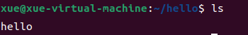

# 简介

FUSE: 用户空间文件系统

所谓“用户空间文件系统“，是指一个文件系统的data和metadata都是由用户态的进程提供。

 # 架构


#  组件


fuse.ko是内核自带的，启动后只要查看`/dev/fuse`文件存在即表示系统支持。

libfuse是一个库，可以帮助开发者开发daemon进程。因为如果开发者自己直接操作fuse设备文件的话，这里面有太多细节。libfuse的地址是https://github.com/libfuse/libfuse, 利用它可以轻松开发一个文件系统。

libfuse源码里有个example目录，里面提供了许多示例。最简单的一个示例是hello.c。我们通过它来了解fuse的工作机制和使用。

# hello

* 按照帮助文档的步骤，编译libfuse，编译所有的example

* 在home目录新建目录hello：

  

* 此时hello是空的。然后到build/example/目录，执行

  

* 可以看到文件系统已经挂载到这个hello目录：

  

* 查看一下挂载信息

  

  意思是文件系统挂载点是/home/xue/hello,这时，如果有用户访问/home/xue/hello目录，系统识别出这个路径文件系统类型是fuse.hello，VFS识别到fuse前缀，就转发给内核的fuse驱动，驱动再转给hello程序。

下面结合hello的代码来理解

```c
//hello.c 131行
static const struct fuse_operations hello_oper = {
	.init           = hello_init,
	.getattr	= hello_getattr,
	.readdir	= hello_readdir,
	.open		= hello_open,
	.read		= hello_read,
};

//main函数
int main(int argc, char *argv[])
{
	int ret;
	struct fuse_args args = FUSE_ARGS_INIT(argc, argv);

	options.filename = strdup("hello");
	options.contents = strdup("Hello World!\n");

	/* Parse options */
	if (fuse_opt_parse(&args, &options, option_spec, NULL) == -1)
		return 1;
...
    
	ret = fuse_main(args.argc, args.argv, &hello_oper, NULL);
...
}
```

`fuse_operations`结构体很容易让人联想到`file_operation`,所以这个结构体的作用不难理解。里面需要实现的函数有：

getattr：得到文件或文件夹的状态属性。
mkdir：创建新的文件夹。
rmdir：删除文件夹。
readdir：展示文件夹的所有文件。
mknod：创建新的文件。
open：打开文件。
read：读取文件内容。
write：向文件中写入内容。
unlink：与mknod对应，指删除文件。
release：（在打开文件后）释放文件。

还有readlink、link、rename、chmod、chown、truncate、fsync、lock等函数。

示例只实现了getattr、readdir、open、read几个方法，所以我可以在目录里ls：



可以cat:


但是无法echo(因为没有实现write)：


我们可以试着切到root，依然提升权限不够，所以真正的原因就是fuse_operations没有实现写方法

```shell
root@xue-virtual-machine:/home/xue/hello# echo 111 > hello
bash: hello: 权限不够
```

至于读和写要怎么实现，那就随心所欲了。比如，你要把一个远程的ssh连接，挂载到本地，希望操作远程的文件就好像操作本地文件一下。那么你在open函数里调用ssh命令打开一个连接，然后在读写方法里操作远程文件即可。

至此，可以回到前面的架构图，用hello这个例子理解一下调用过程。

# 总结

fuse实现用户态文件系统,有以下优点：

* 不需要编译到内核,不需要了解文件系统的内幕和内核模块编程的知识，开发难度低
* 出问题不会导致系统崩溃
* 用户空间下调试工具丰富
* 迎合用户空间复杂多变的需求，灵活

缺点

* 底层的功能支持不是很完整，比如中断、内核里的锁、睡眠机制
* 性能差，体现在以下几点：
  * 访问路径长，从VFS到fuse到daemon，以及返回
  * 用户态和内核态频繁切换
  * 增加了数据copy次数
  * I/O吞吐量低

# Android里的fuse

## 历史演变

* 早期，sdcard是一个独立的分区，google将其格式化为VFAT

  ```shell
  dev/block/vold/179:14 /mnt/sdcard vfat rw,dirsync,nosuid,nodev,noexec,relatime,uid=1000,gid=1015,fmask=0702,dmask=0702,allow_utime=0020,codepage=cp437,iocharset=iso8859-1,shortname=mixed,utf8,errors=remount-ro 0 0
  ```

  --》没有权限管理，每个应用只都可以访问sdcard任何位置的数据。

* 在andorid4.4 中引入了 FUSE

  ```shell
  /dev/fuse /mnt/shell/emulated fuse rw,nosuid,nodev,noexec,relatime,user_id=1023,group_id=1023,default_permissions,allow_other 0 0
  ```

  --》区分app的私有目录和共享目录，私有目录（即`/sdcard/Android/<pkg>/`）不用任何权限即可读写文件；共享目录需要READ_EXTERNAL_STORAGE才可读，声明WRITE_EXTERNAL_STORAGE可写。

* 6.0引入了动态权限

  --》 会存在多个fuse挂载点

* 从4.0就开始布局的多用户功能开始成熟，多用户带来需求

  --》 每个用户拥有独立的外部存储。主用户id为0，sdcard映射到/storage/emulated/0，真正位置为 /data/media/0；id为1的用户则映射到/data/media/1。不同用户的挂载对别的用户不可见。

* Android 8 引入了 SDCardFS,替换FUSE

  --》解决FUSE的性能问题

* Android 11为了支持分区存储， 又用FUSE 替换了SDCardFS

  --》 改进了 `libfuse`，通过微调来解决 Android 7 和更低版本中的性能问题。但是性能仍然不然Android 10。

* Android 12 支持 FUSE 透传功能，此功能可以最大限度地降低 FUSE 开销，从而实现可媲美直接访问下层文件系统的性能。

关于fuse是如何降低性能，我用模拟器做了测试。以下是基于安卓7，模拟器：

```
## 安卓8已经没有sdcard守护进程，基于Android 7
generic_x86:/sdcard # cat test.txt                                             
12345
generic_x86:/sdcard # strace -f -e open,openat,read,close cat test.txt
(..忽略前面一大段不相关的，从open test.txt开始)
openat(AT_FDCWD, "test.txt", O_RDONLY|O_LARGEFILE|O_CLOEXEC) = 3
read(3, "12345\n", 4096)                = 6
12345
read(3, "", 4096)                       = 0
close(3)                                = 0
+++ exited with 0 +++
```

与此同时sdcard daemo 工作流程:

```
generic_x86:/sdcard #  ps | grep sdcard
media_rw  1945  1308  9504   1652  inotify_re b0e62424 S /system/bin/sdcard
media_rw  1994  1308  9500   1688  inotify_re b2da9424 S /system/bin/sdcard
generic_x86:/sdcard # 
generic_x86:/sdcard # ps -t | grep 1945
media_rw  1945  1308  9504   1652  inotify_re b0e62424 S /system/bin/sdcard
media_rw  1956  1945  9504   1652  fuse_dev_d b0e62424 S sdcard
media_rw  1957  1945  9504   1652  fuse_dev_d b0e62424 S sdcard
media_rw  1958  1945  9504   1652  fuse_dev_d b0e62424 S sdcard

generic_x86:/sdcard # strace -f -p 1945  //并不知道是1945还是1994，开两个shell一起执行
                                                                                                                             
strace: Process 1945 attached with 4 threads
[pid  1956] read(4,  <unfinished ...>
[pid  1957] read(8,  <unfinished ...>
[pid  1958] read(9,  <unfinished ...>
[pid  1945] read(12, 

# 再开一个shell，执行cat test.txt,然后此处继续输出如下
"8\0\0\0\3\0\0\0N\3\0\0\0\0\0\0\0000h\260\0\0\0\0\0\0\0\0\0\0\0\0"..., 262224) = 56
[pid  1956] fstatat64(AT_FDCWD, "/data/media/0", {st_mode=0, st_size=12, ...}, AT_SYMLINK_NOFOLLOW) = 0
[pid  1956] writev(4, [{"x\0\0\0\0\0\0\0N\3\0\0\0\0\0\0", 16}, {"\n\0\0\0\0\0\0\0\0\0\0\0\0\0\0\0\1\0\0\0\0\0\0\0\0\20\0\0\0\0\0\0"..., 104}], 2) = 120
[pid  1956] read(4, "0\0\0\0\16\0\0\0O\3\0\0\0\0\0\0\3207h\260\0\0\0\0\0\0\0\0\0\0\0\0"..., 262224) = 48
[pid  1956] openat(AT_FDCWD, "/data/media/0/test.txt", O_RDONLY|O_LARGEFILE) = 14
[pid  1956] writev(4, [{" \0\0\0\0\0\0\0O\3\0\0\0\0\0\0", 16}, {"h\200h\260\0\0\0\0\0\0\0\0\0\0\0\0", 16}], 2) = 32
[pid  1956] read(4, "P\0\0\0\17\0\0\0P\3\0\0\0\0\0\0\3207h\260\0\0\0\0\0\0\0\0\0\0\0\0"..., 262224) = 80
[pid  1956] pread64(14, "12345\n", 4096, 0) = 6
[pid  1956] writev(4, [{"\26\0\0\0\0\0\0\0P\3\0\0\0\0\0\0", 16}, {"12345\n", 6}], 2) = 22
[pid  1956] read(4, "8\0\0\0\3\0\0\0Q\3\0\0\0\0\0\0\3207h\260\0\0\0\0\0\0\0\0\0\0\0\0"..., 262224) = 56
[pid  1956] fstatat64(AT_FDCWD, "/data/media/0/test.txt", {st_mode=0, st_size=1, ...}, AT_SYMLINK_NOFOLLOW) = 0
[pid  1956] writev(4, [{"x\0\0\0\0\0\0\0Q\3\0\0\0\0\0\0", 16}, {"\n\0\0\0\0\0\0\0\0\0\0\0\0\0\0\0$\0\0\0\0\0\0\0\6\0\0\0\0\0\0\0"..., 104}], 2) = 120
[pid  1956] read(4, "@\0\0\0\31\0\0\0R\3\0\0\0\0\0\0\3207h\260\0\0\0\0\0\0\0\0\0\0\0\0"..., 262224) = 64
[pid  1956] write(4, "\20\0\0\0\0\0\0\0R\3\0\0\0\0\0\0", 16) = 16
[pid  1956] read(4, "@\0\0\0\22\0\0\0S\3\0\0\0\0\0\0\3207h\260\0\0\0\0\0\0\0\0\0\0\0\0"..., 262224) = 64
[pid  1956] close(14)                   = 0
[pid  1956] write(4, "\20\0\0\0\0\0\0\0S\3\0\0\0\0\0\0", 16) = 16
[pid  1956] read(4,
```

每个文件操作都按以下流程走一遍：

1. cat程序的系统调用将由内核的Fuse驱动处理
2. Fuse驱动通知userspace守护进程(sdcard)有关新请求的信息
3. userspace守护进程sdcard读取 /dev/fuse
4. sdcard解析命令并识别文件操作，如：open、read
5. sdcard调用实际的底层文件系统，如EXT4、F2FS
6. 真实文件系统在内核处理请求并返回userspace
7. 如果userspace修改文件数据其将再次通过/dev/fuse/传递给内核
8. 内核完成底层真实文件系统调用并将数据移动到userspace的应用程序(此处的cat程序）

fuse和ext4性能测试：

* 拷贝单个大文件对比

  **EXT4** 

```shell
generic_x86:/data/media/0 # echo 3 > /proc/sys/vm/drop_caches //清除缓存，会释放pagecache、dentries、inodes缓存，这样就会直接反应真实文件系统性能
generic_x86:/data/media/0 # dd if=file.in of=file.out bs=1m   //file.in 500M
500+0 records in
500+0 records out
524288000 bytes transferred in 1.745 secs (300451575 bytes/sec)
```

**Fuse**

```shell
generic_x86:/sdcard # echo 3 > /proc/sys/vm/drop_caches
generic_x86:/sdcard # dd if=file.in of=file.out bs=1m 
500+0 records in
500+0 records out
524288000 bytes transferred in 2.529 secs (207310399 bytes/sec)
```

经多次测试，fuse在2.1s到2.8s之间浮动，ext4在1.7s到2.3s之间。总的来说，对于大文件，EXT4比Fuse块30%左右。

- 小文件拷贝 10000个5kB文件

先用脚本创建10000个5KB的文件

```shell
mk_file()
{
	num=1
	while ((num <= 10000))
	do
		dd if=/dev/zero of=$num.img bs=5k count=1
		num=`expr $num + 1`
	done
}
dirname='small small1 small2'
for d in $dirname
do
	echo "create dir "$d
	mkdir $d
done

cd small
mk_file
echo "finished"
cd ..

generic_x86:/sdcard $ cd small
generic_x86:/sdcard/small $ ls | wc -w
10000
generic_x86:/sdcard/small $ ls -lh | more                                                                                             
total 78M
-rw-rw---- 1 root sdcard_rw 5.0K 2023-06-24 10:54 1.img
-rw-rw---- 1 root sdcard_rw 5.0K 2023-06-24 10:54 10.img
-rw-rw---- 1 root sdcard_rw 5.0K 2023-06-24 10:54 100.img
-rw-rw---- 1 root sdcard_rw 5.0K 2023-06-24 10:54 1000.img
-rw-rw---- 1 root sdcard_rw 5.0K 2023-06-24 10:55 10000.img
-rw-rw---- 1 root sdcard_rw 5.0K 2023-06-24 10:54 1001.img
-rw-rw---- 1 root sdcard_rw 5.0K 2023-06-24 10:54 1002.img
-rw-rw---- 1 root sdcard_rw 5.0K 2023-06-24 10:54 1003.img
-rw-rw---- 1 root sdcard_rw 5.0K 2023-06-24 10:54 1004.img
```

**EXT4**

```shell
generic_x86:/data/media/0 # rm -rf small2/*
generic_x86:/data/media/0 # echo 3 > /proc/sys/vm/drop_caches
generic_x86:/data/media/0 # time cp small/* small2/
    0m01.64s real     0m00.08s user     0m00.77s system
```

 **Fuse**

```shell
generic_x86:/sdcard # rm -rf small1/*
generic_x86:/sdcard # echo 3 > /proc/sys/vm/drop_caches
generic_x86:/sdcard # time cp small/* small1/
    0m18.40s real     0m00.09s user     0m01.55s system
```

多次重复上面过程，结果都差不多，浮动不像拷贝单个500M文件那么明显，说明结果是比较可信的。可以看出差异很明显，Fuse拷贝10000个小文件耗费18秒，而EXT4仅需1.6s。

说明对于大批量的小文件，fuse对性能的影响相当大。而对于单个大文件，影响则相对可接受。

另外因为谷歌声称Android 11对fuse做了调优，所以我用Android 11再做一次测试。同一台PC，同样是模拟器，同样的测试命令，保证除了系统，其它条件都一样。然后对比Android 7和Android 11差异。

Android 7 以及之前，Android使用了`sdcard`进程处理和`/dev/fuse`的交互（路径: `system/core/sdcard/`）；android 11，sdcard只是一个命令行。fuse daemon放在mediaprovider里面,所以strace跟踪mediaprovicer进程。

```shell
generic_x86_64:/sdcard # cat test.txt
12345
generic_x86_64:/sdcard # strace -f -e open,openat,read,close cat test.txt
(..忽略前面一大段不相关的，从open test.txt开始)
openat(AT_FDCWD, "test.txt", O_RDONLY|O_CLOEXEC) = 3
read(3, "12345\n", 4096)                = 6
12345
read(3, "", 4096)                       = 0
close(3)                                = 0
+++ exited with 0 +++
```

cat命令里的系统调用显然是一样的。然后

```shell
generic_x86_64:/sdcard # ps -e | grep providers.media
u0_a122        1491    305 12943476 134928 do_epoll_wait      0 S com.android.providers.media.module

generic_x86_64:/sdcard # strace -f -p 1491                                                                                            strace: Process 1491 attached with 30 threads

# 另开一个shell，执行cat test.txt,然后此处继续输出如下
 <unfinished ...>
[pid 15269] <... read resumed> "1\0\0\0\1\0\0\0\226\6\0\0\0\0\0\0\0\4j\35\332}\0\0\0\0\0\0\0\0\0\0"..., 1052672) = 49
[pid 15269] write(2, "unique: 1686, opcode: LOOKUP (1)"..., 82) = 82
[pid 15269] getuid()                    = 10122
[pid 15269] newfstatat(AT_FDCWD, "/storage/emulated/0/test.txt", {st_mode=S_IFREG|0600, st_size=6, ...}, AT_SYMLINK_NOFOLLOW) = 0
[pid 15269] getuid()                    = 10122
[pid 15269] getuid()                    = 10122
[pid 15269] write(2, "   unique: 1686, success, outsiz"..., 39) = 39
[pid 15269] writev(60, [{iov_base="\220\0\0\0\0\0\0\0\226\6\0\0\0\0\0\0", iov_len=16}, {iov_base="\20\275z\35\332}\0\0\0\0\0\0\0\0\0\0\0\0\0\0\0\0\0\0\0\0\0\0\0\0\0\0"..., iov_len=128}], 2) = 144
[pid 15269] read(60,  <unfinished ...>
[pid  1602] <... read resumed> "0\0\0\0\16\0\0\0\230\6\0\0\0\0\0\0\20\275z\35\332}\0\0\0\0\0\0\0\0\0\0"..., 1052672) = 48
[pid  1602] write(2, "unique: 1688, opcode: OPEN (14),"..., 81) = 81
[pid  1602] openat(AT_FDCWD, "/storage/emulated/0/test.txt", O_RDONLY|O_LARGEFILE) = 82
[pid  1602] fcntl(82, F_OFD_GETLK, {l_type=F_UNLCK, l_whence=SEEK_SET, l_start=0, l_len=0, l_pid=0}) = 0
[pid  1602] write(2, "   unique: 1688, success, outsiz"..., 38) = 38
[pid  1602] writev(60, [{iov_base=" \0\0\0\0\0\0\0\230\6\0\0\0\0\0\0", iov_len=16}, {iov_base="0\357o\275\331}\0\0\2\0\0\0\0\0\0\0", iov_len=16}], 2) = 32
[pid  1601] <... read resumed> "(\0\0\0\340\7\0\0\232\6\0\0\0\0\0\0\20\275z\35\332}\0\0\0\0\0\0\0\0\0\0"..., 1052672) = 40
[pid  1602] read(60,  <unfinished ...>
[pid  1601] write(2, "unique: 1690, opcode: CANONICAL_"..., 93) = 93
[pid  1601] write(2, "   unique: 1690, success, outsiz"..., 38) = 38
[pid  1601] writev(60, [{iov_base="-\0\0\0\0\0\0\0\232\6\0\0\0\0\0\0", iov_len=16}, {iov_base="/storage/emulated/0/test.txt\0", iov_len=29}], 2) = 45
[pid  1601] read(60,  <unfinished ...>
[pid 15269] <... read resumed> "8\0\0\0\3\0\0\0\234\6\0\0\0\0\0\0\20\275z\35\332}\0\0\0\0\0\0\0\0\0\0"..., 1052672) = 56
[pid 15269] write(2, "unique: 1692, opcode: GETATTR (3"..., 83) = 83
[pid 15269] newfstatat(AT_FDCWD, "/storage/emulated/0/test.txt", {st_mode=S_IFREG|0600, st_size=6, ...}, AT_SYMLINK_NOFOLLOW) = 0
[pid 15269] write(2, "   unique: 1692, success, outsiz"..., 39) = 39
[pid 15269] writev(60, [{iov_base="x\0\0\0\0\0\0\0\234\6\0\0\0\0\0\0", iov_len=16}, {iov_base="\377\377\377\377\377\377\377\377\377\311\232;\0\0\0\0\35 \4\0\0\0\0\0\6\0\0\0\0\0\0\0"..., iov_len=104}], 2) = 120
[pid 15269] read(60,  <unfinished ...>
[pid  1602] <... read resumed> "@\0\0\0\31\0\0\0\236\6\0\0\0\0\0\0\20\275z\35\332}\0\0\0\0\0\0\0\0\0\0"..., 1052672) = 64
[pid  1602] write(2, "unique: 1694, opcode: FLUSH (25)"..., 82) = 82
[pid  1602] write(2, "   unique: 1694, success, outsiz"..., 38) = 38
[pid  1602] writev(60, [{iov_base="\20\0\0\0\0\0\0\0\236\6\0\0\0\0\0\0", iov_len=16}], 1) = 16
[pid  1602] read(60,  <unfinished ...>
[pid  1601] <... read resumed> "@\0\0\0\22\0\0\0\240\6\0\0\0\0\0\0\20\275z\35\332}\0\0\0\0\0\0\0\0\0\0"..., 1052672) = 64
[pid  1601] write(2, "unique: 1696, opcode: RELEASE (1"..., 80) = 80
[pid  1601] futex(0x7dd94546c708, FUTEX_WAKE_PRIVATE, 1) = 1
[pid  1600] <... futex resumed> )       = 0
[pid  1601] close(82 <unfinished ...>
[pid  1600] futex(0x7dd94546c708, FUTEX_WAIT_BITSET_PRIVATE, 48, NULL, FUTEX_BITSET_MATCH_ANY <unfinished ...>
[pid  1601] <... close resumed> )       = 0
[pid  1601] write(2, "   unique: 1696, success, outsiz"..., 38) = 38
[pid  1601] writev(60, [{iov_base="\20\0\0\0\0\0\0\0\240\6\0\0\0\0\0\0", iov_len=16}], 1) = 16
[pid  1601] read(60, 

```

可以发现输出和Android7差异颇大，可见谷歌确实改动很大。接下来测时间。

```shell
generic_x86_64:/sdcard # dd if=/dev/zero of=file.in bs=500m count=1
generic_x86_64:/sdcard # echo 3 > /proc/sys/vm/drop_caches
generic_x86_64:/sdcard # dd if=file.in of=file.out bs=1m 
500+0 records in
500+0 records out
524288000 bytes (500 M) copied, 1.640140 s, 305 M/s
```

1.64秒，和安卓7差不多。

小文件测试：

```shell
#创建10000个5kB文件，略过
generic_x86_64:/data/media/0 # time cp small/* small2/
    0m02.59s real     0m00.07s user     0m02.07s system

generic_x86_64:/sdcard # time cp small/* small1/
    0m09.31s real     0m00.14s user     0m01.40s system
```

从测试结果看，确实比Android 7快了不少。18s提升到里9s，但是还是和直接访问底层文件系统有很大差距。

顺便测试以下sdcardFs：

```shel
# 安卓9，模拟器
generic_x86_arm:/sdcard $ time cp small/* small2/                              
    0m01.90s real     0m00.01s user     0m01.85s system
```

2s,和直接访问`/data/media/0`看不出区别。所以Android11使用fuse根本就是退步。但是为了分区存储，更精细化的权限控制，也没办法。


FUSE 内核实现代码分析（一） 初始化（https://blog.csdn.net/sunedy2007/article/details/39082505）

FUSE 内核实现代码分析（二） 队列管理（https://blog.csdn.net/sunedy2007/article/details/39155661）

FUSE文件系统 基于Android 11 AOSP 以及 kernel4.19的开源代码(https://www.cnblogs.com/Linux-tech/p/14110335.html)

 libfuse 源码分析（https://blog.csdn.net/zhonglinzhang/article/details/104262658）
