## 一个案例

一个vendor下的hal服务，配置selinux如下

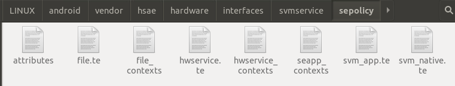

要让这个目录被SELinux识别，需要把目录添加到编译脚本的BOARD_SEPOLICY_DIRS变量：

```makefile
#路径：device/qcom/sepolicy_vndr/SEPolicy.mk
#svmservice
HSAE_VENDOR_SVMSERVICE_DIR := vendor/hsae/hardware/interfaces/svmservice/
BOARD_SEPOLICY_DIRS += $(HSAE_VENDOR_SVMSERVICE_DIR)/sepolicy
```

关于BOARD_SEPOLICY_DIRS这几个变量的意思，参考https://source.android.google.cn/docs/security/features/selinux/customize?hl=zh-cn：

> 在 Android 7.0 及更低版本中，设备制造商可以将政策添加到 `BOARD_SEPOLICY_DIRS`，包括用来在不同设备类型之间增强 AOSP 政策的政策。在 Android 8.0 及更高版本中，将政策添加到 `BOARD_SEPOLICY_DIRS` 会将该政策仅存放在供应商映像中。
>
> 在 Android 8.0 及更高版本中，政策位于 AOSP 中的以下位置：
>
> - **system/sepolicy/public**。其中包括所导出的用于供应商特定政策的政策。所有内容都会纳入 Android 8.0 [兼容性基础架构](https://source.android.google.cn/docs/security/selinux/compatibility?hl=zh-cn)。公共政策会保留在不同版本上，因此您可以在自定义政策的 `/public` 中添加任何内容。正因如此，可存放在 `/public` 中的政策类型的限制性更强。将此目录视为相应平台的已导出政策 API：处理 `/system` 与 `/vendor` 之间的接口的所有内容都位于这里。
> - **system/sepolicy/private**。包括系统映像正常运行所必需（但供应商映像政策应该不知道）的政策。
> - **system/sepolicy/vendor**。包括位于 `/vendor` 但存在于核心平台树（非设备特定目录）中的组件的相关政策。这是构建系统区分设备和全局组件的软件工件；从概念上讲，这是下述设备专用政策的一部分。
> - **device/manufacturer/device-name/sepolicy**。包含设备专用政策，以及对政策进行的设备自定义（在 Android 8.0 及更高版本中，该政策对应于供应商映像组件的相关政策）。
>
> 在 Android 11 及更高版本中，system_ext 和 product 分区还可以包含特定于分区的政策。system_ext 和 product 政策也分为公共政策和私有政策，且供应商可以使用 system_ext 和 product 的公共政策（例如系统政策）。
>
> - `SYSTEM_EXT_PUBLIC_SEPOLICY_DIRS`。包括所导出的用于供应商特定政策的政策。已安装到 system_ext 分区。
> - `SYSTEM_EXT_PRIVATE_SEPOLICY_DIRS`。包括 system_ext 映像正常运行所必需（但供应商映像政策应该不知道）的政策。已安装到 system_ext 分区。
> - `PRODUCT_PUBLIC_SEPOLICY_DIRS`。包括所导出的用于供应商特定政策的政策。已安装到 product 分区。
> - `PRODUCT_PRIVATE_SEPOLICY_DIRS`。包括 product 映像正常运行所必需（但供应商映像政策应该不知道）的政策。已安装到 product 分区。

有时我们直接在`device/架构/sepolicy`或者`system/sepolicy/`目录里添加selinux配置，则不需要添加路径到BOARD_SEPOLICY_DIRS变量。

下面开始关注配置的内容。

file_contexts:

```
/system/bin/hw/vendor\.hsae\.hardware\.interfaces\.svmservice@1\.0-service    u:object_r:vendor_svm_native_exec:s0
/data/misc/AVM(/.*)?                                                          u:object_r:avm_data_file:s0
```

指定`/system/bin/hw/vendor.hsae.hardware.interfaces.svmservice@1.0-service`文件的selinux标签为“u:object_r:vendor_svm_native_exec:s0”。（又称为安全上下文）。基于正则表达式语法，点号“.”在正则表达式里表示匹配任意字符，所以这里需要加反斜杠进行转义。

为svmservice访问的目录也配置标签。`/data/misc/AVM(/.*)? `，点号是匹配任意字符，包括斜杆，星号表示重复0或n次。(/.*)?表示括号里的内容可以出现0次或一次。综合起来就是表示AVM目录或者AVM里面的任意文件。即匹配如下路径：

"/data/misc/AVM"

 "/data/misc/AVM/"

"/data/misc/AVM/abc"

 "/data/misc/AVM/abc/def"

但不匹配如下:

"/data/misc/AV"

"abc/data/misc/AVM"。


注意，`u:object_r:vendor_svm_native_exec:s0`是vendor.hsae.hardware.interfaces.svmservice@1.0-service这个文件的标签，而不是文件运行起来后进程的标签：

```
#文件
sm6150_au:/system/bin/hw # ls -lZ | grep svmservice
-rwxr-xr-x 1 root shell u:object_r:vendor_svm_native_exec:s0      35872 2023-06-10 21:52 vendor.hsae.hardware.interfaces.svmservice@1.0-service

#进程
sm6150_au:/system/bin/hw # ps -eZ | grep svmservice
u:r:vendor_svm_native:s0       system          513      1 12788948 84920 binder_thread_read  0 S vendor.hsae.hardware.interfaces.svmservice@1.0-service
```

为什么进程的标签是`u:r:vendor_svm_native:s0`，后面会讲。


vendor_svm_native、vendor_svm_native_exec、avm_data_file称为type。te文件里不出现进程名、文件名，而是通过type来配置规则：

```
//svm_native.te
#允许vendor_svm_native对avm_data_file的dir(即目录)执行create_dir_perms操作。由于svmservice进程的type是vendor_svm_native，
# /data/misc/AVM/xxx的type是avm_data_file，所以进程起来后，访问/data/misc/AVM/目录，会受到约束
allow vendor_svm_native avm_data_file:dir create_dir_perms;
allow vendor_svm_native avm_data_file:file create_file_perms;
```

create_dir_perms是一个宏，去system/sepolicy/public/global_macros 中看 dir 相关的宏定义：

```
define(`create_dir_perms', `{ create reparent rename rmdir setattr rw_dir_perms }')
```

所以这句话实际是：

```
#允许创建、重命名、删除目录等操作
allow vendor_svm_native avm_data_file:dir { create reparent rename rmdir setattr rw_dir_perms };
```

类似create_dir_perms的还有：

```
define(`x_file_perms', `{ getattr execute execute_no_trans map }')
define(`r_file_perms', `{ getattr open read ioctl lock map watch watch_reads }')
define(`w_file_perms', `{ open append write lock map }')
define(`rx_file_perms', `{ r_file_perms x_file_perms }')
define(`ra_file_perms', `{ r_file_perms append }')
define(`rw_file_perms', `{ r_file_perms w_file_perms }')
define(`rwx_file_perms', `{ rw_file_perms x_file_perms }')
define(`create_file_perms', `{ create rename setattr unlink rw_file_perms }')

define(`r_dir_perms', `{ open getattr read search ioctl lock watch watch_reads }')
define(`w_dir_perms', `{ open search write add_name remove_name lock }')
define(`ra_dir_perms', `{ r_dir_perms add_name write }')
define(`rw_dir_perms', `{ r_dir_perms w_dir_perms }')
define(`create_dir_perms', `{ create reparent rename rmdir setattr rw_dir_perms }')
```

我们看到create_file_perms和create_dir_perms包含了前面的大多数权限，所以通常只用这两个即可。

下面再看svm_native.te的内容

```
binder_call(vendor_svm_client,vendor_svm_server)
binder_call(vendor_svm_server,vendor_svm_client)
hal_attribute_hwservice(vendor_svm, vendor_svm_hwservice)

type vendor_svm_native, domain, coredomain;
type vendor_svm_native_exec, exec_type, file_type, system_file_type;
init_daemon_domain(vendor_svm_native)
hal_server_domain(vendor_svm_native,vendor_svm)

allow vendor_svm_native avm_data_file:dir create_dir_perms;
allow vendor_svm_native avm_data_file:file create_file_perms;

allow vendor_svm_native gpu_device:chr_file { ioctl map read write };
allow vendor_svm_native hal_graphics_composer_default:fd use;
allow vendor_svm_native surfaceflinger:binder call;
allow vendor_svm_native surfaceflinger:fd use;
```

binder_call、hal_attribute_hwservice、init_daemon_domain、hal_server_domain都是宏定义，到system/sepolicy目录下去搜索宏定义：

```
//public/te_macros:384:
#####################################
# binder_call(clientdomain, serverdomain)
# Allow clientdomain to perform binder IPC to serverdomain.
define(`binder_call', `
# Call the server domain and optionally transfer references to it.
allow $1 $2:binder { call transfer };
# Allow the serverdomain to transfer references to the client on the reply.
allow $2 $1:binder transfer;
# Receive and use open files from the server.
allow $1 $2:fd use;
')
```

$1 $2是参数，所以binder_call(vendor_svm_client,vendor_svm_server)扩展成：

```
allow vendor_svm_client vendor_svm_server:binder { call transfer };
allow vendor_svm_server vendor_svm_client:binder transfer;
allow vendor_svm_client vendor_svm_server:fd use;
```


hal_attribute_hwservice定义：

```
###########################################
# hal_attribute_hwservice(attribute, service)
# Ability for domain to get a service to hwservice_manager
# and find it. It also creates a neverallow preventing
# others from adding it.
#
# Used to pair hal_foo_client with hal_foo_hwservice
define(`hal_attribute_hwservice', `
  allow $1_client $2:hwservice_manager find;
  add_hwservice($1_server, $2)

  build_test_only(`
    neverallow { domain -$1_client -$1_server } $2:hwservice_manager find;
  ')
')
```

里面嵌套了宏定义add_hwservice。一层层展开，`hal_attribute_hwservice(vendor_svm, vendor_svm_hwservice)`最后是这样：

```
allow vendor_svm_client vendor_svm_hwservice:hwservice_manager find;
#add_hwservice展开
allow vendor_svm_server vendor_svm_hwservice:hwservice_manager { add find };
allow vendor_svm_server hidl_base_hwservice:hwservice_manager add;
neverallow { domain -vendor_svm_server } vendor_svm_hwservice:hwservice_manager add;
#build_test_only省略
```

init_daemon_domain定义如下：

```
#####################################
# init_daemon_domain(domain)
# Set up a transition from init to the daemon domain
# upon executing its binary.
define(`init_daemon_domain', `
domain_auto_trans(init, $1_exec, $1)
')

#####################################
# domain_auto_trans(olddomain, type, newdomain)
# Automatically transition from olddomain to newdomain
# upon executing a file labeled with type.
#
define(`domain_auto_trans', `
# Allow the necessary permissions.
domain_trans($1,$2,$3)
# Make the transition occur by default.
type_transition $1 $2:process $3;
')
```

把init_daemon_domain(vendor_svm_native)展开：

```
domain_auto_trans(init, vendor_svm_native_exec, vendor_svm_native)

#继续对domain_auto_trans展开
domain_trans(init,vendor_svm_native_exec,vendor_svm_native)
type_transition init vendor_svm_native_exec:process vendor_svm_native;

#继续
allow init vendor_svm_native_exec:file { getattr open read execute map };
allow init vendor_svm_native:process transition;
allow vendor_svm_native vendor_svm_native_exec:file { entrypoint open read execute getattr map };
ifelse(init, `init', `', `allow vendor_svm_native init:process sigchld;')
dontaudit init vendor_svm_native:process noatsecure;
allow init vendor_svm_native:process { siginh rlimitinh }
type_transition init vendor_svm_native_exec:process vendor_svm_native;
```

type_transition这一行的意思是，在主体init执行“vendor_svm_native_exec”这个文件时，将进程的类型变成vendor_svm_native。

就是为什么svmservice文件type是vendor_svm_native_exec，起来后是进程的type是vendor_svm_native。

这里的ifelse，SELinux应该没有提供if-else语法，所以这里的ifelse估计也是个宏定义，但是没找到在哪。


还有一个hal_server_domain：

```
#####################################
# hal_server_domain(domain, hal_type)
# Allow a base set of permissions required for a domain to offer a
# HAL implementation of the specified type over HwBinder.
#
# For example, default implementation of Foo HAL:
#   type hal_foo_default, domain;
#   hal_server_domain(hal_foo_default, hal_foo)
#
define(`hal_server_domain', `
typeattribute $1 halserverdomain;
typeattribute $1 $2_server;
typeattribute $1 $2;
')
```

hal_server_domain(vendor_svm_native,vendor_svm)展开是：

```
typeattribute vendor_svm_native halserverdomain;
typeattribute vendor_svm_native vendor_svm_server;
typeattribute vendor_svm_native vendor_svm;
```

还有两行是声明type：

```
type vendor_svm_native, domain, coredomain;
type vendor_svm_native_exec, exec_type, file_type, system_file_type;
```

第一个type是vendor_svm_native，属于（或者说，类似于继承）domain和coredomain。domain和coredomain在`system\sepolicy\public\attributes`中定义：

```
# All types used for processes.
attribute domain;

# All core domains (as opposed to vendor/device-specific domains)
attribute coredomain;
```

第二个type vendor_svm_native_exec,声明它属于exec_type, file_type, system_file_type这三个type

```
# All types used for domain entry points.
attribute exec_type;

# All types used for files that can exist on a labeled fs.
# Do not use for pseudo file types.
# On change, update CHECK_FC_ASSERT_ATTRS
# definition in tools/checkfc.c.
attribute file_type;

# All types in /system
attribute system_file_type;
```

当vendor_svm_native属于domain，那么domain上的约束就自动作用于vendor_svm_native。打开domain.te:

```
allow domain init:process sigchld;

# Intra-domain accesses.
allow domain self:process {
    fork
    sigchld
    sigkill
    sigstop
    signull
    signal
    getsched
    setsched
    getsession
    getpgid
    setpgid
    getcap
    setcap
    getattr
    setrlimit
};
allow domain self:fd use;
allow domain proc:dir r_dir_perms;
allow domain proc_net_type:dir search;
r_dir_file(domain, self)
allow domain self:{ fifo_file file } rw_file_perms;
allow domain self:unix_dgram_socket { create_socket_perms sendto };
allow domain self:unix_stream_socket { create_stream_socket_perms connectto };
....省略
```

其它都是同理。

然后看hwservice_contexts内容：

```
vendor.hsae.hardware.interfaces.svmservice::ISvmService                      u:object_r:vendor_svm_hwservice:s0
```

ISvmService是我们要暴露的hal接口。所以除了文件、进程，我们知道hal接口也可以配安全标签。类似还有service_contexts，为aidl服务、接口指定label。

透过这个案例，我们知道，配置SEAndroid需要：

* 在file_contexts里定义文件的安全上下文
* attribute在attributes文件里定义。attribute和type差不多，使用上似乎什么区别。以下关键词expandattribute、attribute、type、typeattribute后文介绍各自意思。
* 创建te文件，里面声明type，根据你的服务类型，这些type要属于特定的attribute。比如进程的type都是属于domain，文件一般都是xxx_type(fs_type、file_type)
* te文件里写allow语句。另外还有调用宏。这些宏一般是系统预定义好的。但是宏展开后，最终还是那些allow语句、type定义等。所以可以先粗暴的认为te文件就是写allow语句。


## SEAndroid策略简介与编写指引

* 基于用户、组群和其它权限（rwx）的标准访问策略叫做DAC；Security Enhanced Linux(SELinux)称为强制访问控制(MAC)。DAC和MAC是Linux里的两套安全机制，两者是正交的。DAC比较简单，不够精细。系统先判断DAC,如果DAC拒绝了权限，那么不会判断MAC。
* SELinux基于白名单。也就是说，默认全是不允许，我们配置允许什么，而不是“不允许什么”。虽然te文件里你会看到很多“neverallow”，但是“neverallow”只是系统编译阶段，检查你有没有违反“neverallow”的规则。也就是你的allow不能喝neverallow冲突。编译后的产物是不包含neverallow的。安卓系统会预先写了很多neverallow，限制你的行为。

### SELinux标签

Android系统中的任何资源（包括Socket、文件、进程等）都有自己对应的标签。标签（label）是SEAndroid机制的基础，它用于为策略和行为提供匹配条件。

标签的基本格式为：


* user      代表用户，目前均为u

源码目录：system/sepolicy/private/users

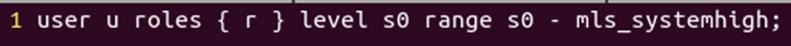

* role

​     代表角色，对于主体为r，对于客体为object_r

源码目录：/system/sepolicy/public/roles


* type

​     代表类型，对于主体一般为domain，对于客体一般为type（fs_type，file_type…）

源码目录：system/sepolicy/public/attributes

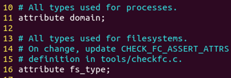

* mls_level

​     代表安全级别，格式是Sn,  一般为s0， n > 0代表高的级别。为了满足军用和教育行业而设计的Multi-LevelSecurity(mls)机制，将系统的进程与文件进行了分级，不同级别的资源需要对应级别的进程才能访问。

安卓里我们见到的全是s0,所以这个不要管，直接写s0即可。

源码目录：system/sepolicy/private/users

 system/sepolicy/private/mls_macros

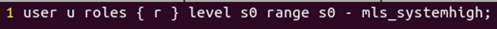

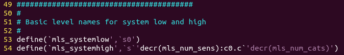

### 安全策略

安全策略文件通常以.te为后缀名，其所在目录一般为/system/sepolicy

​     策略的基本格式为：

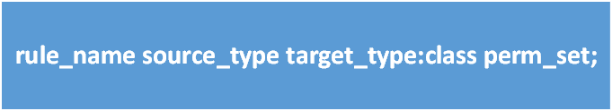

* rule_name

​     控制类型，有如下几种定义：

   allow：赋予权限

   auditallow：记录并赋予权限

   dontaudit：对权限检查失败的操作不记录

   neverallow：用来检查安全策略文件中是否有违反该项规则的allow语句

我们普通开发只用第一个allow。

* source_type

​     指域domain，为主体标签的type，如shell、su。前面的案例里的vendor_svm_native。

* target_type

​     指资源端的类型type，为客体标签的type，如cgroup、device等 。前面案例里的avm_data_file。

* class

​     指该类型资源端下的具体资源，如dir、file，详见源码目录/system/sepolicy/private/security_classes

* perm_set

​     指对资源的操作，如create、read、write，详见源码目录/system/sepolicy/private/access_vectors

策略语句示例：

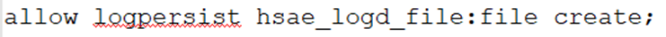

说明：

（1）如果有多个source_type，target_type，class或perm_set，可以用“{}”括起来

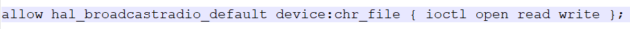

（2）“~”号，表示除了“~”以外

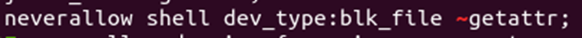

（3）“-”号，表示去除某项内容

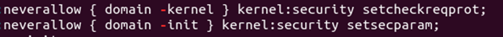

（4）“*”号，表示所有内容

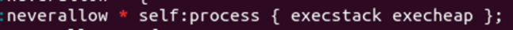

### 策略编写

​     目前主要根据logcat截取的avc日志来编写安全策略，avc日志示例如下：

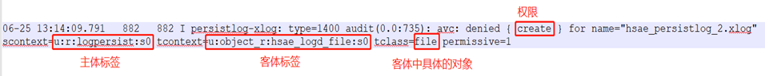

​     其转化规则如下：


​     转化后的安全策略如下：


​     也可使用工具audit2allow来进行自动转化，请自行百度学习。

### **扩展**

* 宏命令：

关键字为macros，查找指令为find . -name “*macros*”

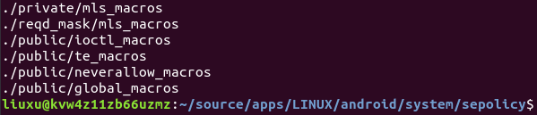

* te_macros：

  策略语句的宏定义

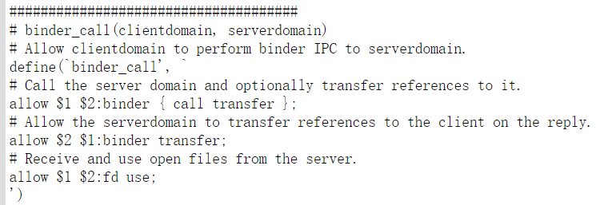

使用示例：

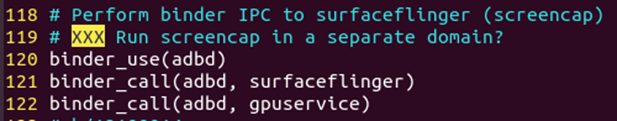

* neverallow_macros：

  neverallow的宏定义

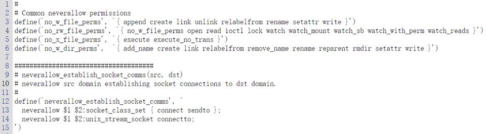

使用示例：

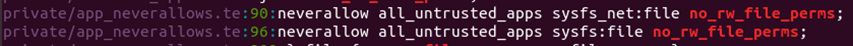

* global_macros：

  全局宏定义

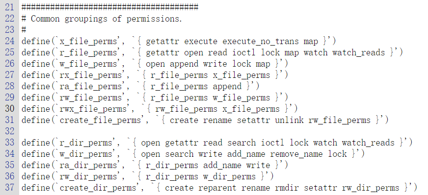

使用示例：

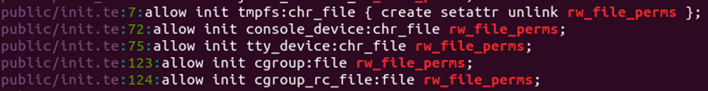

* contexts文件：

关键字为contexts，查找指令为find . -name “*contexts*”

其主要分为4类：file、service、property、app.

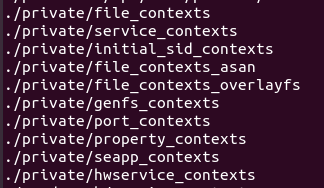

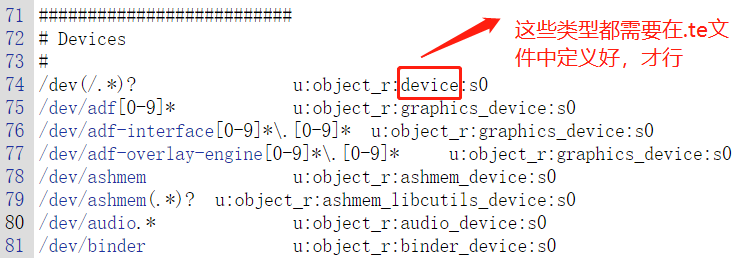

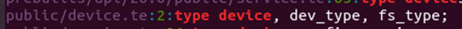

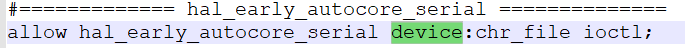

* genfs_contexts:

  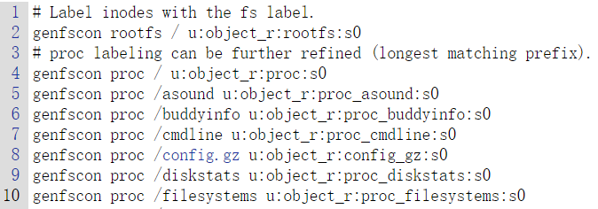

  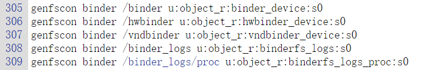

  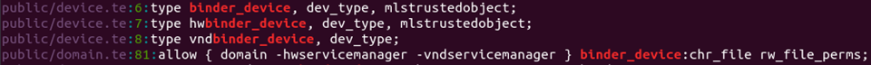

* property_contexts

  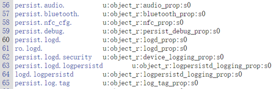

  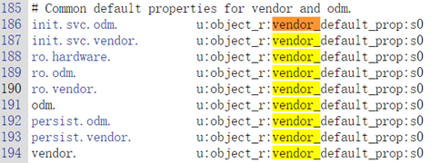

  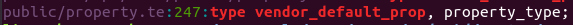

  使用示例:

  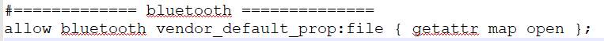

或

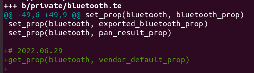

注意:

宏语句不要加“;”


### SELinux的两种执行模式

**宽容模式** - 权限拒绝事件会被记录下来，但不会被强制执行。（权限不够时，仅警告）

**强制模式** - 权限拒绝事件会被记录下来并强制执行。（权限不够时，拒绝执行）

### SELinux在安卓平台上的演变

**低于安卓4.3** - 默认不支持SELinux

**安卓4.3** - 宽容模式

**安卓4.4** - 部分强制模式（多数设备依然是宽容模式）

**安卓5.1** - 默认强制模式

**高于安卓8.0** - 强制模式且Sepolicy规则被分成多个部分

### 规则位置

* 核心规则

**路径**：system/sepolicy

核心规则会被所有设备使用。

* 设备规则

**路径**：`device/<vendor>/<board>/sepolicy`

设备规则会被对应的产品使用。

* 添加规则目录

在Android.mk中设置***BOARD_SEPOLICY_DIRS***可以添加Sepolicy的搜寻目录，如：

```cobol
BOARD_SEPOLICY_DIRS += device/samsung/tuna/sepolicy
```

* 关于多部分规则

  从安卓8.0开始，sepolicy规则被分成了多个部分。

  笔者个人认为：是进行了可移植性改造，及多版本兼容，因此将规则分散到了多个目录中以增强其可移植性，及兼容性。

  **public** - PLAT_PUBLIC_POLICY，平台公开规则，会被导出给其他非平台相关的规则。

  **private** - PLAT_PRIVATE_POLICY，平台私有规则，不会向vendor部分暴露。

  **vendor** - PLAT_VENDOR_POLICY，厂商规则，可引用public的规则，不能引用[private](https://so.csdn.net/so/search?q=private&spm=1001.2101.3001.7020)的规则。

  **mapping** - 规则映射表，将旧版本的public规则映射到当前规则中，来保证旧版本可用，如xxx.cil文件。

### Sepolicy编译过程

1) 将所有规则转换成CIL

\- private + public platform policy 转换到CIL

\- mapping文件转储到CIL

\- non-platform public policy 转换到CIL

\- non-platform public policy + private policy 转换到CIL

2) 属性化规则

3) 合并规则文件

\- 合并 mapping，platform 及 non-platform 规则

\- 合并输出二进制规则文件

编译目标:

**selinux_policy**

## 几种定义

* 类型

进程、资源，都被抽象成类型了。

```crystal
type 类型名 [alias 别名集] [,属性集];
```

一个简单的实例：

```haskell
type rootfs, fs_type;
```

此例中定义了一个名为rootfs的类型，这个类型属于fs_type属性。

可以将多个类型指定到同一属性组，这样配置权限时就可以针对一组属性来设置权限，而不必精确的去针对每个类型设置权限。

除了在定义类型的时候关联属性，也可以用typeattribute来设置类型的属性。等于把这type的两个作用分开，type仅定义，typeattribute进行关联

```
#定义httpd_user_content_t，并关联两个属性
type httpd_user_content_t, file_type, httpdcontent;  

分成两条语句进行表述：
#定义httpd_user_content_t
type httpd_user_content_t;
#关联属性   
typeattribute httpd_user_content_t file_type, httpdcontent;
```


* 属性

  ```undefined
  attribute 属性名;
  ```

  实例：

  ```php
  attribute fs_type;
  ```

  此例定义了一个名为**fs_type**的属性。

* 权限类

是由class所定义的权限类，如**access_vectors**文件中定义的：

```csharp
class service_manager { add find list }
```

service_manager这个权限类里面有`add find list`三个权限。然后如果有以下语句：

```
allow platform_app recovery_service:service_manager find;
```

允许**platform_app**访问**recovery_service**的**service_manager:find**权限。更直白的意思是：*让platform_app可以找到recovery_service*。

比如file也是一个权限类。里面有open、read、write、ioctl、getattr等权限。

* type_tansition

  type_transition是类型转换语句，允许主体或者客体在条件符合的情况下，将安全上下文中的type转移成为指定的类型。一般适用于两种场景：
  1.进程创建新的客体时，新客体的类型来自type_transition的规定
  2.进程执行execve系统调用后，进程的新类型来自type_transition的定义

  type_transition的语法：

  ```
  type_transition source_type target_type : class default_type;
  ```

###  帮助理解

type 是起名，比如小明，小红。

attribute 是属性组，比如：人类，男性，女性，有驾照。

小明是：人类、男性、有驾照

小红是：人类、女性

权限类是特定场景的权限，比如：洗浴，驾驶

权限集是针对某场景的各种可能的限制，如：洗浴这个场景，权限有：前往大门，交费，进入男浴室，进入女浴室

然后我们可以这样定义一个权限规则来定义小明与小红的权限：

```coffeescript
# 下面定义了此系统中的属性
attribute 人类;
attribute 男性;
attribute 女性;
attribute 有驾照;
attribute 洗浴中心;
attribute 机动车;

# 下面定义了此系统中的type（权限对象）
type 小红, 女性, 人类;
type 小明, 有驾照, 男性, 人类;
type 大浪淘沙澡堂, 洗浴中心;
type 本田缤智, 机动车;

# 下面定义了此系统中的权限类
class 洗浴 { 前往大门, 交费, 进入男浴室, 进入女浴室 }
class 驾乘 { 开车门, 驾驶, 乘坐 }


############################################
# 下面定义了小明和小红在此系统中的权限
############################################
# 小红不能进男浴室
allow 小红 大浪淘沙澡堂:洗浴 {前往大门, 交费, 进入女浴室};
# 小红没有驾照不能开车
allow 小红 本田缤智:驾乘 {开车门, 乘坐};
# 小明不能进女浴室
allow 小明 大浪淘沙澡堂:洗浴 {前往大门, 交费, 进入男浴室};
# 小明有驾照可以开车
allow 小明 本田缤智:驾乘 {开车门, 驾驶, 乘坐};
# 禁止所有没有驾照的人驾驶机动车
neverallow {人类 -有驾照} {机动车}:驾乘 {驾驶};
```

 

# 参考材料：

[1] system\sepolicy\README

[2] system\sepolicy\Android.mk

深入理解SELinux SEAndroid（第一部分)https://blog.csdn.net/innost/article/details/19299937

深入理解SELinux SEAndroid之二https://blog.csdn.net/innost/article/details/19641487

深入理解SELinux SEAndroid（最后部分）https://blog.csdn.net/innost/article/details/19767621

SELinux：编译加载源码和模块https://blog.csdn.net/keheinash/article/details/68945914

SELinux策略实例--type_transition（一）https://blog.csdn.net/keheinash/article/details/70169705