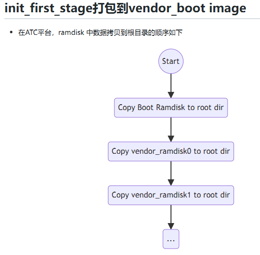
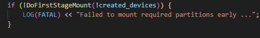

在FirstStage阶段，还没有挂载system分区，因此此时的init程序来自内核ramdisk。第一阶段结束后，后面运行的才是来自super镜像system分区的init。



早期存在修改FirstStage代码，编译烧录不生效问题，原因就在于init没有打包进vendor_boot image。后来ATC提供了补丁，修复了这个问题。

## FirstStageMain流程

文件：`system/core/init/first_stage_init.cpp`， `int FirstStageMain(int argc, char** argv) `函数。

1. 内存中mount tmpfs、proc、sysfs、selinuxfs等
2. 创建设备节点：/dev/kmsg、/dev/random、/dev/ptmx等
3. DoFirstStageMount，和System、vendor挂载相关的是在这里面。



4. SetInitAvbVersionInRecovery()

### super、system和vendor

DoFirstStageMount内部（system/core/init/first_stage_mount.cpp）：

```cpp
auto fsm = FirstStageMount::Create();
if (!fsm.ok()) {
    LOG(ERROR) << "Failed to create FirstStageMount " << fsm.error();
    return false;
}
if (create_devices) {
    if (!(*fsm)->DoCreateDevices()) return false;
}
return (*fsm)->DoFirstStageMount();
```

first_stage_mount.cpp里面有三个类：FirstStageMount、FirstStageMountVBootV1、FirstStageMountVBootV2，后两个是FirstStageMount的子类。

1. `FirstStageMount::Create()`里面读取fstab，然后构建返回FirstStageMountVBootV2对象。

   ```c++
       auto fstab = ReadFirstStageFstab();
       if (!fstab.ok()) {
           return fstab.error();
       }
   //fstab是vector类型，返回5组：
   fstab_: mount_point=/metadata,      logical_partition_name=,               fs_type=ext4
   fstab_: mount_point=/teedata,       logical_partition_name=,               fs_type=ext4
   fstab_: mount_point=/vendor_dlkm,   logical_partition_name=vendor_dlkm_a,  fs_type=ext4
   fstab_: mount_point=/vendor,        logical_partition_name=vendor_a,       fs_type=ext4
   fstab_: mount_point=/system,        logical_partition_name=system_a,       fs_type=ext4
   
       if (IsDtVbmetaCompatible(*fstab)) { //here return FirstStageMountVBootV2
           return std::make_unique<FirstStageMountVBootV2>(std::move(*fstab));
       } else {
           return std::make_unique<FirstStageMountVBootV1>(std::move(*fstab));
       }
   ```

   ReadFirstStageFstab内部会先读取全部fstab，然后过滤，只返回需要再first stage阶段mount的分区。

2. DoCreateDevices()

   * 先mount /metadata

   * 把DSU AVB keys从ramdisk拷贝到 /metadata下面。动态系统更新 (DSU) 是 Android 10 中引入的一项系统功能。具体介绍见：https://developer.android.google.cn/topic/dsu?authuser=19&hl=he

   * CreateLogicalPartitions。从/dev/block/super开头读取的metadata信息。metadata信息里面包含partitions数组，遍历partitions属性，对每个partition执行CreateLogicalPartition函数，从而创建了vendor、system等分区。

     在24MM项目上，假设现在是从a区启动。这一步实际会挂载：vendor_a、system_a、vendor_dlkm_a。

     实际上这个过程很复杂，涉及动态分区、avb校验，虚拟 A/B 分区等。足以作为一个独立的专题。需要先了解一些背景知识。可以参考https://source.android.google.cn/docs/core/ota/virtual_ab?hl=ca。

     我们先跳过内部细节，只知道这一步挂载了system vendor即可。

3. DoFirstStageMount  

   * 这步先执行TrySwitchSystemAsRoot。这里有一些DSU和AVB的逻辑，我们跳过。然后执行SwitchRoot("/system")，重新挂载/system对应的分区修改挂载点。即/dev/block/dm-1原来的挂载点是/system, 执行后改成/。让system分区成为VFS的root。那么原来的虚拟文件系统就被替换了。

   * 接下来处理文件系统是overlay的分区。

     简要说一下overlayfs是什么。过去，执行adb remount，只需把system等ro分区重新挂载为rw即可。而使用动态分区后，机制决定了里面的逻辑分区（system vendor等）是无法重挂载为读写的。因此安卓采用了这个方案，大意是在上面叠了一个文件系统，remount后，对system里的修改，实际上写入到upper ，不会修改原来system分区里的数据。
     
     但是这里刚开机，system和vendor肯定不会是overlay。

DoFirstStageMount结束后，SetInitAvbVersionInRecovery

1. 重新读取fstab，因为SwitchSystemAsRoot改变了文件系统，所以需要重新读取。
1. 和ABV校验相关的逻辑。


### ReadFirstStageFstab

简要分析一下这个函数。

```c++
static Result<Fstab> ReadFirstStageFstab() {
    Fstab fstab;
    // 丰田24是上，ReadFstabFromDt返回fail，于是走ReadDefaultFstab
    if (!ReadFstabFromDt(&fstab)) {
        if (ReadDefaultFstab(&fstab)) {
            fstab.erase(std::remove_if(fstab.begin(), fstab.end(),
                                       [](const auto& entry) {
                                           return !entry.fs_mgr_flags.first_stage_mount;
                                       }),
                        fstab.end());
        } else {
            return Error() << "failed to read default fstab for first stage mount";
        }
    }
    return fstab;
}
```

这时system、vendor已经挂载，ReadDefaultFstab会从几个指定的路径去找fstab文件。丰田24上，找到的default_fstab_path是/vendor/etc/fstab.ac8x。

打开文件，内容如下：

```
/dev/block/platform/soc/bootdevice/by-name/cache /cache ext4 noatime,nosuid,node
v,noauto_da_alloc,discard wait,check,formattable


/dev/block/platform/soc/bootdevice/by-name/metadata /metadata ext4 noatime,nosui
d,nodev,noauto_da_alloc,errors=remount-ro,noexec wait,check,formattable,first_st
age_mount


/dev/block/platform/soc/bootdevice/by-name/userdata /data ext4 noatime,nosuid,no
dev,noauto_da_alloc,errors=remount-ro,inlinecrypt wait,check,quota,reservedsize=
128M,formattable,resize,fileencryption=aes-256-xts,keydirectory=/metadata/vold/m
etadata_encryption,latemount

.....省略若干项
```

然后读和解析这个文件，每一项对应一个FstabEntry对象，返回一个包含所有FstabEntry的vector，(`using Fstab = std::vector<FstabEntry>`)。

Fstab总计包含以下：

```
fstab_: mount_point=/cache, logical_partition_name=, fs_type=ext4, metadata_key_dir=, metadata_encryption=, sysfs_path=, vbmeta_partition=, avb_keys=, lowerdir=, is_encryptable()=0
fstab_: mount_point=/metadata, logical_partition_name=, fs_type=ext4, metadata_key_dir=, metadata_encryption=, sysfs_path=, vbmeta_partition=, avb_keys=, lowerdir=, is_encryptable()=0
fstab_: mount_point=/data, logical_partition_name=, fs_type=ext4, metadata_key_dir=/metadata/vold/metadata_encryption, metadata_encryption=, sysfs_path=, vbmeta_partition=, avb_keys=, lowerdir=, is_encryptable()=0
fstab_: mount_point=/teedata, logical_partition_name=, fs_type=ext4, metadata_key_dir=, metadata_encryption=, sysfs_path=, vbmeta_partition=, avb_keys=, lowerdir=, is_encryptable()=0
fstab_: mount_point=/extdata, logical_partition_name=, fs_type=ext4, metadata_key_dir=, metadata_encryption=, sysfs_path=, vbmeta_partition=, avb_keys=, lowerdir=, is_encryptable()=0
fstab_: mount_point=/vdata, logical_partition_name=, fs_type=ext4, metadata_key_dir=, metadata_encryption=, sysfs_path=, vbmeta_partition=, avb_keys=, lowerdir=, is_encryptable()=0
fstab_: mount_point=/resdata, logical_partition_name=, fs_type=ext4, metadata_key_dir=, metadata_encryption=, sysfs_path=, vbmeta_partition=, avb_keys=, lowerdir=, is_encryptable()=0
fstab_: mount_point=/update, logical_partition_name=, fs_type=ext4, metadata_key_dir=, metadata_encryption=, sysfs_path=, vbmeta_partition=, avb_keys=, lowerdir=, is_encryptable()=0
fstab_: mount_point=auto, logical_partition_name=, fs_type=auto, metadata_key_dir=, metadata_encryption=, sysfs_path=, vbmeta_partition=, avb_keys=, lowerdir=, is_encryptable()=1
fstab_: mount_point=auto, logical_partition_name=, fs_type=auto, metadata_key_dir=, metadata_encryption=, sysfs_path=, vbmeta_partition=, avb_keys=, lowerdir=, is_encryptable()=1
fstab_: mount_point=auto, logical_partition_name=, fs_type=auto, metadata_key_dir=, metadata_encryption=, sysfs_path=, vbmeta_partition=, avb_keys=, lowerdir=, is_encryptable()=1
fstab_: mount_point=auto, logical_partition_name=, fs_type=auto, metadata_key_dir=, metadata_encryption=, sysfs_path=, vbmeta_partition=, avb_keys=, lowerdir=, is_encryptable()=1
fstab_: mount_point=auto, logical_partition_name=, fs_type=auto, metadata_key_dir=, metadata_encryption=, sysfs_path=, vbmeta_partition=, avb_keys=, lowerdir=, is_encryptable()=1
fstab_: mount_point=auto, logical_partition_name=, fs_type=auto, metadata_key_dir=, metadata_encryption=, sysfs_path=, vbmeta_partition=, avb_keys=, lowerdir=, is_encryptable()=1
fstab_: mount_point=/vendor_dlkm, logical_partition_name=vendor_dlkm_a, fs_type=ext4, metadata_key_dir=, metadata_encryption=, sysfs_path=, vbmeta_partition=, avb_keys=, lowerdir=, is_encryptable()=0
fstab_: mount_point=/vendor, logical_partition_name=vendor_a, fs_type=ext4, metadata_key_dir=, metadata_encryption=, sysfs_path=, vbmeta_partition=, avb_keys=, lowerdir=, is_encryptable()=0
fstab_: mount_point=/system, logical_partition_name=system_a, fs_type=ext4, metadata_key_dir=, metadata_encryption=, sysfs_path=, vbmeta_partition=, avb_keys=, lowerdir=, is_encryptable()=0
fstab_: mount_point=/misc, logical_partition_name=, fs_type=emmc, metadata_key_dir=, metadata_encryption=, sysfs_path=, vbmeta_partition=, avb_keys=, lowerdir=, is_encryptable()=0
fstab_: mount_point=/recovery, logical_partition_name=, fs_type=emmc, metadata_key_dir=, metadata_encryption=, sysfs_path=, vbmeta_partition=, avb_keys=, lowerdir=, is_encryptable()=0
fstab_: mount_point=/logo, logical_partition_name=, fs_type=emmc, metadata_key_dir=, metadata_encryption=, sysfs_path=, vbmeta_partition=, avb_keys=, lowerdir=, is_encryptable()=0
fstab_: mount_point=/expdb, logical_partition_name=, fs_type=emmc, metadata_key_dir=, metadata_encryption=, sysfs_path=, vbmeta_partition=, avb_keys=, lowerdir=, is_encryptable()=0
fstab_: mount_point=/super, logical_partition_name=, fs_type=emmc, metadata_key_dir=, metadata_encryption=, sysfs_path=, vbmeta_partition=, avb_keys=, lowerdir=, is_encryptable()=0
fstab_: mount_point=/vbmeta, logical_partition_name=, fs_type=emmc, metadata_key_dir=, metadata_encryption=, sysfs_path=, vbmeta_partition=, avb_keys=, lowerdir=, is_encryptable()=0
```

执行过:

```c++
//把没有first_stage_mount标志的移除
fstab.erase(std::remove_if(fstab.begin(), fstab.end(),
                               [](const auto& entry) {
                                   return !entry.fs_mgr_flags.first_stage_mount;
                               }),
                fstab.end());
```

后，就只有前面贴的5个了。那么剩下的，大部分会在second stage，少部分在其它地方。

注意到只有/data分区的metadata_key_dir字段是有值的。data分区是加密的，这样即使手机遗失，用户私人数据也不会泄漏。但是这导致data分区的挂载更加复杂。后面分析这一点。

## SecondStageMain流程

SecondStage阶段，挂载分区相关的逻辑是通过init.rc来触发的。

```
// rc file: /vendor/etc/init/hw/init.ac8x.rc
on fs
    write /proc/bootprof "INIT:Mount_START"
    # Sync with device.mk config
    mount_all /vendor/etc/fstab.ac8x --early
    mount_all /vendor/etc/fstab.ac8x --late
    write /proc/bootprof "INIT:Mount_END"
    write /proc/mmc_debug "emmc_enable_all_wp"
    
// 触发fs是在 /system/etc/init/hw/init.rc
# Mount filesystems and start core system services.
on late-init                      
    trigger early-fs
                                                                           
    # Mount fstab in init.{$device}.rc by mount_all command. Optional parameter 
    # '--early' can be specified to skip entries with 'latemount'.             
    # /system and /vendor must be mounted by the end of the fs stage,
    # while /data is optional.
    trigger fs                                         
    trigger post-fs  
```

FirstStage阶段读fstab也正是读的/vendor/etc/fstab.ac8x文件。

而late-init是由代码触发:

```c++
// init.cpp, SecondStageMain函数体内,执行到某个阶段，就触发late-init
    am.QueueEventTrigger("early-init");
。。。
    // Trigger all the boot actions to get us started.
    am.QueueEventTrigger("init");

    std::string bootmode = GetProperty("ro.bootmode", "");
    if (bootmode == "charger") {
        am.QueueEventTrigger("charger");
    } else {
        am.QueueEventTrigger("late-init"); //here
    }
```

注意到 if (bootmode == "charger"），还有一种情况触发late-init,是在bootmode charger里。我们暂且不要关心:

```
# Healthd can trigger a full boot from charger mode by signaling this           
# property when the power button is held.                                      
on property:sys.boot_from_charger_mode=1
    class_stop charger
    trigger late-init 
```

通过logcat日志观察mount过程。你可以过滤init进程。或者过滤”__mount“。

打开/vendor/etc/fstab.ac8x 文件，注意到有些项后面跟了first_stage_mount，这是是在第一阶段挂载，前文以分析过。

```
//后面没跟latemount，也没跟first_stage_mount
mount_all /vendor/etc/fstab.ac8x --early
//后面跟了latemount
mount_all /vendor/etc/fstab.ac8x --late
```

至于mount_all是rc语法里的指令，具体实现我们不分析。

另外通过日志看到data分区(加密的)是挂载是跳过的，真正挂载是在vold里：

```
0     0 E [    2.695627][    T1][E] init: [libfs_mgr]mount_with_alternatives(): skipping mount due to invalid magic, mountpoint=/data blk_dev=/dev/block/userdata rec[2].fs_type=ext4
258   258 I vold    : [libfs_mgr]__mount(source=/dev/block/dm-4,target=/data,type=ext4)=0: Success
```


## 后续

关于AVB校验，参阅https://developer.aliyun.com/article/1411254。七篇
