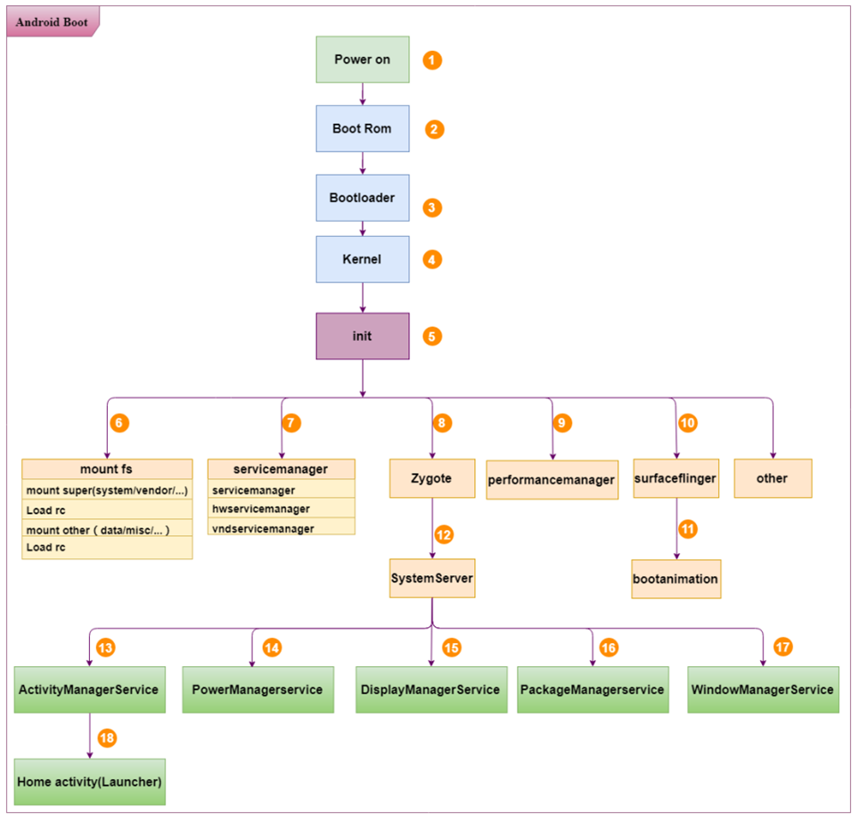
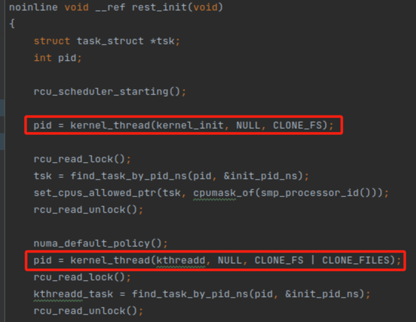
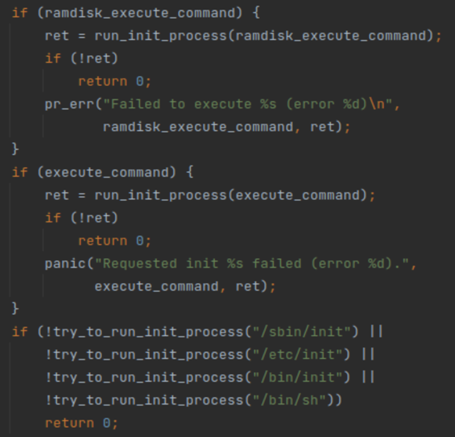
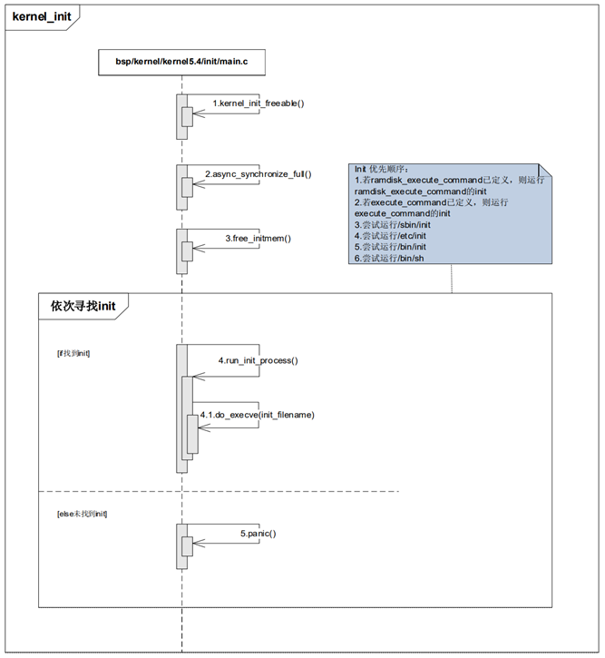
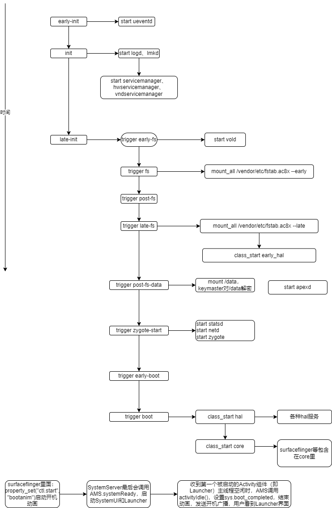

## 流程

Android 启动总体框架图:



流程大致如下：

1.Boot Rom：当长按电源键开机的时候，引导芯片从固化在 ROM 的预设代码开始执行，加载Bootloader到 RAM 中运行。 

2.Bootloader：即引导程序，主要作用是初始化 flash、将内核 kernel 拷贝到内存中、启动内核。

3.启动 Kernel：主要是启动内核线程 kernel_init。kernel_init 函数完成设备驱动程序的初始化，并调用 init_post 启动用户空间的 init 进程。

4.启动 init 进程：在 Linux 系统中，所有的进程都是由 init 进程直接或间接 fork 出来的。init 进程负责创建系统中最关键的几个子进程，尤其是 Zygote 进程，另外它还提供了 property service（类似于 Windows 系统的注册表服务）。

5.启动 Zygote 进程：当 init 进程创建之后，会 fork 出一个 Zygote 进程，这个进程是所有 Java 进程的父进程。

6.启动 SystemServer 进程：SystemServer 进程由 Zygote 进程 fork，这个进程在整个 Android 系统中非常重要，系统里面的服务都是在这个进程里面开启的，例如 AMS、WindowsManager 等。 

7.运行 Home Activity：最后 AMS 会通过 Home intent 将 Launcher 启动起来。


**Boot Rom**是什么？

​    BootROM是嵌入式系统中的一段代码，它是芯片内置的只读存储器（ROM）中的一段程序，一般固话在芯片内部，它是芯片上电后第一时间运行的程序，初始化部分硬件，包括CPU、DDR、EMMC、NAND Flash、SPI Flash等硬件设备的初始化。

**bootloader**是什么？

​    bootloader 就是在操作系统 kernel 运行之前运行的一段小程序。通过这段小程序，我们可以建立内存空间的映射图，从而将系统的软硬件环境带到一个合适的状态，以便为最终调用操作系统内核准备好正确的环境，最后会调用 kernel 的起始位置开始执行。

​    Android系统基于Linux，所以bootloader部分也是与传统的嵌入式设备上运行的Linux没有什么区别。

​    bootloader是基于特定硬件平台来实现的。因此，几乎不可能为所有的嵌入式系统建立一个通用的bootloader。

**uboot**是什么？

​    uboot 即 universal bootloader，是一种可用于多种CPU的bootloader程序（ARM、MIPS、X86等），可以说是bootloader的一种具体实现。

**Boot Rom**和**Bootloader**的关系

​    Boot Rom 是芯片内置的引导程序，负责初始化芯片并启动引导加载程序，而bootloader是启动流程的下一步，负责从存储设备中读取内核和文件系统等映像文件，并将它们加载到内存中。

## kernel启动简介

uboot运行到最后会执行kernel的start_kernel函数，kernel初始化，加载驱动程序，内核启动完成后调用到rest_init函数，创建2个线程，分别是kernel_init与kthreadd线程。



kernel_init线程最后会在用户空间启动init进程，开机启动进入下一个阶段，后面会详细介绍。

kthreadd线程的作用主要是创建、清理、调度其他内核线程。

## init的启动

kernel_init 启动后，完成一些 init 的初始化操作。启动后去系统根目录下依次找 ramdisk_execute_command 和 execute_command 设置的应用程序，如果这两个目录都找不到，就依次去根目录下找/sbin/init、/etc/init、/bin/init、/bin/sh，只要这些应用程序有一个启动了，其他就不需启动了。

ramdisk_execute_command 和 execute_command 是uboot启动kernel时，配置的环境参数，如：setenv bootargs rdinit=/busybox/rdinit cpmem=16M





## 开机流程

init程序做什么放到后面专门的分析篇幅里。这篇关注开机从上电到Launcher主界面出来的整体流程，宜粗不宜细，因为每一个环节拿出来分析细节，都可以作为单独的一篇，容易迷失。

init的第二阶段，里面一个重要的模块是读取和解析init.rc文件，触发action、启动service。梳理这块，作为切入点，整理出启动的各个阶段、以及每个阶段启动的程序。



简单分下类：

* init阶段： early-init、init、late-init
* fs阶段：early-fs、fs、post-fs、late-fs、post-fs-data
* boot阶段：early-boot、boot

其中，`early-init`、`init`、`late-init`是init代码里直接触发的：

```cpp
//init.cpp SecondStageMain函数
am.QueueEventTrigger("early-init");
// ...
am.QueueEventTrigger("init");
// ...
if (bootmode == "charger") {
    am.QueueEventTrigger("charger"); //充电
} else {
    am.QueueEventTrigger("late-init"); //here
}
```

其它action则是通过init.rc，trigger 指令触发。

每个阶段做什么，内容太多，不宜放这里。后面分析具体模块时，会指出该模块在哪个阶段、什么位置启动的。这里对一些重要的大致说一下。

### **`early-init`** **阶段**

系统启动的最初阶段

* 早期的初始化工作
* 设置基本系统属性
* 文件系统早期的配置，如ramfs里创建目录、权限设置、sysfs或procfs、dev里写入配置

### init阶段

系统初始化阶段，启动一些核心服务、执行配置脚本

* 启动logd、lowmemorykiller、servicemanager等，这些服务最基本，所以要放在早期。
* 一些cgroups的设置放在这里，如：`write /dev/cpuset/foreground/cpus 0-7`

### late-init阶段

系统初始化完成，接下来late-init会依次触发文件系统处理的相关action（early-fs、fs、post-fs、post-fs-data），zygote、boot相关action。

### early-fs

metadata在此之前已经挂载，这里启动vold，处理userdata

### fs

文件系统挂载阶段

init.{$device}.rc里定义fs阶段通过mount_all指令，挂载fstab文件里的分区。其实fstab里的有些在第一阶段挂载，还有些由vold处理。后面具体分析。

### late-fs

挂载fstab，有late参数的。

这里启动early_hal。此时分区还没有解密。也就是说，如果你的hal需要访问`/data`，那么不能作为early_hal。

### post-fs-data

data分区涉及用户隐私数据，因此是加密的。在这里解密。如何解密放到存储篇讨论。

这之后data分区就能访问了。

如果你需要在data目录里面创建目录，可以添加在它的后面。（因为selinux的原因，进程通常没有权限直接在data目录创建目录，可以加在这里）

### zygote-start

没什么好说的，都懂！

### early-boot 阶段

以ATC8025为例，许多USB的设置参数放在这里。

### boot阶段

系统启动的最后阶段，此时已经万事俱备只欠东风。

* 许多sysfs文件在这里执行chmod和chown。
* 重要的是这里会启动class hal、class core

### 遗漏的

如开头所说，不可能在一篇里面把所有开机细节全部表达出来。除了线性的按照上述开机阶段执行程序外，还有很多是事件触发的。

系统常用的class有：

1.early_hal（加密存储分区解锁之前，即未装载/data分区之前）

2.hal（普通hal服务）

3.core（系统核心基础服务）

4.main（系统普通服务）

5.late_start（当系统资源全部加载完成后才运行的服务）

前面的分析没提到 main和late_start, 触发是在vold里面，时间大概是在分区解密后。这里暂不多述。

### 开机动画、进入Launcher

上面那张图已经表达清楚了。


这篇对java世界分析不多，许多开机自启的app是怎样启动的？我认为应该先了解zygote、systemserver、pms等方面，所以这里就不讨论了。