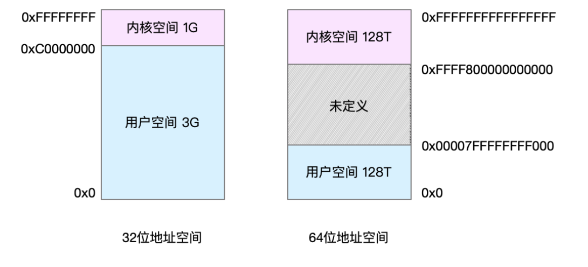
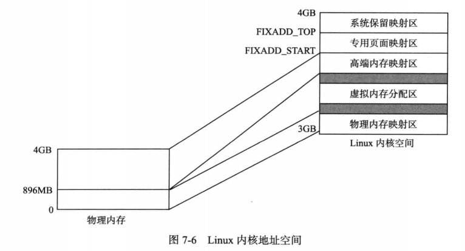
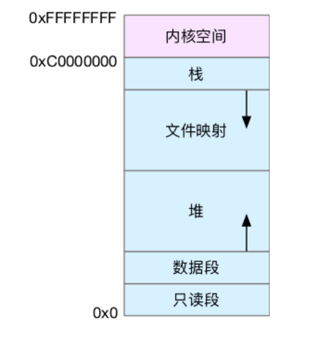
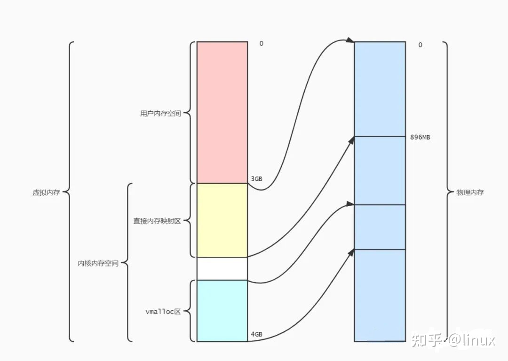
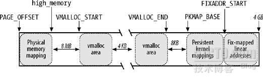
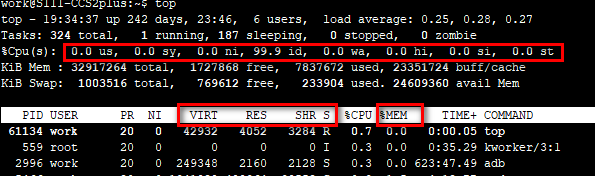
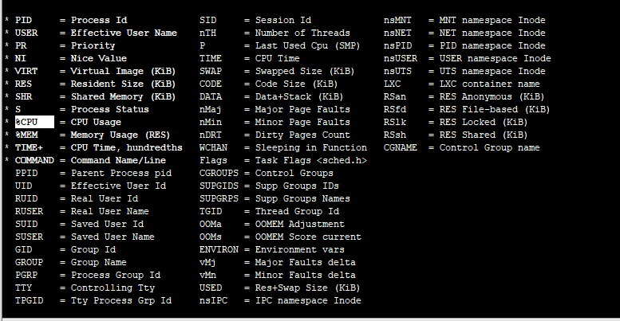

## 逻辑地址和物理地址

在内存管理中，会涉及到三种内存地址:

1. 物理地址：访问内存条上的内存单元时所使用的地址。CPU会把该地址送往地址总线来读/写某一内存单元。
2. 逻辑地址：程序的机器语言指令里，指定一条指令或是一个操作数的地址时，所使用的实际上都是逻辑地址。一个逻辑地址由两部分组成：段选择符和段偏移值。
3. 线性地址：逻辑地址经过分段映射后，得到的就是线性地址。

逻辑地址到物理地址的转换是由MMU (Memory Management Unit)来完成的：分段单元把逻辑地址转换为线性地址，分页单元把线性地址转换为物理地址。

作为应用开发者，只要大致知道，代码编译成可执行文件，可执行文件里包含一条条指令，这些指令使用的是逻辑地址，比如，程序要访问地址0xA0,这里的0xA0是逻辑地址，系统执行该命令时，将逻辑地址翻译成物理地址，然后访问内存条上对应物理位置的数据。


本文以32位系统讲解。至于64位系统，无非地址空间大小不一样，过程是一样的。

当进程启动时，系统为进程分配一段物理空间，这段空间是怎么分配的、是不是连续的、地址是什么，这是操作系统的事，进程本身不需要知道，因为系统会对这段空间进行`抽像描述`,称为`虚拟内存(virtual memory)`。 虚拟内存地址是连续的，从0x0到0xFFFFFFFF(32位系统)，进程使用的是这种虚拟的地址。

在32位系统中，因为地址总线是32位，每一位可以表示0或1，因此可以表示0~2^32,即可寻址空间是2^32。所以可以访问0~2^32的字节，2^32byte=4GB。线性地址空间的大小为 4GB。Kernel一般会按照 3:1 的比例，把线性地址空间分为两部分：

- 0~3GB 用户地址空间

- 3GB~4GB 内核地址空间。

4G虚拟内存的意思是，操作系统给应用预先假设了这么多的空间，应用可以在这个地址范围内申请内存。不会真的立刻分配这么多的空间，否则内存一下子就耗光了。实际上是只有在应用真正用到时，才会从物理上分配空间。

## 内核空间和用户空间

虚拟地址空间内部被分为内核空间和用户空间：



简单的说就是，内核空间（Kernel）是系统内核运行的空间，用户空间（User Space）是用户程序运行的空间。为了保证安全性，它们之间是隔离的, 应用不能访问内核空间，只能通过**系统调用**等使用操作系统提供的功能（概括的说，有三种方式：系统调用、软中断和硬件中断,系统调用是通过软中断实现的）。有cpu硬件实现的空间分离、也有纯软件实现的空间分离。如果强行访问会由于权限不够而触发一个异常（中断，陷阱）。反过来，内核可以随意访问用户空间。

用户空间是进程间分离的，每个进程同样的逻辑地址实际上映射到不同的物理地址上。

## 高端内存

### 由来

如前所述，32位Linux内核最大可寻址0xFFFFFFFF，即4GB，因此虚拟地址空间有4GB，划分0~3G为用户空间，3~4G为内核空间，即Linux内核虚拟地址空间只有1G。虚拟地址空间紧张，内核中不能直接线性映射所有的内存，所以有了高端内存的概念。

实际的计算机体系结构有硬件的限制，这约束了页框的使用方式，其中，Linux内核必须处理x86体系结构的两种硬件约束：

- ISA总线的直接内存存取（DMA）处理器有一个严格的限制：它们只能对RAM的前16MB地址进行寻址。
- 在具有大容量RAM的现代32位计算机中，CPU不能直接访问所有的物理内存，因为现行地址大小太小。

为了应对这种限制，对于x86机器，Linux内核将内存区域又被分为了3个管理区（zone）。

|              | 区域               |
| ------------ | ------------------ |
| ZONE_DMA     | 低于16MB的内存空间 |
| ZONE_NORMAL  | 16MB~895MB         |
| ZONE_HIGHMEM | 896MB~物理内存结束 |

内核或应用程序访问内存时，所操作的内存地址都为虚拟地址，而对应到真正的物理内存地址，需要地址一对一的映射。对于应用程序，虚拟地址到物理地址的转换需要MMU。

而对于内核, 前两个管理区的内存空间被直接映射到虚拟地址空间中,虚拟地址与物理地址有如下的对应关系：

```text
物理地址 = 虚拟地址 – 0xC0000000
```

如果内核空间这1G全部采用这种直接映射的方式，就会发现内核只能访问1GB的物理内存。为了解决，Linux 规定“内核直接映射空间” 最多映射 896M 物理内存，超过 896M的部分称为高端内存。虚拟地址0xC0000000-0xF7FFFFFF的896MB采用前面说的直接映射(fix-mapping)，而0xF8000000-0xFFFFFFFF的128MB用作dynamic-mapping，分时复用最后这128MB的线性地址空间，Kernel 就可以访问到全部的物理内存了。

----------->概括：在kernel中访问内核空间前896M，直接映射；访问后面的空间（high memory）的话，就需要通过kmap_atomic把这个物理页map到kernel[3G+896M,4G)的虚拟空间后，才能访问。

内核可以采用三种不同的机制将页框映射到高端内存，分别叫做：

1. 永久内核映射(Persistent Kernel Mappings)

2. 临时内核映射 (Temporary Kernel Mappings)

3. 非连续内存分配

实际上high memory还被划分为了3个区域，一部分用于vmalloc分配虚拟地址上连续的内存，一部分用于较长期的动态映射（persistent kernel mappings），还有一部分用于编译时可以直接分配物理地址的高端固定映射（fixmaps）。



来到64位系统，**虚拟地址空间不足**带来的问题天然就不存在，因此在64位系统的memlayout中就没有high memory，但vmalloc仍然是内核的一个重要部分。

## 虚拟内存空间分布

32 位系统 内存地址空间分布



上图粗略划分了用户空间内部的情况。对于内核空间内部，上一节已有了一些介绍。后文还会重点讲。

根据上图，用户空间内存，从低到高分别是五种不同的内存段

1. 只读段：包括代码和常量等。
2. 数据段：包括全局变量等。
3. 堆：包括动态分配的内存，从低地址开始向上增长。
4. 文件映射段，包括动态库、共享内存等，从高地址开始向下增长。
5. 栈，包括局部变量和函数调用的上下文等。栈的大小是固定的，一般是 8 MB

实际上内存结构更复杂，还有**动态链接库映射区**、**保留区**等。但我们也不必知道的这么细。对于普通开发，堆、栈、文件映射一定要了解。

在这五个内存段中，堆和文件映射段的内存是动态分配的,C语言里面用标准库的`malloc()`函数在堆上动态分配内存，对应的内存释放函数是 free()；使用`mmap()`在文件映射段动态分配内存。

内核空间的结构：




在32位系统上，高于896M的物理内存称为高端内存（HIGHMEM）。在64位系统上，HIGHMEM是不存在的。

3G ~ 3G+896M为直接映射区(Physical memory mapping,根据英文直译为物理内存映射区，但感觉翻译成直接映射区更妥当一些)，也就是说物理地址和内核虚拟地址只差3G的偏移量，比如说，内核中某个变量地址为3G+24M，那么这个变量所在的物理地址必然是24M。内核还剩下128M的地址空间，因为物理地址可能高于1G，高于1G的地方在内核里无法直接寻址，这128M就是用来映射高于896M部分的内存的。

这张图重点描述这128M的分布：



*PAGE_OFFSET* =0xC0000000，也就是3G（在X86-64架构下是ffff880000000000，不过这张图针对的32位）

high_memory位置是3G+896M。

high_memory后面分为动态内存映射区（VMALLOC区）、永久映射区(PKMAP区)、临时/固定映射区（FIXMAP区）。对应高端内存映射到内核空间的三种方法。

* VMALLOC区

  分配非连续内存。用vmalloc函数在这段空间分配。范围是VMALLOC_START到VMALLOC_END，VMALLOC_START前面与直接映射区中间有8M的间隙（代码`#define VMALLOC_OFFSET (8*1024*1024)`），为了捕捉越界。中间的4K是为了把分配的每段内存隔开，就像用户层的malloc，中间会有间隙。VMALLOC分配内存时，会把地址映射到这个区域，举个例子，假如你用vmalloc得到了1M内存，物理地址(假设连续，实际不一定)为22G~22G+1M，返回给你的地址有可能是920M~921M。

* 永久映射(PKMAP)、固定映射(FIXMAP)、临时映射

  不太懂，不关心。其中临时映射是相对于永久映射来说的,永久映射的api: kmap()和kunmap()函数不能用于中断处理程序，因为它可能会睡眠，所以又发明了一个新的区间专门为中断上下文中使用高端内存而设计的：临时映射区间，也叫原子映射。

  临时映射可以用在不能睡眠的地方，如中断处理程序中，因为获取映射时，绝对不会阻塞。用于紧急的，短时间的映射，它没有使用任何锁，完全靠一个数学公式来避免混乱，它空间有限且虚拟地址固定，这意味着它映射的内存不能长期被占用，所以叫临时映射。

  临时映射的虚拟地址位于fixmap中,不过和固定映射不能等同，严格来说临时映射只是固定映射的一段FIX_KMAP_BEGIN到FIX_KMAP_END区间。

  固定映射是在编译时就确定的地址空间,固定映射的地址定义在fixed_addresses中，即这些虚拟地址的用途是固定的, 但是它对应的物理页可以是任意的，后端的物理内存可以动态映射。每一个固定地址中的项都是一页范围,这些地址的用途是固定的,这是该区间被设计的最主要的用途。

  pkmap的入口函数，是`void* kmap(struct page*page);`，反函数是kunmap。

  临时映射函数如下: `void *kmap_atomic(struct page *page)`，反函数是kunmap_atomic。kmap_atomic是原子性的。


在内核空间中申请内存一般用到 kmalloc()、kzalloc()、vmalloc() 等。

* kmalloc()     函数原型：void *kmalloc(size_t size, gfp_t flags)；

  申请的内存位于物理内存映射区域(即直接映射区)，而且在物理上也是连续的，它们与真实的物理地址只有一个固定的偏移，因为存在较简单的转换关系，所以对申请的内存大小有限制，不能超过128KB。 

  较常用的 flags（分配内存的方法）：

  - **GFP_ATOMIC** —— 分配内存的过程是一个原子过程，分配内存的过程不会被（高优先级进程或中断）打断；
  - **GFP_KERNEL** —— 正常分配内存；
  - **GFP_DMA** —— 给 DMA 控制器分配内存，需要使用该标志（DMA要求分配虚拟地址和物理地址连续）。

  flags 的参考用法： 
  　|– 进程上下文，可以睡眠　　　　　GFP_KERNEL 
  　|– 进程上下文，不可以睡眠　　　　GFP_ATOMIC 
  　|　　|– 中断处理程序　　　　　　　GFP_ATOMIC 
  　|　　|– 软中断　　　　　　　　　　GFP_ATOMIC 
  　|　　|– Tasklet　　　　　　　　　GFP_ATOMIC 
  　|– 用于DMA的内存，可以睡眠　　　GFP_DMA | GFP_KERNEL 
  　|– 用于DMA的内存，不可以睡眠　　GFP_DMA |GFP_ATOMIC 
  　　 
  对应的内存释放函数为：

  ```c
  void kfree(const void *objp);
  ```

* kzalloc()

  `kzalloc()` 函数与 `kmalloc() `非常相似，参数及返回值是一样的，可以说是前者是后者的一个变种，因为 `kzalloc()`实际上只是额外附加了 **__GFP_ZERO** 标志。所以它除了申请内核内存外，还会对申请到的内存内容清零。

  ```c
  /**
   * kzalloc - allocate memory. The memory is set to zero.
   * @size: how many bytes of memory are required.
   * @flags: the type of memory to allocate (see kmalloc).
   */
  static inline void *kzalloc(size_t size, gfp_t flags){
      return kmalloc(size, flags | __GFP_ZERO);
  }
  ```

  kzalloc() 对应的内存释放函数也是 kfree()。

* vmalloc()

  函数原型：

  ```C
  void *vmalloc(unsigned long size);
  ```

  前文介绍动态内存映射区时已经介绍过了。vmalloc() 函数会在虚拟内存空间给出一块连续的内存区，但这片连续的虚拟内存在物理内存中并不一定连续。

  由于 vmalloc() 没有保证申请到的是连续的物理内存，因此对申请的内存大小没有限制，如果需要申请较大的内存空间就需要用此函数了。当调用vmalloc时，先调用kmalloc分配一块可以存放申请的全部物理页框描述符的空间，最后直接调用alloc_page每次申请一个物理页框。

  对应的内存释放函数为：
  
  ```C
  void vfree(const void *addr);
  ```
  
  注意：vmalloc() 和 vfree() 可以睡眠，因此不能从中断上下文调用

**总结：**

​		kmalloc()、vmalloc() 的区别是：kmalloc会在低端内存申请，kmalloc 分配的内存大小有限制（128KB），而 vmalloc 没有限制；kmalloc 可以保证分配的内存物理地址是连续的，但是 vmalloc 不能保证;kmalloc 分配内存的过程可以是原子过程（使用 GFP_ATOMIC），而 vmalloc 分配内存时则可能产生阻塞;kmalloc 分配内存的开销小，因此 kmalloc 比 vmalloc 要快；

​		一般情况下，内存只有在要被 DMA 访问的时候才需要物理上连续，但为了性能上的考虑，内核中一般使用 kmalloc()，而只有在需要获得大块内存时才使用 vmalloc()。

​		不少人以为标准库malloc函数在内核态的调用函数是kmalloc或vmalloc，这是不对的，kmalloc或vmalloc是在内核上分配，malloc是在用户空间分配，完全不一样。关于malloc的实现原理：https://blog.csdn.net/ordeder/article/details/41654509。

## 用户态与内核态的切换

- 所有用户程序都是运行在用户态的，但是有时候程序确实需要做一些内核态的事情，例如从硬盘读取数据，或者从键盘获取输入等。(小白可能会误认为，应用自身可以读取硬盘。其实读硬盘是件非常复杂的事情，识别文件系统、寻址、复位、断开等，如果这些事情都由各个应用自己完成，复杂性不说，各个应用之间如果同时操作，难道不会冲突把硬盘搞死吗？所有外设都是由内核中的设备驱动控制管理的，故只有操作系统才能做这些事情)

- 这时候 程序 就**需要先向 操作系统 请求**，以 程序 的名字来执行这些操作。

- 需要一个这样的机制：**用户态** 切换到 **内核态**，但是不能控制内核态中的执行。这种机制叫做**系统调用**，在CPU中的实现称之为**"陷阱指令(Trap Instruction)"**

### 系统调用机制流程

1. 用户态程序将一些数据值放在寄存器中，或者使用参数创建一个堆栈(stack frame)，以表明需要操作系统提供的服务。

2. 用户态程序执行陷阱指令

3. CPU切换到内核态，并跳到内存指定位置的指令，这些指令是操作系统的一部分，他们具有内存保护，不可被用户态程序访问

4. 这些指令称之为 陷阱 (trap) 或者新系统调用处理器 ( system call handler )。他们会读取程序放入内存的数据参数，并执行程序请求的服务。

5. 系统调用完成后，操作系统会重置CPU为用户态并返回系统调用的结果。

### 中断处理由用户态切换到内核态的步骤

1.从当前进程的描述符中提取其内核栈的ss0及esp0信息。
2.使用ss0和esp0指向的内核栈将当前进程的cs,eip,eflags,ss,esp信息保存起来，这个过程也完成了由用户栈到内核栈的切换过程，同时保存了被暂停执行的程序的下一条指令。
3.将先前由中断向量检索得到的中断处理程序的cs,eip信息装入相应的寄存器，开始执行中断处理程序，这时就转到了内核态的程序执行了。
4.内核态程序执行完毕时如果要从内核态返回用户态，可以通过执行指令iret来完成，指令iret会将先前压栈的进入内核态前的cs,eip,eflags,ss,esp信息从栈里弹出，加载到各个对应的寄存器中，重新开始执行用户态的程序.

## mmap内存映射原理

mmap内存映射的实现过程，总的来说可以分为三个阶段：

**进程启动映射过程，并在虚拟地址空间中为映射创建虚拟映射区域**

- 进程在用户空间调用库函数mmap，原型：void *mmap(void* start, size_t length, int prot, int flags, int fd, off_t offset);
- 在当前进程的虚拟地址空间中，寻找一段空闲的满足要求的连续的虚拟地址
- 为此虚拟区分配一个vm_area_struct结构，接着对这个结构的各个域进行了初始化
- 将新建的虚拟区结构（vm_area_struct）插入进程的虚拟地址区域链表或树中

**调用内核空间的系统调用函数mmap（不同于用户空间函数），实现文件物理地址和进程虚拟地址的一一映射关系**

- 为映射分配了新的虚拟地址区域后，通过待映射的文件指针，在文件描述符表中找到对应的文件描述符，通过文件描述符，链接到内核“已打开文件集”中该文件的文件结构体（struct file），每个文件结构体维护着和这个已打开文件相关各项信息。
- 通过该文件的文件结构体，链接到file_operations模块，调用内核函数mmap，其原型为：int mmap(struct file *filp, struct vm_area_struct* vma)，不同于用户空间库函数。
- 内核mmap函数通过虚拟文件系统inode模块定位到文件磁盘物理地址。
- 通过remap_pfn_range函数建立页表，即实现了文件地址和虚拟地址区域的映射关系。此时，这片虚拟地址并没有任何数据关联到主存中。

**进程发起对这片映射空间的访问，引发缺页异常，实现文件内容到物理内存（主存）的拷贝**

注：前两个阶段仅在于创建虚拟区间并完成地址映射，但是并没有将任何文件数据的拷贝至主存。真正的文件读取是当进程发起读或写操作时。

- 程的读或写操作访问虚拟地址空间这一段映射地址，通过查询页表，发现这一段地址并不在物理页面上。因为目前只建立了地址映射，真正的硬盘数据还没有拷贝到内存中，因此引发缺页异常。
- 缺页异常进行一系列判断，确定无非法操作后，内核发起请求调页过程。
- 调页过程先在交换缓存空间（swap cache）中寻找需要访问的内存页，如果没有则调用nopage函数把所缺的页从磁盘装入到主存中。
- 之后进程即可对这片主存进行读或者写的操作，如果写操作改变了其内容，一定时间后系统会自动回写脏页面到对应磁盘地址，也即完成了写入到文件的过程。

注：修改过的脏页面并不会立即更新回文件中，而是有一段时间的延迟，可以调用msync()来强制同步, 这样所写的内容就能立即保存到文件里了。

## munmap和msync

众所周知，linux为了提高IO效率，写数据不是直接写到硬盘上，而是先写到硬盘缓存，称为“延迟写”。只有调用fsync() 和 fdatasync() 后才能保证数据落到硬盘上。mmap函数也有一个类似的函数：msync()。进程在映射空间的对共享内容的改变并不直接写回到磁盘文件中，往往在调用munmap（）后才执行该操作。成功返回0，失败返回-1。

munmap解除内存映射函数。解除时会把相应内容写回磁盘文件，无需调用msync。

## top命令

​	top命令可以查看 CPU 时间在 User space 与 Kernel Space 之间的分配情况

```shell
work@S111-CCS2plus:~$ top
top - 16:50:23 up 242 days, 21:02, 11 users,  load average: 0.44, 0.38, 0.38
Tasks: 356 total,   1 running, 219 sleeping,   0 stopped,   0 zombie
%Cpu(s):  0.0 us,  0.1 sy,  0.0 ni, 99.9 id,  0.0 wa,  0.0 hi,  0.0 si,  0.0 st
KiB Mem : 32917264 total,  2828300 free,  7859200 used, 22229764 buff/cache
KiB Swap:  1003516 total,   766484 free,   237032 used. 24591496 avail Mem 

   PID USER      PR  NI    VIRT    RES    SHR S  %CPU %MEM     TIME+ COMMAND                                                     
 39072 work      20   0   43052   4244   3348 R   0.7  0.0   0:00.05 top
     8 root      20   0       0      0      0 I   0.3  0.0 170:51.45 rcu_sched                                                   
  5466 work      20   0 1341416 488436  39552 S   0.3  1.5   3:49.62 node                                                       
     1 root      20   0  225608   5756   3848 S   0.0  0.0   6:12.31 systemd                                                     
     2 root      20   0       0      0      0 S   0.0  0.0   0:16.73 kthreadd       
```

关注几项：



第三行有 8 项统计指标:

> -  第一项us（user 的缩写）就是 CPU 消耗在 User space 的时间百分比
> - 第二项sy（system 的缩写）是消耗在 Kernel space 的时间百分比
> - ni：niceness 的缩写，CPU 消耗在 nice 进程（低优先级）的时间百分比
> - id：idle 的缩写，CPU 消耗在闲置进程的时间百分比，这个值越低，表示 CPU 越忙
> - wa：wait 的缩写，CPU 等待外部 I/O 的时间百分比，这段时间 CPU 不能干其他事，但是也没有执行运算，这个值太高就说明外部设备有问题
> - hi：hardware interrupt 的缩写，CPU 响应硬件中断请求的时间百分比
> - si：software interrupt 的缩写，CPU 响应软件中断请求的时间百分比
> - st：stole time 的缩写，该项指标只对虚拟机有效，表示分配给当前虚拟机的 CPU 时间之中，被同一台物理机上的其他虚拟机偷走的时间百分比

 VIRT、RES、SHR 以及 %MEM 等包含了进程最重要的几个内存使用情况。为了解释清楚，先给出进程使用内存的分类：

```text
                                 Private | Shared
                             1           |          2
        Anonymous  . stack               |
                   . malloc()            |
                   . brk()/sbrk()        | . POSIX shm*
                   . mmap(PRIVATE, ANON) | . mmap(SHARED, ANON)
                  -----------------------+----------------------
                   . mmap(PRIVATE, fd)   | . mmap(SHARED, fd)
      File-backed  . pgms/shared libs    |
                             3           |          4
```
分成1、2、3、4四个象限，

>  **CODE**: 代码容量(KiB)
>
>  **DATA: 数据和栈容量(KiB)**，也被称为数据驻留集或DRS。
>
>   **RSan 常驻/驻留匿名内存**  ，RES的子集，其表示私有的不映射到文件的页，非文件背景页的内存，又称匿名内存页
>
>  **RSfd 驻留文件支持的内存(文件背景页内存)**代表具体的程序文件以及一些公共的库所使用的文件背景页的内存，也包含明确文件映射，私有和公共的
>
>  **RSlk 驻留的锁定的内存**锁定的内存，也即无法被交换出去的内存页，也就是说这一段内存在程序运行期间是一直位于物理内存上的，无法通过swap或者page cache等将其交换到硬盘上
>
>   **RSsh 驻留的共享内存**表示明确的共享的匿名 shm*/mmap 的内存页
>
>  VIRT 是进程虚拟内存的大小，包括进程使用的库、代码、数据，以及malloc、new分配的堆空间和分配的栈空间等。只要是进程申请过的内存，即便还没有真正分配物理内存，也会计算在内。假如进程新申请10MB的内存，但实际只使用了1MB，那么它会增长10MB，而不是实际的1MB使用量。原因是已经在虚拟内存分配了10MB。CentOS 7.4 描述VIRT = code, data and shared libraries + swapped out + mapped but not used，所以网上许多资料说VIRT = SWAP +RES是不准确的。上图中包含了全部。
>
>  RES 是常驻内存的大小**(KiB)**，正在使用的没有交换的物理内存，也就是进程实际使用的物理内存大小但不包括 Swap 和共享内存，包括使用中的malloc、new分配的堆空间和分配的栈空间，包含其他进程的共享。许多资料说**RES = CODE + DATA**，其实这个公式也是有问题的，可能是Linux版本升级带来的历史原因吧。关于库占用内存的情况，它只统计加载的库文件所占内存大小。如果申请10MB的内存，实际使用1MB，它只增长1MB，与VIRT相反，原因是，虽然虚拟内存分配了10MB，但是实际物理内存才分配了1MB。从Linux 4.5开始，是以下的总和：
>
>  ​				 RSan - 象限1, which include any former quadrant 3 pages if modified（没看懂）
>  ​                 RSfd - 象限3和象限4
>  ​                 RSsh - 象限2
>
>  SHR 是共享内存的大小，比如与其他进程共同使用的共享内存、加载的动态链接库以及程序的代码段等。RES – SHR计算某个进程代码和堆栈实际占用的物理内存大小。是RES的子集，上图中，不包含1，包含2、4，包含3的一部分。
>
>  %**MEM** 是进程使用物理内存占系统总内存的百分比 
>
>  **%CPU: cpu使用率**，对于多核处理器，该数值可能会超过100%。
>
>  SWAP 除了象限4，其它都可能出现在这里。

其它字段含义：

| PID     | 进程 ID                                                      |
| ------- | ------------------------------------------------------------ |
| USER    | 进程所有者的用户名                                           |
| PR      | 任务优先级                                                   |
| NI      | nice 值。数值越小表示优先级越高，数值越大表示优先级越低      |
| VIRT    | 进程使用的虚拟内存总量，单位：kb。VIRT=SWAP+RES              |
| RES     | 进程使用的、未被换出的物理内存大小，单位：kb。RES=CODE+DATA  |
| SHR     | 共享内存大小，单位：kb                                       |
| S       | 进程状态。 D= 不可中断的睡眠状态  R= 运行  S= 睡眠  T= 跟踪 / 停止  Z= 僵尸进程 |
| %CPU    | 上次更新到现在的 CPU 时间占用百分比                          |
| TIME+   | 进程使用的 CPU 时间总计，精确到 1/100 秒                     |
| COMMAND | 命令名 / 命令行                                              |

top命令运行过程中按下f键可以看到各个缩写的全称：



按下c，可以**COMMAND**字段显示完整命令行。

另，执行man top查看该命令的完整解释。

## time命令

查看单个程序的耗时，一般使用time命令。

- real：程序从开始运行到结束的全部时间，这是用户能感知到的时间，包括 CPU 切换去执行其他任务的时间。

- user：程序在 User space 执行的时间

- sys：程序在 Kernel space 执行的时间

user和sys之和，一般情况下，应该小于real。但如果是多核 CPU，这两个指标反映的是所有 CPU 的总耗时，所以它们之和可能大于real。

## free命令

```shell
work@S111-CCS2plus:~$ free
              total        used        free      shared  buff/cache   available
Mem:       32917264     7823788     4103116       18968    20990360    24619828
Swap:       1003516      240812      762704
```

## copy_from_user与 copy_to_user

分别是将用户空间的数据拷贝到内核空间以及将内核空间中的数据拷贝到用户空间。这两个函数一般用于系统调用中，前者将用户空间参数拷贝到内核，后者将系统用的结果返回到用户空间。

内核里调用的，比如binder驱动(binder.c)里有这个动作。普通进程没法调用这函数，从命名上也是内核的口吻。

### access_ok 

内核里使用user space指针的时候都用access_ok 函数检查。比如copy_from_user 与 copy_to_user里就有这个检查。

access_ok就是检验将要操作的用户空间的地址范围是否在当前进程的用户地址空间限制中。

曾经linux源码里提交了一笔代码，没有做这个检查，导致你有一百种办法攻击内核。后来修复bug只是增加了对access_ok的调用而已。

## 物理地址扩展（PAE）

物理地址扩展是指x86和x86-64处理器的一个特色，即如果操作系统提供适当支持，则可以在32位的系统中使用超过4GB字节的实体内存。AMD的较新型号的CPU也支持PAE。

增加了额外的地址线以选择那些增加了的内存，所以实体内存的大小从32位增加到了36位。最大的实体内存由4GiB增加到了64GiB。32位的虚拟地址没有变，所以一般的应用软件可以继续使用地址为32位的指令，这些软件的地址空间(即本文所说的虚拟地址)仍然限制为4GiB。页表将这4GiB的地址空间映射到大小为64GiB的实体内存，而这个映射对各个进程是不一样的。这样一来，虽然单个进程仍然最多只能用4G内存，但所有进程加起来，可以有更多的物理内存使用。

本文提到，内核空间最后的128M空间，在开启PAE的情况下，可以映射896M~64G的部分。

## 问题

**问**： 既然每个进程，都有一段0xC0000000~0xFFFFFFFF的内核空间，如何理解“所有进程的内核空间（3G－4G）都是共享的”？

**答：**以Linux2.6内核为例，内核在初始化过程中，内核页表的初始化在保护模式下，但是此时尚未开启分页机制。内核填充PGD表（静态数组），使得（3G－4G）的虚拟地址映射到物理地址（0－1G），确切的讲，是（3G －3G+896M）的虚拟地址映射到物理地址（0－896M），因为剩下的(3G+896M--4G)虚拟空间可以用来映射物理存储器的高端地址（大于896M）。然后内核将PGD基地址加载到CR3中，将CR0的PG位置1，正式开启分页机制。此时，（3G－3G+896M）的虚拟地址正式映射到物理地址（0－896M）。

​		内核页表PGD将作为进程SWAPPER（PID＝0）的页表，SWAPPER是系统中的第一个进程，除了SWAPPER，内核还创建INIT进程。INIT进程的页表跟内核页表是一致的，系统中的其它所有用户进程都是INIT进程的儿子或后代。用户进程的创建都是父进程通过FORK()函数实现，创建的子进程有两种情形：1）子进程与父进程完全共享地址空间，此时它们共享PGD以及PTE；2）子进程不与父进程共享地址空间，此时它们有各自的PGD与PTE，但是（在创建之初）子进程的PGD与PTE是父进程的拷贝。

​		在各个进程的运行过程中，他们的页表可能会发生变化，比如发生缺页异常，或者执行EXEC（）系列函数，但是所有这些页表项的变化都属于用户空间（0－－3G)。内核空间的页表几乎不变，确切的讲，（3G－3G+896M）之间的页表项不变（也就是说，**所有进程的3G~(3G+896M)的虚拟地址都映射到物理地址0~896M**  ------>记住这一句话就行了)。

​		以上回答了为什么3G－－3G+896M的虚拟地址是共享的。

​		至于3G+896M－－4G这段，这段的页表可能会变，比如内核执行VMALLOC()函数。为了使所有进程的内核空间（3G--4G)都保持一致，原则上必须修改每个进程的（3G+896M－－4G）之间的页表，这样做的效率比较低下。LINUX内核通过PAGE FAULT机制保持所有进程的（3G+896M－－4G）之间的页表一致。

​		比如在vmalloc分配了一块内存，如何通知所有的进程修改其页表呢？vmalloc先在kernel virtual space找出一段空间，分配出物理页，然后更新到init_mm.pgd所指的page table中。但是当前进程的page table中kernel virtual space那段还是要通过page fault来更新。当发生page fault时，内核通过读取cr2来判断异常的类型，异常发生时cpu会将3位的error_code压入到栈中。如果发生了由于内核访问不存在的页框引起的异常，就跳转去执行vmalloc_fault标记处的代码。这部分代码负责从主内核页表中取出相应信息并更新当前进程的页表。

**问：**高端内存空间一定就是在high_memory之上的地址空间吗？

本文一直在说，high_memory之上的是高端内存，但是，实际写代码时，肯定要考虑各种特殊场景，比方说，如果实际的物理内存不到896M呢?这种情况照样可以使用vmalloc，但是显然不能把VMALLOC区放到896M后面了。实际上，“低于896M的物理内存与虚拟内存在内核空间里是一一对应的”，如果完全考虑到现实情况，这句话也是有问题的。假如实际的物理内存不到896M，只有A(A<896M),那么进程内核空间大于3G+A的部分显然不可能直接映射。


## 参考

[Linux内存简单汇总](https://www.cnblogs.com/mrwuzs/p/11372969.html)

[Kernel那些事儿之内存管理系列文章](https://blog.51cto.com/richardguo)共13篇

深入浅出介绍Linux内核内存管理机制系列文章https://blog.csdn.net/rikeyone/category_9282598.html

