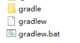

我研究gradle 的初衷是，android studio默认用gradle作为项目构建工具。但是现在还是不要考虑安卓的情况，研究一下“纯粹的gradle”是怎么回事，否则到后面，你搞不清项目里的配置脚本哪些是gradle的基础特性，哪些是android 插件引入的。

需要知道，AndroidStudio用gradle来构建项目，而gradle并不依赖Android Studio。你完全可以不打开Android Studio，用纯命令行来执行task，构建apk。

## gradle 是什么

*  **gradle 是一个自动化构建工具**

  gradle 是通过组织一系列 task 来最终完成自动化构建的，所以 task 是 gradle 里最重要的概念
  以生成一个可用的 apk 为例，整个过程要经过 资源的处理，javac 编译，dex 打包，apk 打包，签名等等步骤，每个步骤就对应到 gradle 里的一个 task

* **gradle 脚本里使用 groovy 或者 kotlin DSL**

  以前都是用的groovy，Gradle5.0 新增了 *Kotlin* DSL 1.0 。毕竟Kotlin有一个好爹，在Google的推动下，说不定将来能代替groovy在gradle中使用。暂时没兴趣研究 *Kotlin* DSL。

* **gradle 自身基于 groovy 编写**

  *.gradle 脚本的本质就是类的定义，一些配置项的本质都是方法调用，参数是后面的 {} 闭包

  比如 build.gradle 对应 Project 类，buildScript 对应 Project.buildScript 方法

## 基本组件

* Project： 每一个待编译的工程都叫一个 Project，拥有一个build.gradle

  利用gradle projects命令查看project信息：

  ```shell
  E:\14workspace\ccs2.0_plus_qm\SecondaryRender>gradlew.bat projects
  Starting a Gradle Daemon, 1 incompatible Daemon could not be reused, use --status for details
  
  > Task :projects
  
  ------------------------------------------------------------
  Root project
  ------------------------------------------------------------
  
  Root project 'SecondaryRender'
  \--- Project ':app'
  ```

  这个输出结果表明，根项目名叫SecondaryRender，里面有包含了一个名叫app的project。对应到android studio里面，SecondaryRender就是你新建的工程，而app是你在工程下添加的模块(module)。gradle统一叫做project。在build.gradle中可以用“project”引用project对象，不过当前的this就是project，所以省掉。

* Task： 项目的构建本质上就是执行一系列的 Task。

  > 比如Android APK的构建过程包含**Java 源码编译 Task、资源编译 Task、JNI 编译 Task、lint 检查 Task、打包生成 APK 的 Task、签名 Task 等**。这些Task是在**插件**中定义的。

  执行task命令：> gradle task_name。所以以后编译release版本的apk你可以用shell：`> ./gradlew assembleRelease`，跟菜单里点击build是一样的。

## 文件

* build.gradle 对应的是 Project 类，每个项目/子项目配置一个build.gradle文件，也是我们最主要关注的文件，你的task、配置项都信息基本都在这个文件里。

* settings.gradle: 用idea/android studio创建的安卓项目，默认的项目结构是rootProject下包含多个module。rootProject下有一个build.gradle, 每个module也对应一个build.gradle。rootProject需要知道有哪些module，这种情况你要在rootProject下面新建一个settings.gradle文件，内容格式如下：

  ```groovy
  include ':app', ':sensortest'
  rootProject.name='AndroidFound'
  ```

  或者分开：

  ```groovy
  include ':app'
  rootProject.name = "AndroidTest"
  include ':myapplication'
  ```

  如果不include进去，那么这个模块不会被识别。

  如果想指定子模块的位置，可以使用 project 方法获取 Project 对象，设置其 projectDir 参数:

  ```groovy
  include ':app'
  project(':app').projectDir = new File('./app')
  ```

* gradle.properties: 在里面定义键值对，定义的key可以在build.gradle中使用。比如在gradle.properties中指定：

  ```properties
  #city
  city = "yangzhou"
  city2 = yangzhou
  ```

  build.gradle中：

  ```groovy
  println(city)//打印"yangzhou"
  println(city2)//打印yangzhou
  ```

  安卓项目常常用来指定编译器的参数，如：

  ```properties
  org.gradle.jvmargs=-Xmx2048m -Dfile.encoding=UTF-8
  android.useAndroidX=true
  android.enableJetifier=true
  ```

* 其它的 .properties文件： properties文件名不为 gradle.properties时或者 不在同级或者父级的目录下时，默认是不会自动引入的。但是你用的gradle插件里面可以自己加载properties文件。

  ```groovy
  def config = new ConfigSlurper().parse(new File("test.properties").toURL())
  ```

  比如安卓gradle项目在根目录下有个local.properties，这个文件里配置sdk、ndk路径。以版本4.1.3为例，这个文件load是在：`C:\Users\xuexiangyu\.gradle\caches\modules-2\files-2.1\com.android.tools.build\gradle\4.1.3\fff7ad707507b7d0f10b0bf27bf3419f545a5c55\gradle-4.1.3-sources\com\android\build\gradle\internal\cxx\configure\GradleLocalProperties.kt`

  ```kotlin
  fun gradleLocalProperties(projectRootDir : File) : Properties {
      val properties = Properties()
      val localProperties = File(projectRootDir, FN_LOCAL_PROPERTIES)
  
      if (localProperties.isFile) {
          InputStreamReader(FileInputStream(localProperties), Charsets.UTF_8).use { reader ->
              properties.load(reader)
          }
      } else {
          infoln("Gradle local properties file not found at $localProperties")
      }
      return properties
  }
  ```

  

## Gradle Wrapper

  为了用gradle构建项目，你要下载gradle-xx--version.zip,配置环境变量。现实问题是，不同项目可能用不同版本的gradle，团队开发中也需要统一gradle版本。因此现实项目中往往采用Wrapper的方式。Wrapper是一个shell脚本，window下叫gradlew.bat。AS新建的项目默认就是wrapper模式。

### 生成wrapper

项目目录下打开shell，执行“wrapper”这个task：`gradle wrapper`,然后看到目录下多了几个文件：



gradle文件夹里面是wrapper/gradle-wrapper.jar 和 wrapper/gradle-wrapper.properties 两个文件。

然后，执行task的命令改成"gradlew task_name"或"gradlew.bat task_name"。

一旦生成这些wrapper文件，你就不再依赖过去配置的gradle home了。比如你可以把这个目录拷贝到一个没有配置过任何gradle的电脑上，用gradlew命令。

gradle-wrapper.properties的内容：

```properties
distributionBase=GRADLE_USER_HOME
distributionPath=wrapper/dists
distributionUrl=https\://services.gradle.org/distributions/gradle-4.10.1-bin.zip
zipStoreBase=GRADLE_USER_HOME
zipStorePath=wrapper/dists
```

在执行任何task之前，你先打开这个文件，把distributionUrl改成你需要的gradle版本。

然后在执行task时，自动下载zip到 "home/.gradle/wrapper/dists/gradle-xxx-all/3221gyojl5jsh0helicew7rwx"（后面那个路径名因版本而异）。所有依赖的资源都会自动下载。

因为国内网络问题，有时下载很慢，你可以提前准备好zip，拷贝到这个目录。

### 配置wrapper Task

新建build.gradle,自定义gradle版本，代码如下：

```groovy
//5.0之前的版本
task wrapper(type: Wrapper){
	gradleVersion = '3.0'
}
//5.0以后
wrapper{
    gradleVersion = '3.0'
    //or 直接指定distributionUrl，但是这么写不会验证url是否有效
    distributionUrl = 'https://services.gradle.org/distributions/gradle-5.4.1-all.zip'
}
```

然后执行gradle wrapper，生成的gradle-wrapper.properties变成3.0版本了：

```properties
distributionBase=GRADLE_USER_HOME
distributionPath=wrapper/dists
distributionUrl=https\://services.gradle.org/distributions/gradle-3.0-bin.zip
zipStoreBase=GRADLE_USER_HOME
zipStorePath=wrapper/dists
```

还可以用参数：`gradlew.bat wrapper --gradle-version 2.4`,这样distributionUrl就是2.4版本了。

## 日志级别

gradle -q task  //quiet

gradle -i task   //info

gradle -d task  //debug,一般会输出所有日志

## 输出错误堆栈信息

gradle -s  task  //关键的堆栈信息

gradle -S  task  //输出全部堆栈信息，不推荐，因为太多太长

## 自己打印日志

* println '一段日志'
* logger.quiet('quiet级别的日志')
* logger.error('error级别的日志')
* logger.warn('warn级别的日志')
* logger.lifecycle('lifecycle级别的日志')
* logger.info('info级别的日志')
* logger.debug('debug级别的日志')

## 使用帮助

gradle -h //gradle --help

如果要查看某个task的帮助，使用gradle help --task taskname。比如：

```shell
E:\14workspace\testgroovy>gradle help --task wrapper

> Configure project :
xxxxxxxxxxxxxx

> Task :help
Detailed task information for wrapper

Path
     :wrapper

Type
     Wrapper (org.gradle.api.tasks.wrapper.Wrapper)

Options
     --distribution-type     The type of the Gradle distribution to be used by the wrapper.
                             Available values are:
                                  ALL
....................
```

## 查看所有task

gradle tasks

## 强制刷新缓存

依赖资源都是有缓存的。在命令行运行时可以加上--refresh-dependencies参数强制刷新。比如：

./gradlew --refresh-dependencies assemble

这个功能IDE是很难做到的，这就是命令行的优势。

## 多任务调用

gradle clean jar  //先执行clean，在执行jar

## 创建Task

```groovy
//方法一：调用Project的task()方法创建task
task myTask {
    println 'myTask in configuration '
    doFirst {
        println 'myTask doFirst'
    }
    doLast {
        println 'myTask doLast'
    }
}
//方法二:通过TaskContainer的create()方法创建Task
tasks.create("myTask2"){//tasks 是Project中的一个TaskContainer对象
    println 'myTask2 in configuration '
    doFirst {
        println 'myTask2 doFirst'
    }
    doLast {
        println 'myTask2 doLast'
    }
}
myTask.doFirst{
    println 'myTask doFirst 2'
}
myTask.doLast{//位置1
    println 'myTask doLast 2'
}
//执行“gradlew.bat myTask”，输出：
> Configure project :
myTask in configuration
myTask2 in configuration

> Task :myTask
myTask doFirst 2
myTask doFirst
myTask doLast
myTask doLast 2
```

以上创建了两个task，task本质上是DefaultTask类的对象。DefaultTask继承了AbstractTask，doFirst和doLast是AbstractTask的成员函数。所以正如代码“位置1”处所示，可以追加doFirst和doLast的代码块。

一个task可以声明多个doFirst和doLast方法，都会被执行，doFirst越是后面设置的越先执行，doLast反之。

“<<”是doLast的别名，直觉上，这个符号就是追加到后面的意思，可以说非常形象,但不知为啥在gradle 5.0被移除了：

```groovy
printVersion.doFirst { println "First action" }
printVersion << { println "Last action" }//5.0后不能用
```

## Task之间的依赖

task直接可以相互依赖，但是不能形成闭环，否则会报错。

Task.dependsOn
Task.mustRunAfter
Task.shouldRunAfter
Task.finalizedBy

示例：

```groovy
task task1 {
    doLast {
        println('task2')
    }
}
task task2 {
    doLast {
        println('task2')
    }
}
task1.finalizedBy(task2)
task1.dependsOn(task2)
task1.mustRunAfter(task2)
task1.shouldRunAfter(task2)
task1.finalizedBy(task2)
```

主要记住`dependsOn`这个方法。当然，正如doFirst可以放在task定义处的闭包里，`dependsOn`也一样。

## 自定义属性

```groovy
//在build.gradle里
myProp1 = "age"//如果你直接这样，报错：project中没有这个属性

def myProp1 = "age"//定义了一个变量
println myProp1//没问题，这只是普通的groovy声明变量语法。

//自定义Project的属性
//在build.gradle最外层
ext.myProp1 = "age"//你应该
println myProp1
//相当于
project.ext.myProp1 = "age"
println myProp1
println project.myProp1//等价

//通常project前缀是可以省略的，但是如果当前作用域不是在project
android {
    project.ext.myProp1 = "age"
    xxx其它代码
}
println myProp1
```

除了给project添加额外属性，也可以添加给task：

```groovy
task myTask {
    println 'myTask in configuration '
    doFirst {
        println 'myTask doFirst'
    }
    doLast {
        println 'myTask doLast'
    }
}
myTask.ext.extname = "I am a task"
println "name " + myTask.extname
```

那么疑问是，这个ext到底是什么？

根据ext属性的[官方文档](https://docs.gradle.org/current/dsl/org.gradle.api.plugins.ExtraPropertiesExtension.html#org.gradle.api.plugins.ExtraPropertiesExtension)，ext属性是[ExtensionAware](https://docs.gradle.org/current/dsl/org.gradle.api.plugins.ExtensionAware.html)类型的一个特殊的属性，是ExtraPropertiesExtension类型，本质是它的内部维护了一个Map，而

ExtentionAware接口的实现类为`Project`, `Settings`, `Task`, `SourceSet`、`configurations`、`dependencies`等,也就是说，这些类的对象上面都可以用ext来自定义你需要的属性。

```groovy
//build.gradle
class MyExtension{
    String foo

    MyExtension(String foo) {
        this.foo = foo
    }
}
project.extensions.create('custom', MyExtension, "bar")
println project.custom instanceof ExtensionAware//true
```

以上代码给project对象添加了一个`custom`属性，“extensions”是`ExtensionContainer`的对象，凡是用`ExtensionContainer`的create方法添加的扩展，本身也是实现了ExtensionAware的。因为MyExtension类是我们自己写的，没有实现ExtensionAware，所以显然这里面用到了某种类似动态代理的技术。这就是为甚么下面代码是错的：

```groovy
project.extensions.create('bar', String, "I am bar")//String是final，不能创建子类
```

既然MyExtension的对象custom自动实现了ExtensionAware,那么也就拥有ext属性：

```groovy
project.custom.ext {
    foo = "other"
    goo = "go"
}
println project.custom.ext.goo//go
println project.custom.ext.foo//other
println project.custom.foo//bar，本身MyExtension有一个成员变量foo，又通过ext扩展了一个foo。所以访问扩展的foo只能用ext.foo了。

//这是custom(Closure)方法。也就是，project.extensions.create给project添加了一个custom属性和一个custom(Closure)方法。
custom{//通过custom(Closure)可以方便的配置属性
    foo = "haha"
    goo = "lala"
}
println custom.foo//haha
println custom.goo//lala
println custom.ext.foo//other
println custom.ext.goo//lala
```

ext属性本身可以看做一种特殊的extension,是不是也是内部通过extensions.create创建出来的，就不得而知了，我们也不需要关心这种底层实现。但是你发现里面有一些神奇的地方，就是一个对象本身没有某个属性或者方法，你却可以直接在对象上面调用。比如上面调用了custom(Closure)方法，但是用反射打印project对象的所有方法，并没有这个方法，那么这方法哪来的？再比如为甚么ext扩展的额外属性可以在对象上直接调用？有这些疑惑说明你是在用java的经验来套groovy，但要知道groovy语法糖提供了许多额外的特性。反编译成java，会发现其实委托给了另一个对象。groovy语言本身是动态的,所以gradle很容易实现动态特性，下一篇介绍gradle的动态对象。

### 使用ext属性的优势

用ext属性，和直接在build.gradle中用def定义变量的好处是什么？

ext属性可以伴随对应的`ExtensionAware`对象在构建的过程中被其他对象访问，例如你在rootProject中声明的ext中添加的内容，就可以在任何能获取到rootProject的地方访问这些属性，而如果只在rootProject/build.gradle中用def来声明这些变量，那么这些变量除了在这个文件里面访问之外，其他任何地方都没办法访问。

**注意，在module中可以直接引用rootProject的ext引用属性**

## Gradle构建的生命周期

这块可以参阅官网文档：https://docs.gradle.org/current/userguide/build_lifecycle.html#sub:building_the_tree

一个`gradle`的构建有3个不同的阶段

1. 初始化（Initialization）

   Gradle支持单和多project的构建。在初始化阶段，gradle决定了哪一个或哪些project将要参与到这次构建，并且为每个project创建一个`Project`对象。（注意，一个project对应一个build.gradle文件）settings.gradle脚本中的内容在这个阶段执行。

2. 配置（Configuration）

   在这个阶段，配置`Project`对象，所有参与到这次构建的build.gradle脚本文件都会被执行。随着脚本文件的执行，tasks会创建出来。

3. 执行（Execution）

   在此阶段，gradle根据“gradle命令”指定的参数，决定哪些tasks要被执行。然后执行每一个被选中的task。

## sync

Android团队开发了Android Gradle这个Gradle的第三方插件，用于Android的开发构建，能够和AndroidStudio进行无缝整合。Android Studio 需要从build.gradle等gradle配置文件中同步配置，这样Android Studio才知道项目的信息，比如源码目录在哪、引用哪些jar包、怎样debug、有哪些task、怎样构建。从而让你不需要手动执行命令行，只需要在界面上点点就能执行任务。修改gradle文件后，窗口的右上角有一个“Sync  Now”的提示。这个sync就是把gradle语句同步给Android Studio的过程。如果你使用纯粹的命令行，不使用IDE，那么是不需要sync的，直接执行task就行。

## buildscript

```groovy
buildscript {
    repositories {
        maven{ url 'https://maven.aliyun.com/repository/google' }
        maven{ url 'https://maven.aliyun.com/repository/jcenter' }
    }
    dependencies {
        classpath "com.android.tools.build:gradle:4.1.3"
    }
}

allprojects {
    repositories {
        maven{ url 'https://maven.aliyun.com/repository/google' }
        maven{ url 'https://maven.aliyun.com/repository/jcenter' }
    }
}
dependencies {
    implementation fileTree(include: ['*.aar', '*.jar'], dir: 'source/libs')
}
```

这里我们看到buildscript语句块中有一个repositories和dependencies，外面又定义了一次。我们知道build.gradle构建脚本自身也是代码，也需要引用类库。所以，buildscript里是**gradle脚本自身**执行时需要的依赖，buildscript外面才是我们项目代码依赖的maven库和jar包。

后面我会写一个简单的自定义插件，你会看到，要apply这个插件，需要把插件添加到buildscript里。

正是因为buildscript语句块定义gradle脚本本身需要的依赖，所以buildscript语句块应该放到根项目的开头。