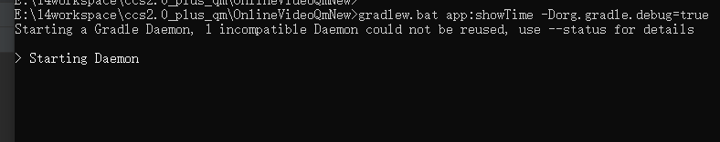

## 应用插件

在build.gradle中声明使用一个插件，大致有一下几种写法：

```
//写法1
plugins {
    id 'com.android.application'
    id 'kotlin-android'
}

//写法2
apply plugin: 'com.android.application'
apply plugin: 'kotlin-android'

//写法3
apply{
    plugin 'com.android.application'
    plugin 'kotlin-android'
}
//---以上都是通过id。也可以指定插件类名：
apply plugin: com.my.DateAndTimePlugin
apply{
    plugin com.my.DateAndTimePlugin
}
```

## 自定义插件

### 一. 在build.gradle中定义Plugin

```groovy
//build.gradle
class DateAndTimePlugin implements Plugin<Project>{

    @Override
    void apply(Project inProject) {
        inProject.extensions.create("dateAndTime", DateAndTimePluginExtension)

        inProject.task('showTime').doLast{
            println "Current time is " + new Date().format(project.dateAndTime.timeFormat)
        }
        inProject.tasks.create('showDate').doLast{
            println "Current date is " + new Date().format(project.dateAndTime.dateFormat)
        }
    }
}
class DateAndTimePluginExtension {
    String timeFormat = "MM/dd/yyyyHH:mm:ss.SSS"
    String dateFormat = "yyyy-MM-dd"
}

apply plugin: DateAndTimePlugin
println dateAndTime.dateFormat //打印yyyy-MM-dd
```

每一个自定义的Plugin都需要实现`Plugin<T>`接口，事实上，除了给Project编写Plugin之外，我们还可以为其他Gradle类编写Plugin。该接口定义了一个apply()方法,把T对象传进来。

通过这个例子，可以领悟自定义Plugin有什么用。我可以把这个插件的代码单独拿出来，然后通过传进来的project对象，给project添加task、定义额外的Property。然后在build.gradle里面使用这些task和property。假设你给别人提供了一堆资源，别人把资源引入到项目里面。引入的方法可能很复杂。你可以通过自定义Plugin，在plugin里面把引入资源的代码写好，打包出来，别人只需要apply plugin一下就行了。

### 二. 单独的模块中创建Plugin

在Android Studio中新建module，模块可以选Android Library，选什么模板是无所谓的，因为我们后面会把多余内容删掉，重写build.gradle。

新建模块叫做“plugin1”，当然名字是随便起的。然后在src/main目录新建“groovy”目录，把多余的文件删掉。

把前面的例子里，里面的两个类放到groovy目录下，你需要创建两个文件：DateAndTimePlugin.groovy、DateAndTimePluginExtension.groovy，然后把内容copy进去。最终目录结构像这样：


如果你的groovy目录不是天蓝色，不要奇怪，这时gradle还没写好，代码目录无法识别。把build.gradle中默认生成的内容删掉，替换成以下：

```groovy
apply plugin: 'groovy'

dependencies {
    implementation gradleApi()
    implementation localGroovy()
}
```

sync一下，代码里面引用java类库的地方可能仍然报红，这个应该是IDE的问题，不影响构建。但是毕竟视觉不好，而且影响开发。我把jdk里面的rt.jar手动拷贝到libs下，并在dependencies里添加了`implementation fileTree(include: ['*.jar'], dir: 'libs')`，暂时解决这个问题，不过这应该不是好的解决办法。

菜单build-make module,然后build目录会生成plugin1.jar:


这个plugin1.jar就是我们打包出来的gradle插件，你可以在其它模块中使用它。下面我们把它用到“:app”模块中。

打开rootProject的build.gradle文件，在buildscript语句块添加此plugin1.jar：

```groovy
buildscript {
    ....xxxxxx
    
    dependencies {
        classpath fileTree(dir: 'app/libs', include: 'plugin1.jar')//这样你的脚本里才能引用到此jar包
    }
}
```

然后打开app模块的build.gradle，在文件开头添加：

```groovy
apply plugin: com.my.DateAndTimePlugin//包名.类名
```

后面就可以使用这个plugin添加的属性和task了。比如配置dateAndTime：

```groovy
dateAndTime {
    timeFormat = 'HH:mm:ss.SSS'
    dateFormat = 'MM/dd/yyyy'
}
```

然后执行showTime这个task：

```shell
E:\RootProj>gradlew.bat showTime

> Task :app:showTime
Current time is 17:16:39.111

BUILD SUCCESSFUL in 1s
```

OK!

我们平时应用安卓插件是这样写的：`apply plugin: 'com.android.application'`,是通过ID，而我们上面的例子没有ID，现在给插件定义ID。

在src/main目录下(也就groovy目录的平级目录)新建"resources"目录，并在"resources"目录下新建“META-INF”目录，“META-INF”下新建“gradle-plugins”目录：


新建文件名叫：“test.properties”，内容：`implementation-class=com.my.DateAndTimePlugin`。


这样就给com.my.DateAndTimePlugin起了个名字叫“test”。然后`apply plugin: com.my.DateAndTimePlugin`你可以换成：

```groovy
apply plugin: 'test'
```

为了避免ID冲突，文件名可以用包名做前缀，比如“com.hsae.test.properties”,这样id就是‘com.hsae.test’。

#### 发布到本地maven仓库

plugin1的build.gralde添加代码：

```groovy
apply plugin: 'groovy'

dependencies {
    implementation gradleApi()
    implementation localGroovy()
}
//添加maven的支持
apply plugin: 'maven'

group='com.my'
version='1.0.2'

uploadArchives {
    repositories {
        mavenDeployer {
            repository(url: uri('../repo'))//发布到本地repo目录
        }
    }
}
```

执行task：`gradle uploadArchives`，然后看是不是发布出来了：


目录层次是：com-my-plugin1-1.0.2, com-my是包名，plugin1是插件名，1.0.2是版本。不过这么说太不专业了，就算我们的包名是com.my, 发布出来的路径也不一定是com-my。你应该看出来了，实际是上面gradle脚本里的`group='com.my'`决定的，只是我们总是让它等于包名。在maven里面，专业叫法是，“com-my” 称为“groupId”，“plugin1”是“artifactId”，“1.0.2”是“version”。几个属性组合起来称为maven坐标，你发布的包的maven坐标应该是全球唯一的。

>  groupId ：the unique identifier of the organization or group that created the project 
>
> GroupID 是项目组织唯一的标识符，实际对应JAVA的包的结构，是main目录里java的目录结构。
>
> artifactId ：unique base name of the primary artifact being generated by this project
>
> ArtifactID是项目的唯一的标识符，实际对应项目的名称，就是项目根目录的名称。

当然，除了发布到本地maven仓库之外，你也可以发布到远程maven仓库，比如jcenter中央仓库。

发布到maven后，你原来buildscript的语句可以修改如下：

```groovy
buildscript {
    repositories {
        maven {
            url uri('./repo')
        }
    }
    dependencies {
        classpath "com.my:plugin1:1.0.2"//groupId 、artifactId 、version之间用冒号分隔
    }
}
```

对比原来的：classpath fileTree(dir: 'app/libs', include: 'plugin1.jar')。classpath 由直接引用jar包，变成了根据maven坐标引用。这样的好处是，你们公司可以自己用一台服务器作为maven中央仓库，然后所有团队成员直接引用中央仓库，不需要把jar包下载下来：

```groovy
buildscript {
    repositories {
        maven {
            url 'https://xx.xx.xx/yourcenter'
        }
    }
    dependencies {
        classpath "com.my:plugin1:1.0.2"
    }
}
```

#### 安装插件

在uploadArchives的下面，继续新增代码：

```groovy
install {
    repositories.mavenInstaller {
        pom.version = '0.0.1' // 配置插件版本号
        pom.artifactId = 'myplugin' // 配置插件标识
        pom.groupId = 'com.my' // 配置插件组织
    }
}
```

执行 ./gradlew install，便会把插件安装在本地 maven 仓库。可能会疑惑和uploadArchives的区别。一个是打包发布，一个是安装。uploadArchives需要你传入发布的路径，而mavenInstaller不需要指定路径，会直接安装到`“C:\Users\youname\.m2\repository\”`(以windows为例)

#### 调试插件

1. 在AndroidStudio中调试插件，首先新增一个 remote 配置


2. 然后在代码里打上断点：


3. 接着执行task，后面加个参数：

```shell
> gradlew.bat app:showTime -Dorg.gradle.debug=true
```



你看到它在Starting Daemon后面停下来了，这是在等待debug进程连接。

4. 在 as 中点击 debug 按钮：


5. 然后gradle马上就接着往下执行了。当执行到断点位置时，会停下来：

   

## 常用的远程中央仓库

```groovy
maven{ url 'https://maven.aliyun.com/repository/google' }
maven{ url 'https://maven.aliyun.com/repository/jcenter' }
```

因为是国内阿里云的镜像，没有被墙，所以网速较快，建议项目都改一下。

## 更多插件

到Gradle社区上找：https://plugins.gradle.org