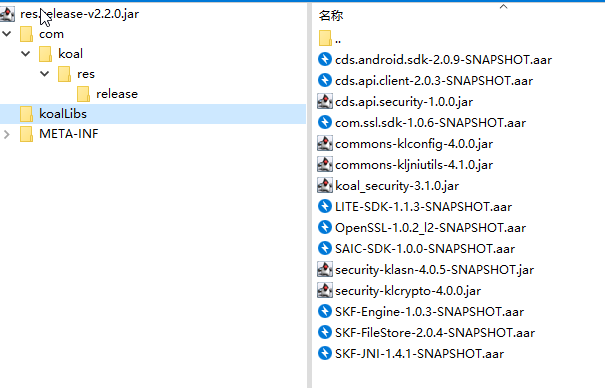
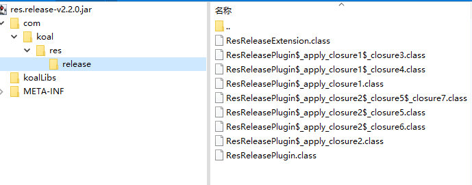
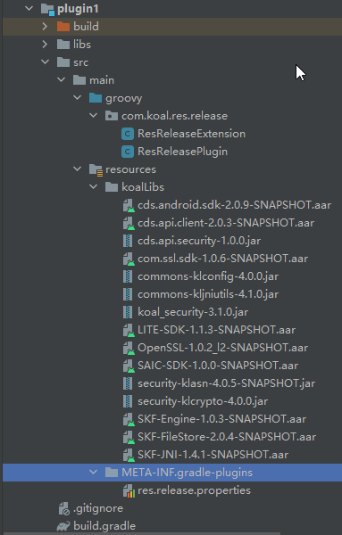

公司接了一个上汽海外出行的项目，里面有一个安全模块，使用的是上汽旗下的格尔安全的PKI SDK。

老版本的PKISDK,需要把一系列aar文件和jar文件拷贝到libs目录下，然后在build.gradle添加如下代码：

```groovy
//build.gradle
repositories {
    jcenter()
    //添加：
    flatDir {
        dirs 'libs'
    }
}
android {
    //添加：
     packagingOptions {
        exclude 'values/strings.xml'
    }
}
//添加：
dependencies {
    //    implementation "koal.security3:koal_security:3.1.0"

    if(rootProject.ext.isDebug){
        compile project(path: ':SAIC-SDK')
    // 格尔SAIC-SDK相关库
    }else{
        api 'com.google.code.gson:gson:2.8.2'
        api 'org.bouncycastle:bcprov-jdk15on:1.57'
        implementation 'com.orhanobut:logger:2.1.0'
        implementation 'org.slf4j:slf4j-api:1.6.6'
        implementation 'org.apache.commons:commons-lang3:3.4'
        implementation 'commons-io:commons-io:2.5'
        implementation "commons-codec:commons-codec:1.3"
        implementation (name:'cds.android.sdk-2.0.9-SNAPSHOT',ext:'aar')
        implementation (name:'cds.api.client-2.0.3-SNAPSHOT',ext:'aar')
        implementation (name:'LITE-SDK-1.1.3-SNAPSHOT',ext:'aar')
        implementation (name:'OpenSSL-1.0.2_l2-SNAPSHOT',ext:'aar')
        implementation (name:'SAIC-SDK-1.0.0-SNAPSHOT',ext:'aar')
        implementation (name:'SKF-Engine-1.0.2-SNAPSHOT',ext:'aar')
        implementation (name:'SKF-FileStore-1.0.10-SNAPSHOT',ext:'aar')
        implementation (name:'SKF-JNI-1.4.1-SNAPSHOT',ext:'aar')
    }
}
```

后来，格尔更新了版本，新提供的SDK只有一个“res.release-v2.2.0.jar”文件。我以为是一个普通jar，但其实解压是这样的：



普通的jar包里面应该是class文件，而这个jar包里面把aar和jar当做资源文件放在koalLibs目录。然后，release目录下是class文件：



很显然，格尔通过自定义gradle插件，把gradle里的配置帮我们实现好了。我们只需要在build.gradle里面apply一下：

```
buildscript{
    dependencies{
        classpath fileTree(dir: 'libs', include: 'res.release-v2.2.0.jar')
    }
}
apply plugin: 'res.release'

// 参数控制是否依赖代理sdk,上汽不使用代理sdk，选择false可缩小体积
resRelease{
    sslEnabled false
}
```

现在分析一下这个插件是如何实现的。先反编译ResReleaseExtension、ResReleasePlugin。因为是groovy写的，反编译成java后代码非常难读，还有几个函数没法反编译。不过我们已经知道这个插件的功能了，使用多个反编译工具比对着看，连蒙带猜，最终还原出了groovy源码。

```groovy
Reference project = new Reference(project);
CallSite[] arrayOfCallSite = $getCallSiteArray(); arrayOfCallSite[0].call(arrayOfCallSite[1].callGetProperty((Project)project.get()), "resRelease", ResReleaseExtension.class);
Reference resRelease = new Reference((ResReleaseExtension)ScriptBytecodeAdapter.castToType(arrayOfCallSite[2].callGetProperty((Project)project.get()), ResReleaseExtension.class));

//1. 找到这个类或闭包的$createCallSiteArray_1方法，从而确定arrayOfCallSite[0]、arrayOfCallSite[1]、arrayOfCallSite[2]分别代表什么方法
//2. Reference project = new Reference(project); ---> 忽略Reference，直接使用project对象
//3. arrayOfCallSite[1].callGetProperty((Project)project.get()) --> arrayOfCallSite[1]="extensions",所以是"extensions".callGetProperty(project),就是访问project的属性：project.extensions
//4. arrayOfCallSite[0]="create"，所以就是"create".call(project.extensions, "resRelease", ResReleaseExtension.class),这是用反射的方法调用函数，第一个参数是对象，后面是方法的参数。
//5. ScriptBytecodeAdapter.castToType这行就是把创建的resRelease属性赋值给本地局部变量resRelease
//所以这两行代码翻译过来就是：
ResReleaseExtension resRelease = project.extensions.create("resRelease", ResReleaseExtension)
//也就是给使用这个插件的project创建了一个resRelease属性
```

```groovy
Reference cdsAndroidSdk = new Reference("cds.android.sdk-2.0.9-SNAPSHOT"); cdsAndroidSdk;
//---> 
String cdsAndroidSdk = "cds.android.sdk-2.0.9-SNAPSHOT"
```

```groovy
Object hasApp = arrayOfCallSite[3].call(arrayOfCallSite[4].callGetProperty((Project)project.get()), com.android.build.gradle.AppPlugin.class); hasApp;
    Object hasLib = arrayOfCallSite[5].call(arrayOfCallSite[6].callGetProperty((Project)project.get()), com.android.build.gradle.LibraryPlugin.class); hasLib;
//---->
boolean hasApp = project.plugins.withType(AppPlugin)
boolean hasLib = project.plugins.withType(LibraryPlugin)
```

```groovy
if (BytecodeInterface8.isOrigZ() && !__$stMC && !BytecodeInterface8.disabledStandardMetaClass()) { if (((!DefaultTypeTransformation.booleanUnbox(hasApp)) && (!DefaultTypeTransformation.booleanUnbox(hasLib))))
        throw (Throwable)arrayOfCallSite[8].callConstructor(IllegalStateException.class, "'android' or 'android-library' plugin required.");  } else if (((!DefaultTypeTransformation.booleanUnbox(hasApp)) && (!DefaultTypeTransformation.booleanUnbox(hasLib)))) { throw (Throwable)arrayOfCallSite[7].callConstructor(IllegalStateException.class, "'android' or 'android-library' plugin required."); }
//---->
//莫名其妙的类、方法、属性都忽略，其实就是一个判断：
if (!hasApp && !hasLib) {
    throw new IllegalStateException("'android' or 'android-library' plugin required.")
}
//这一行的意思是，此插件只用于安卓项目和安卓类库项目
```

```groovy
arrayOfCallSite[10].call((Project)project.get(), new _apply_closure1(this, this));

public class _apply_closure1 extends Closure implements GeneratedClosure {
    public _apply_closure1(Object _outerInstance, Object _thisObject) {
        super(_outerInstance, _thisObject);
    }
    public Object doCall(Object it) {
        CallSite[] arrayOfCallSite = $getCallSiteArray();
        arrayOfCallSite[0].callCurrent(this, new _closure3(this, getThisObject()));
        return arrayOfCallSite[1].callCurrent(this, new _closure4(this, getThisObject()));
    }
。。。。省略

//_apply_closure1是一个闭包，跟到闭包里，在闭包里又嵌套调用了闭包---》
project.android {
    packagingOptions {
        exclude "values/strings.xml"
    }
    lintOptions {
        abortOnError false
    }
}
//这是gradle里的常见配置，一旦反编译成java代码，变的非常晦涩。记住闭包编译成字节码后还是一个类，格式是：
    class _apply_closureX extends Closure{
        public _apply_closure2(Object _outerInstance, Object _thisObject, Reference resRelease,....){
            xxx
        }
        Object doCall(Object it){
            xxx//只要关注doCall方法就行了
        }
    }
    //闭包类的构造函数参数都是语法的闭包机制自动传进来的，我们还原groovy时直接删掉，只要看doCall里的逻辑就行。
```

按照这个思路完成插件，打包出来，然后在项目里把格尔提供的SDK删掉，用我自己写的，sync一下。

报错，用前一篇介绍的debug方法，打断点单步执行，修正代码。


附上完整代码：

目录结构：



plugin1模块的build.gradle:

```groovy
apply plugin: 'groovy'

dependencies {
    implementation gradleApi()
    implementation localGroovy()
    //因为我们要在代码里引用AndroidPlugin里的类，所以要加到dependencies里
    implementation "com.android.tools.build:gradle:4.1.3"
    implementation fileTree(include: ['*.jar'], dir: 'libs')
}
```

ResReleaseExtension.groovy:

```groovy
package com.koal.res.release;

class ResReleaseExtension {
    boolean sslEnabled = true;
}
```

ResReleasePlugin.groovy:

```groovy
package com.koal.res.release;

import com.android.build.gradle.AppPlugin;
import com.android.build.gradle.LibraryPlugin
import org.gradle.api.Plugin;
import org.gradle.api.Project
import org.gradle.api.logging.Logger;


class ResReleasePlugin implements Plugin<Project> {

    private Logger log;

    void apply(Project project) {
        ResReleaseExtension resRelease = project.extensions.create("resRelease", ResReleaseExtension)

        String cdsAndroidSdk = "cds.android.sdk-2.0.9-SNAPSHOT"
        String cdsApiClient = "cds.api.client-2.0.3-SNAPSHOT"
        String liteSdk = "LITE-SDK-1.1.3-SNAPSHOT"
        String openssl = "OpenSSL-1.0.2_l2-SNAPSHOT"
        String saicSdk = "SAIC-SDK-1.0.0-SNAPSHOT"
        String skfEngine = "SKF-Engine-1.0.3-SNAPSHOT"
        String skfFileStore = "SKF-FileStore-2.0.4-SNAPSHOT"
        String skfJni = "SKF-JNI-1.4.1-SNAPSHOT"
        String comSslSdk = "com.ssl.sdk-1.0.6-SNAPSHOT"
        String cdsApiSecurity = "cds.api.security-1.0.0"
        String commonsKlConfig = "commons-klconfig-4.0.0"
        String commonsKlJniUtils = "commons-kljniutils-4.1.0"
        String koalSecurity = "koal_security-3.1.0"
        String securityKlAsn = "security-klasn-4.0.5-SNAPSHOT"
        String securityKlCrypto = "security-klcrypto-4.0.0"

        boolean hasApp = project.plugins.withType(AppPlugin)
        boolean hasLib = project.plugins.withType(LibraryPlugin)

        if (!hasApp && !hasLib) {
            throw new IllegalStateException("'android' or 'android-library' plugin required.")
        }

        this.log = project.logger
        project.android {
            packagingOptions {
                exclude "values/strings.xml"
            }
            lintOptions {
                abortOnError false
            }
        }
        String cachePath = project.buildDir.getAbsolutePath() + File.separator + "outputs" + File.separator + "koalLibs"
        File outDir = new File(cachePath)
        if (!outDir.exists()) {
            outDir.mkdirs()
        }
        project.afterEvaluate {
            log.error("project.resRelease " + resRelease.sslEnabled)
            copyAarFile(cdsAndroidSdk, cachePath + File.separator + cdsAndroidSdk)
            copyAarFile(cdsApiClient, cachePath + File.separator + cdsApiClient)
            copyAarFile(liteSdk, cachePath + File.separator + liteSdk)
            copyAarFile(openssl, cachePath + File.separator + openssl)
            copyAarFile(saicSdk, cachePath + File.separator + saicSdk)
            copyAarFile(skfEngine, cachePath + File.separator + skfEngine)
            copyAarFile(skfFileStore, cachePath + File.separator + skfFileStore)
            copyAarFile(skfJni, cachePath + File.separator + skfJni)
            if (resRelease.sslEnabled) {
                copyAarFile(comSslSdk, cachePath + File.separator + comSslSdk)
            }
            copyJarFile(cdsApiSecurity, cachePath + File.separator + cdsApiSecurity)
            copyJarFile(commonsKlConfig, cachePath + File.separator + commonsKlConfig)
            copyJarFile(commonsKlJniUtils, cachePath + File.separator + commonsKlJniUtils)
            copyJarFile(koalSecurity, cachePath + File.separator + koalSecurity)
            copyJarFile(securityKlAsn, cachePath + File.separator + securityKlAsn)
            copyJarFile(securityKlCrypto, cachePath + File.separator + securityKlCrypto)

            project.repositories {
                jcenter()
                flatDir {
                    dirs cachePath
                }
            }
            project.dependencies {
                api "com.google.code.gson:gson:2.8.2"
                api "org.bouncycastle:bcprov-jdk15on:1.57"
                api "org.bouncycastle:bcprov-jdk15on:1.59"
                implementation "com.orhanobut:logger:2.1.0"
                implementation "org.slf4j:slf4j-api:1.6.6"
                implementation "org.slf4j:slf4j-simple:1.6.6"
                implementation "org.apache.commons:commons-lang3:3.4"
                implementation "commons-io:commons-io:2.5"
                implementation "commons-codec:commons-codec:1.3"
                compile "com.nikhaldimann:inieditor:r6"
                compile "com.squareup.okhttp3:okhttp:3.8.0"
                compile "com.android.support:multidex:1.0.3"
                implementation([name: cdsApiSecurity, ext: "jar"])
                implementation([name: commonsKlConfig, ext: "jar"])
                implementation([name: commonsKlJniUtils, ext: "jar"])
                implementation([name: koalSecurity, ext: "jar"])
                implementation([name: securityKlAsn, ext: "jar"])
                implementation([name: securityKlCrypto, ext: "jar"])
                implementation([name: cdsAndroidSdk, ext: "aar"])
                implementation([name: cdsApiClient, ext: "aar"])
                implementation([name: liteSdk, ext: "aar"])
                implementation([name: openssl, ext: "aar"])
                implementation([name: saicSdk, ext: "aar"])
                implementation([name: skfEngine, ext: "aar"])
                implementation([name: skfFileStore, ext: "aar"])
                implementation([name: skfJni, ext: "aar"])
                if(resRelease.sslEnabled){
                    implementation([name: comSslSdk, ext: "aar"])
                }
            }

        }
    }

    /**
     * 拷贝aar文件
     * @param srcFile
     * @param targetFile
     */
    private void copyAarFile(String srcFile, String targetFile) {
        copyFile(srcFile, targetFile, ".aar")
    }

    /**
     * 拷贝jar文件
     * @param srcFile
     * @param targetFile
     */
    private void copyJarFile(String srcFile, String targetFile){
        copyFile(srcFile, targetFile, ".jar")
    }
    private void copyFile(String srcFile, String targetFile, String suffix) {
        File outputFile = new File(targetFile + suffix)
        InputStream inputStream = null
        OutputStream outputStream = null
        try{
            if(outputFile.exists()){
                log.debug(targetFile + suffix + " already existed")
                return
            }
            inputStream = getClass().getClassLoader().getResourceAsStream("koalLibs/" + srcFile + suffix)
            if(inputStream == null){
                log.error("koalLibs" + File.separator + srcFile + suffix + " maybe inexistence, inputstream is null: " + inputStream)
                return
            }
            outputStream = new FileOutputStream(targetFile + suffix)
            byte[] bs = new byte[1024]
            int len = -1
            while((len = inputStream.read(bs)) != -1){
                outputStream.write(bs, 0, len)
            }
        }catch (Exception e){
            log.error(e.getMessage())
            return;
        }finally{
            if(inputStream != null){
                try {
                    inputStream.close()
                } catch (Exception e) {
                    log.error(e.getMessage())
                }
            }
            if(outputStream != null){
                try {
                    outputStream.close()
                } catch (Exception e) {
                    log.error(e.getMessage())
                }
            }
        }
    }
}
```

