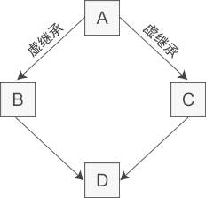

## 类& 对象

类是 C++ 的核心特性，是在 C 语言的基础上增加面向对象编程，引入的特性，也是最复杂难学的部分，需要花大量篇幅。

Linux之父Linus非常排斥C++，其观点也非一无是处。比如简单的用户自定义类型（即类）C语言用结构体也能实现。但是毕竟C++提供了许多面向对象的更高层次特性，不能因为初学者门槛高容易用错就排斥是不是？C++囊括了C，C++包罗万象，c++过于复杂以至于这世上完全了解C++的人不多，不熟悉的特性避开不用其实也能把代码写出来。

有些语言遵从简单的原则，如果一个语法特性能实现目标，就没必要再设计一个语法特性实现同样目标，就好比回字只需要一种写法。但是C++自由度极高，各种编程风格都能用C++实现。什么函数式编程、面向对象编程、模板编程、面向过程等等等等。

### 基本结构

```c++
//Box.h
class Box
{
   public:
      double length;   // 长度
      double breadth;  // 宽度
      double height;   // 高度
      // 成员函数声明
      double get(void);
      void set( double len, double bre, double hei );
};

//Box.cpp
// 成员函数定义
double Box::get(void)
{
    return length * breadth * height;
}
 
void Box::set( double len, double bre, double hei)
{
    length = len;
    breadth = bre;
    height = hei;
}
//使用
Box box;
```

如果把函数实现放在类里面，c++编译器会把函数当成内联函数来对待。我们推荐分开，声明在头文件，实现在cpp文件。

类定义结尾的分号是必需的，因为在类定义之后可以接一个对象定义列表。

### 创建类对象的方式

```c++
//1.
Box box;
//2.创建一个未命名的变量，然后拷贝给box。编译器很可能会优化它。
Box box = Box();
Box box;box = Box();//这样编译器不会优化，可以加日志看到构造函数执行两次。
//3 动态内存
Box *box = new Box;
delete box;
```


### 构造函数、析构函数

编译器默认提供一个无参的构造函数，一旦你自己提供了构造函数(有参或无参)，则编译器不提供默认构造函数。

对于无参的构造函数，创建对象不要加括号：

```c++
class Basic{
public:
	Basic(){
		cout<<"xxxxx"<<endl;
	}
    Basic(int){
	}
};
Basic basic1;//OK
Basic basic2();//NOT OK，编译器把它当成函数声明。
Basic basic3(5);//OK
```

编译器会认为`Basic basic2()`是一个返回Basic对象的函数声明。不会报错，但没有创建basic2对象，构造函数未执行。

动态分配则没有区别：

```c++
	Basic* basic = new Basic;//same as
	Basic* basic2 = new Basic();
```

析构函数是对象释放时执行的函数，里面做释放资源的工作。比如：

```c++
class Mutex(){
    public:
    Mutex(){
        lock();
    }
    ~Mutex(){
        unlock();
    }
}
int fun(){
    Mutex _mutex;
    xxxxx
}
//只要创建了Mutex的对象，后面的代码就都是加锁的了。表面看，没有释放锁，实际上，_mutex是局部变量，代码块结束后，释放_mutex,会执行Mutex的析构函数，里面释放。
```


### 成员初始化

C++11之前的版本，只有静态常量整型数据成员static constant intergral()才可以在类中声明时直接初始化。

```c++
class Basic{
public:
	int a = 1;//wrong
	static int b = 2;//wrong
    const int c = 3;//wrong
    const static int d = 4;//right, 满足三个条件：const、static、整形
    
    //下面全是OK的
    const static char e = 'e';
	const static unsigned char f ='f';
	const static wchar_t  g = 9;
	const static short h = 9;
	const static int i = 9;
	const static long j = 9;
	const static long long k = 9;
    
    //不OK的，float和double不属于整形
	const static float l = 9;
	const static double m = 9;
    
    //OK
    enum AA{ aa1 = 2, aa2 =3,aa3,aa4};
	static const AA a = aa1;
};
```

为什么标准不允许这一行为？ C++之父Bjarne这样解释：

> 一个类会被特别定义在一个头文件中，并且头文件会被包含在许多转换单元里。但是，为了防止链接规则过于复杂，C++需要每一个对象有特定的定义。如果C++允许存储在内存中的对象进行类内定义，那么这一规则将会被打破。

最新的C++标准好像允许了, 另外个别编译器也允许，只是给个警告。

既然普通的static成员变量不能向java那样直接在后面初始化，那么总需要一个初始化的地方，C++规定放在外面：

```c++
class Basic{
public:
	static float fl;
};
int main(){
	Basic::fl = 4.0f;
}
//编译OK，链接时报： error LNK2001: 无法解析的外部符号 "public: static float Basic::ll" (?ll@Basic@@2MA)
//原因在于fl没有初始化
//在类外面加一行初始化即可：
class Basic{
public:
	static float fl;
};
float Basic::fl = 4.0f;//1. 在类定义体外面2.float不能省
int main(){
//	float Basic::fl = 4.0f;这里也不行哦
}
```

非静态的普通成员，如果不初始化，值是不确定的：

```c++
class Basic{
public:
	float fl;

	Basic(){
		cout<<"fl    "<<fl<<endl;//fl的值是随机的
        fl = 4.0f;//所以应该在构造函数里给它赋值，更好是用“初始化列表”
	}
};
```


### 构造函数初始化列表

```c++
class ConstRef{
    public:
    	ConstRef(int ii);
    private:
    	const int ci;
}
//代码1
ConstRef::ConstRef(int ii){
    ci = ii;//错误，ci是const，不能赋值
}
////代码2
ConstRef::ConstRef(int ii):ci(ii){//OK，使用初始化列表
}
```

代码1是，先初始化，再赋值；代码2是直接用ii初始化。大部分时候可以忽略差异，但是，像上面这样，ci是const，显然不能赋值，必须用初始化列表。其次，即使不是const，如果ci不是int，而是一个类类型，没有默认构造函数，那么显然也必须使用初始化列表。比如，

```c++
private:
	A aa;//class A 没有无参的构造函数
public:
	ConstRef::ConstRef(A ii){
        aa = ii;//赋值本身没问题，问题是这之前aa按理应该已经初始化，初始化就必然调用A的无参构造函数，怎么初始化？java这样没问题因为java的A aa是引用
        //另外貌似这里发生了两次拷贝：传参、赋值给aa。
    }
```

那么请问aa怎么初始化呢？显然你必须使用初始化列表，否则报错：

```c++
public:
	ConstRef::ConstRef(A ii):aa(ii){//拷贝构造函数
    }
	ConstRef::ConstRef(int a,int b):aa(a,b){//假设A有一个(int,int)的构造函数
    }
```

先初始化，再赋值这种做法除了可能带来错误之外，还还事关底层效率，所以我们总是推荐用初始化列表而不是在方法体内赋值。

### 类对象的隐式转换

```c++
void fun(CTest test); 

class CTest 
{ 
public: 
    CTest(int m = 0); 
} 
fun(20);//隐式转换
```

这段代码竟然是可以的。fun的参数是CTest类型，fun(20)传了一个int，按理应该报错，但是CTest刚好有一个只接收一个int作为参数的构造函数，于是编译器会将20隐式转成成CTest对象(`CTest(20)`),然后传给fun函数。

通常出乎我们意料的行为都是我们不期望的。所以c++提供了一个`explicit `关键字来禁用隐式转换：

```c++
void fun(CTest test); 

class CTest 
{ 
public: 
    explicit CTest(int m = 0); 
} 
fun(20);//error 隐式转换
fun(static_cast<CTest>(20)); //ok 显式转换
```

我们推荐把所有“只有一个参数的构造函数”都声明为`explicit `。

### 对象赋值

`A aa(a)`或者`A aa = a`是OK的，原因是C++会自动给类提供一个"复制构造函数"，比如假设类A，那么会自动提供原型为`A(const A&);`的构造函数，`A aa(a)`和`A aa = a`实质都是调用拷贝构造函数。

继续，然后再执行`aa = b`,也是OK的，原因是C++的类自动重载赋值操作符，也就是你的类里面隐藏了一个`A & A::operator=(const A &);`。

当然，如果你自己显式定义了`A(const A&)`或者手动重载赋值，就不会自动提供，而是用你自己创建的。

更具体信息参见“隐私成员函数.md”。

### 易错点：互相包含

类A，类B相互包含对方：

```c++
class A{
    int i;
    B b;//A包含B
}
class B{
    int i;
    A a;//B包含A
}
```

A里面有B，B里面又有一个A，无穷尽，对象的内存是无限大，显然是不可以的，所以不能这样写。把其中一个改成指针即可：

```c++
class A
{
    int i;
    B b;
};

class B
{
    int i;
    A* a;
};
```

不过这只是一个示意, 告诉你这种情况要用指针而已，代码本身是有问题的。与java等语言不同，B的定义在后面，前面的A类里面是不能用B的。应该这样：

```c++
class B;//前置声明
class A
{
    class ::B;//这里声明也行，但要加::,否则认为是A::B
	int i;
	B* b;//使用前置声明，这里必须是指针，不能是对象。
};

class B
{
	int i;
	A a;
};
```

`class B;`称为类的前置声明。**应该记住：当使用前置声明时，不能涉及类的任何细节**。因为仅仅进行前向声明而没有定义的类是不完整的，这样的类，**只能用于定义指针、引用、以及用于函数形参的指针和引用。**而不能定义对象(因为此时编译器只知道这是个类，还不知道这个类的大小有多大)，也不能访问类的对象，任何形式的访问都不允许。

## 继承

```c++
class Rectangle: public Shape{//public方式继承
    
}
```

继承方式包括 public（公有的）、private（私有的）和 protected（受保护的）。类(class)默认继承方式是private,结构体(struct)默认继承方式是public。

他们的作用是，把父类中的属性的可见性降低到某个级别，或者说，父类成员继承给子类后，访问权限不得高于继承方式中指定的权限。比如，protected继承，如果父类的某个成员原本就是protected，那么继承过来还是protected；但是如果父类中是public，那么继承过来会降低到protected。

同理，对应private继承，父类的所有成员继承过来都变成private。对于public继承，继承过来还是原来的权限。

private属性无法被子类继承，不管是哪种继承方式。

实际开发中一般使用 public。

### 构造函数与继承

子类的构造函数总是要调用父类的构造函数。默认调用父类的无参构造函数。正常是通过成员初始化列表调用父类构造函数：

```c++
class A{
public :
	A(){cout<<"A的默认构造函数"<<endl;}
	A(int a){}
}
class B:public A{
public :
	//默认调用A的无参构造函数
	B(int a,int b){cout<<"B构造函数"<<endl;}
    
	//通过成员初始化列表调用父类构造函数
	B(int a):A(a){}
	B():A(1){}//B的默认构造函数，调用A的构造函数A(int),且参数总是1
}
//test
B b2(2,3);
输出：
A的默认构造函数
B构造函数
----即先调父类的构造函数，再调自身
```

**tip:**构造函数不需要，也不能加virtual。而析构函数很多时候必须声明为virtual。

### 改变访问属性

```c++
 class People{
    protected:
        char *name;
        int age;
    public:
        void say();
    };
 
class Student: public People{
    private:
        using People::say;  //父类的say函数变成private的
    public:
        using People::name;  //继承父类的name属性，但变成public的
        using People::age;
        float score;
        void learning();
};
```

## 多态

假如Shape 是基类，Rectangle 是子类，Rectangle 重写了Shape中的方法：

```c++
class Shape {
   public://省略不相干代码
      int area(){
         cout << "Parent" <<endl;
         return 0;
      }
};
class Rectangle: public Shape{
   public://省略不相干代码
      int area () { 
         cout << "Rectangle" <<endl;
         return (width * height); 
      }
};
```

rec是Rectangle类型的对象：`Rectangle rec`，然后rec.area()当然调用的子类Rectangle的area函数。但是通过父类引用它:`Shape *shape=&rec`,然后调用`shape->area();`,调用的是父类Shape的area函数。

我们希望像java语言或其它现代高级语言那样，调用的实际对象类型的函数，而不是引用对象的指针的类型的函数。这就是多态性。C++里多态通过虚函数和动态联编实现。关键字 **virtual**：

```c++
class Shape {
   public://省略不相干代码
      virtual int area()
      {
         cout << "Parent" <<endl;
         return 0;
      }
};
```

称为**虚函数**。就是在**基类**中使用关键字 **virtual** 声明的函数。在派生类中重新定义基类中定义的虚函数时，会告诉编译器不要静态链接到该函数。

**虚函数**会使对象变大，大出一个指针的大小，因为在对象占用内存的开始处增加了一个指向**虚函数表**的指针。当我们用父类的指针来操作一个子类的虚函数的时候，这张虚函数表就像一张地图一样指明了实际所应该调用的函数，是C++实现多态的原理。

Visual Studio可以支持通过配置查看虚函数表。

后面我们会通过代码研究C++对象的内存布局，探讨各种情况，包括继承、有虚函数、没有虚函数等各种情形，从而明白c++的原理。

在整条继承链上，只要有一个类中的某个方法是virtual的，那么从这个类开始，所有子类重写的方法都是virtual的方式。所以，理论上只需要把父类中的函数声明为virtual就行了。

下面例子，继承关系是A<--B<--C<--D，其中只有B的show函数加了virtual关键字。那么通过A的指针调用时，始终调用的A的show方法；通过B、C、D调用，调用的是对象真实类型的show。

```c++
class A {
    public :
        void show() { cout << "A show" << endl; }

        virtual ~A() {}
    };

    class B : public A {
    public :
        virtual void show() { cout << "B show" << endl; }
    };

    class C : public B {
    public:
        void show() { cout << "C show" << endl; }
    };

    class D : public C {
    public:
        void show() { cout << "D show" << endl; }
    };

    int main_extend() {
        A *a = new B;
        a->show();//A show
        B* b = static_cast<B*>(a);
        b->show();//B show

        A* aa = new C;
        aa->show();//A show
        B* bb = static_cast<B*>(aa);
        bb->show();//C show
        C* cc = static_cast<C*>(aa);
        cc->show();//C show

        C* ccc = new D;//C没有声明virtual，但继承B
        ccc->show();//D show
        return 0;

    }
```


### 析构函数声明成虚函数

假设有 `A* a = new B;`如果析构函数不是virtual，那么delete a, 会只调用A的析构函数。B中分配的资源无法释放。而如果是virtual，delete a，会先调用 ~B(), 再调用 ~A()。因此，析构函数应尽量声明为virtual。

### 纯虚函数

```c++
class Shape {
   public://省略不相干代码
      virtual int area() = 0;
};
```

= 0 告诉编译器，函数没有主体，上面的虚函数是**纯虚函数**。

c++中没有接口的概念，含有纯虚函数成员的类称为抽象类，只含有纯虚函数的类称为纯虚类。这样我们可以大致和java对应起来：

　　C++   ----------      Java
　　虚函数 --------     普通函数
　　纯虚函数 -------- 抽象函数
　　抽象类 --------     抽象类
　　虚基类 ----------  接口

## 友元

```c++
//Box.h
class Box
{
   double width;
public:
   double length;
   friend void printWidth( Box box );//Box类声明，虽然printWidth不是我的成员函数，但作为老朋友，可以访问我的私有成员和保护成员
   void setWidth( double wid );
   friend class BigBox;//友元类,BigBox的所有成员都是Box的友元
};
//其它文件
void printWidth( Box box )
{
   /* 因为 printWidth() 是 Box 的友元，它可以直接访问该类的任何成员 */
   cout << "Width of box : " << box.width <<endl;
}
//BigBox.h
class BigBox
{
public :
    void Print(int width, Box &box){
        // BigBox是Box的友元类，它可以直接访问Box类的任何成员
        box.setWidth(width);
        cout << "Width of box : " << box.width << endl;
    }
};
```

`friend class BigBox`这个声明相当于一个授权，允许BigBox访问自己的私有属性，而不是自己访问BigBox的。类比到现实，我说你是我好友，你可以随便用我的东西；总不能反过来，我单方面称咱俩是好友，然后我就可以随意用你的东西了？

### 结合模板

在Android的智能指针的源码StrongPointer.h中有：

```c++
template <typename T>
class sp
{
    ...
    private:
      template<typename Y> friend class sp;
    ...
}
```

疑惑是，friend class sp这个类不就是自己吗？为什么声明自身为友元？

实际上可以看到，typename参数是不一样的，即这是两个类。

## 操作符重载

见“运算符重载.md”。

## 多重继承、二义性

class C继承了class A 和class B，A和B都有一个id。那么在C里面访问id，必须指明是A和还是B的：

```c++
class C : A, B {
    public:
        void printId() {
            //C里面有两个id，分别从A和B继承过来,所以不指定域的话，编译器不知道访问的是哪一个。
            A::id = 1;
            B::id = 2;
            cout << A::id << endl;//A中的id
            cout << B::id << endl;//B中的id

            //cout<<id<<endl;//二义性
        }
};
```

### 虚继承、虚基类

通过虚继承避免二义性。



上图中的A称为虚基类（Virtual Base Class）。

```c++
class Base {
    protected:
        long id;
}
class VA : virtual public Base {//虚继承

 };

class VB : public virtual Base {//虚继承

};
class VC : public VA, VB, B {//VA是公有继承，VB、B是私有继承
    public:
    void printId() {
        VA::id = 1;
        cout << VA::id << "  same as " << VB::id << endl;
        VB::id = 2;
        cout << VA::id << "  same as " << VB::id << endl;
        
        B::id = 4;
        cout << B::id << endl;
    }
};
```

所有虚继承Base的类都是共享一个变量。上面的例子，VA的id和VB的id是同一个。但是class B没有virtual继承Base，所以B的id是自己的。

## 类模板和泛型编程

基本的使用和函数模板差不多，联想一下大部分就懂了

```c++
//Queue.h
template <class Type> class Queue {
 public:
	 Queue ();                // default constructor
	 Type &front ();          // return element from head of Queue
	 const Type &front () const;
	 void push (const Type &); // add element to back of Queue
	 void pop();              // remove element from head of Queue
	 bool empty() const;      // true if no elements in the Queue
 private:
	 // ...
};
//Queue.cpp
template <class Type>
void Queue<Type>::pop() {
     // pop is unchecked: Popping off an empty Queue is undefined
     QueueItem<Type>* p = head; // keep pointer to head so we can delete it
     head = head->next;         // head now points to next element
     delete p;                  // delete old head element
 }


//使用
Queue<int> qi;                 // Queue that holds ints
Queue< vector<double> > qc;    // Queue that holds vectors of doubles
Queue<string> qs;              // Queue that holds strings
//Queue qs; //错，必须指定模板实参
```

使用函数模板时，编译器通常会为我们推断模板实参;类模板你必须像`Queue<int> qi`这样显式指定。

### 类模板的特化

含义与函数模板特化一样。语法上也是前面加“template<>”：

```c++
/*
	上面泛型的Queue类不适用于C风格的字符串，因此为const char* 定义整个类的特化版本
*/
template<> class Queue<const char*> {
 public:
	 // no copy control: Synthesized versions work for this class
	 // similarly, no need for explicit default constructor either
	 void push(const char*);
	 void pop()                  {real_queue.pop();}
	 bool empty() const          {return real_queue.empty();}
	 // Note: return type does not match template parameter type
	 std::string front()         {return real_queue.front();}
	 const std::string &front() const
								 {return real_queue.front();}
 private:
	 Queue<std::string> real_queue; // forward calls to real_queue
 };
//外部类特化定义,前不能加 template<> 标记
void Queue<const char*>::push(const char* val){
    return real_queue.push(val);
}
```

部分特化：

```c++
template <class T1, class T2>
class some_template {
        // ...
};
// 部分特化: T2 作为int
template <class T1>
class some_template<T1, int> {
        // ...
};
some_template<int, string> foo; // uses template
some_template<string, int> bar; // uses partial specialization
```


### 作用域

屏蔽规则

```c++
typedef double T;//假设有一个类型、函数、变量叫T

template <class T> T calc(const T &a, const T &b)
{
    //屏蔽全局作用域中声明的同名对象、函数或类型
    // T是模板参数T，而不是typedef double T
    T tmp = a;
}

```

### 元编程(Metaprogramming)

编写或者操纵其他程序（或者自身）作为它们的数据，或者在运行时完成部分本应在编译时完成的工作,开发这类程序称为“元编程”。编写元程序的语言称之为元语言，被操作的语言称之为目标语言。一门语言同时也是自身的元语言的能力称之为**反射**。

在1994年，C++标准委员会在圣迭戈(SanDiego)举行的一次会议期间， Erwin Unruh展示了一段特别的代码。这段代码的特别之处在于程序的功能在编译期实现而非运行期，编译器以错误信息的方式产生从2到某个给定值之间的所有质数。同年夏天， Todd Veldhuizen 受Erwin 的例子启发，发现可以使用C++模板进行元编程，并发表了一份技术报告。

```c++
#include <iostream>
#include <string>
using namespace std;

#ifndef META_PROGRAMMING_H
#define META_PROGRAMMING_H

//主模板
template<int N> //模板
class Fibonacci
{
public:
    enum{Result = Fibonacci<N-1>::Result + Fibonacci<N-2>::Result };
//枚举，带有隐含计算
};
//完全特化模板
template<>
class Fibonacci<1> //带常参数1的构造函数
{
public:
    enum { Result = 1 };
//给枚举赋初值1
};
//完全特化模板
template<>
class Fibonacci<0> //带参数0的模板
{
public:
    enum { Result = 0 };
//给枚举赋初值0
};
#endif

//模板元编程
int main(){
    std::cout << "第20项的Fibonacci数是：" << Fibonacci<20>::Result << std::endl;
	return 0;
}
//output: 第20项的Fibonacci数是：6765
```

这段代码的玄妙在于，它不是运行程序计算出斐波拉契，而是在编译时就算出来，生成的目标代码里面没有算法，只是简单打印值而已。我们用ida反汇编：

```c++
  //main函数的伪代码
  __int64 v0; // rax
  __int64 v1; // rax

  v0 = std::operator<<<std::char_traits<char>>(refptr__ZSt4cout, &unk_140005050);
  v1 = std::ostream::operator<<(v0, 6765i64);//6765是写死在代码里的。i64是__int64的意思
  std::ostream::operator<<(v1, refptr__ZSt4endlIcSt11char_traitsIcEERSt13basic_ostreamIT_T0_ES6_);
```

正如递归算法必须有终止条件，这个程序也需要N是0和1时，指定模板特例化。