## IDE工具

visual Studio中看内存分布非常强大

1. 选中文件，右键，属性

   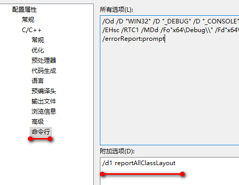

   附加选项里写：`/d1 reportAllClassLayout`,可以看到所有相关类的内存布局。如果写上`/d1 reportSingleClassLayoutXXX`（XXX为类名），则只会打出指定类XXX的内存布局。

2. 我定义了一个类，代码如下：

   ```c++
   class Basic{
   public:
   	float height;
   	virtual void f(){}
   };
   ```

   附加选项写上“/d1 reportSingleClassLayoutBasic”。然后构建项目，下面输出：

   ```txt
   1>正在编译...
   1>testClass.cpp
   1>class Basic size(16):
   1> +---
   1> 0 | {vfptr}
   1> 8 | height
   1>   | <alignment member> (size=4)
   1> +---
   1>Basic::$vftable@:
   1> | &Basic_meta
   1> |  0
   1> 0 | &Basic::f
   1>Basic::f this adjustor: 0
   1>正在编译资源清单...
   ```

   这个内存结构图分成了两个部分，上面是内存分布，下面是虚表;

   另外，visual studio debug查看对象的值，显示的比较全，包括虚函数表指针：
   
   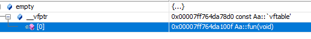
   
   Clion，至少我用的版本和配置只显示普通成员，不显示vfptr。但Clion能dump二进制内存。

CLion中这样查看某个对象的内存视图(dump二进制内存)：

先打断点，Debug执行，断点停下后，鼠标放上去(或者右击-Evaluate Expression...),这是会弹出一个窗口显示变量的值：

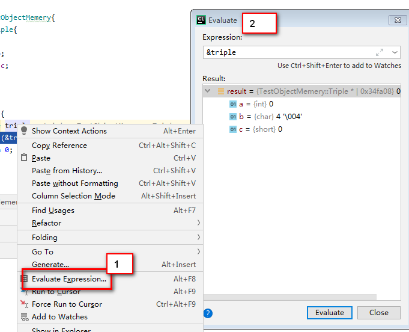

选中变量，右击，点最下面的“Show in Memory View”。

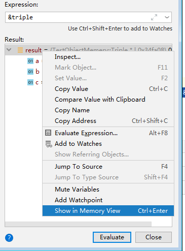

这时就会打开二进制的视图：

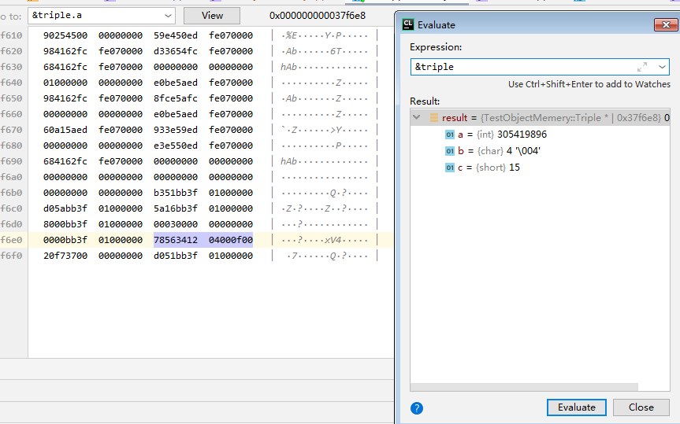

紫色的代表是tripple的范围。这时如果上面文本框内容改为"&triple.a"，点击View，鼠标光标会调到a的首地址前面。

triple的结构体定义是：

```c++
struct Triple{
    int a;
    char b;
    short c;
};
```

需要注意几点：

* 图上看，triple.a的十六进制是78563412。因为地址是从左往右增长，我们是小端存储，所以triple.a的int值是0x12345678。同理，triple.c是short类型，两个字节，在图上看到的是0f00，实际表示的是00f0,即十进制的15。

* 开始我选中triple，右击发现“Show in Memory View”是灰的，浪费了许多时间都没解决，我甚至换了编译器。后来找到clion的官网：https://www.jetbrains.com/help/clion/memory-view.html ， 有一句“select the desired *pointer*variable.”，原来要用这个功能，你应该选中一个指针，所以我选中“&triple”就行了。原来这个功能不是看对象的二进制，而是输入一个地址，把地址处的内存显示出来。比如，我在文本框里写了一个地址，果然紫色也能跳到地址处：

  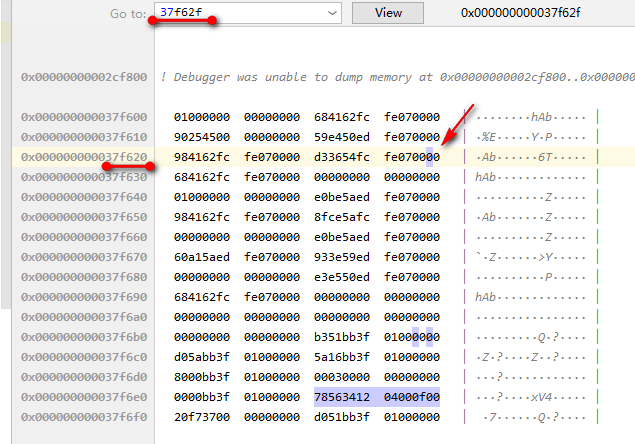

* triple.b是char类型，按理char是一个字节，但是我们看到b和c的内存是0400 0f00。前面04是char b的值。也就是b和c中间空了一个字节。。sizeof(triple) ==8。这就是前面讲过的内存对齐。即使我们把`short c;`删掉，sizeof(triple)依然是8，内存变成0400 0000。按照几个字节对齐，取决于硬件和编译器。

现在开始分析类对象的内存布局。

## 基础概念

* 堆内存(heap): 允许程序在运行时，动态地在堆上申请某个大小的内存空间，通过new,malloc。
* 栈内存（stack）:  编译器在需要时分配，在不需要时自动清除，存取速度比堆要快。存放局部变量、函数参数
* 全局/静态数据区 : 全局和静态变量被分配到同一块内存,C语言中，未初始化的放在.bss段中，初始化的放在.data段中；在C++里则不区分。
* 常量存储区（.rodata段）：存放常量
* 代码区（.text段） ：存放代码（如函数），不允许修改。

可执行程序包括BSS段、数据段、代码段。

BSS段（Block Started by Symbol）： 用来存放程序中未初始化的或者初始化为0的全局变量和静态变量，程序执行之前BSS段会自动清0，这也就是为什么`C语言`中未显式初始化的全局变量的值为默认为`0`。属于静态内存分配。

DATA段： 显式初始化为非零的全局变量存放在`.data段`中。静态局部变量(也就是static修饰的局部变量)也分配在.data段。

代码段除程序的可执行部分外，一些特殊类型的数据也会被存放在代码段，如C语言中定义的字符串常量。单片机的编译器中，将`cosnt`修饰的变量放在代码段实现无法被修改，但在`gcc`中，`const`型常量和普通变量一样被放在数据区。(编译器来检查确保`const`型的常量不会被修改,所以实际上是可以用指针修改的)

UNIX下可使用size命令查看可执行文件的段大小信息:

```shell
work@S111-CCS2plus:~$ size  `which ls`
   text	   data	    bss	    dec	    hex	filename
 124042	   4728	   4832	 133602	  209e2	/bin/ls
```

Linux/Unix的可执行文件采用ELF文件格式；windows采用PE格式。但是许多地方是共通的。

我们以文本方式打开一个可执行文件，搜索“.bss”、“.data”、“.text”,一般也能搜索到，表示以下这一段属于bss/data/code。

linux虚拟内存一个进程的分布如下：

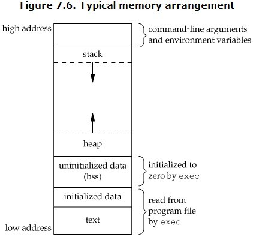

下图左边的是UNIX/LINUX系统的执行文件，右边是对应进程逻辑地址空间的划分情况：

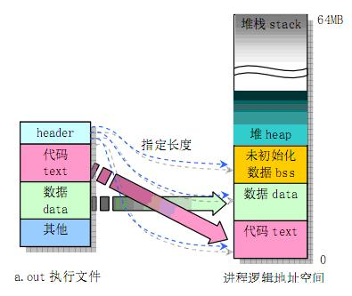

vbptr： 虚基类指针

vbtable： 虚基类表

`__vfptr`：虚函数表vtable指针，类型为`void**`。

## 实例

用visual studio和clion调试，观察内存结构。clion使用的gcc，和vs不是同样的编译器，但是现代编译器对C++的实现，不是太偏冷怪的地方都差不多，互相印证也没问题。

1. 空类

```c++
class Empty{};
int main(){
	Empty empty;
	cout<<sizeof empty<<endl;//输出： 1
}
```

​	vs:

```
1>testClass.cpp
1>class Empty size(1):
1> +---
1> +---
```

可以看到类的大小是1(指类实例的内存占用大小)。但里面是空的。这1字节是为了标识该对象，因为这个类的对象你能创建和引用它，就必须在内存中有一段内存。这是该对象的内存：

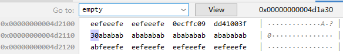

2. 添加成员变量

   ```c++
   class A{
   	int a;
   	char c;
   };
   ```

   内存分布：

   ```shell
   1>class A size(8):
   1> +---
   1> 0 | a
   1> 4 | c
   1>   | <alignment member> (size=3)
   1> +---
   ```

   可见大小是8字节，a占用4字节，c是一字节，c后面有3字节没用的空间是为了内存对齐。

3. 加一个成员函数：

   ```c++
   class Aa{
   	int a;
   	char c;
   	void fun(){cout<<"fun"<<endl;}
   };
   ```

   内存不变：

   ```shell
   1>class Aa size(8):
   1> +---
   1> 0 | a
   1> 4 | c
   1>   | <alignment member> (size=3)
   1> +---
   ```

   因为函数代码是所有对象共享的，位于代码段，对象不会因为函数增加空间。包括把函数实现放到类外面也是一样。

4. 只有一个虚函数的类

   ```c++
   class Aa{
   	virtual void fun();
   };
   ```

   fun的实体当然还是在代码区，但是对象里多了一个vfptr。vfptr即虚函数表指针,指向虚函数表(vftable)。虚函数表位于只读数据段（.rodata）,也就是C++内存模型中的常量区；而虚函数则位于代码段（.text），也就是C++内存模型中的代码区。

   C++标准规定, 虚函数表指针必须位于对象实例的内存开头，因此，这样得到虚函数表的地址：

   ```c++
   Aa *a = new Aa();
   long vbaddr=*(int *)a;   //虚函数表地址
   ```

   根据虚函数表的地址可以得到虚函数fun的地址：

   ```c++
   long vfaddr= *(int *)vbaddr;  //虚函数Aa::fun的地址
   ```

    然后还可以根据fun的地址来调用这个函数：

   ```c++
   ((void(*)(void))vfaddr)();  //根据得到的地址来调用虚函数 
   ```

   

   内存布局如下:

   ```shell
   1>testClass.cpp
   1>class Aa size(8):
   1> +---
   1> 0 | {vfptr}
   1> +---
   1>Aa::$vftable@:
   1> | &Aa_meta
   1> |  0
   1> 0 | &Aa::fun
   1>Aa::fun this adjustor: 0
   ```

   我们debug看得更清楚一点：

   

   至于size为什么是8？我的机器地址(指针)是64位8字节而已。

5. 加一些成员

   ```c++
   class Aa{
   public:
   	int a;
   	virtual void fun();
   	virtual void fun2();
   	int b;
   };
   void Aa::fun(){
   	cout<<"fun"<<endl;
   }
   void Aa::fun2(){
   	cout<<"fun2"<<endl;
   }
   ```
   size是16：
   ```shell
   1>class Aa size(16):
   1> +---
   1> 0 | {vfptr}
   1> 8 | a
   1>12 | b
   1> +---
   1>Aa::$vftable@:
   1> | &Aa_meta
   1> |  0
   1> 0 | &Aa::fun
   1> 1 | &Aa::fun2
   1>Aa::fun this adjustor: 0
   1>Aa::fun2 this adjustor: 0
   ```

   debug:

   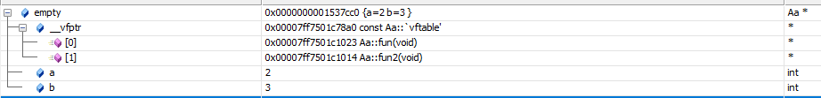

   我们利用指针运算去访问a和b：

   ```c++
   Aa* empty = new Aa;
   empty->a = 2;
   empty->b = 3;
   void** vptr = (void**)empty;
   cout<<"empty size "<<sizeof *empty<<endl;
   cout<<"vptr "<<*vptr<<endl;
   cout<<"a "<<*(int*)((char*)vptr+ sizeof (int*))<<endl;
   cout<<"b "<<*(int*)((char*)vptr+ sizeof(int) + sizeof(int))<<endl;
   cout<<"----end"<<endl;
   //某次输出：
   empty size 16
   vptr 00007FF7501C78A0
   a 2
   b 2
   ```

   可以看到，只要知道内存布局，即使a是private的，我一样可以通过对对象的指针加一个偏移，访问到a的内容。

   同时也表明，指向虚函数表的指针是放在对象的最前面(保证取到虚函数表的最高性能)。

6. 简单继承

   ```c++
   class Aa{
   public:
   	int a;
   	int b;
   };
   class Ba:public Aa{
   	int c;
   };
   ```

   ```shell
   1>class _s__RTTIBaseClassDescriptor2 size(36):
   1> +---
   1> 0 | pTypeDescriptor
   1> 8 | numContainedBases
   1>12 | _PMD where
   1>24 | attributes
   1>28 | pClassDescriptor
   1> +---
   1>class _s__RTTIBaseClassArray size(1):
   1> +---
   1> 0 | arrayOfBaseClassDescriptors
   1> +---
   1>class Ba size(12):
   1> +---
   1> | +--- (base class Aa)
   1> 0 | | a
   1> 4 | | b
   1> | +---
   1> 8 | c
   1> +---
   ```

   不清楚_s__RTTIBaseClassDescriptor2、_s__RTTIBaseClassArray是什么。sizeof(Ba)为12。观察内存：

   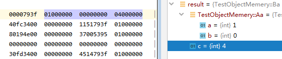

   从父类继承的a、b在前面，自身定义的c紧跟在后。三个int共占用12字节。

7. 子类和父类有同名对象

   ```c++
   class Aa{
   public:
        int a;
        int b;
   };
   class Ba:public Aa{
   public:
       int b;
       int c;
   };
   int main(){
       Ba ba;
       ba.b = 3;
       cout<<"ba.b= "<<ba.b<<"  ,Aa.b= "<<((Aa)ba).b<<endl;
       return 0;
   }
   ```

   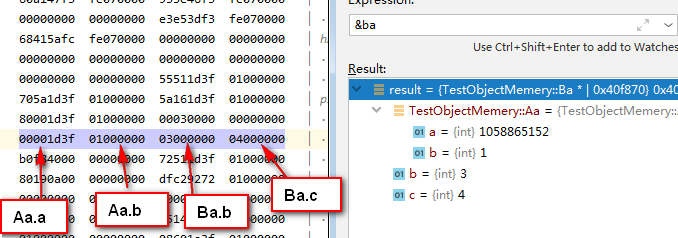

   因为Ba对象的前面部分就是Aa的内容，因此所谓把Ba类型强转为Aa,实际上就是地址不变，以Aa类型去理解这段内存。那如果是多继承，不可能两个父类都在开头，是什么情况呢？

8. 多继承

   ```c++
   class Aa{
   public:
       int a;
   };
   class Ab{
   public:
       int b;
   };
   class Ba:public Aa,public Ab{
   public:
       int c;
   };
   
   Ba ba;
   ba.a = 1;
   ba.b = 3;
   ba.c = 4;
   Ab *ab = (&ba);
   cout<<"point &ba at "<<&ba<<endl;
   cout<<"point ab at "<<ab<<endl;
   //output:
   point &ba at 0x36fc2c
   point ab at 0x36fc30
   ```

   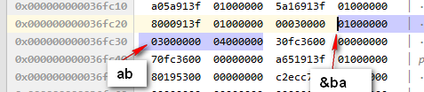

   从内存角度，Aa.a在最前面，Ab.b跟着，然后是Ba.c。观察输出，ab的地址比ba大4，可见，强转过程中，指针的值发生了变化。

9. 虚函数继承

   ```c++
   class Aa{
   public:
   	int a;
   	virtual void fun();
   };
   void Aa::fun(){
   	cout<<"fun"<<endl;
   }
   class Ba:public Aa{
   	int c;
   };
   Ba* ba = new Ba;
   Aa* aaSelf = new Aa;
   ```

   结构图：

   ```shell
   1>class Aa size(16):
   1> +---
   1> 0 | {vfptr}
   1> 8 | a
   1>   | <alignment member> (size=4)
   1> +---
   1>Aa::$vftable@:
   1> | &Aa_meta
   1> |  0
   1> 0 | &Aa::fun
   1>Aa::fun this adjustor: 0
   
   1>class Ba size(24):
   1> +---
   1> | +--- (base class Aa)
   1> 0 | | {vfptr}
   1> 8 | | a
   1>   | | <alignment member> (size=4)
   1> | +---
   1>16 | c
   1>   | <alignment member> (size=4)
   1> +---
   1>Ba::$vftable@:
   1> | &Ba_meta
   1> |  0
   1> 0 | &Aa::fun
   ```

   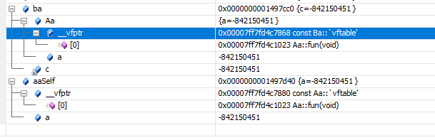

   我们看到Aa类和Ba类都包含了一张虚函数表。如果是Aa的对象，就是包含的Aa的虚函数表；Ba的对象就是Ba的虚函数表。与指针类型无关。我们试着把ba赋给Aa的指针：

   ```c++
   Aa* aa = ba;
   cout<<sizeof(*ba)<<"   "<<sizeof(*aa)<<endl;
   //output: 24   16，所以通过Aa*只能访问Aa定义的部分
   ```

   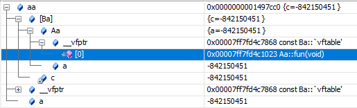

   指针仍然是指向Ba的vftable。

   但是因为子类Ba没有重写fun函数，所以Ba的虚函数表里仍然指向的是Aa::fun。

10. 添加一些方法，有虚函数，有普通函数

    ```c++
    class Aa{
    public:
    	int a;
    	virtual void fun();
    	virtual void fun2(){cout<<"Aa fun2"<<endl;}
    	void fun3(){}
    };
    void Aa::fun(){
    	cout<<"Aa fun"<<endl;
    }
    class Ba:public Aa{
    	int c;
    	virtual void fun(){cout<<"Ba fun"<<endl;}
    	void fun3(){}
    };
    int main(){
    	Ba* ba = new Ba;
    	Aa* aa = ba;
    }
    ```

    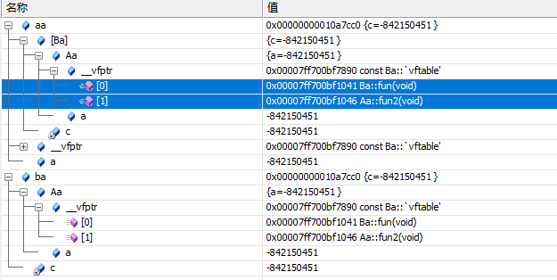

    因为Ba重写了fun，Ba的虚函数表里，fun是Ba的，fun2是Aa的。当通过`Aa* aa`调用fun3，fun3不是virtual，编译器也只知道aa是Aa类型，无法得知实际对象是Ba的，故直接调用Aa的fun3。调用fun2，fun2是virtual，然后虚函数指针指向Ba的vftable，然后根据vftable调用Aa的fun2函数。

    Ba重写了fun函数，所以aa->fun();肯定调用Ba::fun，如果想强行调用Aa::fun，加前缀就行：

    ```c++
    virtual void fun(){
        cout<<"---inside Ba::fun"<<endl;
        Aa::fun();//调用父类的fun
        cout<<"Ba fun"<<endl;
    }
    aa->Aa::fun();//调用父类Aa的fun
    ```

    下面来玩一个魔法，假如我把fun函数声明为私有的，这样子类和外面就不能调用了。现在我们通过虚函数表的指针找到函数的地址，然后调用。我们会发现C++的权限控制都是有办法绕过去的。

    ```c++
    #include <iostream>
    using namespace std;
    
    class Aa{
    private:
    	virtual void fun();
    };
    void Aa::fun(){
    	cout<<"Aa fun "<<this<<endl;
    }
    class Ba:public Aa{
    	virtual void fun(){
    		cout<<"---inside Ba::fun"<<endl;
    	}
    };
    int main(){
    	Aa* aaSelf = new Aa;
    	cout<<"aaSelf "<<aaSelf<<endl;
    
    	void** table = (void**)aaSelf;
    	void (*aafunP)() = (void (*)(void))(((long long *)*table)[0]);
    	(*aafunP)();
    
    	new Aa;
    	(*aafunP)();
    
    	new Ba;
    	(*aafunP)();
    
    	aaSelf;
    	cout<<"last "<<aaSelf<<endl;
    	(*aafunP)();
    
    	cout<<"-----"<<endl;
    }
    ```

    虚函数表指针在对象的开头，因此`void** table = (void**)aaSelf;`得到指向虚函数表的指针。

    `void (*aafunP)() = (void (*)(void))(((long long *)*table)[0]);`我们分解一下：

    ```c++
    //table指向虚函数表，*table得到虚函数表入口
    long long* pTab = (long long *)*table;//指针大小都是一样的，char*也没关系
    //得到fun函数的地址
    long long* funP = (long long*)pTab[0];//fun函数是虚函数表中第一个
    //转换成fun函数类型的指针
    void (*aafunP)() = (void (*)(void))funP;
    ```

    输出示范如下：

    ```text
    aaSelf 00000000010189C0
    Aa fun 00000000659F4238
    Aa fun 000000000101AF30
    Aa fun 000000000101A530
    last 00000000010189C0
    Aa fun 00000000659F4238
    -----
    ```

    我们发现`(*aafunP)();`这样调用，缺了this上下文。从打印的this，我们发现this属于哪个对象是一个比较玄的事情。不过肯定有办法指定this，就不进一步探究了。

11. todo...