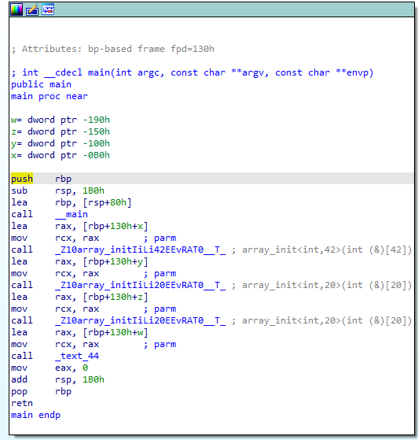
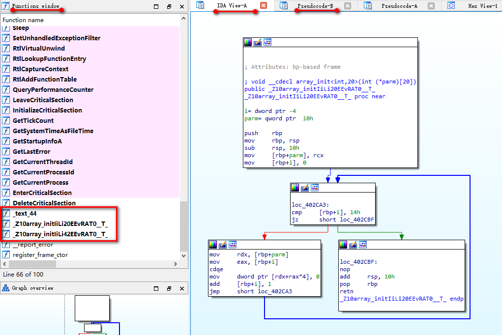

代码：

```c++
template <class T, int N> void array_init(T (&parm)[N])
{
   // cout<<"value of N is "<<N<<endl;
//  N = 9;//wrong，N在编译期间就确定了，不是变量，不能赋值
    for (int i = 0; i != N; ++i) {
        parm[i] = 0;
    }
}
int main(){
	int x[42],y[20],z[20],w[15];
	array_init(x);
	array_init(y);
	array_init(z);
	array_init(w);
}
```

用IDA Pro打开生成的可执行文件，按F5从汇编生成伪代码，我们将证实以下几点：

1. 编译期间，模板会替换成真正的代码，模板参数N和T会替换成类型和数字
2. 由于代码依次调用了4次array_init函数，参数依次是`int x[42],y[20],z[20],w[15];`，只有一个int类型，y和z的数组长度都是20，所以array_init(x)生成一个函数，y和z生成一个函数，w生成一个函数，编译后的二进制代码里面有三份array_init函数。

main函数的汇编：



除了call  __main,有4个call：

```assembly
call    _Z10array_initIiLi42EEvRAT0__T_ ;注意中间是42
call    _Z10array_initIiLi20EEvRAT0__T_ ;注意中间是20
call    _Z10array_initIiLi20EEvRAT0__T_ ;与上个完全一样，意味着array_init(y)和array_init(z)调用的同一个函数
call    _text_44
```

汇编里面分号表示后面是注释。

不知道为什么array_init(w)变成了`call    _text_44`。

按F5看伪代码：

```c++
int __cdecl main(int argc, const char **argv, const char **envp)
{
  int w[15]; // [rsp+20h] [rbp-60h] BYREF
  int z[20]; // [rsp+60h] [rbp-20h] BYREF
  int y[20]; // [rsp+B0h] [rbp+30h] BYREF
  int x[42]; // [rsp+100h] [rbp+80h] BYREF

  _main(argc, argv, envp);
  array_init<int,42>((int (*)[42])x);
  array_init<int,20>((int (*)[20])y);
  array_init<int,20>((int (*)[20])z);
  text_44((int (*)[15])w);
  return 0;
}
```

左边函数窗口：



看到有三个函数对应c++源码里的array_init。