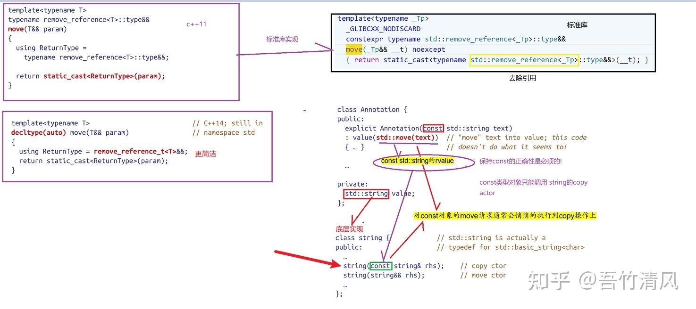

C++真正的临时对象是不可见的匿名对象，不会出现在你的源码中，但是程序在运行时确实生成了这样的对象.

因为新的编译器做了优化，导致一些以前有问题的代码，现在是可以正常运行的，但我们不能忽略问题，即使新编译器优化了，也要注意尽量不要这样写。所以下面这段代码我用VS2008来运行（最新的编译器输出会和我下面贴出来的不一样）

```c++
#include <iostream>
#include <sstream>

using namespace std;

namespace test_temp_obj {
	class A {
	public:
		A() {
			cout << "constructor A "<<this << endl;
		}
		A(const A& a) {
			cout << "copy constructor A"<<this  << endl;
		}
		A& operator=(const A& a){
			cout << "operator= A this="<<this<<"&a="<<&a  << endl;
			return *this;
		}

		~A() {
			cout << "deconstructor "<<this << endl;
		}
		int val;
	};

	A createA1() {
		A a;
		a.val = 3;
		cout << "testA1 " << &a << endl;
		return a;
	}


	void main() {
		{
			A a = createA1();
			cout << "addr:" << &a << endl;
		}

	}
}

int main()
{
	test_temp_obj::main();
}
```

打印是：

```text
constructor A 000000000113F654
testA1 000000000113F654
copy constructor A000000000113F6A4
deconstructor 000000000113F654
addr:000000000113F6A4
deconstructor 000000000113F6A4
```

而gcc7.5打印是：

```c++
constructor A 0x7fffc80705f4
testA1 0x7fffc80705f4
addr:0x7fffc80705f4
deconstructor 0x7fffc80705f4
```

分析代码，createA1里面创建了a，返回值赋给外面对象，一共两个对象, 外面的对象是通过拷贝构造函数初始化的。这样看来，VS2008的打印是合理的，gcc7.5是编译器优化过的，节约了开销。

但是实际上，VS2008也做了优化。按照C++的设计，返回时应该创建一个临时对象，createA1返回的是临时对象，再把临时对象赋给外面的对象。

但是这样开销太大了。我的目的只想创建一个对象，这个过程中却会产生3个对象，最终只保留的一个，临时对象和函数里面的局部变量会立即释放。

分析一下为什么C++要搞一个临时对象。假如你这样调用：

```C++
A& a = createA1();
```

A& a引用的是谁呢？如果引用的是createA1里面的对象，可那是局部变量，调用完就释放的，怎么能引用呢？所以必然是返回时生成一个临时的对象，A& a引用的是这个临时对象。

C++标准允许编译器优化：

> [class.copy/31] When certain criteria are met, an implementation is allowed to omit the copy/move construction of a class object, even if the constructor selected for the copy/move operation and/or the destructor for the object have side effects. In such cases, the implementation treats the source and target of the omitted copy/move operation as simply two different ways of referring to the same object. ... This elision of copy/move operations, called *copy elision*, is permitted in the following circumstances (which may be combined to eliminate multiple [copies](https://www.zhihu.com/search?q=copies&search_source=Entity&hybrid_search_source=Entity&hybrid_search_extra={"sourceType"%3A"answer"%2C"sourceId"%3A108169027})): ... — when a temporary class object that has not been bound to a reference (12.2) would be copied/moved to a class object with the same type (ignoring cv-qualification), the                        copy/move operation can be omitted by constructing the temporary object directly into the target of the omitted copy/move ...

所以VS2008的优化是合理也符合C++标准的。但是仍然会产生两个对象。而最新的gcc编译器更进一步优化，就仿佛直接返回了createA1里面的局部变量(通过gcc打印的地址，外面的A对象和函数里面的局部变量的地址，是一样的),  但这就不符合常理了，因为按照C++ 的思想，返回、传递值类型必然会发生拷贝，而且局部变量理应释放。猜测是C++11后编译器自动把新特性的一些内容用在上面。

由于编译器有可能优化也有可能不优化，构造函数的调用次数不确定，我们不能依赖它，必须自己做好设计。后面给出一个编译器优化就ok，没优化就奔溃的代码。

不考虑编译器的优化，自己有没有方法呢？显而易见的方法是，createA1里面采用动态内存分配，返回指针。外面的使用者记得delete，或者外面的使用者使用智能指针。但是如果我们的设计就是像返回值对象，而不是指针，怎么办呢？

一、 能不能返回引用这样？像这样：

```c++
	A& createA1() {
		A a;
		a.val = 3;
		cout << "testA1 " << &a << endl;
		return a;
	}
```

不能,因为不能返回局部变量的引用。因为局部变量a的内存会在调用结束后立马释放。

二、 能不能调用的时候加引用？像这样：

```C++
A& a = createA1();
```

VS2008打印如下：

```
constructor A 000000000057FB34
testA1 000000000057FB34
copy constructor A000000000057FB94
deconstructor 000000000057FB34
addr:000000000057FB94
deconstructor 000000000057FB94
```

貌似没什么用，仍然是两个对象。但是我们代码本身是没问题的。这里A&a引用的不是createA1里面的局部变量，而是引用返回的临时对象（局部变量释放掉）。也就是说，这样写的话，编译器就不会把临时对象优化掉了。

> 而且在最新的gcc编译器上面，是不允许这样的。因为编译器认为程序员无法对临时变量进行操作。createA1返回临时变量，如果A a要引用的话，必须声明const：
>
> ```c++
> const A& a = createA1();//gcc ok
> ```
>
> 类似的，传递函数参数也有这个问题：
>
> ```c++
> void test(string& str){
>     cout<<str;
> }
> test(str);//没问题，ok
> test(str.substr(0,3));//有问题，substr调用返回临时对象，所以test函数的参数不能是普通的引用。
> test(str=str.substr(0,3));//ok,临时对象已经赋给了str，参数不是临时对象
> ```
>
> 所以，如果参数是引用的话，必须声明为const，函数体内不得进行修改：
>
> ```c++
> void test(const string& str){
>     cout<<str;
> }
> test(str.substr(0,3));//OK
> ```
>
> 

三、这样写：

```C++
A a;
a = createA1();
cout << "addr:" << &a << endl;
```

这还不如`A a = createA1();`，这样写是先用默认无参构造函数创建对象，再调用重载的赋值操作符。打印如下：

```
constructor A 0000000000EFF844                           ------------》对应A a;
constructor A 0000000000EFF7F4                           ------------》对应createA1里的A a
testA1 0000000000EFF7F4
copy constructor A0000000000EFF854                       ------------》对应返回的临时对象
deconstructor 0000000000EFF7F4
operator= A this=0000000000EFF844 ,&a=0000000000EFF854   -----------》用临时对象给a赋值
deconstructor 0000000000EFF854
addr:0000000000EFF844
deconstructor 0000000000EFF844
```

我们看到比一开始的写法，还多了一个对象，效率更差。因为这样写，编译器不好把临时对象优化掉。从打印看，赋值时，createA1里的局部变量a已经释放了，所以必须借助临时对象。

四、在return出创建对象：

```c++
A createA2() {
    //a.val = 3;
    return A();
}
//调用：
A b = createA2();
//或者 A& b = createA2();
cout << "addr:" << &b << endl;
```

VS2008打印：

```
constructor A 00000000006FF9C4
addr:00000000006FF9C4
deconstructor 00000000006FF9C4
```

可以看到，在return语句里创建A对象，在VS2008上面，只有一个对象，完全就和高版本的gcc一样了。但是之所以要有createA2函数，就是因为要对A的变量设值啊。`a.val = 3;`这行往哪放呢？假如createA2函数里只有`return A();`一行，那这个函数有什么意义呢？直接`A b;`就行了，干嘛要通过createA2函数。

五、所以我最终的结论是，在C++11之前，其实没什么好的办法。要解决这个问题，必须升级到新的编译器，借助右值引用。

## 容易犯错的写法

把最初的例子增加一些逻辑，看一下createA1按值返回，或者临时对象这种东西可能会带来的不易察觉的问题。

增加一个指针p，构造函数里动态分配，因此需要在析构函数里面释放。

```c++
class A {
    public:
    A() {
        cout << "constructor A "<<this << endl;
        p = new int;
    }
    A(const A& a) {
        cout << "copy constructor A"<<this  << endl;
    }

    ~A() {
        cout << "deconstructor "<<this << endl;
        delete p;
        p = NULL;
    }
    int val;
    int* p;
};

A createA1() {
    A a;
    a.val = 3;
    cout << "testA1 " << &a << endl;
    return a;
}
//调用
A& b = createA1();
```

表面看，没问题啊。createA1创建一个对象，b是引用，引用createA1创建的对象。在createA1时，分配了p的内存：`p = new int;`,对象销毁时，释放p内存：

`delete p;`。可是VS2008运行时出错：

```
TestCpp.exe 中的 0x63cf58a4 (msvcr90d.dll) 处未处理的异常: 0xC0000005: 读取位置 0xffffffffffffffff 时发生访问冲突
```

（debug时弹出这个错误，正常执行，卡半天最后还是正常结束了，没有错误信息）

为什么呢，因为局部变量或临时变量释放的时候，p对应的内存已经释放掉了。不能重复释放。

析构函数里加判断行不行？不行：

```c++
if (p != NULL) {
    delete p;
    p = NULL;
}
```

拷贝发生在临时对象析构的前面，临时对象的p设为NULL了，但第二个对象的p还是指向原来的地址。

真正解决这个问题，要在拷贝构造函数里使用深克隆：

```c++
A(const A& a) {
    cout << "copy constructor A" << endl;
    p = new int;//重新分配p
    *p = *a.p;//并把原来p指向的值赋过去，而不是赋地址
}
A& operator=(const A& a){
    cout << "operator= A" << endl;
    if(this != &a) {//不是自己给自己赋值
        if(this->p == NULL) {
            this->p = new int;
        }
        *this->p = *a.p;//把原来p指向的值赋过去,而不是赋地址
    }
    return *this;
}
```


## 其它会产生临时对象的场景

**（１）创建一个无名对象时，会产生临时对象**
如：int(8);
int a = int(8); //这就是用一个临时对象初始化一个int对象

**（２）** **隐式类型转换时，会创建临时对象**

```c++
int i = 1;
char &c = i;//报错Non-const lvalue reference to type 'char' cannot bind to a value of unrelated type 'int'
++c;

double d = 1.0;
int &ii = d;//报错Non-const lvalue reference to type 'int' cannot bind to a value of unrelated type 'double'

int iii = 1;
long &l = iii;//报错Non-const lvalue reference to type 'long' cannot bind to a value of unrelated type 'int'
```

逻辑很好理解，引用相当与别名，即`char &c = i`，c就是i的别名。可是c是char，i是int，所以这里面必然要产生一个中间的临时对象，c实际上是中间对象的别名，而不是i的。但是这样的话，程序员会认为++c改变了i，但是实际上不会。所以c++禁止这样写。如果const引用就可以, 因为你不可能改变const的值：

```c++
int i = 1;
const char &c = i;//ok

double d = 1.0;
const int &ii = d;

int iii = 1;
const long &l = iii;
```

和前面我说函数参数是引用的话要声明为const是一个道理。比如这样写也是不行的：

```c++
int getI(){
    int a = 1;
    return a;
}
int &ii = getI();//not ok
const int &ii = getI();//ok
```

总之只要中间有个临时变量，那么就不能引用，必须是const引用。

```c++
int &a=100;//报错
const int &b=100;//ok
```

临时对象没有地址，生命周期非常短。短到下一行代码就被直接析构了。不能取地址。C++ 里称为“右值”。

## 概念：

左值：有地址的量就是左值。

右值：没有地址量就是右值。

左值与右值的根本区别在于是否允许取地址&运算符获得对应的内存地址。

一般来说，变量可以取地址，所以是左值，但是常量和临时对象等不可以取地址，所以是右值。

也可以认为，有名字的是左值；没有名字的、匿名的是右值。

`const int b2 = 1;`b2是左值，b2是可以取地址的。

但是`(const int)b`是右值，因为类型转换中间生成一个临时的变量。

下面的例子证明这一点。

```c++
void test(int& i){
    cout<<"左值引用"<<endl;
}
void test(const int& i){
    cout<<"左值引用,const"<<endl;
}
void test(int&& i){
    cout<<"右值引用"<<endl;
}
void test(const int&& i){
    cout<<"右值引用,const"<<endl;
}

//测试
int b = 0;
const int b2 = 1;
test(1);//字面量当然是右值
test(b);//b是左值
test(b2);//b2类型是const int，也是左值
test((const int)b);//b转成const int，转换生成临时变量传给test，所以是右值
test((double)b);//同样类型转换生成临时变量传给test，所以是右值
test(b + 2);//计算表达式，结果放在临时变量里传给test，所以是右值

输出：
右值引用
左值引用
左值引用,const
右值引用
右值引用
右值引用
```

右值引用的语法形式：

```cpp
右值引用类型&& 引用变量 = 常量或临时对象（即右值）
```

注意const不是常量。const只是告诉读者和编译器这个变量不会改变，它是有地址的。事实上，C++修改const修饰的变量的值是很容易的。

当右边不是常量或临时对象时，报错，示例：

```c++
int getI() {
    int a = 1;
    return a;
}

int b = 0;
const int b2 = 1;
const int &a = b;//a是b的别名，改变b就改变了a；但是可以通过b改变值，不能通过a改变
//int&& c = b;//不允许，c是右值引用类型，但右边的b不是右值
//const int&& c1 = b2;//不允许，c1是右值引用类型(并且是const)，但右边的b2是左值
int&& c2 = b + 1;//OK，c2是右值引用类型，右边表达式计算结果是右值
int &&c3 = getI();//OK，c3是右值引用类型，函数返回结果是右值
int&& c4 = 2;//OK,字面量当然是右值
```

有点出乎意料的是：

```c++
int&& c4 = 2;

test(2);
test(c4);
//int&& c5 = c4;//报错不允许，c4是左值
cout<<&c4<<endl;

输出：
右值引用
左值引用
0x7ffd1d6b2590
```

也就是说，虽然c4引用一个右值，但是它本身是一个左值。


下面是说明为什么C++需要引入右值引用。

示例1：

```c++
class A
    {
    public:
        A()
        {
            cout<<"A的构造"<<endl;
        }

        virtual ~A()
        {
            cout<<"A的析构"<<endl;
        }

        A(const A& other)
        {
            cout<<"A的拷贝构造"<<endl;
        }

        virtual void show_info()
        {
            cout<<"我是父亲"<<endl;
        }
    };

    class B:public A
    {
    public:
        B()
        {
            cout<<"B的构造"<<endl;
        }

        ~B()
        {
            cout<<"B的析构"<<endl;
        }

        void show_info()
        {
            cout<<"我是儿子"<<endl;
        }
    };

    void main() {
        A a= B();
        a.show_info();
    }
//输出
A的构造   ------》创建对象B，先执行父类A的构造函数
B的构造   ------》创建对象B，执行B的构造函数
A的拷贝构造------》用b初始化A
B的析构   ------》B是匿名的，即临时对象，在整行表达式结束后释放
A的析构   ------》释放B对象调用父类析构
我是父亲  ------》不是指针不存在多态
A的析构   ------》释放对象A
```

这里还是临时对象的问题，我们发现创建了两次对象。可以用引用避开匿名对象，前面说了，如果用引用，必须是const引用：

```c++
void show_info()const //class A 里面的show_info加const
{
    cout<<"我是父亲"<<endl;
}
const A& a= B();
a.show_info();
```

这样确实只有一个对象：

```c+=
A的构造
B的构造
我是父亲
B的析构
A的析构
```

但是常引用只能调用常函数，必须把show_info()后面加一个const。这是不现实的。所以我们就引出来了**右值引用**。

```c++
A&& a=B();
a.show_info();
//输出和上面一样
```

 **给将亡值（即返回的临时变量，原本应该在这一行表达式执行完就释放的）续命** ，延长它的生命周期，避开了额外的一次拷贝。也许你觉得实际项目里可以避开这种写法，这个例子说明不了什么。那么~~

示例2：

```c++
class Test
    {
    public:
        Test(){
            p_arr = new int[10];
            std::cout << "Constructor" << std::endl;
        };
        Test(const Test &test) //拷贝构造函数
        {
            std::cout << "copy Constructor" << std::endl;
            p_arr = new int[10];
            memcpy(p_arr, test.p_arr, 10*sizeof(int));
        }
        Test(Test &&test) //移动构造函数
        {
            std::cout << "Move Constructor" << std::endl;
            p_arr=test.p_arr;
            test.p_arr = nullptr; //修改参数的资源
        }
        Test &operator=(Test &&test) //移动赋值操作符
        {
            std::cout << "Move Assignment operator" << std::endl;
            if (this != &test)
            {
                p_arr = test.p_arr;
                test.p_arr= nullptr; //修改参数资源
            }
            return *this;
        }
        Test &operator=(const Test &test) //移动赋值操作符
        {
            std::cout << "Assignment operator" << std::endl;
            if (this != &test)
            {
                if(p_arr == NULL) {
                    p_arr = new int[10];
                }
                memcpy(p_arr, test.p_arr, 10 * sizeof(int));
            }
            return *this;
        }

    private:
        int *p_arr;
    };

	void addToList(Test&& t){
        cout<<"addToList, move "<<endl;
    }
    void addToList(Test& t){
        cout<<"addToList, copy "<<endl;
    }

		Test t1;
        Test t2((Test()));//加一个括号，防止被编译器理解为函数声明
        Test t3 = Test();
        cout<<"---以上调用的是无参构造函数，而不是拷贝或移动构造。也许是编译器做了手脚"<<endl;

        t2 = t1;//赋值
        t2 = Test();//移动赋值
        addToList(t1);//拷贝的方式添加到数组里
        addToList(Test());//移动的方式添加到数组里

结果：
Constructor
Constructor
Constructor
---以上调用的是无参构造函数，而不是拷贝或移动构造。也许是编译器做了手脚
Assignment operator
Constructor
Move Assignment operator
addToList, copy 
Constructor
addToList, move 
```

这里性能差别大了。如果执行拷贝构造函数，需要重新给里面的数组分配空间、赋值；如果执行移动构造函数，直接让数组的指针指向原来的对象里的数组。（切记一定要把原来对象里的数组指向NULL，并且析构函数里delete要判断非空。否则这个临时变量销毁时，把这个内存释放了）。

这个例子，引入了两个老版本的C++没有的东西：移动构造函数和移动赋值操作符。需要理解一下。

## **移动语义**

旧版本的C++没有区分拷贝和移动。

移动是一个语义，意味着两点：

- **原对象不再被使用**，如果对其使用会造成不可预知的后果。
- 所有权转移，资源的所有权被转移给新的对象。

什么样的对象，编译器能确定一定不会再使用呢？当然是前面的一直探讨的右值（临时对象）。所以，当发生对象的拷贝时，如果拷贝一个右值，那么编译器就能知道这时应该通过移动构造函数来构造新的对象（而不是拷贝构造函数）。

移动语义通过**移动构造函数**和**移动赋值操作符**实现，其与拷贝构造函数类似，区别如下：

- 参数的符号必须为右值引用符号，即为&&。
- 参数不可以是常量，因为函数内需要修改参数的值
- 参数的成员转移后需要修改（如改为nullptr），避免临时对象的析构函数将资源释放掉。

需要我们开发者在定义一个类的时候，实现合理的**移动构造函数**和**移动赋值操作符**，来让这个类支持移动。所谓的移动，和拷贝一样，创建了一个新的对象，只不过区别是，我们知道传进来的对象是不会再用到的、即将销毁的、将亡值。所以我们可以在**移动构造函数**里，直接让新的对象里的指针，指向原来的旧的对象里的指针指向的资源。这样就不要重新分配空间、分配资源了。

因为C++老是在我们意识不到的地方发生对象复制，频繁拷贝、释放，所以这个新的特性很有用。另外我们也要意思到，移动语义依赖我们的合理实现。比如，移动构造函数里`p_arr=test.p_arr;` 下一句一定要记得` test.p_arr = nullptr;`，一定要把test的指针置空，防止内存在test析构时释放。

## std::move

*std::move*()把参数强制转换成右值。

经常有这种场景：

```c++
Test t1;
//t1做其它操作
//...
std::vector<Test> vec;
vec.push_back(t1);
//我们构造t1，添加给vector，t1就完事了。所以push的时候，完全可以采用移动，而不是拷贝。但是编译器不知道，因为t1不是右值。
```

这就可以使用`std::move` :

```c++
Test t1;
//t1做其它操作
//...
std::vector<Test> vec;
vec.push_back(std::move(t1);//添加到容器里，同样拷贝了t1对象，但是走得是t1的移动构造函数
```

std::move没有移动任何东西，只是告诉编译器*尝试*移动。

vec的实现，简化示意如下：

```c++
class MyVector {
    private:
    Test* data[10];
    int maxSize = 10;
    int current = 0;
    public:
    void push(const Test& test){
//            cout<<"push const Test&"<<endl;
        data[current] = new Test(test);
        current++;
    }
    void push(Test&& test){
//            cout<<"push Test&&"<<endl;
        data[current] = new Test(std::move(test));
        current++;
    }
    ...
};

Test t1;
//t1做其它操作
//        t1.setX(...)
MyVector vec;
vec.push(t1);
vec.push(std::move(t1));//后面不得再使用t1

输出：
Constructor
copy Constructor
Move Constructor
```

注意`push(Test&& test)`里面用test创建对象的时候，依然要使用`std::move`，否则还是走copy。

### std::move的实现

std::move除了能实现右值引用，同时也能实现对左值的引用，在左值上使用移动语义。( 这句话的意思是，std::move的参数，你可以传左值，也可以传右值，最后出来都是右值引用)。

std::move的实现主要依赖于static<T&& >，但同时也会做一些参数推导的工作。其C++11的实现如下：

```c++
template<typename T>
typename remove_reference<T>::type&& move(T&& t)
{
    return static_cast<typename remove_reference<T>::type &&>(t);
}
```

在C++14中更优雅的实现：



以C++11为例，里面就是一个静态转换`static_cast`, 分析一下为什么能实现。

#### 对于右值

有如下代码：

```c++
std::move(string("right value"));
```

首先模板类型推导确定T的类型为string，得remove_reference::type为string，故`static_cast<typename remove_reference<T>::type &&>(t)`就是`static_cast<string &&>(t)`, 返回值类型也是`string &&`;而move的参数就是string &&,于是不需要进行类型转换直接返回。

#### 对于左值

> 引入一条规则：当将一个左值传递给一个参数是右值引用的函数，且此右值引用指向模板类型参数(T&&)时，编译器推断模板参数类型为实参的左值引用。

有如下代码：

```
string str("left value");
std::move(str);
```

一般来说，函数参数是`type&&`的话，调用是不能传左值的。比如：

```c++
void testRval(int && i){
    cout<<&i<<endl;
}
int ii = 4;
testRval(ii);//报错，没有void testRval(int)这个函数，int&&和int不一样
testRval(std::move(ii));//OK
```

但是`std::move(str);`为什么能传str这个左值呢？注意到move的参数是一个**模板类型**。所以这里是把str这个左值传给参数是模板`T&&`的函数，符合引入的规则。

根据规则，模板类型推导确定T的类型为 实参的左值引用 即 string的引用 即`string &`，move的参数类型为string& &&，**折叠**后为sting &。remove_reference::type为`string`。故static_cast的模板参数类型为`string &&`;返回值是`string &&`。

所以结果就为将string &通过static_cast转为string &&。返回string &&。

#### 引用折叠

如果间接的创建一个引用的引用，则这些引用就会“折叠”。如：

- X& &、X& &&、X&& &都折叠成X&
- X&& &&折叠为X&&