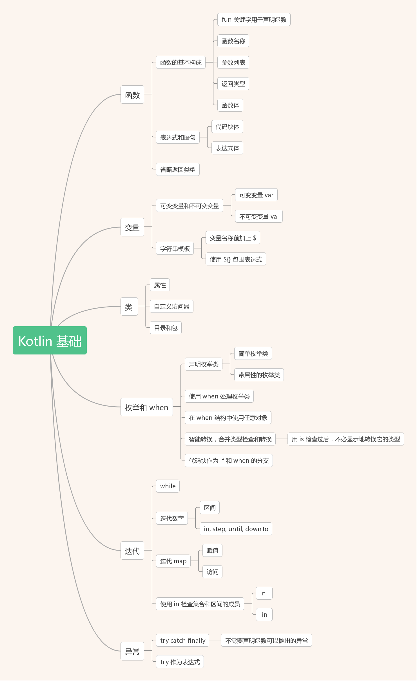

## 思维导图

https://www.jianshu.com/u/37baa8a86582 简书作者梳理的知识体系

以下是思维导图

[Kotlin 基础](https://www.jianshu.com/p/f9e78d6c54bd)

[函数的定义与调用](https://www.jianshu.com/p/22b92a506db5)

[类、对象和接口](https://www.jianshu.com/p/c2463a6140c5)

[数据类、类委托 及 object 关键字](https://www.jianshu.com/p/5f03cb52a040)

[lambda 表达式和成员引用](https://www.jianshu.com/p/504bca3a9fa1)

[Kotlin 的可空性](https://www.jianshu.com/p/a1a1a79ae4e1)

[Kotlin 的类型系统](https://www.jianshu.com/p/8748d6489822)

[运算符重载及其他约定](https://www.jianshu.com/p/4a457f569c4a)

[委托属性](https://www.jianshu.com/p/86742ab37726)

[高阶函数：Lambda 作为形参或返回值](https://www.jianshu.com/p/4da8968ec305)

[内联函数](https://www.jianshu.com/p/ab877fe72b40)

[泛型类型参数](https://www.jianshu.com/p/d290f02964f5)

还有一个协程比较重要需要单独作为一个专题来讲。

