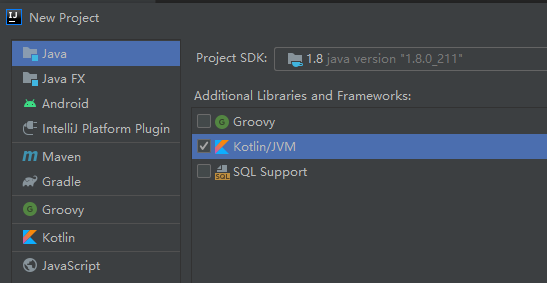
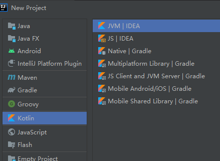
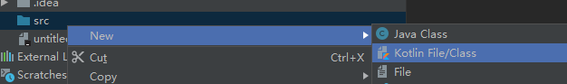
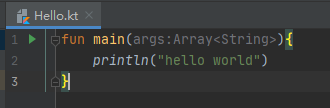

## 一. Hello World

假设使用idea

1.  新建项目



Or 



其实是一样的。

2. 新建kotlin文件



3. 添加main方法

   ```kotlin
   fun main(args:Array<String>){
       println("hello world")
   }
   ```

   

你会看到，

1) 左边第一行有一个三角形的绿色图标

2) 文本里只有一个main函数，没有class。如果你画蛇添足，外面加一层class，绿色三角形就没了。这点跟java不一样。

4. 运行： 点击三角形，即可运行。

