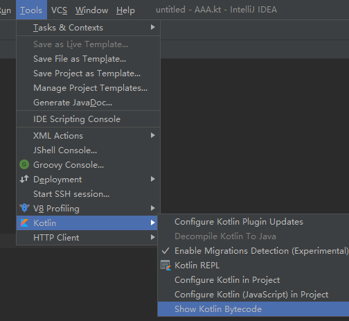
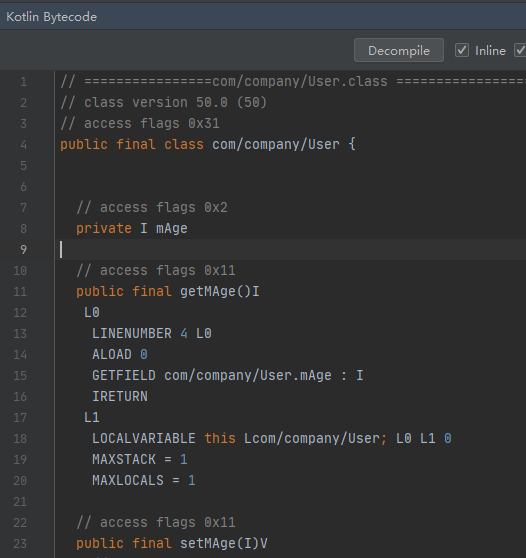

## 一. Hello World

假设使用idea

1.  新建项目


Or 


其实是一样的。

2. 新建kotlin文件


3. 添加main方法

   ```kotlin
   fun main(args:Array<String>){
       println("hello world")
   }
   ```

   

你会看到，

1) 左边第一行有一个三角形的绿色图标

2) 文本里只有一个main函数，没有class。如果你画蛇添足，外面加一层class，绿色三角形就没了。这点跟java不一样。

4. 运行： 点击三角形，即可运行。

## 二. 转java代码



得到字节码：



然后点击“Decompile", 即可看到对应的java代码。

由于很大程度上，kotlin是java的语法糖，所以可以用这种方法来学习和理解kotlin。

## 三. 变量

用var或val声明，类型写在后面

```kotlin
val str: String = "this is a final string"
var a = 12//通过=右边推导出左边变量的类型是Int
```

js等脚本语言可以直接赋值另一种类型的值，比如这样：

```javascript
var a = 12
a = "string"//kotlin错误
```

但是kotlin里，`a`变量在首次赋值时就确定了类型，这里的类型是`Int`，再次赋值`String`类型的值时就会提示错误。

## 函数

```kotlin
fun max(a: Int, b: Int): Int {
    return if (a > b) a else b
}
```

1. 返回值写后面。
2. 如果返回void，在Kotlin中其实是`: Unit`，而`: Unit`默认可以省略
3. Kotlin中，if是表达式，而不是语句。语句和表达式的区别在于，表达式有值，能作为另一个表达式的一部分使用
4. 在Kotlin中，除了循环（for，do，do/while）以外大多数控制结构都是表达式

#### 表达式函数体

```kotlin
fun max(a: Int, b: Int) = if (a > b) a else b
```

如果函数体是由单个表达式构成的，就可以像上面这样写，去掉花括号和return语句。表达式的值就是函数的返回值。返回类型可以推导出来故而不需要显式写。

## 声明枚举

```kotlin
enum class Color {
    RED, ORANGE, YELLOW, GREEN, BLUE
}
```

比Java多了`class`关键字。这表明Kotlin中，`enum`是一个软关键字，只有当它出现在class前面才有特殊的意义，在其他地方可以把它当做普通的名称使用。

和Java一样，可以给枚举类声明属性和方法：

```kotlin
enum class Color(val r: Int, val g: Int, val b: Int) {

    RED(255, 0, 0), ORANGE(255, 165, 0),
    YELLOW(255, 255, 0), GREEN(0, 255, 255),
    BLUE(0, 0, 255);//这是Kotlin语法中唯一必须使用分号（;）的地方

    fun rgb() = (r * 256 + g) * 256 + b
}
```

## when代替switch

以上面的枚举为例，

```kotlin
fun getColorStr(color: Color) =
        when (color) {
            Color.RED -> "red"
            Color.ORANGE -> "orange"
            Color.YELLOW -> "yellow"
            Color.GREEN -> "green"
            Color.BLUE -> "blue"
        }
//调用方法
println(getColorStr(Color.RED))
```

1. kotlin 没有switch，用when代替java中的switch

2. when是一个有返回值的表达式，所以上面的函数是一个表达式体函数

3. 你不需要在每个分支都写上`break`语句（在Java中遗漏break通常会导致bug）

4. 也可以把多个值合并到同一个分支，只需要逗号（`,`）隔开这些值：

   ```kotlin
   fun getColorStr(color: Color) =
           when (color) {
               Color.RED, Color.ORANGE, Color.YELLOW -> "yellow"
               Color.GREEN -> "neutral"
               Color.BLUE -> "cold"
           }
   ```

5. `when`允许使用任何对象，这点也比`switch`强大

## 循环

`while`和`do-while`循环与Java完全一致

`for`循环仅有唯一一种形式：`for <item> in <elements>`

比如：

```kotlin
for (i in 100 downTo 1 step 2) {
     print(fizzBuzz(i))
}
```

这里的`100 downTo 1 step 2`,本质是函数调用，等效于：`100.downTo(1).step(2)`。请参考下一篇“中缀调用”。

另外`in运算符`单独拿出来，用来来检查一个值是否在区间中：

```kotlin
println(4 in 1..10 step 2)//false
println(3 in 1..10 step 2)//true
```

## 类的属性

在Java中，常常把字段定义成private的，然后提供一个getter和一个setter用来访问字段。

字段和其访问器的组合被叫做属性，在Kotlin中，属性是头等的语言特性，完全代替了字段和访问器的方法，其本质仍然是语法糖，编译成字节码时，编译器自动帮你产生get、set。

```kotlin
class Person(
        val name: String,//只读属性，生成一个字段和一个简单的getter
        var isMarried: Boolean//可写属性：生成一个字段、一个getter、一个setter
)
```

如果getter和setter方法中需要额外的逻辑，就不能让编译器默认生成了，需要自定义访问器：

```kotlin
class Rectangle(val height: Int, val width: Int) {
    val isSquare: Boolean
        get() {//声明属性的getter
            return height == width
        }
    
    var picPath:String?=""
        get()=field
        set(value) {
            field = pathPrefix + value
        }
}
```

使用的时候，不需要调用get和set，直接：

```kotlin
println(rec.isSquare)
println(rec.picPath = "a.jpg")
```

如果是java，既然isSquare是private的，那么在外面访问会报错。而kotlin会在编译时，自动帮你转成对相应的“get\set”方法的调用。

### 幕后字段field

上面的例子里，你看到使用了一个`field`。如果不知道field，你可能会这么写：

```kotlin
//错误的代码    
var picPath:String?=""
        get()=picPath
        set(value) {
            picPath = pathPrefix + value
        }
```

但是我们说了，访问picPath其实会调用getPicPath(),所以`get()=picPath`转成java后是：

```java
//get()=picPath -> get(){picPath} -> get(){get()}
String getPicPath(){
    getPicPath();
}
```

同理，set转成java后是：

```java
String setPicPath(){
    setPicPath(pathPrefix + value);
}
```

显然这是一个无限的递归，程序也许编译没问题，但是一跑就会栈溢出：

```shell
Exception in thread "main" java.lang.StackOverflowError
	at sun.nio.cs.UTF_8$Encoder.encodeLoop(UTF_8.java:691)
	at java.nio.charset.CharsetEncoder.encode(CharsetEncoder.java:579)
	at sun.nio.cs.StreamEncoder.implWrite(StreamEncoder.java:271)
	at sun.nio.cs.StreamEncoder.write(StreamEncoder.java:125)

```

所以kotlin提供了`field`，field只在访问器里面使用，并且访问器里面引用属性一定要用field。

## 类

1. Kotlin在类名后面使用冒号来代替了Java中的`extends` 和`implements` 关键字：

```kotlin
class Button : Clickable {
    override fun click() = println("i was clicked")
}
```

2. 和Java一样,单继承，可以实现任意多个接口。
3. 子类中**强制要求**使用`override` 修饰符，标注被重写的方法和属性
4. 接口的方法可以有一个默认实现，Java 8中需要你在这样的实现上标注`default` 关键字

```kotlin
interface Clickable {
    fun click()
    fun showOff() = println("i'm Clickable!") //默认实现的方法
}
class Button : Clickable {
    override fun click() = println("i was clicked")
    //showOff有默认实现，所以这里不需要实现
}
//但是如果你是在java里面实现这个用kotlin写的接口，那么两个都要实现
```

把这个接口转成java：

```java
public interface Clickable {
   void click();

   void showOff();

   public static final class DefaultImpls {
      public static void showOff(Clickable $this) {
         String var1 = "i'm Clickable!";
         System.out.println(var1);
      }
   }
}
```

从这里你能明白为什么在java里面实现这个接口，默认实现不起效了。

为什么kotlin不直接使用java 8 的接口特性呢？ 那是因为kotlin需要兼容到java6。

5. 类默认是final的。如果你想允许这个类被继承，需要使用`open` 修饰符来标识这个类，还要给每一个可以被重写的属性或方法添加`open` 修饰符。

```kotlin
open class RichButton : Clickable { //open修饰表示可以有子类
    fun disable() {} //这个函数是final的，不能被子类重写
    
    open fun animate() {} //函数是open的，可以被子类重写
    
    override fun click() {} //这个函数是重写了一个open函数，因此也是open的
}
```

kotlin之所以这样设计，是基于多年来对java的实践经验。《Effective Java》中也建议：要么为继承做好设计并记录文档，要么禁止这么做。

