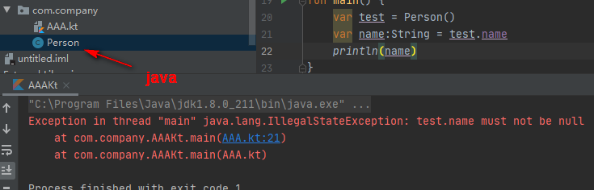

主要说说kotlin代码中常见的特性，其中和Java不一样的部分。

### 顶层函数

**思想：**Java中有静态函数和静态属性概念，在外部访问的直接利用**类名.方法名**访问。在Kotlin中则认为一个函数或方法有时候并不是属于任何一个类，它可以独立存在。

**语法：** 一个函数或者属性，直接定义在一个Kotlin文件的顶层中。在使用的地方只需要import这个函数或属性即可。"Util"后缀结尾的工具类，是时候去掉了。

**原理：**通过反编译成java，可以总结出两点内容

1、顶层文件会反编译成一个容器类。(类名一般默认就是顶层文件名+"Kt"后缀，注意容器类名可以自定义)
2、顶层函数会反编译成一个static静态函数

在**文件顶部**,在**package声明**的前面,通过Kotlin中的@file: JvmName(“自定义生成类名”)注解,可以自动生成对应Java调用类名

```kotlin
@file: JvmName("FormateUtil")
package com.ymc.kotlindemo

import java.math.BigDecimal

fun formateFileSize(size: Double): String { ... }
```


#### Java中如何调用Kotlin中的顶层函数

反编译生成的类作为静态函数容器类, 直接调用对应的函数

```java
System.out.println("文件大小: " + FormateFileKt.formateFileSize(1111));// Java中调用Kotlin中定义顶层函数，一般是顶层文件名+"Kt"后缀作为静态函数的类名调用相应函数
```

### 顶层属性

和 顶层函数 相似，属性也是可以放在文件的顶层

### 扩展函数

定义函数时，在函数名前面加上类或者接口名称，中间用“.”连接：

```kotlin
// 扩展String类，添加一个lastData函数
fun String.lastData() : Char{
    return this.get(this.length-1)
}

// 获取最后一个单词
import util.lastData
println("Kotlin".lastData())
```

当成员函数与扩展函数，名字、参数都一样时，**成员函数优先级高**。

扩展函数 并不算是类的一部分，他是声明在类之外的，编译成java字节码后，毕竟真实的类里面是没有这些方法的。这些方法对应对应Java中的静态函数，第一个参数为接收者类型的对象。所以 **扩展函数是不可以 继承的**。

### 扩展属性

扩展属性也没有真的为该类添加了属性，只能说是为该类通过get、set方法计算出属性。换言之，你只是加了get\set方法，没有真实的存在内存中的字段，因此没有幕后字段（filed），你的set方法不能给field赋值，只能给其它真正存在的字段赋值。并且也不能初始化。

`val` 属性不可变，因此只需要定义getter，而`var` 属性可变，所以getter和setter都需要。 

```kotlin
//尝试给String扩展一个test属性
var String.test : Char = 'a'//错，没有幕后字段，不能初始化

var String.test : Char
     set(value)  {
         //field = value 错，扩展属性并没有真正添加属性也就没有field
         setCharAt(length - 1, value)
     }
     get() {
         return 'a'
     }
```

### 可变参数

看个例子

```kotlin
val strings = listOf("first", "second", "fourteenth")
//listOf 函数的定义
public fun <T> listOf(vararg elements: T): List<T>
//等同于java的：
public <T> List<T> listOf(T... elements)//java
```

`vararg` 关键字，让函数支持任意个数的参数。

跟java的区别：java中可变参数就是数组，可以按原样传递数组，数组中每个元素自动作为参数。

而Kotlin把数组整体当做一个参数，所以你需要显示地解包数组，这个功能被称为**展开运算符**：

```kotlin
val array = arrayOf("a", "b")
val list = listOf("c", array)
println(list)//输出: [c, [Ljava.lang.String;@5305068a]

val list2 = listOf<String>("c", *array)//加一个星号
println(list2)//[c, a, b]

```

### 中缀调用

```kotlin
val map = mapOf(1 to "one", 7 to "seven", 52 to "fifty-five")
val x = 1 until 10
```

`to` 和`until`并不是一个内置的结构，而是一种特殊的函数调用，被称为中缀调用。以下两种调用方式是等价的：

```kotlin
1.to("one")//普通调用
1 to "one" //中缀调用
```

**条件1：**函数只有一个参数

**条件2：**使用`infix` 修饰符来标记它

例如`to` 函数的声明：

```kotlin
public infix fun <A, B> A.to(that: B): Pair<A, B> = Pair(this, that)
```

这里引入一个Pair类。Pair是Kotlin标准库中的类，它是用来表示一对元素。

### 解构声明

```kotlin
val (number, name) = 1 to "one"
```

这个功能称之为解构声明，`1 to "one"` 会返回一个Pair对象，Pair包含一对元素，也就是1和one，接着又定义了变量`(number, name)` 分别指向Pair中的1和one。 

解构声明实际上就是将对象中所有属性，解构成一组属性变量。举个例子，

```kotlin
//声明一个数据类
data class Student(var name: String, var age: Int, var grade: Double)
//-----使用
val student = Student("mikyou", 18, 99.0)
val (name, age, grade) = student//将一个student对象解构成一组3个单独的变量
println("my name is $name , I'm $age years old, I get $grade score")//解构后的3个变量可以脱离对象，直接单独使用

//也可以 部分解构
val (_, age, grade) = student//下划线_ 忽略name属性

```

解构声明的对象类型一定是data class。比如上面说的Pair类，在kotlin lib中的声明如下：

```kotlin
public data class Pair<out A, out B>(
    public val first: A,
    public val second: B
) : Serializable {
    public override fun toString(): String = "($first, $second)"
}
```

### var、val、const val区别

var:  

```kotlin
var mAge: Int = 0
//生成一个private的字段和public的get和set：
private I mAge
public final getMAge()I
public final setMAge(I)V

//既然是对外不暴露的，也就不会生成get和set
private var mAge: Int = 0
```

val ：

跟var的区别是，不会生成set、多了final修饰符。因为是只读的。

```kotlin
val mAge: Int = 0
//---->to java
private final I mAge = 0
public final getMAge()I
```

const val: 

```kotlin
//首先，const val只能用在顶层属性、最外部的object、伴生对象上面。
const val mAge: Int = 0
//---》to java
public final static I mAge = 0
```

可见const val完全相当于java中的public static final 。外面直接访问属性而不是通过get。

### 自动类型转换

```kotlin
if (obj is String) {
    // 做过类型判断以后，obj会被系统自动转换为String类型
    return obj.length
}
//等价的java代码：
if (obj instanceof String) {
    return ((String)obj).length
}

```

另外还支持 “!is”:

```kotlin
if (usr !is User){
  // XXX
}
```

### 参数的默认值

```kotlin
class User @JvmOverloads constructor(val nickName: String, val isSubscribed: Boolean = true)
```

在User类的构造函数里，参数isSubscribed我们给了默认值true。通过这种方法，有效减少了定义重载构造。

### 可空性

为了避免NullPointerException，kotlin 的变量默认不可以存储null引用。如果希望允许赋null，则需要在类型后面加上`?` ：

```kotlin
fun strLen(s: String?) = if(s != null) s.length else 0

val s: String? = ""
//    s.length  //错误，only safe(?.) or non-null asserted (!!.) calls are allowed
    s?.length   //表示如果s不为null则调用length属性
    s!!.length  //"!!"是非空断言。表示断言s不为null，直接调用length属性，如果s运行时为null，则同样会crash
```

也不能直接把可空的赋值给非空类型的变量：

```kotlin
val x: String? = null
//    val y: String = x  //Type mismatch，不能赋值

//加上非空判断，可以赋值
val x: String? = null
if(x != null) {
    val y: String = x
}

val x: String? = null
var y = x//y类型自动推导为可空的，也就是String?
//错误：var z : String = y//z明确是String而不是"String?",y已经自动推导为String?,不能赋值

val x: String? = "x"
//错：var y:String = x//虽然x已经明确赋值，但是这里依然不能直接赋值

//比较迷惑的是，这样是可以赋值的
var x: String?
x = ""
var y:String = x
```

可空类型是一种 `Union Type`，近似于数学中的并集，`Any?` 可写为 `Any ∪ Null`。也就是说，一个对象的类型标志为`Any?`时，这个对象可以是Any，也可以是null，但是一旦对象创建出来，就明确了，要么是Any(及其子类)，要么是null。参考下面几个例子：

```kotlin
//一
var obj :Int = 1
println(obj is Int)//true
println(obj is Int?)//true

//二
var obj :Int? = null
println(obj is Int)//false
println(obj is Int?)//true

//三，同一
var obj :Int? = 1
println(obj is Int)//true，obj真实类型是Int
println(obj is Int?)//true，Int? 相当于 Int∪null,obj是Int

//四，同二
println(null is Int)//false
println(null is Int?)//true

```

#### 可空性的扩展

指的是为**可空类型**定义扩展函数

```kotlin
fun verifyUserInput(input: String?) {
    if (input.isNullOrBlank()) { //此方法是String?的方法，不需要安全调用
        println("Please fill in the required fields")
    }
}
```

上面的代码中，`input`可为空，但是调用isNullOrBlank前并没有做非空判断。即使input为空，代码也不会出现异常。我们看`isNullOrBlank`的定义：

```kotlin
public inline fun CharSequence?.isNullOrBlank(): Boolean = this == null || this.isBlank()
```

CharSequence是String的父类。扩展函数是定义给`CharSequence?` （注意后面的问号）的。

#### 泛型类型参数的可空性

Kotlin中所有泛型和泛型函数的类型参数默认都是可空的。

```kotlin
fun <T> printHashCode(t: T) {
    println(t?.hashCode())
}
//尽管没有用问号结尾。实参t依然允许持有null。
```

如何让泛型拒绝可空值呢？指定一个非空的上界：

```kotlin
fun <T: Any> printHashCode(t: T) {
    println(t.hashCode())
}
```

#### 可空性和Java

既然kotlin和java可以互相调用，Java的类型系统是不支持可空性的，那么该如果处理呢？

 Java中可空性信息通常是通过注解来表达的，但是至少在IDE里面给一个提示，不是强制的。不过Kotlin就会识别它，转换成对应的Kotlin类型。例如：`@Nullable String` -> `String?` ，`@NotNull String` -> `String`。

Kotlin可以识别多种不同风格的可空性注解，包括JSR-305标准的注解（javax.annotation包下）、Android的注解（android.support.annitation） 和JetBrans工具支持的注解（org.jetbrains.annotations）。那么还剩下一个问题，如果没有注解怎么办呢？

没有注解的Java类型会变成Kotlin中的**平台类型** 。平台类型的引入是 Kotlin 兼容 Java 时的一种权衡设计。试想下，如果所有来自 Java 的值都被看成非空，那么就容易写出比较危险的代码。反之，如果 Java 值都强制当做可空，则会导致大量的 `null` 检查。综合考量，平台类型是一种折中的设计方案。本质上就是 Kotlin 不知道可空性信息的类型。

所有 Java 引用类型在 Kotlin 中都表现为`平台类型`。当在 Kotlin 中处理平台类型的值的时候，它既可以被当做可空类型来处理，也可以被当做非空类型来操作。什么意思呢？对于非空类型，如果你做非空判断，kotlin编译器会提示你多余的代码；反之，对于可空类型，如果没有非空判断调用函数，编译器会报错(前面讲过，可以通过非空断言抑制)。而对于`平台类型`,编译器就不管了，权利(责任)交给你，你可以把它当前非空类型，也可以当做可空类型。

平台类型的变量，只能来自Java代码，你不能声明。

```kotlin
val person = Person()//假设Person来自java
val name: String = person.name//你必须自己搞清楚，name有没有可能是null。如果是空，运行这里抛异常，见下面的图
val name2: String? = person.name

//---如果Person来自kotlin，你不需要关心这些。因为能不能为空在语法层面定义死了，编译器可以提示。
```




#### 可空性和集合

`List<Int?>` 和`List<Int>?` 的区别,前一种表示列表本身始终不为null，但列表中的每个值都可以为null。后一种类型的变量可能包含空引用而不是列表实例，但列表的元素保证是非空的。

Kotlin提供了一个标准库函数`filterNotNull`滤掉集合中的null值：

```kotlin
val list = listOf(1L, null, 3L)
println(list)//[1, null, 3]
println(list.filterNotNull())//[1, 3]
//这种过滤也影响了集合的类型。过滤前是List<Long?>，过滤后是List<Long>，因为过滤保证了集合不会在包含任何为null的元素。
```


### Any

`Any`类型是 Kotlin 中所有**非空类型**的根类型，`Any?` 可以是任何**可空类型**的根类，也兼容非空类型。虽然反编译成java后，`Any`以及`Any?`都变成了Object，但是在kotlin语法层面，Any确实是根类。

```kotlin
var user: Any? = Any()
println(user is Object)//true

user = Object()
println(user is Any)//true
println(user is Any?)//true
//---由以上可知，Object可转成Any，Any也可转成Object。所以一个显而易见的是，编译后Object即Any。

user = null
println(user is Any)//false
println(user is Any?)//true
println(user is Object)//false
println(user is Object?)//true

//理论上，既然最终编译成java字节码，那么终究Object才是根类，然而实际上：
var user: Any = Object()//OK
var user2:Object = Any()//not OK，类型不兼容
var user2:Object = Any() as Object//OK
//说明语法层面把Any视为根类，Object在它下面。可是从字节码角度，Any不可能在Object继承树的上面，所以唯一的可能是：编译后他们都是Object。
```

### Elvis 操作符"?:"

如果第一个运算数不为null，运算结果就是第一个运算数，如果第一个运算数为null，运算结果就是第二个运算数

```kotlin
if (country != null) country else "Unknown"
//通过Elvis运算符改写成：
country ?: "Unknown"

fun strLen(s: String?) = if(s != null) s.length else 0
//用Elvis运算符简写：
fun strLen(s: String?) = s?.length ?: 0
```

### 安全转换："as?"

`as` 运算符用于Kotlin中的类型转换。和Java一样，如果不能转换，就会抛出ClassCastException异常

`as?` 运算符尝试把值转换成指定的类型，如果不是合适的类型就返回null。

把安全转换和Elvis 运算符结合使用：

```kotlin
override fun equals(other: Any?): Boolean {
    val o = other as? Person ?: return false  //匹配就转成Person类型赋给o，不匹配直接让函数返回false
    return o.name == name && o.company == company //在安全转换后o被智能地转换为Person类型
}
```

### 常见函数let,with,run,apply,also

需要先了解lambda和属性委托，才好深入分析。

