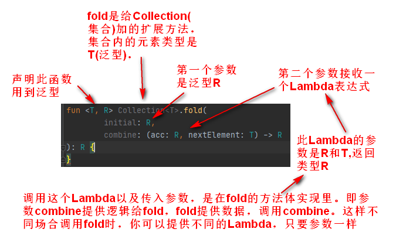

## Lambda表达式

假设你要为一个按钮添加一个负责处理点击事件的监听器：

```java
/* Java */
button.setOnClickListener(new View.OnClickListener() {
        @Override
        public void onClick(View v) {
            //do something
        }
});
```

这样声明匿名内部类的写法实在是太啰嗦了。Java8可以：

```java
/* Java 8 */
button.setOnClickListener(v->{
    //do something
});
```

Kotlin中也可以像Java 8一样使用lambda来消除这些冗余代码，语法稍有不同：

```kotlin
/* Kotlin */
button.setOnClickListener{ /* do someting */ }//Lambda内部使用it表示入参v
//不过稍后你会看到只有调用java的方法才能这么写
```

### 语法：

>     //参数                 //函数体 
>     { x: Int, y: Int  ->   x + y }

1. 当只有一个参数时，可以省略参数，用`it`代表参数。
2.  lambda 表达式中的最后一个表达式是返回值，不需要`return`关键字

代码片段：

```kotlin
interface Listener{
    fun click(source:Int)
}
fun happen(l:Listener):Unit{
    l.click(1)
}
fun main() {
    happen({source:Int -> } )//wrong,类型不兼容,一个是函数，一个是Listener类
    happen({source:Int -> } as Listener)//语法上right,实际上运行还是报类型不兼容异常
}
//---以上表明，Kotlin不支持把lambda自动转换成Kotlin接口对象。不能像java8函数式接口那样用

//然而
//JavaListener.java
public interface JavaListener {
        void click(int source);
}
//kotlin
fun happen2(l:JavaListener):Unit{
    l.click(1)
}
happen2(JavaListener{ source:Int -> println(source)})//OK
//--以上，官方文档有解释: 如果对象是函数式 Java 接⼝（即具有单个抽象⽅法的 Java 接⼝）的实例，你可以使⽤带接⼝类型前缀的lambda表达式创建它。这个叫做“SAM构造方法”。
//接上文，如果happen2也是定义在java里的方法：
void happen2(JavaListener l){
    l.click(1);
}
//in kotlin
fun main() {
    obj.happen2{ source:Int -> println(source)}//OK,完全像java8函数式接口那样用
}
//这就是为什么,明明kotlin里面Lambda不能自动转成函数式接口类型，可是kotlin写安卓时，为button注册监听可以：button.setOnClickListener { xx }，因为Button和OnClickListener都是java写的。
//为什么这么设计？一方面纯的kotlin不需要java的那些特性，另一方面又要兼容java。
```

### 函数参数是Lambda

格式如下：

```kotlin
fun performRequest(
        url: String,
        callback: (code: Int, content: String) -> Unit //第二个参数是一个Lambda
) {
    /*...*/
}
```

示例2，带接收者的lambda：

```kotlin
@kotlin.internal.InlineOnly
public inline fun <T, R> with(receiver: T, block: T.() -> R): R {
    contract {
        callsInPlace(block, InvocationKind.EXACTLY_ONCE)
    }
    return receiver.block()//在receiver上面调用block
}
//这里block的类型是: T.() -> R。称为带有接收者的函数类型
```

带有接收者的函数类型A.(B) -> C，表示可以在 `A` 的接收者对象上以一个 `B` 类型参数来调用并返回一个 `C` 类型值的函数。

和**扩展函数**类似，传给调用的接收者对象成为***隐式***的*this*，以便访问接收者对象的成员而无需任何额外的限定符，亦可使用`this`访问接收者对象。

### 函数返回类型是Lambda

函数可以直接返回一个Lambda:

```kotlin
fun main() {
    fun createAllDoneRunnable(): ()->Unit {
        return  { println("All Done!") }
    }
    var r = createAllDoneRunnable()
    r()
    println(r)
    println(r.javaClass)
}
//output:
All Done!
() -> kotlin.Unit
class com.company.AAAKt$main$1$1
```

### **SAM构造方法**

如果返回类型是一个java的函数式接口类型，可以用**SAM构造方法**：

```kotlin
fun createAllDoneRunnable(): Runnable {
    return Runnable { println("All Done!") }
}
var r = createAllDoneRunnable()
r.run()
println(r is Runnable)
```

除了返回值外，**SAM构造方法**还可以用在需要把函数式接口实例存储在一个变量中的情况。假设你要在多个按钮上重用同一个监听器，就像下面的代码一样：

```kotlin
val listener = OnClickListener { view ->
        val text = when(view.id) {
            R.id.button1 -> "First Button"
            R.id.button2 -> "Second Button"
            else -> "Unknown Button"
        }
        toast(text)
}
button1.setOnClickListener(listener)
button2.setOnClickListener(listener)
//如前文所述，OnClickListener是用java代码定义的，才能这样用。
```

### Lambda里的this

测试1：

```kotlin
class AAA {
    fun test1(){
        {
            println(this)
        }()//在lambda后面加一个括号，意思是直接调用它
    }
}
fun main() {
    AAA().test1()//显然print this是AAA的对象
}
```

测试2：

```kotlin
class AAA {
    fun test2(code: ()->Unit){
        code()
    }
}

fun main() {
    AAA().test2 { println(this)}//报错，this指向的是包围它的类，而main方法是顶层,没有包围的类
}
```

测试3：

```kotlin
class AAA {
    fun test2(code: AAA.()->Unit){//带有接收者的函数类型
        code()
    }
}
fun main() {
     AAA().test2 { println(this)}//OK, 接收者是AAA()对象
}
```

**总结**，lambda内部没有匿名对象那样的this：没有办法引用到lambda转换成的匿名类实例。从编译器的角度来看，lambda是一个代码块，不是一个对象，而且也不能把它当成对象引用。Lambda中的this，要么指向的是包围它的类，要么指向接收者。
         如果你的事件监听器在处理事件时还需要取消它自己，不能使用lambda这样做。这种情况请使用实现了接口的匿名对象，在匿名对象内，this关键字指向该对象实例，可以把它传给移除监听器的API。

```kotlin
val handler = Handler()
handler.postDelayed({
    //企图执行周期任务
    handler.postDelayed(this, 3000)//错，this不是Runnable
},1000)

//正确写法
handler.postDelayed(object :Runnable{
    override fun run() {
        handler.postDelayed(this, 3000)
    }
},1000)
```

### with 与 apply函数

先看看下面这个例子：

```kotlin
fun alphabet(): String {
    val result = StringBuilder()
    for (letter in 'A'..'Z') {
        result.append(letter)
    }
    result.append("\nNow I know the alphabet!")
    return result.toString()
}
```

这里每次调用都要重复result这个名称，如果你用到的表达式更长或者重复得更多，这样写就非常啰嗦了。

使用with函数重写这段代码：

```kotlin
fun alphabet(): String {
    val stringBuilder = StringBuilder()
    return with(stringBuilder) { //指定接收者的值，你会调用它的方法
        for (letter in 'A'..'Z') {
            this.append(letter)  //通过显式地this来调用接收者值得方法
        } 
        append("\nNow I know the alphabet!") //this可以省略
        this.toString() //从lambda返回
    }
}
```

你也可以选择把它写成`with(stringBuilder, {...})`，但是kotlin的约定规范，我们总是把lambda放在括号外。这导致整个调用看起来就像是内建的语言功能，但你心里要知道，with实际上是一个函数，它的原理我上文已经讲过了。

#### apply 函数

apply是一个扩展函数：

```kotlin
@kotlin.internal.InlineOnly
public inline fun <T> T.apply(block: T.() -> Unit): T {
    contract {
        callsInPlace(block, InvocationKind.EXACTLY_ONCE)
    }
    block()
    return this
}
```

可以在任何对象上调用它：

```kotlin
Object().apply {  }
Runnable{}.apply {  }
Any().apply {  }
```

并且apply方法始终返回它的接收者对象。其它功能和with一致。所以，有了apply，你代码可以这样写：

```kotlin
fun createViewWithCustomAttr(context: Context) = 
    TextView(context).apply {
        text = "Sample Text"
        textSize = 20.0f
        setPadding(10, 0, 0, 0)
    }
```

我记得以前写js时有很多这样的写法。果然语言之间都是互相借鉴的。

## 成员引用

你已经看到如何用lambda让你的代码块作为参数传递给函数。但是如果想要当做参数传递的代码已经被定义成了函数，该怎么办？Kotlin和Java 8一样，使用`::` 运算符来转换：

```kotlin
fun com(a:Int, b:Int):Int{
    return a
}
fun main() {
    var tt = ::com//因为com是顶层函数，故"::"前面没有类。但这个双冒号不能省略
    var tt2 = ::com
    println(tt==tt2)//true
    println(tt===tt2)//false,表明和java8一样，每次使用::com生成的不同对象
    
    var c = { a:Int,b:Int -> a }
    c = ::com//OK
    c = tt//OK
    tt = c//OK
    //----以上，因为参数和返回值类型都是一样的，因此可以互相赋值
}
```

片段2：

```kotlin
class AAA {
    fun test(a:Int){
        println("test $a, $this")
    }
}
fun main() {
    var aa = AAA()
    aa.test(3)//普通调用

    var aRef = AAA::test//类名+双冒号
    aRef(aa, 3)//由于test是属于一个对象的，需要告诉aRef哪个对象

    var bRef = aa::test//对象+双冒号
    bRef(3)//和普通调用一样。kotlin1.1以后才支持
}
```

片段3：

```kotlin
class AAA {
    fun test(a:Int){
        println("test $a, $this")
    }
}
class BBB{
    fun cal(par: (a:Int)->Unit){
        par(3)
        println(this)
    }
}
fun main() {
    var aa = AAA()
    var bb = BBB()
//wrong:    bb.cal(AAA::test)
    bb.cal(aa::test)//right,1.1之后
    bb.cal { aa.test(it) }//kotlin1.1之前要显式写lambda
}
/*
输出：
test 3, com.company.AAA@5451c3a8
com.company.BBB@76ed5528
观察打印的this对象
*/
```

## 高阶函数

```kotlin
fun <T, R> Collection<T>.fold(
        initial: R,
        combine: (acc: R, nextElement: T) -> R
): R {
    var accumulator: R = initial
    for (element: T in this) {
        accumulator = combine(accumulator, element)
    }
    return accumulator
}
```

我们暂且忽略方法块内的实现逻辑，只关注声明格式：



比方说，你要从Person的集合里找到最大的元素。但是最大可能是指的年龄，也可能指的工号：

```kotlin
val people = listOf(Person("10100", 29), Person("10101", 26))
println(people.maxBy{ it.age })//根据年龄
println(people.maxBy{ it.licence })//根据工号
```

这种把一个函数作为参数传给另一个函数，或者函数返回一个函数，就叫做“高阶函数”。

这个名称很形象的。数学上，函数f(x),g(y),当f(x)的参数x=g(y)时，就是f(g(y)),这不就是"高阶"吗？正如复合函数要求g(y)的值域是f(x)的定义域的子集，“高阶函数”的使用也必须满足数学上的“闭包”性。实际上，是先有数学里的“λ演算”，后有计算机领域的*Lambda*表达式。

> Lambda表达式基于数学中的[λ演算](https://baike.baidu.com/item/λ演算)得名，直接对应于其中的lambda抽象（lambda abstraction），是一个匿名函数

## 函数式编程(Functional Programming)

`函数式编程`将电脑运算视为函数的计算。基础是λ演算（lambda calculus），而且λ演算的函数可以接受函数当作输入（参数）和输出（返回值）。

和指令式编程相比，函数式编程关心数据的映射，命令式编程关心解决问题的步骤.

和过程化编程相比，函数式编程里函数的计算可随时调用。

简单说，"函数式编程"是一种"编程范式"（programming paradigm），也就是如何编写程序的方法论。

它属于"结构化编程"的一种，主要思想是把运算过程尽量写成一系列嵌套的函数调用。

### 特性

* **闭包和高阶函数**

* **惰性计算**

* **递归**

* **函数是"第一等公民"**

* **只用"表达式"，不用"语句"**

* **没有"副作用"**

* **不修改状态**

* **引用透明性**

* **易于"并发编程"**

### 顾虑

函数式编程常被认为严重耗费在CPU和存储器资源。主因有：

- 早期的函数式编程语言实现时并无考虑过效率问题。
- 有些非函数式编程语言为求提升速度，不提供自动边界检查或自动垃圾回收等功能。
- 惰性求值亦为语言增加了额外的管理工作。
- 掩盖底层操作的复杂性。如果涉及到性能，不了解底层做了什么的话，容易写出低效率的代码。

## 惰性求值

在编程语言理论中，惰性求值(英语：Lazy Evaluation)，又译为惰性计算、懒惰求值，也称为传需求调用(call-by-need)，是一个计算机编程中的一个概念，目的是要最小化计算机要做的工作。它有两个相关而又有区别的含意，可以表示为“延迟求值”和“最小化求值”。除可以得到性能的提升外，惰性计算的最重要的好处是它可以构造一个无限的数据类型。

## 集合的函数式API

### filter、map、all、any、count、find

filter和map函数是许多集合操作的基础，**filter**即过滤，参数传一个返回布尔类型的lambda，**filter**函数遍历集合并选出lambda返回true的那些元素：

```kotlin
fun main() {
    val list = listOf(1, 2, 3, 4)
    println(list.filter {  it % 2 == 0 })//过滤出所有偶数创建新集合，并返回新集合
    
    val people = listOf(Person("Hubert", 26), Person("Bob", 31))
    println(people.filter { it.age > 30 })//过滤出超过30岁的人
}
```

`map`即映射。对集合的每个元素，通过参数给定的函数，映射为一个新的元素：

```kotlin
val list = listOf(1, 2, 3, 4)
println(list.map { it * it })//把数字列表变换成它们平方的列表

//返回Person的名字的集合
data class Person(val name: String, val age: Int)
fun main() {
    val people = listOf(Person("Hubert", 26), Person("Bob", 31),Person("Bob", 31))
    println(people.map { it.name })//打印：[Hubert, Bob, Bob]
    println(people.map(Person::name))//用成员引用，与上面等价
}
```

链式调用：

```kotlin
//返回年龄超过30岁的人的名字的集合
people.filter { it.age > 30 }.map(Person::name)

//所有年龄最大的人的名字：
people.filter { it.age == people.maxBy(Person::age).age }//低效率，对每个人都会重复寻找最大年龄的过程
//改进，只计算了一次最大年龄：
val maxAge = people.maxBy(Person::age).age
people.filter { it.age == maxAge }
```

**all**:检查集合中所有元素是否都符合某个条件

```kotlin
println(people.all{it.age < 40})//如果people集合中的每个人年龄都小于40，则打印true
```

**any**：存在元素符合条件即返回true：

```kotlin
val people = listOf(Person("Hubert", 26), Person("Bob", 31),Person("Bob", 25))
println(people.any{println(it);it.age < 27})
/*打印：
Person(name=Hubert, age=26)
true
因为any的意思是只要有一个存在即返回true。只计算了第一个就已经能确定了。
*/
```

**count**: 符合条件的元素个数：

```kotlin
println(people.count{it.age > 27})
//相当于：
println(people.filter{it.age > 27}.size)
//区别是第二种会创建一个中间集合，而count方法只关心数量，不会创建新集合，更高效。
```

**find函数**：返回第一个匹配的元素：

```kotlin
val people = listOf(Person("Hubert", 26), Person("Bob", 31),Person("Bob2", 31))
println(people.find{it.age == 31})//打印：Person(name=Bob, age=31)
```

### Sequence

```kotlin
people.map(Person::name).filter { it.startsWith("A") }
//我想你应该已经知道,上面的链式调用会创建两个列表：一个保存filter函数的结果，另一个保存map函数的结果。如果有一百万个元素，链式调用就会变得十分低效
```
这个问题通过使用序列(Sequence)解决
> 序列(Sequence)是 Kotlin 标准库提供的另一种容器类型。序列与集合有相同的函数 API，却采用不同的实现方式。
>
> Kotlin 的 Sequence 更类似于 Java 8 的 Stream，二者都是延迟执行(即前面说的“惰性求值”)。Kotlin 的集合转换成 Sequence 只需使用asSequence()方法。

所以为了提高效率，把操作变成使用序列，而不是直接使用集合：

```kotlin
var list = people.asSequence()     //把初始集合转换成序列
        .map(Person::name)
        .filter { it.startsWith("A") }
        .toList()   //把结果序列转换回列表
println(list)
```

在 Kotlin 1.2.70 的 release note 上曾说明：

> 使用 Sequence 有助于避免不必要的临时分配开销，并且可以显着提高复杂处理 PipeLines 的性能。

#### 关于惰性求值的测试：

```kotlin
var seq = listOf(1, 2, 3, 4).asSequence()
.map { print("map($it) ${System.currentTimeMillis()/1000}"); it *it }
.filter { print("filter($it) ${System.currentTimeMillis() / 1000})"); it % 2 == 0 }

println("time 1: ${System.currentTimeMillis()/1000}")
Thread.sleep(1000)
seq.toList()

//打印：
time 1: 1624003372
map(1) 1624003373filter(1) 1624003373)map(2) 1624003373filter(4) 1624003373)map(3) 1624003373filter(9) 1624003373)map(4) 1624003373filter(16) 1624003373)
测试结果表明，在最后seq.toList()的时候，才真正执行前面map和filter变换
```