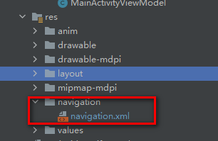
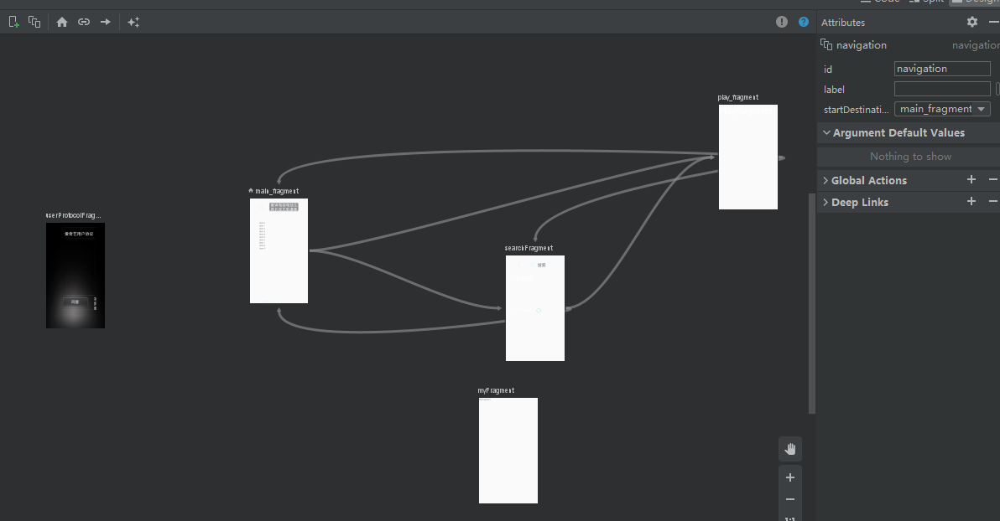

## 零 是什么

Navigation 组件用于具有一个主 Activity 和多个 Fragment 目的地的应用。主 Activity 与导航图相关联，且包含一个负责根据需要交换目的地的 `NavHostFragment`。在具有多个 Activity 目的地的应用中，每个 Activity 均拥有其自己的导航图。

导航架构组件 可简化实现导航的过程，同时有助于您直观呈现应用的导航流程。该库具有诸多优势，包括：

- 自动处理 fragment 事务
- 默认情况下即可正确处理 **up** 和 **back**
- 提供默认的动画和过渡行为
- 将深层链接视为第一类操作
- 只需极少额外操作即可实现各种导航界面模式（例如抽屉式导航栏和底部导航栏）
- 导航过程中，在传递信息的同时确保类型安全
- Android Studio 直观呈现和修改应用的导航流程
- [Safe Args](https://developer.android.google.cn/guide/navigation/navigation-pass-data#Safe-args) - 可在目标之间导航和传递数据时提供类型安全的 Gradle 插件。
- `ViewModel` 支持 - 您可以将 `ViewModel` 的范围限定为导航图，以在图表的目标之间共享与界面相关的数据。

## 一. 依赖

```
dependencies {
    // Navigation
    implementation "androidx.navigation:navigation-fragment:2.3.5"
    implementation "androidx.navigation:navigation-ui:2.3.5"
}
```

如果使用kotlin开发：

```groovy
  def nav_version = "2.3.5"
  // Kotlin
  implementation "androidx.navigation:navigation-fragment-ktx:$nav_version"
  implementation "androidx.navigation:navigation-ui-ktx:$nav_version"
```

如果使用了“safe-args”，则需要在buildscript里：

```groovy
buildscript {
    ...
    dependencies {
        classpath "com.android.tools.build:gradle:4.2.2"
        //使用SafeArgs
        classpath "androidx.navigation:navigation-safe-args-gradle-plugin:2.3.5"
    }
}
```

## 二. 基本架构

导航组件由三个关键部分组成，这三个部分协同工作。它们是：

1. **导航图**（新 XML 资源）- 一个配置所有导航相关信息的 XML 文件。其中包括应用内的所有位置（称为“目的地”）以及用户在应用中可采取的可能路径。

2. **NavController**（Kotlin/Java 对象）- 控制器，我们导航到不同的位置，就是通过调用NavController里面的方法。NavController从 `NavHost` 中获取，管理应用导航。当用户在整个应用中移动时，`NavController` 会安排 `NavHost` 中目标内容的交换。

3. **NavHostFragment** - 显示导航图中目标的空白容器。传统的使用fragment的方法，通常在布局文件中声明一个FrameLayout，然后在代码里用`fragmentTransaction.add(R.id.framelayout_id, fragment1).commit()`添加fragment（或者直接把fragment标签静态声明在FrameLayout标签里）。现在我们将`FrameLayout`替换成`androidx.fragment.app.FragmentContainerView`，然后`android:name`属性指定`NavHost`的实现类，即**NavHostFragment** 。`FragmentContainerView`是`FrameLayout`的子类，是容纳fragment的容器；`NavHostFragment`是Fragment的子类，本身也是一个fragment，但是不会显示，只是作为`PrimaryNavigationFragment`。我们通过它获取到**NavController**对象，这样不管是从activity、fragment还是view，都能获取到controller。

   

**导航图位置：**



Android Studio提供可视化界面：




**容器：**

```xml
<androidx.fragment.app.FragmentContainerView
    android:id="@+id/fragment_contain"
    android:name="androidx.navigation.fragment.NavHostFragment"
    android:layout_width="match_parent"
    android:layout_height="match_parent"
    android:layout_marginStart="151dp"
    app:defaultNavHost="true"
    />
```

这个基本就是固定写法。你 **应当注意** 到里面声明了一个属性`app:defaultNavHost="true"`。意味着你的NavGraphFragment将会 **拦截系统Back键的点击事件**。如果不声明此属性，返回键会直接关闭activity，而不是弹出fragment回到上一个fragment。

如果你在fragment里注册了`requireActivity().getOnBackPressedDispatcher().addCallback()`，那么即使没有声明defaultNavHost，fragment也是能收到的back事件的。

## 三. 使用

1. 获取NavController

   ```kotlin
   //在kotlin中
   Fragment.findNavController()
   View.findNavController()
   Activity.findNavController(viewId: Int)
   ```

   java中：

   ```java
   NavHostFragment.findNavController(Fragment)
   Navigation.findNavController(Activity, @IdRes int viewId)
   Navigation.findNavController(View)
   ```

   

2.  导航到其它fragment

   ```java
   //根据navigation.xml中声明的action，推荐的方式
   NavHostFragment.findNavController(this).navigate(R.id.action_main_fragment_to_searchFragment);
   
   //也可以传进fragment id
   NavHostFragment.findNavController(UserProtocolFragment.this).navigate(R.id.main_fragment);
   //这些fragment是在navigation.xml中声明
   <fragment
           android:id="@+id/main_fragment"
               ........
               
   ```

   navigate导航底层相当于fragment的replace方式，而不是add、show、hide。每次调用navigate方法会创建新的fragment对象。

3.  android维护了一个返回堆栈。每次调用 `navigate()` 方法都会将目的地放置到堆栈的顶部。移除（或弹出）堆栈顶部，返回上一级的方法是调用popBackStack()或navigateUp()，或者按下返回键。

4. popUpTo 和 popUpToInclusive。

   假设有A、B 和 C三个fragment，从 A 到 B、从 B 到 C 再从 C 返回到 A。每执行一次导航操作，都会将一个目的地添加到返回堆栈。通过此流程反复导航，则返回堆栈会不停累加（例如 A、B、C、A、B、C、A 、......）。

   如果在从c到a的action里使用了popUpTo 属性：

   ```xml
   <fragment
       android:id="@+id/c"
       android:name="com.example.myapplication.C"
       android:label="fragment_c"
       tools:layout="@layout/fragment_c">
       <action
           android:id="@+id/action_c_to_a"
           app:destination="@id/a"
           app:popUpTo="@+id/a"/>
   </fragment>
   ```

   那么，假设现在堆栈是：（A、B、C）,当导航(navigate)到目的地 A 时， A上面的B 和 C会从堆栈中移除，但是A不会。注意是调用navigate(A)导航到A，会创建新的Afragment对象，而不是堆栈弹到A。所以这时的堆栈是：(A、A), 有两个A，所以popUpTo 一般是和 popUpToInclusive一起用的：

   ```xml
   <fragment
       android:id="@+id/c"
       android:name="com.example.myapplication.C"
       android:label="fragment_c"
       tools:layout="@layout/fragment_c">
   
       <action
           android:id="@+id/action_c_to_a"
           app:destination="@id/a"
           app:popUpTo="@+id/a"
           app:popUpToInclusive="true"/>
   </fragment>
   ```

   加了popUpToInclusive=“true"，会把A也从历史里弹出来，然后堆栈就只有一个新创建的AFragment了。

   > 实验1：
   >
   > fragmentA通过navigate(id)导航到fragmentB,在从fragmentB通过navigate(id)导航到fragmentA,如此反复。在onCreateView中将fragment对象打印出来。log如下：
   >
   > onCreateView: AFragment{882803c}
   >
   > onCreateView: AFragment{41bcdce}
   >
   > onCreateView: AFragment{4990432}
   >
   > 这表明每次导航都创建新的fragment对象。
   >
   > 
   >
   > 实验2：
   >
   > 接上，从fragmentB导航到fragmentA的方法改为navigateUp()，log如下：
   >
   > AFragment{cb402ab}
   >
   > AFragment{cb402ab}
   >
   > AFragment{cb402ab}
   >
   > 表明navigateUp()是回到上一个fragment界面，并且复用的之前的fragment对象。
   >
   > 如果我们设计良好，把数据放到VM里，那么一般不要关心fragment对象是不是同一个。
   >
   > 
   >
   > 实验3：
   >
   > 接实验1，导航都用navigate，且不添加popUpTo和popUpToInclusive
   >
   > ```
   > <action
   > android:id="@+id/action_b_to_a"
   > app:destination="@id/a_fragment" />
   > ```
   > 然后执行导航A->B->A->B->A->B->A，然后手机按下back键。我们发现回到了B，再连续按back键，会依次返回上个界面：返回B->返回A->返回B->返回A->返回B->返回A->退出APP。通常这是不符合期望的。然后我们在b_to_a的action加上popUpTo：
   >
   > ```
   > <action
   >  android:id="@+id/action_b_to_a"
   >  app:popUpTo="@id/a_fragment"
   >  app:destination="@id/a_fragment" />
   > <action
   > ```
   >
   > A->B->A, 此时在A界面，然后按back键。我们发现仍然在A界面。看log：
   >
   > onCreateView:AFragment{cb402ab}//第一次进入A
   >
   > onCreateView:AFragment{7f60efc}//导航到B，再导航到A时
   >
   > onCreateView:AFragment{cb402ab}//按下back键时
   >
   > 也就是说，堆栈有两个A, 按下back键，表面上界面没有变化，其实已经把A弹出了，回到了上一个A界面。
   >
   > 然后我们再把popUpToInclusive="true"也加上：
   >
   > ```
   > <action
   >     android:id="@+id/action_b_to_a"
   >     app:popUpTo="@id/a_fragment"
   >     app:popUpToInclusive="true"
   >     app:destination="@id/a_fragment" />
   > <action
   > ```
   >
   > 执行导航A->B->A->B->A->B->A，然后手机按下back键，直接退出应用界面。
   >
   > 

## 四. 常见问题

**问题1. ** 第一次使用app，显示用户协议，同意后再进入主界面；否则直接进入主页面fragment(main_fragment)。

当然，我可以把起始地点设置为主界面，在主界面的逻辑里判断“是否已经同意协议”，如果没有同意，则导航到用户协议界面。

```xml
 <androidx.fragment.app.FragmentContainerView
        android:id="@+id/fragment_contain"
        android:name="androidx.navigation.fragment.NavHostFragment"
        android:layout_width="match_parent"
        android:layout_height="match_parent"
        android:layout_marginStart="151dp"
        app:defaultNavHost="true"
        app:navGraph="@navigation/navigation"
        />
```

向上面这样app:navGraph配置在main_avitivity.xml里，navigation.xml里指定了startDestination:

```
<navigation xmlns:android="http://schemas.android.com/apk/res/android"
    xmlns:app="http://schemas.android.com/apk/res-auto"
    xmlns:tools="http://schemas.android.com/tools"
    android:id="@+id/navigation"
    app:startDestination="@id/main_fragment">
  ....
```

那么进入一定是先创建main_fragment的,然后再导航到用户协议fragment。我们不希望还没有同意用户协议，就创建MainFragment。我们的对策是：

1. xml里删除`app:navGraph="@navigation/navigation"`

2. 用代码控制startDestination：

   ```kotlin
   navController = supportFragmentManager.findFragmentById(R.id.fragment_contain)!!.findNavController()
   //渲染导航图
   val navGraph = navController.navInflater.inflate(R.navigation.navigation)
   
   if(agree){//如果同意协议
       navGraph.startDestination = R.id.videos_fragment
   }else{
       navGraph.startDestination = R.id.userProtocolFragment
   }
   navController.graph = navGraph//导航图赋给navController
   ```

3. 如果没有删除xml里的`app:navGraph`,即使使用动态代码，依然会先inflate主页fragment。所以删除`app:navGraph`是必要的。

4. 用户同意协议后，进入主界面，如果按返回键，会回到用户协议界面。这是不希望的。所以从协议界面导航到主界面的同时，要将用户协议fragment从历史堆栈中弹出。这里我用了另一种方法，即重新设置startDestination为main fragment：

   ```java
   //删除： NavHostFragment.findNavController(UserProtocolFragment.this).navigate(R.id.main_fragment);
   
   NavGraph graph = navController.getGraph();
   graph.setStartDestination(R.id.main_fragment);
   navController.setGraph(graph);//重新设置graph，这样按返回键不会回到协议界面。
   ```

   进入setGraph的源代码，有一行：

   ```java
   if (mGraph != null) {
       // Pop everything from the old graph off the back stack
       popBackStackInternal(mGraph.getId(), true);
   }
   ```

所以如果之前设置过graph，会先把原来的空，再设置界面为新的graph指定的起始位置。


**问题2.** 默认返回事件是回到堆栈的上个界面，如果我需要拦截返回事件，做一些自己的判断，满足条件才弹出堆栈。典型场景是，界面显示一个假的弹框（所谓假的弹窗，意思是，不是用的安卓系统提供的dialog，而是我们自己画的普通view当做弹框）。然后，当此弹框显示时，返回事件是dismiss这个弹窗，fragment不弹出。

传统的做法是，在宿主activity里重写onBackPressed()方法，通过listener通知各个fragment。

我们发现androidx.activity.ComponentActivity已经实现了onBackPressed()通过listener通知各个fragment的逻辑：

```java
//androidx.activity.ComponentActivity.java
@MainThread
public void onBackPressed() {
    mOnBackPressedDispatcher.onBackPressed();
}
```

所以只需要在fragment里添加：

```java
//返回键事件
requireActivity().getOnBackPressedDispatcher().addCallback(getViewLifecycleOwner(), new OnBackPressedCallback(true) {
    @Override
    public void handleOnBackPressed() {
        LogUtils.i("handleOnBackPressed");
        if(condition){
            xxx Your code
        }else{
            NavHostFragment.findNavController(this).navigateUp();//返回
        }
    }
});
```

注意满足返回的条件时，你要手动调用navigateUp(),因为注册了此回调后，系统就不会自动返回了。

**问题3.**  从activity的oncreate中获取navController为空

如下代码解决:

```java
navController = NavHostFragment.findNavController(getSupportFragmentManager().findFragmentById(R.id.fragment_contain));
```

**问题4.**  每次切换目的地，fragment是反复销毁重建的，按照谷歌推荐的`1个APP只需1个activity`的思路开发，这样是没问题的，但是假如我们希望将首页保存起来，从二级页面返回过来时，不要重新绘制界面，不要重新加载数据，该怎么办？

没什么好的办法，网上的思路大都是继承FragmentNavigator，重写navitgate方法，把ft.replace换成add+show/hide。这样虽然可以达到目的，但是这么玩的话使用navigation组件的优势是什么？还不如用原始方法控制fragment呢。

或者onCreateView添加类似下面代码：

```java
if(mView != null){
    return mView;
}
//mView is null
inflate view...
liveData.observe(...)
```

返回时候记得用popup的方式，而不是navigate。这样view是复用之前的了，但是要注意新的问题，比如,上面你把LiveData#observe(getViewLifecycleOwner(),xxxx)放在onCreateView里面，直接return mView,也就没有重新执行observe，因为每次onCreateView都创建新的mViewLifecycleOwner对象：

```java
//androidx.fragment.app.Fragment
void performCreateView(@NonNull LayoutInflater inflater, @Nullable ViewGroup container,
        @Nullable Bundle savedInstanceState) {
    ...
    mViewLifecycleOwner = new FragmentViewLifecycleOwner(this, getViewModelStore());
    mView = onCreateView(inflater, container, savedInstanceState);
    ...
}
```

LiveData对象关联的还是之前的mViewLifecycleOwner，而不是新的，LiveData#observe(getViewLifecycleOwner(),xxxx) 会失效。你应该把liveData.observe放到其他生命周期里面，让它重新执行一次。

这样LiveData对象可以收到通知，但是仍然新的问题，返回界面show出来后，LiveData收到通知导致数据刷新（返回后我们希望直接显示原来的界面，不要刷新）。所以我们把LiveData#observe(getViewLifecycleOwner(),xxxx)，换成LiveData#observe(this,xxxx), 但是在新的版本上面，android studio里面有一个Lint check会使这行代码报红。当然这只是一个Lint check，不会影响编译，但是既然谷歌希望你用getViewLifecycleOwner()代替this，也许getViewLifecycleOwner()会避免一些潜在问题，出于长远考虑我们建议遵循谷歌规范。

> `Fragment` implements `LifecycleOwner` which maps its create and destroy events to the fragment's `onCreate` and `onDestroy`, respectively.
>
> `Fragment.getViewLifecycleOwner()` maps its create and destroy events to the fragment's `onViewCreated` and `onDestroyView`, respectively. 
>
> In most cases, this mirrors the lifecycle of the Fragment itself, but in cases of `detached` Fragments, the lifecycle of the Fragment can be considerably longer than the lifecycle of the View itself.
>
> 参考：https://developer.android.google.cn/reference/androidx/fragment/app/Fragment.html#getViewLifecycleOwner()

你看，怎么改都不完美，甚至引入新的问题和难以察觉的潜在问题。所以如果使用navigation，最好是遵循谷歌的建议，返回后就让界面重新绘制，不保存历史数据，这不是什么大问题。

实在不能忍受的话，考虑自己创建一个类实现LifecycleOwner，用它跟LiveData关联，把一切控制权抓在自己手上。只是代码变得更复杂，需要考虑许多精细的地方。

(网上一堆人吐槽重复创建真的是太坑了^--^,而且挖空心思也只能做到第一个页面不重复创建，其他页面仍然会，你只能用数据库缓存数据。除非自定义FragmentNavigator。谷歌说这不符合设计原则，所以不肯去解决这个问题)