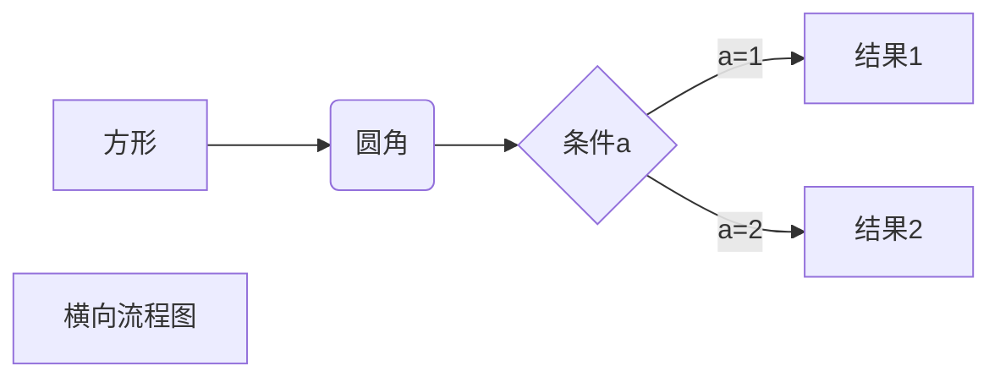
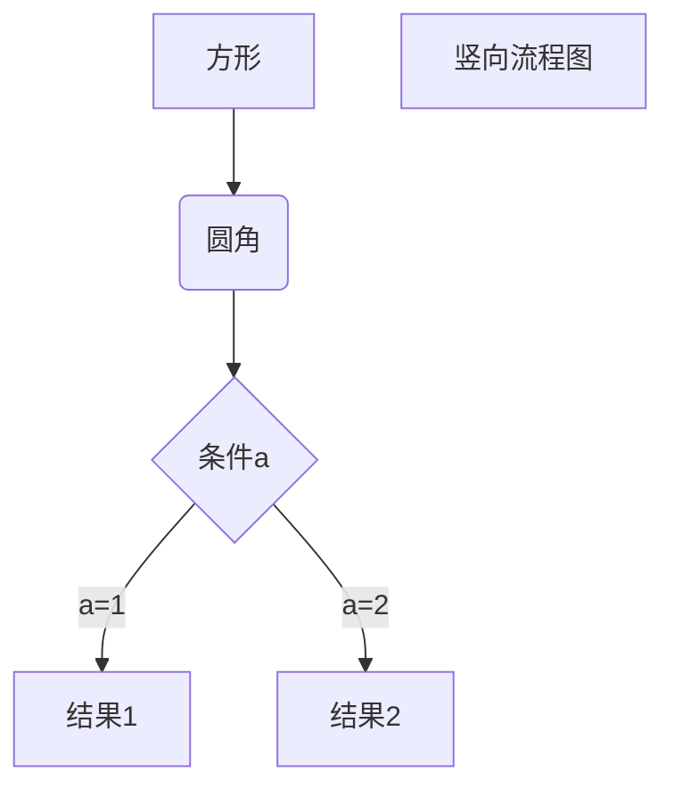
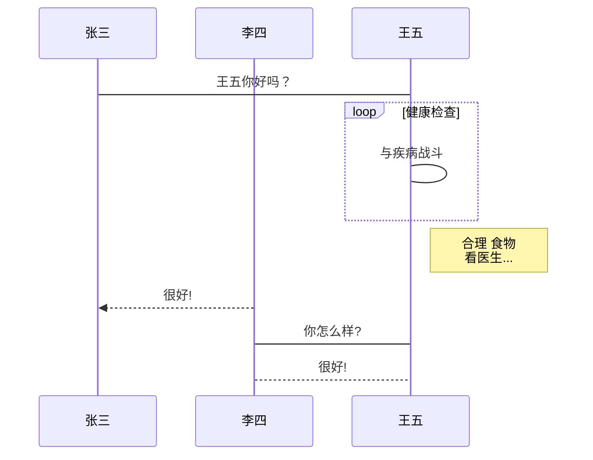
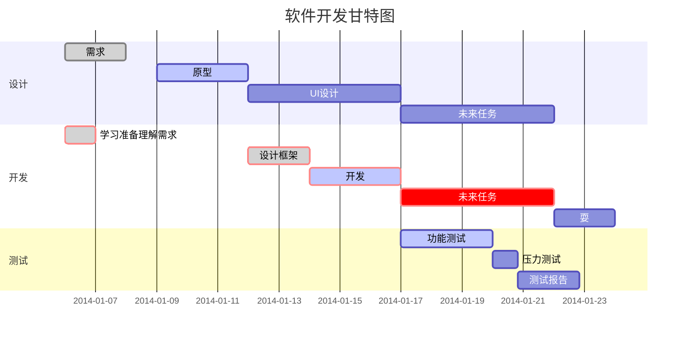

软件
===
独立应用有 `Typora` ，支持 MacOS 、Windows、Linux 平台，且包含多种主题。

chrome插件，有 `Markdown Editor`，`Markdown Viewer`，前者可以编辑和预览。后者让你直接把md文件拖进chrome。 

**note**:不同渲染器有细微差异，当有些标志没有效果时，在标志后面加个空格试一试 

# 标题

```markdown
我展示的是一级标题
=================

我展示的是二级标题
-----------------
```
或者
```markdown
# 一级标题
## 二级标题
### 三级标题
#### 四级标题
##### 五级标题
###### 六级标题
```
# 段落

两个以上**空格**加上回车区分段落

## 字体

```markdown
*斜体文本*
_斜体文本_
**粗体文本**
__粗体文本__
***粗斜体文本***
___粗斜体文本___
```

## 分隔线

在一行中用三个以上的星号、减号、底线来建立一个分隔线，行内不能有其他东西,可以有空格。

## 删除线

在文字的两端加上两个波浪线 **~~** 即可

```markdown
GOOGLE.COM
~~BAIDU.COM~~
```

## 下划线
通过 HTML 的 **<u>** 标签来实现

> <u>带下划线文本</u>

## 脚注
将鼠标放在上面
Hello[^1]

[^1]:Hello means 你好


# 无序列表

使用星号(*****)、加号(**+**)或是减号(**-**)作为列表标记，标记后面要添加一个**空格**

```markdown
* 第一项
* 第二项
* 第三项

+ 第一项
+ 第二项
+ 第三项


- 第一项
- 第二项
- 第三项
```

# 有序列表

数字并加上 **.** 号来表示

```markdown
1. 第一项
2. 第二项
3. 第三项
```

### 列表嵌套

在子列表中的选项前面添加四个空格即可

```markdown
1. 第一项：
    - 第一项嵌套的第一个元素
    - 第一项嵌套的第二个元素
2. 第二项：
    - 第二项嵌套的第一个元素
    - 第二项嵌套的第二个元素
```

# 区块

当引用别人的文本时，通常放到一个区块中。区块是在段落开头使用 **>** 符号 ，然后后面紧跟一个**空格**符号

另外区块是可以嵌套的，一个 **>** 符号是最外层，两个 **>** 符号是第一层嵌套，以此类推：

```
> 最外层
> > 第一层嵌套
> > > 第二层嵌套
```

### 区块中使用列表

```markdown
> 区块中使用列表
> 1. 第一项
> 2. 第二项
> + 第一项
> + 第二项
> + 第三项
```

### 列表中使用区块

```
* 第一项
    > markdown教程
    > 奇技淫巧
* 第二项
```

# 代码

一行里面的代码片段可以用反引号把它包起来：

```markdown
C语言引用用`printf()` 函数
```
用 ``` 包裹一段代码，并指定一种语言（也可以不指定）

```
​```javascript
$(document).ready(function () {
    alert('RUNOOB');
});
​```
```

# 链接

```
这是一个链接 [谷歌](https://www.google.com)
```

显示结果： 

这是一个链接 [谷歌](https://www.google.com)  


尖括号直接使用链接地址：

```
<https://www.runoob.com>
```

#  图片

- 开头一个感叹号 !

- 接着一个方括号，里面放上图片的替代文字

- 接着一个普通括号，里面放上图片的网址，最后还可以用引号包住并加上选择性的 'title' 属性的文字。

  ```
  
  ```
显示效果：
  
  如果链接失效则显示方括号里的文字


Markdown 还没有办法指定图片的高度与宽度，如果你需要的话，你可以使用普通的 ` `标签:

```html

```


# 表格

使用 **|** 来分隔不同的单元格，使用 **-** 来分隔表头和其他行

```
| 左对齐 | 右对齐 | 居中对齐 |
| :-----| ----: | :----: |
| 单元格 | 单元格 | 单元格 |
| 单元格 | 单元格 | 单元格 |
```
显示效果：
| 左对齐 | 右对齐 | 居中对齐 |
| :-----| ----: | :----: |
| 单元格 | 单元格 | 单元格 |
| 单元格 | 单元格 | 单元格 |

### 支持的 HTML 元素

目前支持的 HTML 元素有：`<kbd> <b> <i> <em> <sup> <sub> <br>`等，例如：

```
使用 <kbd>Ctrl</kbd>+<kbd>Alt</kbd>+<kbd>Del</kbd> 重启电脑
```
使用 <kbd>Ctrl</kbd>+<kbd>Alt</kbd>+<kbd>Del</kbd> 重启电脑


### 转义

反斜杠转义特殊字符

```
**文本加粗** 
\*\* 正常显示星号 \*\*
```
效果如下：
**文本加粗** 
\*\* 正常显示星号 \*\*

Markdown 支持以下这些符号前面加上反斜杠来帮助插入普通的符号：

```
\   反斜线
`   反引号
*   星号
_   下划线
{}  花括号
[]  方括号
()  小括号
#   井字号
+   加号
-   减号
.   英文句点
!   感叹号
```


下面介绍markdown中编辑数学公式，绘制流程图。目前我不知道是markdown自身支持，还是特定渲染器提供的扩展功能，抑或是调用外部工具。总之开头介绍的软件typora是支持的,Clion自带的解析器则不能显示。

### 公式

使用两个美元符 $$ 包裹 TeX 或 LaTeX 格式的数学公式

```
$$
\mathbf{V}_1 \times \mathbf{V}_2 =  \begin{vmatrix} 
\mathbf{i} & \mathbf{j} & \mathbf{k} \\
\frac{\partial X}{\partial u} &  \frac{\partial Y}{\partial u} & 0 \\
\frac{\partial X}{\partial v} &  \frac{\partial Y}{\partial v} & 0 \\
\end{vmatrix}
${$tep1}{\style{visibility:hidden}{(x+1)(x+1)}}
$$
```
输出结果为：
$$
\mathbf{V}_1 \times \mathbf{V}_2 =  \begin{vmatrix} 
\mathbf{i} & \mathbf{j} & \mathbf{k} \\
\frac{\partial X}{\partial u} &  \frac{\partial Y}{\partial u} & 0 \\
\frac{\partial X}{\partial v} &  \frac{\partial Y}{\partial v} & 0 \\
\end{vmatrix}
${$tep1}{\style{visibility:hidden}{(x+1)(x+1)}}
$$

### 横向流程图
```
​```mermaid
graph LR
A[方形] -->B(圆角)
    B --> C{条件a}
    C -->|a=1| D[结果1]
    C -->|a=2| E[结果2]
    F[横向流程图]
​```
```

显示效果：



### 竖向流程图
```
​```mermaid
graph TD
A[方形] --> B(圆角)
    B --> C{条件a}
    C --> |a=1| D[结果1]
    C --> |a=2| E[结果2]
    F[竖向流程图]
​```
```
显示效果：


### 标准流程图
```
​```flow
st=>start: 开始框
op=>operation: 处理框
cond=>condition: 判断框(是或否?)
sub1=>subroutine: 子流程
io=>inputoutput: 输入输出框
e=>end: 结束框
st->op->cond
cond(yes)->io->e
cond(no)->sub1(right)->op
​```
```
显示效果：
```flow
st=>start: 开始框
op=>operation: 处理框
cond=>condition: 判断框(是或否?)
sub1=>subroutine: 子流程
io=>inputoutput: 输入输出框
e=>end: 结束框
st->op->cond
cond(yes)->io->e
cond(no)->sub1(right)->op
```

### 标准流程图（横向）
```
​```flow
st=>start: 开始框
op=>operation: 处理框
cond=>condition: 判断框(是或否?)
sub1=>subroutine: 子流程
io=>inputoutput: 输入输出框
e=>end: 结束框
st(right)->op(right)->cond
cond(yes)->io(bottom)->e
cond(no)->sub1(right)->op
​```
```
显示效果：
```flow
st=>start: 开始框
op=>operation: 处理框
cond=>condition: 判断框(是或否?)
sub1=>subroutine: 子流程
io=>inputoutput: 输入输出框
e=>end: 结束框
st(right)->op(right)->cond
cond(yes)->io(bottom)->e
cond(no)->sub1(right)->op
```

### UML时序图
```
​```sequence
对象A->对象B: 对象B你好吗?（请求）
Note right of 对象B: 对象B的描述
Note left of 对象A: 对象A的描述(提示)
对象B-->对象A: 我很好(响应)
对象A->对象B: 你真的好吗？
​```
```
显示效果：
```sequence
对象A->对象B: 对象B你好吗?（请求）
Note right of 对象B: 对象B的描述
Note left of 对象A: 对象A的描述(提示)
对象B-->对象A: 我很好(响应)
对象A->对象B: 你真的好吗？
```

### UML时序图(复杂一点)
```
​```sequence
Title: 标题：复杂使用
对象A->对象B: 对象B你好吗?（请求）
Note right of 对象B: 对象B的描述
Note left of 对象A: 对象A的描述(提示)
对象B-->对象A: 我很好(响应)
对象B->小三: 你好吗
小三-->>对象A: 对象B找我了
对象A->对象B: 你真的好吗？
Note over 小三,对象B: 我们是朋友
participant C
Note right of C: 没人陪我玩
​```
```
显示效果：
```sequence
Title: 标题：复杂使用
对象A->对象B: 对象B你好吗?（请求）
Note right of 对象B: 对象B的描述
Note left of 对象A: 对象A的描述(提示)
对象B-->对象A: 我很好(响应)
对象B->小三: 你好吗
小三-->>对象A: 对象B找我了
对象A->对象B: 你真的好吗？
Note over 小三,对象B: 我们是朋友
participant C
Note right of C: 没人陪我玩
```

### UML标准时序图
```
​```sequence
%% 时序图例子,-> 直线，-->虚线，->>实线箭头
  sequenceDiagram
    participant 张三
    participant 李四
    张三->王五: 王五你好吗？
    loop 健康检查
        王五->王五: 与疾病战斗
    end
    Note right of 王五: 合理 食物 <br/>看医生...
    李四-->>张三: 很好!
    王五->李四: 你怎么样?
    李四-->王五: 很好!
​```
```
显示效果：

### 甘特图
```
​```mermaid
%% 语法示例
        gantt
        dateFormat  YYYY-MM-DD
        title 软件开发甘特图
        section 设计
        需求                      :done,    des1, 2014-01-06,2014-01-08
        原型                      :active,  des2, 2014-01-09, 3d
        UI设计                     :         des3, after des2, 5d
    未来任务                     :         des4, after des3, 5d
        section 开发
        学习准备理解需求                      :crit, done, 2014-01-06,24h
        设计框架                             :crit, done, after des2, 2d
        开发                                 :crit, active, 3d
        未来任务                              :crit, 5d
        耍                                   :2d
        section 测试
        功能测试                              :active, a1, after des3, 3d
        压力测试                               :after a1  , 20h
        测试报告                               : 48h
​```
```
显示效果：



以上效果图的png格式图片在这里: